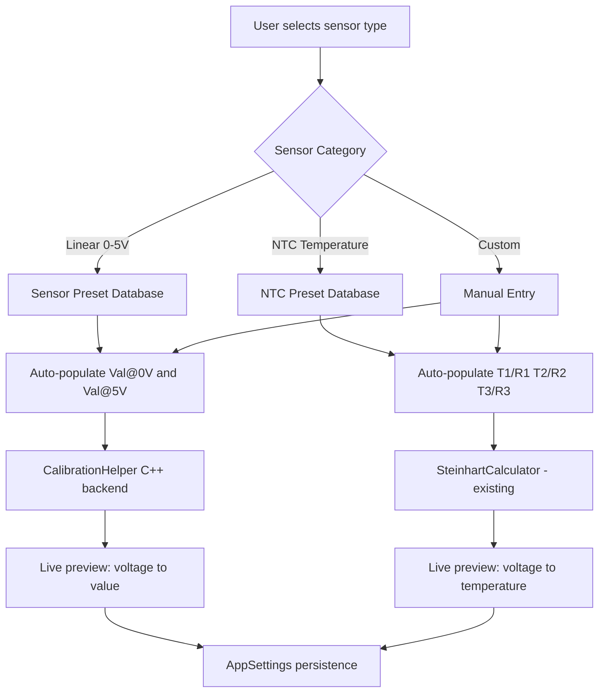
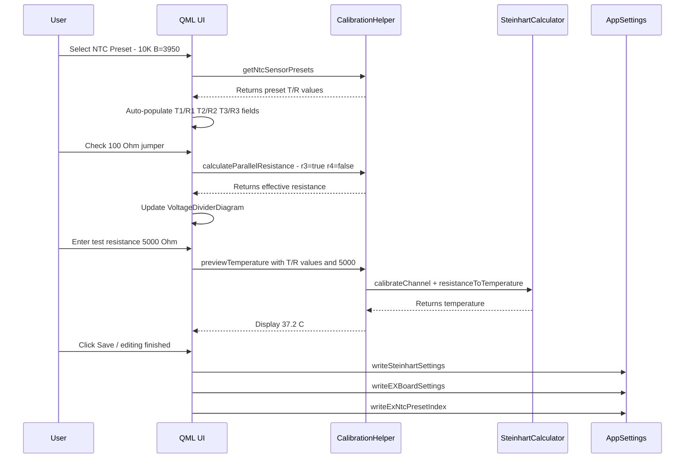

# Calibration Integration Plan

## Current State Analysis

### Analog Inputs ([`AnalogInputs.qml`](PowerTune/Core/AnalogInputs.qml))
- 11 analog channels (AN 0-10), each with raw `Val@0V` / `Val@5V` text fields
- Linear interpolation between two user-entered values
- No sensor type selection, no presets, no live preview
- Settings persisted via [`AppSettings::writeAnalogSettings()`](Core/appsettings.cpp:221) -- 22 individual `qreal` params passed as flat arguments

### EX Board Analog ([`ExBoardAnalog.qml`](PowerTune/Core/ExBoardAnalog.qml))
- 8 EX Board channels (EX AN 0-7) with `Val@0V` / `Val@5V` fields (same pattern as AnalogInputs)
- 6 channels (0-5) support NTC temperature mode via checkbox (`checkan0ntc` ... `checkan5ntc`)
- When NTC is enabled, the Val@0V/5V fields are disabled and Steinhart-Hart fields activate
- Each NTC channel has 6 fields: T1/R1, T2/R2, T3/R3 (temperature in C, resistance in Ohms)
- Voltage divider jumpers: two checkboxes per channel (100 Ohm / 1K Ohm) control R3/R4 values
- Settings persisted via [`AppSettings::writeEXBoardSettings()`](Core/appsettings.cpp:272) and [`AppSettings::writeSteinhartSettings()`](Core/appsettings.cpp:331)

### SteinhartCalculator ([`SteinhartCalculator.h`](Utils/SteinhartCalculator.h))
- Already implements the full Steinhart-Hart equation
- [`calibrateChannel()`](Utils/SteinhartCalculator.cpp:25) takes T1/T2/T3 + R1/R2/R3, computes A/B/C coefficients
- [`setVoltageDividerParams()`](Utils/SteinhartCalculator.cpp:62) handles R3/R4 parallel resistance calculation
- [`voltageToTemperature()`](Utils/SteinhartCalculator.cpp:142) converts ADC voltage to temperature
- [`resistanceToTemperature()`](Utils/SteinhartCalculator.cpp:116) and [`calculateSensorResistance()`](Utils/SteinhartCalculator.cpp:93) available separately
- Fixed circuit constants: `R2_FIXED = 1430 Ohm`, `R3_DEFAULT = 100 Ohm`, `R4_DEFAULT = 1000 Ohm`
- Note: line 50 has a suspected typo `(L1 + L2 + L2)` instead of `(L1 + L2 + L3)` -- flagged for investigation

### Settings Components ([`PowerTune/Settings/components/`](PowerTune/Settings/components/))
- Existing styled components: `StyledTextField`, `StyledCheckBox`, `StyledComboBox`, `StyledSwitch`, `StyledButton`
- Existing layout components: `SettingsPage`, `SettingsRow`, `SettingsSection`
- These should be reused for new calibration UI

---

## Architecture Overview

---

## Phase 1: C++ Backend - CalibrationHelper Class

### New File: `Utils/CalibrationHelper.h` and `Utils/CalibrationHelper.cpp`

A new `QObject`-derived class exposed to QML that provides:

1. **Sensor Preset Database**
   - `Q_INVOKABLE QVariantList getLinearSensorPresets()` -- returns list of common linear sensors
   - `Q_INVOKABLE QVariantList getNtcSensorPresets()` -- returns list of common NTC sensors
   - Each preset contains: name, unit, val0V, val5V (for linear) or T1/R1/T2/R2/T3/R3 (for NTC)

2. **Linear Calibration Helpers**
   - `Q_INVOKABLE qreal calculateLinearValue(qreal voltage, qreal val0V, qreal val5V)` -- live preview
   - `Q_INVOKABLE QVariantMap calculateLinearMapping(qreal knownVoltage1, qreal knownValue1, qreal knownVoltage2, qreal knownValue2)` -- compute val0V/val5V from two known points

3. **Voltage Divider Helpers**
   - `Q_INVOKABLE qreal calculateParallelResistance(bool r3Enabled, bool r4Enabled)` -- show effective R
   - `Q_INVOKABLE qreal calculateMaxSensorResistance(bool r3Enabled, bool r4Enabled)` -- show max measurable range
   - `Q_INVOKABLE qreal calculateVoltageForResistance(qreal sensorR, bool r3Enabled, bool r4Enabled)` -- for preview

4. **NTC Preview Helpers** (delegate to existing [`SteinhartCalculator`](Utils/SteinhartCalculator.h))
   - `Q_INVOKABLE qreal previewTemperature(qreal T1, qreal R1, qreal T2, qreal R2, qreal T3, qreal R3, qreal testResistance)` -- one-shot temperature calculation
   - `Q_INVOKABLE QVariantMap previewCoefficients(qreal T1, qreal R1, qreal T2, qreal R2, qreal T3, qreal R3)` -- return A/B/C for display

### Sensor Preset Data

**Linear Sensor Presets** (built-in):

| Preset Name | Unit | Val@0V | Val@5V |
|---|---|---|---|
| 0-100 PSI Pressure | PSI | 0 | 100 |
| 0-150 PSI Pressure | PSI | 0 | 150 |
| 0-200 PSI Pressure | PSI | 0 | 200 |
| 0-5 Bar Pressure | Bar | 0 | 5 |
| 0-10 Bar Pressure | Bar | 0 | 10 |
| 0-1V Wideband Lambda | Lambda | 0.65 | 1.30 |
| 0-5V Generic | V | 0 | 5 |
| Fuel Level (empty-full) | % | 0 | 100 |

**NTC Sensor Presets** (built-in):

| Preset Name | T1/R1 | T2/R2 | T3/R3 |
|---|---|---|---|
| 10K NTC (B=3950) | -20C / 95327 | 25C / 10000 | 100C / 678 |
| 10K NTC (B=3435) | -20C / 67740 | 25C / 10000 | 100C / 990 |
| 2.2K NTC | -20C / 15462 | 25C / 2200 | 100C / 186 |
| Bosch NTC (0 280 130 026) | 20C / 2500 | 60C / 667 | 100C / 177 |
| GM Coolant Temp | -40C / 100700 | 25C / 2238 | 120C / 97.4 |

These presets will be defined as static data in the `CalibrationHelper` class. Additional presets can be added later.

---

## Phase 2: QML UI Components

### New Shared Components in `PowerTune/Settings/components/`

#### `SensorPresetSelector.qml`
- ComboBox with "Custom" as first option, then sensor presets from [`CalibrationHelper`](Utils/CalibrationHelper.h)
- On selection, emits signal with the preset values
- Distinguishes between linear and NTC preset types

#### `VoltageDividerDiagram.qml`
- Canvas or Image-based visual representation of the voltage divider circuit
- Shows R2_FIXED (1430 Ohm), R3 (100 Ohm), R4 (1000 Ohm) with visual on/off based on jumper checkboxes
- Displays calculated total parallel resistance
- Shows effective voltage measurement range

#### `CalibrationPreview.qml`
- For linear channels: slider or text input for test voltage, displays calculated output value
- For NTC channels: slider or text input for test resistance, displays calculated temperature
- Updates in real-time as calibration parameters change

### Modified Pages

#### [`AnalogInputs.qml`](PowerTune/Core/AnalogInputs.qml) Updates
- Add a `SensorPresetSelector` ComboBox per channel (above/beside the Val@0V/Val@5V fields)
- When a preset is selected, auto-populate Val@0V and Val@5V
- When "Custom" is selected, allow manual entry as before
- Add a small `CalibrationPreview` panel on the right side (replacing the static explanation text)
- Persist selected preset name/index in settings for recall on next load

#### [`ExBoardAnalog.qml`](PowerTune/Core/ExBoardAnalog.qml) Updates
- Add `SensorPresetSelector` for linear channels (when NTC checkbox is unchecked)
- Add NTC `SensorPresetSelector` for NTC channels (when NTC checkbox is checked)
- When NTC preset selected, auto-populate all 6 T/R fields
- Replace raw 100Ohm/1KOhm checkboxes with `VoltageDividerDiagram` per channel (or a shared one that updates per selected channel)
- Add `CalibrationPreview` showing live temperature output for NTC channels
- Show computed Steinhart-Hart A/B/C coefficients in read-only display

---

## Phase 3: AppSettings Extensions

### New Methods in [`AppSettings`](Core/appsettings.h)

- `Q_INVOKABLE void writeAnalogPresetIndex(int channel, int presetIndex)` -- persist which preset was chosen per analog channel
- `Q_INVOKABLE int readAnalogPresetIndex(int channel)` -- recall preset on load
- `Q_INVOKABLE void writeExAnalogPresetIndex(int channel, int presetIndex)` -- same for EX Board
- `Q_INVOKABLE int readExAnalogPresetIndex(int channel)`
- `Q_INVOKABLE void writeExNtcPresetIndex(int channel, int presetIndex)` -- NTC preset per channel
- `Q_INVOKABLE int readExNtcPresetIndex(int channel)`

These use the existing `setValue()`/`value()` pattern with keys like `"AN_PRESET_0"`, `"EXAN_PRESET_0"`, `"EXNTC_PRESET_0"`.

---

## Phase 4: Registration and Wiring

### `main.cpp` Changes
- Instantiate `CalibrationHelper` and register with QML engine as a context property or singleton
- Wire `CalibrationHelper` to the existing `SteinhartCalculator` instance

### `CMakeLists.txt` / `.pro` Changes
- Add `Utils/CalibrationHelper.h` and `Utils/CalibrationHelper.cpp` to the build

---

## Data Flow Diagram

---

## Implementation Priority

### Phase 1 -- C++ Backend (do first)
1. Create `Utils/CalibrationHelper.h` and `Utils/CalibrationHelper.cpp` with sensor preset data and calculation helpers
2. Register `CalibrationHelper` in `main.cpp` as QML context property
3. Add to build system (CMakeLists.txt and/or .pro file)
4. Fix suspected typo in [`SteinhartCalculator.cpp:50`](Utils/SteinhartCalculator.cpp:50) -- `(L1 + L2 + L2)` should be `(L1 + L2 + L3)`

### Phase 2 -- Shared QML Components (do second)
5. Create `PowerTune/Settings/components/SensorPresetSelector.qml`
6. Create `PowerTune/Settings/components/CalibrationPreview.qml`
7. Create `PowerTune/Settings/components/VoltageDividerDiagram.qml`

### Phase 3 -- AnalogInputs Page Update (do third)
8. Add preset selector and live preview to [`AnalogInputs.qml`](PowerTune/Core/AnalogInputs.qml)
9. Add `writeAnalogPresetIndex` / `readAnalogPresetIndex` to [`AppSettings`](Core/appsettings.h)

### Phase 4 -- ExBoardAnalog Page Update (do fourth)
10. Add linear preset selector to [`ExBoardAnalog.qml`](PowerTune/Core/ExBoardAnalog.qml) for non-NTC channels
11. Add NTC preset selector to ExBoardAnalog for NTC channels
12. Replace raw voltage divider checkboxes with `VoltageDividerDiagram`
13. Add Steinhart-Hart coefficient display and temperature preview
14. Add `writeExAnalogPresetIndex` / `writeExNtcPresetIndex` to AppSettings

### Phase 5 -- Testing and Polish
15. Test all preset auto-population for correctness against known datasheet values
16. Verify settings persistence across app restart for all new preset fields
17. Verify live preview calculations match expected results for edge cases
18. Verify voltage divider diagram correctly reflects jumper states

---

## Files To Create

| File | Purpose |
|---|---|
| `Utils/CalibrationHelper.h` | Sensor preset database + calculation helpers header |
| `Utils/CalibrationHelper.cpp` | Implementation |
| `PowerTune/Settings/components/SensorPresetSelector.qml` | Reusable preset dropdown |
| `PowerTune/Settings/components/CalibrationPreview.qml` | Live value/temp preview widget |
| `PowerTune/Settings/components/VoltageDividerDiagram.qml` | Visual circuit diagram |

## Files To Modify

| File | Changes |
|---|---|
| [`Utils/SteinhartCalculator.cpp`](Utils/SteinhartCalculator.cpp:50) | Fix L1+L2+L2 typo on line 50 |
| [`Core/appsettings.h`](Core/appsettings.h) | Add preset index read/write methods |
| [`Core/appsettings.cpp`](Core/appsettings.cpp) | Implement preset index persistence |
| [`PowerTune/Core/AnalogInputs.qml`](PowerTune/Core/AnalogInputs.qml) | Add preset selector + preview |
| [`PowerTune/Core/ExBoardAnalog.qml`](PowerTune/Core/ExBoardAnalog.qml) | Add presets + divider diagram + preview |
| [`main.cpp`](main.cpp) | Register CalibrationHelper with QML |
| `CMakeLists.txt` or `PowertuneQMLGui.pro` | Add new source files |
| `qml.qrc` | Add new QML components |
