# Gauge Config Menu -- Full Implementation Plan

## Problem

1. The `GaugeConfigMenu` is an empty shell -- only Delete/Close buttons. No configuration controls.
2. The 4 new gauges (ArcFillGauge, NumericCell, GearIndicator, ModernRoundGauge) have zero settings.
3. The 7 legacy gauges (RoundGauge, SquareGauge, VerticalBarGauge, MyTextLabel, Picture, StatePicture, StateGIF) each contain 150-2000 lines of inline menus that duplicate UI patterns.
4. `DatasourcesList.qml` spams "value is undefined" warnings due to inconsistent ListElement roles.

## Architecture

Replace the current `sections` list pattern with `default property alias content` so gauges compose config sections as direct children. Create 16 reusable section components in Shared, then wire them into all 11 gauges.

```mermaid
flowchart TD
    subgraph sections ["Shared Config Sections (16 files)"]
        DS[DatasourceSection]
        RS[RangeSection]
        SS[SizeSection]
        CS[ColorsSection]
        AS[ArcSettingsSection]
        NS[NeedleSection]
        NTS[NeedleTrailSection]
        TS[TicksSection]
        LS[LabelSection]
        VT[VisibilityTogglesSection]
        WRZ[WarningRedZoneSection]
        DESC[DescriptionSection]
        FS[FontSettingsSection]
        IP[ImagePickerSection]
        SEC[SecondarySourceSection]
        US[UnitSymbolSection]
    end

    subgraph newGauges ["New Gauges"]
        AF[ArcFillGauge]
        NC[NumericCell]
        GI[GearIndicator]
        MR[ModernRoundGauge]
    end

    subgraph oldGauges ["Legacy Gauges"]
        RG[RoundGauge]
        SQ[SquareGauge]
        VB[VerticalBarGauge]
        TL[MyTextLabel]
        PIC[Picture]
        SP[StatePicture]
        SG[StateGIF]
    end

    AF --> DS & RS & SS & CS & AS & LS
    NC --> DS & RS & SS & CS & LS
    GI --> DS & SS & CS
    MR --> DS & RS & SS & CS & AS & NS & TS & LS

    RG --> DS & RS & SS & CS & NS & NTS & TS & VT & WRZ & DESC & LS
    SQ --> DS & RS & SS & CS & FS & SEC & US & VT
    VB --> DS & RS & SS
    TL --> DS & LS & CS & FS
    PIC --> SS & IP
    SP --> DS & SS & IP
    SG --> DS & SS & IP
```

---

## Phase 1: Redesign GaugeConfigMenu

**File:** [GaugeConfigMenu.qml](PowerTune/Gauges/Shared/GaugeConfigMenu.qml)

- Remove `property list<QtObject> sections` and the `Repeater` (lines 42-53)
- Add `default property alias content: contentColumn.data`
- Keep: outer Rectangle, Flickable, ScrollBar, ColumnLayout, Delete/Close row, `show(mx, my)`, drag MouseArea, `property Item target`

---

## Phase 2: Create Config Section Components

All files in `PowerTune/Gauges/Shared/`. Each is a `ColumnLayout` with a bold header `Text`, `Layout.fillWidth: true`, and `property Item target`.

### Core sections (used by new + legacy gauges)

**2A: DatasourceSection.qml** -- Data source picker

- `DatasourceComboBox` bound to `DatasourceService.allSources`
- `Component.onCompleted`: calls `selectBySourceName(target.mainvaluename)`
- Apply `Button`: sets `target.mainvaluename`, rebinds `target.mainvalue` or `target.gearValue` via `Qt.binding(function() { return PropertyRouter.getValue(name); })`

**2B: RangeSection.qml** -- Min/max, decimals, warnings

- `NumericStepper` for `target.minvalue` (step 1, only shown if `target.minvalue !== undefined`)
- `NumericStepper` for `target.maxvalue` (step 10)
- `NumericStepper` for `target.decimalpoints` (step 1, min 0, max 6)
- `NumericStepper` for `target.warnvaluehigh` (step 100)
- `NumericStepper` for `target.warnvaluelow` (step 100)

**2C: SizeSection.qml** -- Dimensions

- `NumericStepper` for `target.width` (step 10, min 20, max 2000)
- `NumericStepper` for `target.height` (step 10, min 20, max 2000)

**2D: ColorsSection.qml** -- Dynamic color list

- `property var colorBindings: []` -- array of `{label: "X", prop: "propName"}`
- `Repeater` renders label + `ColorComboBox` for each entry
- On completed: `selectByName(target[prop])`
- On change: `target[prop] = selectedColor()`

**2E: ArcSettingsSection.qml** -- Arc geometry

- `NumericStepper` for start angle (reads `target.arcStartAngle` or `target.startangle`)
- `NumericStepper` for end angle (reads `target.arcEndAngle` or `target.endangle`)
- `NumericStepper` for stroke width (only if `target.arcStrokeWidth !== undefined`)
- `NumericStepper` for danger threshold / `dangerStart` (step 0.05, 0-1)

**2F: NeedleSection.qml** -- Needle style

- `ColorComboBox` for `target.needleColor` or `target.needlecolor`
- `ColorComboBox` for `target.needleGlowColor` or `target.needlecolor2`
- `NumericStepper` for `target.needleLength` (step 1, only if exists)
- `NumericStepper` for `target.needleBaseWidth` (step 1, only if exists)
- `NumericStepper` for `target.needleTipWidth` (step 1, only if exists)
- `NumericStepper` for `target.needleinset` (step 1, only if exists)

**2G: TicksSection.qml** -- Tick marks

- `NumericStepper` for `target.tickcount` or `target.tickmarksteps` (step 1)
- `NumericStepper` for `target.minortickcount` or `target.minortickmarksteps` (step 1)
- `NumericStepper` for tick height (only if `target.tickmarkheight !== undefined`)
- `NumericStepper` for tick width (only if `target.tickmarkwidth !== undefined`)
- `NumericStepper` for minor tick height (only if exists)
- `NumericStepper` for minor tick width (only if exists)
- `NumericStepper` for major tick inset (only if exists)
- `NumericStepper` for minor tick inset (only if exists)
- Color pickers for active/inactive tick colors (only if exists)

**2H: LabelSection.qml** -- Text fields for labels/units

- `TextField` for `target.labeltext` or `target.desctextdisplaytext`
- `TextField` for `target.unittext` (only if exists)
- `TextField` for `target.displaytext` (only if exists, for MyTextLabel)

### Legacy-support sections

**2I: VisibilityTogglesSection.qml** -- Boolean toggles

- `property var toggleBindings: []` -- array of `{label: "X", prop: "propName"}`
- `Repeater` renders label + `Switch` for each
- Used by RoundGauge (`needlevisible`, `needlecentervisisble`, `ringvisible`) and SquareGauge (`secvaluevisible`, `vertgaugevisible`, `horizgaugevisible`)

**2J: NeedleTrailSection.qml** -- Trail colors (RoundGauge-specific)

- `ColorComboBox` for `target.outerneedlecolortrailsave` -> also sets `target.outerneedlecolortrail`
- `ColorComboBox` for `target.middleneedlecortrailsave` -> also sets `target.middleneedlecortrail`
- `ColorComboBox` for `target.lowerneedlecolortrailsave` -> also sets `target.lowerneedlecolortrail`

**2K: WarningRedZoneSection.qml** -- Red zone (RoundGauge-specific)

- `NumericStepper` for `target.redareainset`
- `NumericStepper` for `target.redareastart`
- `NumericStepper` for `target.redareawidth`

**2L: DescriptionSection.qml** -- Description text (RoundGauge-specific)

- `NumericStepper` for `target.desctextx`, `target.desctexty`
- `NumericStepper` for `target.desctextfontsize`
- `FontComboBox` for `target.desctextfonttype`
- `ColorComboBox` for `target.desctextdisplaytextcolor`
- `TextField` for `target.desctextdisplaytext`

**2M: FontSettingsSection.qml** -- Font type and size

- `property var fontBindings: []` -- array of `{label: "X", fontProp: "propName", sizeProp: "sizePropName"}`
- `Repeater` renders `FontComboBox` + optional `NumericStepper` for size

**2N: ImagePickerSection.qml** -- Image selection

- Calls `Connect.readavailablebackrounds()` on load
- `NumericStepper` for `target.pictureheight` (step 10)
- `ComboBox` bound to `UI.backroundpictures` for image selection
- Handles platform-specific path prefixes (linux/osx/windows)
- `property string targetProperty: "picturesource"` -- which target prop to set
- For StatePicture/StateGIF: instantiate twice with different `targetProperty` values (`statepicturesourceoff`, `statepicturesourceon`)

### SquareGauge-specific sections

**2O: SecondarySourceSection.qml** -- Secondary data source

- Same pattern as DatasourceSection but binds to `target.secvaluename`

**2P: UnitSymbolSection.qml** -- Unit symbol picker

- Grid of preset buttons: None, deg, degC, %, degF, kPa, PSI, ms, V, mV, lambda, kph, mph
- Sets `target.mainunit`

---

## Phase 3: Register Files

### qmldir additions ([qmldir](PowerTune/Gauges/Shared/qmldir))

Add 16 new entries for all section files.

### CMakeLists.txt additions ([CMakeLists.txt](CMakeLists.txt))

Add 16 new `PowerTune/Gauges/Shared/*.qml` entries to `GaugesSharedLib` QML_FILES block.

---

## Phase 4: Wire Into New Gauges

### 4A: [ArcFillGauge.qml](PowerTune/Gauges/Widgets/ArcFillGauge.qml) (replace lines 159-163)

Sections: DatasourceSection, LabelSection, RangeSection, SizeSection, ArcSettingsSection, ColorsSection (6 colors: arcTrackColor, arcFillColor, arcDangerColor, valueTextColor, labelTextColor, unitTextColor)

### 4B: [NumericCell.qml](PowerTune/Gauges/Widgets/NumericCell.qml) (replace lines 111-115)

Sections: DatasourceSection, LabelSection, RangeSection, SizeSection, ColorsSection (3 colors: labelColor, valueColor, unitColor)

### 4C: [GearIndicator.qml](PowerTune/Gauges/Widgets/GearIndicator.qml) (replace lines 74-78)

Sections: DatasourceSection, SizeSection, ColorsSection (2 colors: textColor, labelColor)

### 4D: [ModernRoundGauge.qml](PowerTune/Gauges/Widgets/ModernRoundGauge.qml) (replace lines 240-244)

Sections: DatasourceSection, LabelSection, RangeSection, SizeSection, ArcSettingsSection, NeedleSection, TicksSection, ColorsSection (9 colors)

---

## Phase 5: Migrate Legacy Gauges

### 5A: [RoundGauge.qml](PowerTune/Gauges/Widgets/RoundGauge.qml) (~2391 lines -> ~600 lines)

1. Add `import PowerTune.Gauges.Shared 1.0` (already present)
2. **Delete** inline MouseArea + Timer (lines 139-176) -- replace with `GaugeMouseHandler`
3. **Delete** entire `Item { id: menustructure }` block (lines 354-1549) -- ~1200 lines of menus
4. **Delete** `Timer { id: timer }` and `increaseDecrease()` function (lines 1495-1741) -- ~250 lines
5. **Delete** toggle helper functions (`toggleneedle`, `togleneedlecenter`, `togglering`) that only served menus
6. **Keep** `warn()` function, `intro` animation, visual elements, properties
7. **Add** `GaugeMouseHandler` + `GaugeConfigMenu` with sections:
  - DatasourceSection, RangeSection, SizeSection, ArcSettingsSection (startangle/endangle)
  - NeedleSection (needlecolor, needlecolor2, length, base, tip, inset)
  - NeedleTrailSection (outer/middle/lower trail colors)
  - TicksSection (major/minor height, width, steps, inset, active/inactive colors)
  - LabelSection (labelfont, size, inset, active/inactive colors + description text)
  - WarningRedZoneSection (redareainset, redareastart, redareawidth)
  - DescriptionSection (position, font, color, text)
  - VisibilityTogglesSection (needlevisible, needlecentervisisble, ringvisible)
  - ColorsSection (backroundcolor)

### 5B: [SquareGauge.qml](PowerTune/Gauges/Widgets/SquareGauge.qml) (~966 lines -> ~400 lines)

1. **Delete** inline MouseArea + Timer (lines 145-183)
2. **Delete** `Item { id: menustructure }` and all overlay Items (lines 331-923) -- ~600 lines
3. **Delete** `hidemenues()` function
4. **Add** `GaugeMouseHandler` + `GaugeConfigMenu` with sections:
  - DatasourceSection, SecondarySourceSection, RangeSection, SizeSection
  - FontSettingsSection (textFonttype + titlefontsize, valueFonttype + mainfontsize)
  - UnitSymbolSection
  - VisibilityTogglesSection (secvaluevisible, vertgaugevisible, horizgaugevisible)
  - ColorsSection (framecolor, resetbackroundcolor, resettitlecolor, titletextcolor, textcolor, barcolor)

### 5C: [VerticalBarGauge.qml](PowerTune/Gauges/Widgets/VerticalBarGauge.qml) (~392 lines -> ~120 lines)

1. Add `import PowerTune.Gauges.Shared 1.0`
2. **Delete** inline MouseArea + Timer (lines 73-107)
3. **Delete** all menus and overlay Items (lines 146-382) -- ~240 lines
4. **Add** `GaugeMouseHandler` + `GaugeConfigMenu` with sections:
  - DatasourceSection, RangeSection (minvalue, maxvalue, decimalpoints), SizeSection
  - LabelSection (gaugename via TextField)

### 5D: [MyTextLabel.qml](PowerTune/Gauges/Media/MyTextLabel.qml) (~403 lines -> ~100 lines)

1. **Delete** inline MouseArea + Timer (lines 52-85)
2. **Delete** Rectangle `changesize` (lines 112-338) -- ~230 lines
3. **Add** `GaugeMouseHandler` + `GaugeConfigMenu` with sections:
  - DatasourceSection (for datasourcename)
  - LabelSection (displaytext)
  - RangeSection (warnvaluehigh, warnvaluelow, decimalpoints)
  - FontSettingsSection (fonttype, fontsize)
  - ColorsSection (textcolor)

### 5E: Media gauges (3 files)

**[Picture.qml](PowerTune/Gauges/Media/Picture.qml)** (~226 lines -> ~60 lines)

1. Add `import PowerTune.Gauges.Shared 1.0`
2. Delete MouseArea + Timer (lines 43-80), delete `changesize` (lines 82-176)
3. Add `GaugeMouseHandler` + `GaugeConfigMenu` with: SizeSection (pictureheight), ImagePickerSection (picturesource)

**[StatePicture.qml](PowerTune/Gauges/Media/StatePicture.qml)** (~366 lines -> ~100 lines)

1. Delete MouseArea + Timer (lines 71-108), delete `changesize` (lines 111-296)
2. Add `GaugeMouseHandler` + `GaugeConfigMenu` with: DatasourceSection, SizeSection, ImagePickerSection x2 (off/on images), RangeSection-like trigger value NumericStepper

**[StateGIF.qml](PowerTune/Gauges/Media/StateGIF.qml)** (~393 lines -> ~100 lines)

1. Delete MouseArea + Timer (lines 73-106), delete `changesize` (lines 109-311)
2. Add `GaugeMouseHandler` + `GaugeConfigMenu` with: DatasourceSection, SizeSection, ImagePickerSection x2 (off/on images), trigger on/off NumericSteppers

---

## Phase 6: Fix DatasourcesList

**File:** [DatasourcesList.qml](PowerTune/Gauges/Shared/DatasourcesList.qml) (4180 lines, 402 ListElements)

Every `ListElement` must define ALL roles: `titlename`, `defaultsymbol`, `sourcename`, `supportedECU`, `decimalpoints`, `decimalpoints2`, `maxvalue`, `stepsize`, `divisor`, `supportedECUs`. Write a script to scan for entries missing any role and add defaults (`""` / `"0"`).

---

## Complete File Summary

| Action | File Path                                              | Est. Lines Changed   |
| ------ | ------------------------------------------------------ | -------------------- |
| MODIFY | `PowerTune/Gauges/Shared/GaugeConfigMenu.qml`          | ~20                  |
| CREATE | `PowerTune/Gauges/Shared/DatasourceSection.qml`        | ~50                  |
| CREATE | `PowerTune/Gauges/Shared/RangeSection.qml`             | ~70                  |
| CREATE | `PowerTune/Gauges/Shared/SizeSection.qml`              | ~35                  |
| CREATE | `PowerTune/Gauges/Shared/ColorsSection.qml`            | ~50                  |
| CREATE | `PowerTune/Gauges/Shared/ArcSettingsSection.qml`       | ~55                  |
| CREATE | `PowerTune/Gauges/Shared/NeedleSection.qml`            | ~80                  |
| CREATE | `PowerTune/Gauges/Shared/NeedleTrailSection.qml`       | ~50                  |
| CREATE | `PowerTune/Gauges/Shared/TicksSection.qml`             | ~120                 |
| CREATE | `PowerTune/Gauges/Shared/LabelSection.qml`             | ~40                  |
| CREATE | `PowerTune/Gauges/Shared/VisibilityTogglesSection.qml` | ~35                  |
| CREATE | `PowerTune/Gauges/Shared/WarningRedZoneSection.qml`    | ~50                  |
| CREATE | `PowerTune/Gauges/Shared/DescriptionSection.qml`       | ~80                  |
| CREATE | `PowerTune/Gauges/Shared/FontSettingsSection.qml`      | ~50                  |
| CREATE | `PowerTune/Gauges/Shared/ImagePickerSection.qml`       | ~70                  |
| CREATE | `PowerTune/Gauges/Shared/SecondarySourceSection.qml`   | ~50                  |
| CREATE | `PowerTune/Gauges/Shared/UnitSymbolSection.qml`        | ~40                  |
| MODIFY | `PowerTune/Gauges/Shared/qmldir`                       | +16 lines            |
| MODIFY | `CMakeLists.txt`                                       | +16 lines            |
| MODIFY | `PowerTune/Gauges/Widgets/ArcFillGauge.qml`            | ~+25                 |
| MODIFY | `PowerTune/Gauges/Widgets/NumericCell.qml`             | ~+20                 |
| MODIFY | `PowerTune/Gauges/Widgets/GearIndicator.qml`           | ~+15                 |
| MODIFY | `PowerTune/Gauges/Widgets/ModernRoundGauge.qml`        | ~+35                 |
| MODIFY | `PowerTune/Gauges/Widgets/RoundGauge.qml`              | ~-1800, +80          |
| MODIFY | `PowerTune/Gauges/Widgets/SquareGauge.qml`             | ~-600, +60           |
| MODIFY | `PowerTune/Gauges/Widgets/VerticalBarGauge.qml`        | ~-270, +30           |
| MODIFY | `PowerTune/Gauges/Media/MyTextLabel.qml`               | ~-290, +30           |
| MODIFY | `PowerTune/Gauges/Media/Picture.qml`                   | ~-170, +20           |
| MODIFY | `PowerTune/Gauges/Media/StatePicture.qml`              | ~-260, +35           |
| MODIFY | `PowerTune/Gauges/Media/StateGIF.qml`                  | ~-270, +35           |
| MODIFY | `PowerTune/Gauges/Shared/DatasourcesList.qml`          | ~400 entries patched |

**Net result:** ~3660 lines of duplicated inline menu code deleted, replaced by ~1000 lines of reusable shared sections.