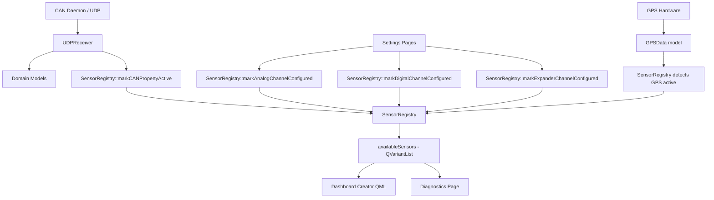
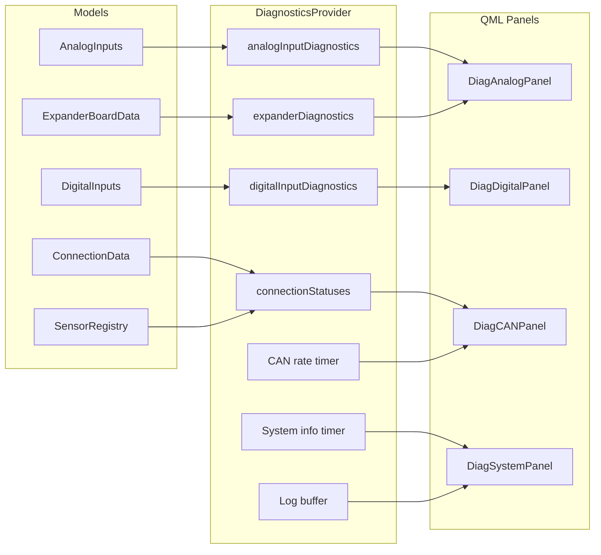
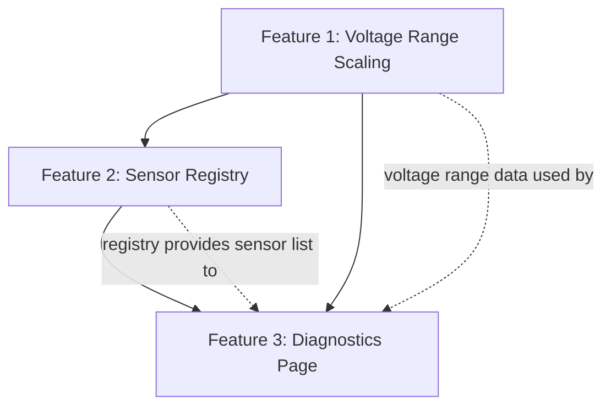

# Architecture Plan: Three New Features

**Copyright (c) Kai Wyborny. All rights reserved.**

> **Design Principle**: All calculations MUST be performed in C++ only. QML is
> strictly for presentation and user input binding. No math, interpolation, or
> value conversion logic in QML.

---

## Table of Contents

1. [Feature 1: Voltage Range Scaling in CalibrationHelper](#feature-1-voltage-range-scaling)
2. [Feature 2: Available Sensor Registry](#feature-2-sensor-registry)
3. [Feature 3: Advanced Diagnostics Settings Page](#feature-3-diagnostics-page)
4. [Feature Dependencies](#feature-dependencies)
5. [Implementation Phases](#implementation-phases)

---

## Feature 1: Voltage Range Scaling

### Problem

The current [`CalibrationHelper::calculateLinearValue()`](Utils/CalibrationHelper.cpp:120) assumes all sensors output 0-5V. The formula is:

```
value = val0v + (voltage / 5.0) * (val5v - val0v)
```

Real sensors have constrained voltage ranges (e.g., GM MAP: 0.2-4.5V, Bosch pressure: 0.5-4.5V). Without per-sensor voltage range configuration, the calibration produces incorrect values at the extremes.

### Current Architecture

- [`LinearPreset`](Utils/CalibrationHelper.h:171) struct: `{ name, val0v, val5v, unit }`
- [`calculateLinearValue()`](Utils/CalibrationHelper.cpp:120) takes `(voltage, val0v, val5v)` and divides by `VCC` (5.0)
- QML pages [`AnalogInputs.qml`](PowerTune/Core/AnalogInputs.qml:38) and [`ExBoardAnalog.qml`](PowerTune/Core/ExBoardAnalog.qml:63) call `applyPreset()` which populates val0v/val5v fields
- Settings are persisted via `Qt.labs.settings` property aliases in QML

### Technical Design

#### 1.1 Extend LinearPreset struct

Add `minVoltage` and `maxVoltage` fields to [`LinearPreset`](Utils/CalibrationHelper.h:171):

```cpp
// In CalibrationHelper.h
struct LinearPreset {
    QString name;
    qreal val0v;
    qreal val5v;
    QString unit;
    qreal minVoltage;  // Sensor minimum output voltage (default 0.0)
    qreal maxVoltage;  // Sensor maximum output voltage (default 5.0)
};
```

#### 1.2 Update preset data

Update [`initLinearPresets()`](Utils/CalibrationHelper.cpp:33) with per-sensor voltage ranges:

```cpp
m_linearPresets = {
    {"Custom",              0,   5,   "V",    0.0, 5.0},
    {"0-100 PSI Pressure",  0,   100, "PSI",  0.5, 4.5},
    {"0-150 PSI Pressure",  0,   150, "PSI",  0.5, 4.5},
    {"GM 1-Bar MAP",        10,  105, "kPa",  0.2, 4.5},
    {"GM 2-Bar MAP",        10,  210, "kPa",  0.2, 4.5},
    {"GM 3-Bar MAP",        10,  315, "kPa",  0.2, 4.5},
    {"AEM 3.5 Bar MAP",     0,   350, "kPa",  0.0, 5.0},
    // ... etc
};
```

#### 1.3 New calculation method

Add a voltage-range-aware overload of [`calculateLinearValue()`](Utils/CalibrationHelper.h:65):

```cpp
// CalibrationHelper.h - new Q_INVOKABLE method
Q_INVOKABLE qreal calculateLinearValueScaled(
    qreal voltage,
    qreal val0v,
    qreal val5v,
    qreal minVoltage,
    qreal maxVoltage
) const;
```

Implementation:

```cpp
// CalibrationHelper.cpp
qreal CalibrationHelper::calculateLinearValueScaled(
    qreal voltage, qreal val0v, qreal val5v,
    qreal minVoltage, qreal maxVoltage) const
{
    // Clamp voltage to the sensor's actual output range
    qreal clamped = qBound(minVoltage, voltage, maxVoltage);
    // Normalize to 0.0-1.0 within the sensor's voltage range
    qreal range = maxVoltage - minVoltage;
    if (range <= 0.0) return val0v;
    qreal normalized = (clamped - minVoltage) / range;
    // Map to sensor value range
    return val0v + normalized * (val5v - val0v);
}
```

#### 1.4 Update existing calculateLinearValue

The existing [`calculateLinearValue()`](Utils/CalibrationHelper.cpp:120) should delegate to the new method with defaults (0.0, 5.0) for backward compatibility:

```cpp
qreal CalibrationHelper::calculateLinearValue(
    qreal voltage, qreal val0v, qreal val5v) const
{
    return calculateLinearValueScaled(voltage, val0v, val5v, 0.0, VCC);
}
```

#### 1.5 Update preset accessors

[`linearPresets()`](Utils/CalibrationHelper.cpp:73) and [`getLinearPreset()`](Utils/CalibrationHelper.cpp:93) must include the new fields in their returned `QVariantMap`:

```cpp
map["minVoltage"] = p.minVoltage;
map["maxVoltage"] = p.maxVoltage;
```

#### 1.6 QML changes -- Remove all JS calculation functions

> **Rule**: QML must NEVER perform calculations. All math stays in C++. QML only
> provides input fields and binds to C++ properties/methods.

The following **existing QML JavaScript functions must be removed** and replaced with C++ `Q_INVOKABLE` equivalents:

| QML File | JS Function to Remove | C++ Replacement |
|----------|----------------------|-----------------|
| [`AnalogInputs.qml`](PowerTune/Core/AnalogInputs.qml:38) | `applyPreset()` | `CalibrationHelper::applyPresetToChannel()` returns QVariantMap |
| [`AnalogInputs.qml`](PowerTune/Core/AnalogInputs.qml:49) | `getPresetUnit()` | Unit is already in the QVariantMap returned by `getLinearPreset()` |
| [`ExBoardAnalog.qml`](PowerTune/Core/ExBoardAnalog.qml:63) | `applyLinearPreset()` | `CalibrationHelper::applyPresetToChannel()` returns QVariantMap |
| [`ExBoardAnalog.qml`](PowerTune/Core/ExBoardAnalog.qml:74) | `applyNtcPreset()` | `CalibrationHelper::applyNtcPresetToChannel()` returns QVariantMap |
| [`ExBoardAnalog.qml`](PowerTune/Core/ExBoardAnalog.qml:225) | `setInputs()` arithmetic (`* 2`, `* 4`) | `AppSettings::cylinderSettingForIndex()` Q_INVOKABLE |
| [`ExBoardAnalog.qml`](PowerTune/Core/ExBoardAnalog.qml:261) | `cylindercalcrpmdi1()` switch/case | `AppSettings::frequencyDividerForCylinderIndex()` Q_INVOKABLE |

**New C++ Q_INVOKABLE methods to add:**

```cpp
// CalibrationHelper.h - new methods
Q_INVOKABLE QVariantMap applyPresetToChannel(int channel, const QString &presetName) const;
Q_INVOKABLE QVariantMap applyNtcPresetToChannel(int channel, const QString &presetName) const;

// AppSettings.h - new methods
Q_INVOKABLE int cylinderSettingForIndex(int comboIndex, int canVersion) const;
Q_INVOKABLE qreal frequencyDividerForCylinderIndex(int index) const;
```

**QML changes (display-only):**

- Add `minV` and `maxV` `StyledTextField` input fields per channel row
- Persist via `Settings` property aliases (e.g., `an0minVsave`, `an0maxVsave`)
- When a preset is selected, QML calls `Calibration.applyPresetToChannel(ch, name)` and assigns the returned QVariantMap values to text fields -- no computation in QML
- The actual calibration calculation (`calculateLinearValueScaled`) is called from C++ (in `AppSettings` or `Extender` where analog calibration currently occurs), never from QML
- QML binds the resulting `AnalogCalcN` / `EXAnalogCalcN` Q_PROPERTY for display

#### 1.7 Data Flow

```
Raw ADC Voltage --> calculateLinearValueScaled(v, val0v, val5v, minV, maxV)
                         |
                         v
                    Clamp to [minV, maxV]
                         |
                         v
                    Normalize: (v - minV) / (maxV - minV) => 0.0..1.0
                         |
                         v
                    Scale: val0v + normalized * (val5v - val0v)
                         |
                         v
                    AnalogCalcN / EXAnalogCalcN property
```

#### 1.8 Files to modify

| File | Change |
|------|--------|
| [`Utils/CalibrationHelper.h`](Utils/CalibrationHelper.h) | Add minVoltage/maxVoltage to LinearPreset, add `calculateLinearValueScaled`, add `applyPresetToChannel`, `applyNtcPresetToChannel` |
| [`Utils/CalibrationHelper.cpp`](Utils/CalibrationHelper.cpp) | Implement new methods, update presets, update accessor maps |
| [`Core/appsettings.h`](Core/appsettings.h) | Add `cylinderSettingForIndex()`, `frequencyDividerForCylinderIndex()` Q_INVOKABLE methods |
| [`Core/appsettings.cpp`](Core/appsettings.cpp) | Implement new methods, persist/restore minV/maxV per channel |
| [`PowerTune/Core/AnalogInputs.qml`](PowerTune/Core/AnalogInputs.qml) | Add minV/maxV fields, **remove** `applyPreset()` and `getPresetUnit()` JS functions, replace with C++ calls |
| [`PowerTune/Core/ExBoardAnalog.qml`](PowerTune/Core/ExBoardAnalog.qml) | Add minV/maxV fields, **remove** `applyLinearPreset()`, `applyNtcPreset()`, `setInputs()` arithmetic, `cylindercalcrpmdi1()` JS functions, replace with C++ calls |

---

## Feature 2: Sensor Registry

### Problem

The dashboard creator uses [`DatasourcesList.qml`](PowerTune/Gauges/DatasourcesList.qml) which is a hardcoded `ListModel` of ALL possible data sources. Users see hundreds of entries regardless of which sensors are actually connected. A runtime registry is needed to track which sensors are available.

### Current Architecture

- Data arrives via [`udpreceiver`](Utils/UDPReceiver.h) from CAN daemons, writing to domain models
- [`PropertyRouter`](Core/PropertyRouter.h) maps property names to their owning model
- [`DatasourcesList.qml`](PowerTune/Gauges/DatasourcesList.qml) is a static ListModel used by the dashboard gauge creator
- Settings pages configure which analog/digital/expander channels are active
- [`ConnectionData`](Core/Models/ConnectionData.h) tracks serial status, ECU type, CAN interfaces

### Technical Design

#### 2.1 New C++ class: SensorRegistry

Location: `Core/SensorRegistry.h` and `Core/SensorRegistry.cpp`

```cpp
// Core/SensorRegistry.h
// Copyright (c) Kai Wyborny. All rights reserved.

#ifndef SENSORREGISTRY_H
#define SENSORREGISTRY_H

#include <QObject>
#include <QVariantList>
#include <QVariantMap>
#include <QSet>
#include <QHash>
#include <QString>

class EngineData;
class VehicleData;
class GPSData;
class AnalogInputs;
class DigitalInputs;
class ExpanderBoardData;
class SensorData;
class ConnectionData;
class SettingsData;

class SensorRegistry : public QObject
{
    Q_OBJECT

    // Read-only count of currently available sensors
    Q_PROPERTY(int availableCount READ availableCount NOTIFY registryChanged)

public:
    enum class SensorSource {
        CAN,            // Data received from CAN bus via daemon
        AnalogInput,    // Configured analog input channel
        DigitalInput,   // Configured digital input channel
        ExpanderBoard,  // Configured expander board channel
        GPS,            // GPS module
        SenseHat,       // SenseHat accelerometer/gyro
        Calculated,     // Derived/calculated values
        System          // System metrics - CPU temp, etc.
    };
    Q_ENUM(SensorSource)

    struct SensorInfo {
        QString id;             // Property name matching PropertyRouter
        QString displayName;    // Human-readable name
        QString unit;           // Display unit
        SensorSource source;    // Where the data comes from
        QString modelName;      // Domain model name
        bool available;         // Currently available
    };

    explicit SensorRegistry(
        EngineData *engine,
        VehicleData *vehicle,
        GPSData *gps,
        AnalogInputs *analog,
        DigitalInputs *digital,
        ExpanderBoardData *expander,
        SensorData *sensor,
        ConnectionData *connection,
        SettingsData *settings,
        QObject *parent = nullptr
    );

    // Get count of available sensors
    int availableCount() const;

    // Get all registered sensors as QVariantList for QML
    Q_INVOKABLE QVariantList allSensors() const;

    // Get only currently available sensors
    Q_INVOKABLE QVariantList availableSensors() const;

    // Get available sensors filtered by source
    Q_INVOKABLE QVariantList availableSensorsBySource(int source) const;

    // Check if a specific sensor is available
    Q_INVOKABLE bool isSensorAvailable(const QString &sensorId) const;

    // Mark a CAN property as receiving data
    Q_INVOKABLE void markCANPropertyActive(const QString &propertyName);

    // Mark an analog input channel as configured
    Q_INVOKABLE void markAnalogChannelConfigured(int channel, bool configured);

    // Mark a digital input channel as configured
    Q_INVOKABLE void markDigitalChannelConfigured(int channel, bool configured);

    // Mark an expander board channel as configured
    Q_INVOKABLE void markExpanderChannelConfigured(int channel, bool configured);

    // Refresh all availability states
    Q_INVOKABLE void refreshAvailability();

signals:
    void registryChanged();

private:
    void initializeSensorTable();
    void connectModelSignals();

    QList<SensorInfo> m_sensors;
    QHash<QString, int> m_sensorIndex;      // id -> index in m_sensors
    QSet<QString> m_activeCANProperties;     // Properties receiving CAN data
    QSet<int> m_configuredAnalogChannels;
    QSet<int> m_configuredDigitalChannels;
    QSet<int> m_configuredExpanderChannels;

    // Model pointers
    EngineData *m_engine;
    VehicleData *m_vehicle;
    GPSData *m_gps;
    AnalogInputs *m_analog;
    DigitalInputs *m_digital;
    ExpanderBoardData *m_expander;
    SensorData *m_sensor;
    ConnectionData *m_connection;
    SettingsData *m_settings;
};

#endif // SENSORREGISTRY_H
```

#### 2.2 Availability detection strategies

| Source | Detection Method |
|--------|-----------------|
| CAN Bus | UDPReceiver calls `markCANPropertyActive()` when a property is first written. Track which properties have been received. |
| Analog Inputs | AnalogInputs settings page sets configuration. Registry monitors `SettingsData` for channel enable states. |
| Digital Inputs | Same pattern as analog - check settings for configured channels. |
| Expander Board | Same pattern - check settings for active expander channels. |
| GPS | Monitor `GPSData` properties. If latitude/longitude are non-zero, GPS is available. |
| SenseHat | Check if SenseHat hardware is detected at startup via `Sensors` class. |
| Calculated | Always available once their dependencies are available. E.g., fuel economy requires fuel flow + speed. |
| System | Always available on Raspberry Pi platform. |

#### 2.3 Integration with UDPReceiver

[`UDPReceiver`](Utils/UDPReceiver.cpp) already writes property values to domain models. Add a single call after processing each datagram:

```cpp
// In UDPReceiver when a property is set for the first time
if (m_sensorRegistry) {
    m_sensorRegistry->markCANPropertyActive(propertyName);
}
```

#### 2.4 Integration with dashboard creator

The dashboard gauge creator QML currently loads from [`DatasourcesList.qml`](PowerTune/Gauges/DatasourcesList.qml). After registry is implemented:

- Dashboard creator calls `SensorRegistry.availableSensors()` to populate the list
- Optional toggle in UI to show all vs. only available sources
- [`DatasourcesList.qml`](PowerTune/Gauges/DatasourcesList.qml) remains as the complete reference but is no longer the primary data source for the creator

#### 2.5 QML exposure

In [`connect.cpp`](Core/connect.cpp:248), register as context property:

```cpp
engine->rootContext()->setContextProperty("SensorRegistry", m_sensorRegistry);
```

#### 2.6 Data Flow Diagram



#### 2.7 Files to create/modify

| File | Change |
|------|--------|
| `Core/SensorRegistry.h` | **NEW** - Class header |
| `Core/SensorRegistry.cpp` | **NEW** - Implementation |
| [`Core/connect.h`](Core/connect.h) | Add SensorRegistry member pointer |
| [`Core/connect.cpp`](Core/connect.cpp) | Instantiate and register SensorRegistry |
| [`Utils/UDPReceiver.h`](Utils/UDPReceiver.h) | Add SensorRegistry pointer parameter |
| [`Utils/UDPReceiver.cpp`](Utils/UDPReceiver.cpp) | Call markCANPropertyActive on property writes |
| [`CMakeLists.txt`](CMakeLists.txt) | Add new source files |
| Dashboard creator QML files | Use SensorRegistry instead of DatasourcesList |

---

## Feature 3: Diagnostics Page

### Problem

No centralized UI for debugging sensor connections, viewing raw values, checking CAN bus health, or diagnosing issues.

### Current Architecture

- Settings tabs defined in [`SerialSettings.qml`](PowerTune/Core/SerialSettings.qml:43) as a `ListModel` with 10 entries
- Content rendered via `StackLayout` at [`SerialSettings.qml`](PowerTune/Core/SerialSettings.qml:113)
- Styled components available in [`PowerTune/Settings/components/`](PowerTune/Settings/components/): `StyledTextField`, `StyledComboBox`, `StyledSwitch`, `StyledCheckBox`, `SettingsSection`, `SettingsRow`, `StyledButton`, `ConnectionStatusIndicator`
- Dark theme: `#121212` bg, `#1E1E1E` secondary, `#009688` teal accent
- Layout constraint: 1600x684 content area (after 56px tab bar), no scrolling

### Technical Design

#### 3.1 New C++ class: DiagnosticsProvider

Location: `Core/DiagnosticsProvider.h` and `Core/DiagnosticsProvider.cpp`

This class aggregates diagnostic data from all models and exposes it to QML with periodic refresh.

```cpp
// Core/DiagnosticsProvider.h
// Copyright (c) Kai Wyborny. All rights reserved.

#ifndef DIAGNOSTICSPROVIDER_H
#define DIAGNOSTICSPROVIDER_H

#include <QObject>
#include <QVariantList>
#include <QVariantMap>
#include <QTimer>
#include <QStringList>

class EngineData;
class VehicleData;
class AnalogInputs;
class DigitalInputs;
class ExpanderBoardData;
class SensorData;
class ConnectionData;
class SensorRegistry;

class DiagnosticsProvider : public QObject
{
    Q_OBJECT

    // CAN bus diagnostics
    Q_PROPERTY(bool canConnected READ canConnected NOTIFY diagnosticsUpdated)
    Q_PROPERTY(int canMessageRate READ canMessageRate NOTIFY diagnosticsUpdated)
    Q_PROPERTY(int canErrorCount READ canErrorCount NOTIFY diagnosticsUpdated)

    // System info
    Q_PROPERTY(qreal cpuTemperature READ cpuTemperature NOTIFY diagnosticsUpdated)
    Q_PROPERTY(qreal memoryUsageMB READ memoryUsageMB NOTIFY diagnosticsUpdated)
    Q_PROPERTY(QString uptime READ uptime NOTIFY diagnosticsUpdated)

    // Log messages
    Q_PROPERTY(QStringList recentLogs READ recentLogs NOTIFY logsUpdated)

public:
    explicit DiagnosticsProvider(
        EngineData *engine,
        VehicleData *vehicle,
        AnalogInputs *analog,
        DigitalInputs *digital,
        ExpanderBoardData *expander,
        SensorData *sensor,
        ConnectionData *connection,
        SensorRegistry *registry,
        QObject *parent = nullptr
    );

    // CAN diagnostics
    bool canConnected() const;
    int canMessageRate() const;
    int canErrorCount() const;

    // System info
    qreal cpuTemperature() const;
    qreal memoryUsageMB() const;
    QString uptime() const;

    // Logs
    QStringList recentLogs() const;

    // Get live analog input diagnostics: raw voltage + calibrated value per channel
    Q_INVOKABLE QVariantList analogInputDiagnostics() const;

    // Get live digital input states
    Q_INVOKABLE QVariantList digitalInputDiagnostics() const;

    // Get expander board diagnostics
    Q_INVOKABLE QVariantList expanderDiagnostics() const;

    // Get connection status for all data sources
    Q_INVOKABLE QVariantList connectionStatuses() const;

    // Add a log message
    void appendLog(const QString &message);

    // Increment CAN message counter
    void incrementCANMessageCount();

    // Increment CAN error counter
    void incrementCANErrorCount();

signals:
    void diagnosticsUpdated();
    void logsUpdated();

private slots:
    void onRefreshTimer();
    void onRateTimer();

private:
    void readSystemInfo();

    // Model pointers
    EngineData *m_engine;
    VehicleData *m_vehicle;
    AnalogInputs *m_analog;
    DigitalInputs *m_digital;
    ExpanderBoardData *m_expander;
    SensorData *m_sensor;
    ConnectionData *m_connection;
    SensorRegistry *m_registry;

    // Refresh timer for system info
    QTimer m_refreshTimer;
    // Rate calculation timer - 1 second interval
    QTimer m_rateTimer;

    // CAN stats
    bool m_canConnected = false;
    int m_canMessageCount = 0;
    int m_canMessageRate = 0;
    int m_canErrorCount = 0;

    // System info
    qreal m_cpuTemperature = 0.0;
    qreal m_memoryUsageMB = 0.0;
    QString m_uptime;

    // Log buffer
    static constexpr int MAX_LOG_ENTRIES = 200;
    QStringList m_recentLogs;
};

#endif // DIAGNOSTICSPROVIDER_H
```

#### 3.2 QML page structure

New file: `PowerTune/Settings/DiagnosticsSettings.qml`

The 1600x684 content area is divided into a 4-panel grid layout:

```
+------------------------------------------+------------------------------------------+
|   Analog Inputs Panel (11 rows)          |   CAN Bus & Connections Panel            |
|   Ch | Raw V | Calibrated | Unit         |   Status | Source | Detail               |
|   0  | 2.43  | 48.6 PSI   | PSI          |   [*] CAN Bus: Connected                |
|   1  | 0.00  | --         | --           |   [ ] Serial: Disconnected               |
|   ...                                    |   Msg Rate: 243/s  Errors: 0             |
+------------------------------------------+------------------------------------------+
|   Digital Inputs Panel                   |   System Info Panel                      |
|   DI1: HIGH  DI2: LOW  DI3: HIGH        |   CPU Temp: 52.3C                        |
|   DI4: LOW   DI5: HIGH DI6: LOW         |   Memory: 312 MB                         |
|   DI7: LOW                               |   Uptime: 2h 34m                         |
|   EX1: HIGH  EX2: LOW  ...              |   --------------------------------       |
|                                          |   Log Viewer (last 10 lines)             |
|   Expander Board                         |   [12:34:56] CAN connected               |
|   EX0: 1.23V -> 24.6 kPa               |   [12:34:57] GPS fix acquired             |
|   EX1: 3.45V -> 68.2 kPa               |   ...                                    |
+------------------------------------------+------------------------------------------+
```

#### 3.3 QML component breakdown

```
PowerTune/Settings/DiagnosticsSettings.qml       -- Main page, 4-panel grid
PowerTune/Settings/components/DiagAnalogPanel.qml   -- Analog inputs table
PowerTune/Settings/components/DiagDigitalPanel.qml  -- Digital inputs display
PowerTune/Settings/components/DiagCANPanel.qml      -- CAN bus + connections
PowerTune/Settings/components/DiagSystemPanel.qml   -- System info + log viewer
```

#### 3.4 Integration with SerialSettings tab bar

Add "Diagnostics" to the [`tabModel`](PowerTune/Core/SerialSettings.qml:43) in `SerialSettings.qml`:

```qml
ListModel {
    id: tabModel
    ListElement { title: "Main" }
    ListElement { title: "Dash Sel." }
    ListElement { title: "Sensehat" }
    ListElement { title: "Warn / Gear" }
    ListElement { title: "Speedtab" }
    ListElement { title: "Analog" }
    ListElement { title: "RPM2" }
    ListElement { title: "EX Board" }
    ListElement { title: "Startup" }
    ListElement { title: "Network" }
    ListElement { title: "Diagnostics" }  // NEW - index 10
}
```

Add the loader in [`StackLayout`](PowerTune/Core/SerialSettings.qml:113):

```qml
DiagnosticsSettings {
    visible: stackLayout.currentIndex === 10
}
```

#### 3.5 System info reading (Raspberry Pi)

```cpp
// Read CPU temperature from /sys/class/thermal/thermal_zone0/temp
// Read memory from /proc/meminfo
// Read uptime from /proc/uptime
// These are Linux-specific; provide fallback stubs for macOS dev builds
```

#### 3.6 Data Flow



#### 3.7 Files to create/modify

| File | Change |
|------|--------|
| `Core/DiagnosticsProvider.h` | **NEW** - Class header |
| `Core/DiagnosticsProvider.cpp` | **NEW** - Implementation |
| `PowerTune/Settings/DiagnosticsSettings.qml` | **NEW** - Main diagnostics page |
| `PowerTune/Settings/components/DiagAnalogPanel.qml` | **NEW** - Analog inputs panel |
| `PowerTune/Settings/components/DiagDigitalPanel.qml` | **NEW** - Digital inputs panel |
| `PowerTune/Settings/components/DiagCANPanel.qml` | **NEW** - CAN/connection panel |
| `PowerTune/Settings/components/DiagSystemPanel.qml` | **NEW** - System info + logs panel |
| [`PowerTune/Core/SerialSettings.qml`](PowerTune/Core/SerialSettings.qml) | Add Diagnostics tab + StackLayout entry |
| [`PowerTune/Settings/qmldir`](PowerTune/Settings/qmldir) | Register DiagnosticsSettings |
| [`Core/connect.h`](Core/connect.h) | Add DiagnosticsProvider pointer |
| [`Core/connect.cpp`](Core/connect.cpp) | Instantiate and register DiagnosticsProvider |
| [`CMakeLists.txt`](CMakeLists.txt) | Add new source files |
| [`Utils/UDPReceiver.cpp`](Utils/UDPReceiver.cpp) | Call diagnostics CAN counters |

---

## Feature Dependencies



**Dependency rationale:**

1. **Feature 1 before Feature 2**: The sensor registry needs to understand per-sensor voltage ranges to accurately report calibrated values vs raw voltages. The extended `LinearPreset` data feeds into the registry's sensor metadata.

2. **Feature 2 before Feature 3**: The diagnostics page's "connection status for each data source" panel directly consumes `SensorRegistry::connectionStatuses()`. The analog panel benefits from knowing which channels are configured (from the registry).

3. **Feature 1 before Feature 3**: The diagnostics analog panel shows both raw voltage and calibrated values. The calibrated values must use the voltage-range-aware calculation to be accurate.

---

## Implementation Phases

### Phase 0: QML Calculation Cleanup (Prerequisite)

- [ ] Add `cylinderSettingForIndex(int comboIndex, int canVersion)` Q_INVOKABLE to `AppSettings` -- moves cylinder `* 2` / `* 4` multiplication from `ExBoardAnalog.qml` `setInputs()` to C++
- [ ] Add `frequencyDividerForCylinderIndex(int index)` Q_INVOKABLE to `AppSettings` -- moves RPM frequency divider switch/case from `ExBoardAnalog.qml` `cylindercalcrpmdi1()` to C++
- [ ] Add `applyPresetToChannel(int channel, QString presetName)` Q_INVOKABLE to `CalibrationHelper` -- returns QVariantMap with all field values
- [ ] Add `applyNtcPresetToChannel(int channel, QString presetName)` Q_INVOKABLE to `CalibrationHelper` -- returns QVariantMap with NTC field values
- [ ] Remove `applyPreset()` and `getPresetUnit()` JavaScript functions from `AnalogInputs.qml` -- replace with direct C++ Q_INVOKABLE calls
- [ ] Remove `applyLinearPreset()`, `applyNtcPreset()`, `setInputs()` arithmetic, and `cylindercalcrpmdi1()` JavaScript functions from `ExBoardAnalog.qml` -- replace with C++ Q_INVOKABLE calls
- [ ] Audit both QML files to verify no arithmetic operators (`*`, `/`, `+`, `-`) remain on sensor/calibration data
- [ ] Verify build compiles and settings pages function correctly after JS removal

### Phase A: Voltage Range Scaling (Feature 1)

- [ ] Extend `LinearPreset` struct with `minVoltage` / `maxVoltage` fields
- [ ] Update `initLinearPresets()` with per-sensor voltage ranges for all 12 presets
- [ ] Implement `calculateLinearValueScaled()` Q_INVOKABLE method
- [ ] Update `calculateLinearValue()` to delegate to new method with 0.0/5.0 defaults
- [ ] Update `linearPresets()` and `getLinearPreset()` to include minVoltage/maxVoltage in returned QVariantMap
- [ ] Update `applyPresetToChannel()` to include minVoltage/maxVoltage in returned QVariantMap
- [ ] Add minV/maxV StyledTextField display fields per channel row in `AnalogInputs.qml` (bound to C++ preset data, no math)
- [ ] Add minV/maxV StyledTextField display fields per channel row in `ExBoardAnalog.qml` (bound to C++ preset data, no math)
- [ ] Persist minV/maxV via Settings property aliases in both QML files
- [ ] Update `appsettings.cpp` for C++-side voltage range persistence and calibration calls
- [ ] Write unit tests for `calculateLinearValueScaled()` covering edge cases: min=max, voltage outside range, zero range, normal operation
- [ ] Verify build: `cmake --preset macos-homebrew && cmake --build build/macos-homebrew`

### Phase B: Sensor Registry (Feature 2)

- [ ] Create `Core/SensorRegistry.h` with class interface as specified above
- [ ] Create `Core/SensorRegistry.cpp` with `initializeSensorTable()` populating all known sensors from all domain models
- [ ] Implement `availableSensors()` and `availableSensorsBySource()` for QML consumption
- [ ] Implement `markCANPropertyActive()` for UDPReceiver integration
- [ ] Implement `markAnalogChannelConfigured()`, `markDigitalChannelConfigured()`, `markExpanderChannelConfigured()`
- [ ] Implement `refreshAvailability()` that re-evaluates all sensor availability
- [ ] Add SensorRegistry pointer to `Connect` class in `connect.h`
- [ ] Instantiate SensorRegistry in `connect.cpp` constructor, passing all model pointers
- [ ] Register as QML context property: `SensorRegistry`
- [ ] Integrate with UDPReceiver: add SensorRegistry pointer, call `markCANPropertyActive()` on first property write
- [ ] Update `CMakeLists.txt` with new source files
- [ ] Write unit tests for availability detection logic
- [ ] Verify build compiles and SensorRegistry is accessible from QML

### Phase C: Diagnostics Settings Page (Feature 3)

- [ ] Create `Core/DiagnosticsProvider.h` with class interface as specified above
- [ ] Create `Core/DiagnosticsProvider.cpp` implementing system info reading (with macOS fallback stubs)
- [ ] Implement `analogInputDiagnostics()` returning raw + calibrated values per channel
- [ ] Implement `digitalInputDiagnostics()` returning state per channel
- [ ] Implement `expanderDiagnostics()` returning raw + calibrated per EX channel
- [ ] Implement `connectionStatuses()` using SensorRegistry data
- [ ] Implement CAN message rate tracking (1-second rolling window)
- [ ] Implement log buffer with `appendLog()` and `MAX_LOG_ENTRIES` circular buffer
- [ ] Add DiagnosticsProvider to `Connect` class, instantiate in constructor, register as QML context property
- [ ] Integrate UDPReceiver with DiagnosticsProvider for CAN message/error counting
- [ ] Create `PowerTune/Settings/components/DiagAnalogPanel.qml` - table showing channel/rawV/calibrated/unit
- [ ] Create `PowerTune/Settings/components/DiagDigitalPanel.qml` - grid showing DI and EX digital states
- [ ] Create `PowerTune/Settings/components/DiagCANPanel.qml` - CAN status, message rate, error count, connection list
- [ ] Create `PowerTune/Settings/components/DiagSystemPanel.qml` - CPU temp, memory, uptime, log viewer
- [ ] Create `PowerTune/Settings/DiagnosticsSettings.qml` composing 4 panels in a 2x2 grid layout
- [ ] Register `DiagnosticsSettings` in `PowerTune/Settings/qmldir`
- [ ] Add "Diagnostics" tab to `SerialSettings.qml` tabModel and StackLayout
- [ ] Update `CMakeLists.txt` with new C++ and QML files
- [ ] Verify the diagnostics page renders correctly within the 1600x684 no-scroll constraint
- [ ] Verify live data updates propagate to the diagnostics panels
- [ ] End-to-end build and test: `cmake --preset macos-homebrew && cmake --build build/macos-homebrew`
