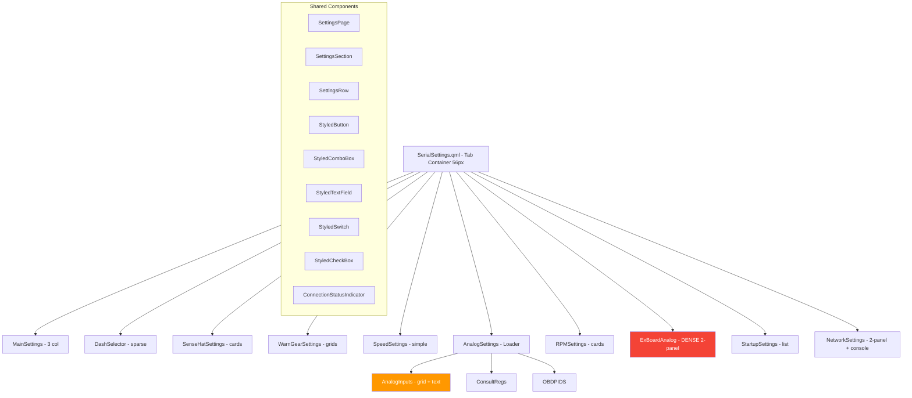

# Settings UI Cleanup Plan - Fixed 1600x740 Display

## 0. Display Constraints

| Constraint | Value |
|-----------|-------|
| Total viewport | 1600 x 740px |
| Tab bar height | 56px (from [`SerialSettings.qml`](PowerTune/Core/SerialSettings.qml:64)) |
| Content area | 1600 x 684px |
| Page margins | 16px all sides |
| Usable content | 1568 x 652px |
| Scrolling | NONE - every page must fit entirely |
| Theme | Dark-only (no light mode) |
| Input | Touch (Raspberry Pi touchscreen) |
| Touch target minimum | 36px height, 44px preferred |

---

## 1. Design System Constants (1600x740 Viewport)

### 1.1 Colors (unchanged from existing)

| Token | Value | Usage |
|-------|-------|-------|
| `colorBackground` | `#121212` | Page background |
| `colorBackgroundSecondary` | `#1E1E1E` | Section cards, panels |
| `colorBackgroundTertiary` | `#2D2D2D` | Input fields, controls |
| `colorAccent` | `#009688` | Active tabs, focus borders, toggles |
| `colorTextPrimary` | `#FFFFFF` | Labels, headings |
| `colorTextSecondary` | `#B0B0B0` | Descriptions, captions, column headers |
| `colorTextMuted` | `#707070` | Help text, placeholder text |
| `colorDivider` | `#3D3D3D` | Borders, separators |
| `colorSuccess` | `#4CAF50` | Connected status |
| `colorWarning` | `#FF9800` | Pending status |
| `colorError` | `#F44336` | Danger buttons, disconnected |

### 1.2 Typography (fixed pixel sizes - no dynamic `width/N` formulas)

| Element | pixelSize | Weight | Family | Usage |
|---------|-----------|--------|--------|-------|
| Section Title | 22px | DemiBold | Lato | SettingsSection title |
| Sub-heading | 18px | DemiBold | Lato | Sub-group headers |
| Body/Label | 16px | Normal | Lato | Standard labels |
| Column Header | 14px | DemiBold | Lato | Table/grid column headers |
| Field Text | 14px | Normal | Lato | Inside text fields |
| Caption/Help | 13px | Normal/Italic | Lato | Help text, explanations |
| Console | 13px | Normal | Courier New | Terminal output |
| Dense Label | 13px | Normal | Lato | ExBoard/Analog grid labels |
| Dense Field | 13px | Normal | Lato | ExBoard/Analog grid fields |

**Key change**: Reduced from original plan (28/22/20/18/16/14) to fit content in fixed viewport. The original sizes were too large for pages like ExBoard that have 50+ controls.

### 1.3 Spacing

| Token | Value | Context |
|-------|-------|---------|
| Page margin | 16px | All sides of content area |
| Section card padding | 12px | Inside SettingsSection |
| Section spacing | 12px | Between SettingsSection blocks |
| Row spacing (standard) | 8px | Between rows in normal pages |
| Row spacing (dense) | 4px | Between rows in ExBoard/Analog |
| Column spacing | 12px | Between columns in grids |
| Column spacing (dense) | 6px | Between columns in ExBoard/Analog |
| Button spacing | 8px | Between adjacent buttons |

### 1.4 Control Sizes

| Control | Width | Height | Touch-friendly |
|---------|-------|--------|----------------|
| Label column (standard) | 160-200px | auto | n/a |
| Label column (dense) | 60-80px | auto | n/a |
| StyledComboBox (standard) | 200-280px | 36px | Yes |
| StyledComboBox (dense) | 120-160px | 32px | Yes (minimum) |
| StyledTextField (standard) | 160-240px | 36px | Yes |
| StyledTextField (dense) | 80-110px | 32px | Yes (minimum) |
| StyledButton | 140-200px | 40px | Yes |
| StyledSwitch | auto | 36px | Yes |
| StyledCheckBox | 32px | 32px | Yes (minimum) |
| Border radius | 6px | - | - |

### 1.5 Height Budget Per Page

Available: **652px** (684 content - 16 top margin - 16 bottom margin)

Standard SettingsSection overhead:
- Title: 22px + 4px spacing = 26px
- Card padding: 12px top + 12px bottom = 24px
- Total per section: ~50px overhead + content rows

Standard row: 36px control + 8px spacing = 44px
Dense row: 32px control + 4px spacing = 36px

---

## 2. Per-Page Layout Specifications

### 2.1 Main Settings (Tab 0)

**File**: [`MainSettings.qml`](PowerTune/Settings/MainSettings.qml:1)
**Current**: 3-column RowLayout (520 + 520 + 480 = 1520px)
**Status**: Mostly good, needs sizing adjustments

**Layout**: 3-column RowLayout, no ScrollView needed

| Column | Width | Sections |
|--------|-------|----------|
| Left | 490px | Connection, ECU Configuration, Units |
| Middle | 500px | Vehicle, Data Logging, GoPro |
| Right | 490px | CAN Configuration, Language |

**Height budget** (left column - tallest):
- Connection section: 50px overhead + Connect/Disconnect row (40px) + GPS Connect/Disconnect (40px) + Serial Port (36px) + GPS Port (36px) + Status (36px) = ~238px
- ECU Configuration: 50px + ECU Selection (36px) + RPM Smoothing (36px, conditional) + Speed Smoothing (36px, conditional) = ~158px max
- Units: 50px + Speed (36px) + Temp (36px) + Pressure (36px) = ~158px
- **Total**: 238 + 12 + 158 + 12 + 158 = **578px** -- FITS in 652px

**Changes needed**:
- Remove `ScrollView` wrapper (not needed at fixed size)
- Reduce column widths from 520/520/480 to 490/500/490
- Reduce button widths from 180px to 140px
- Reduce label widths from 180px to 160px
- Reduce font sizes: body labels from 20px to 16px, sub-headings from 22px to 18px
- Replace raw `ComboBox` language selector (line 633) with `StyledComboBox` variant
- Reduce control heights from implicit 44px to 36px
- Analog Inputs section (PowerFC only, middle column) is conditional - fits when visible

### 2.2 Dash Selector (Tab 1)

**File**: [`DashSelector.qml`](PowerTune/Settings/DashSelector.qml:1)
**Current**: Very sparse - 2 sections, mostly empty space
**Status**: Good styling, wasted space

**Layout**: Single column centered, or 2-column with preview

| Section | Content | Height |
|---------|---------|--------|
| Active Dashboards | Dropdown for count (1-4) | ~86px |
| Dashboard Selection | 4 DashSelectorWidgets in a row | ~300px |
| **Total** | | ~398px |

**Changes needed**:
- Remove `ScrollView` wrapper
- Consider expanding DashSelectorWidget cards to use more vertical space (add preview image or description)
- Center content vertically since there is ~254px unused vertical space
- Alternatively, could add a "Dashboard Preview" section showing the selected dash layout

### 2.3 SenseHat Settings (Tab 2)

**File**: [`SenseHatSettings.qml`](PowerTune/Settings/SenseHatSettings.qml:1)
**Current**: 2-column grid of sensor toggle cards (350px x 80px)
**Status**: Good styling, uses raw `Switch` instead of `StyledSwitch`

**Layout**: 2-column GridLayout of sensor cards

| Row | Col 1 | Col 2 |
|-----|-------|-------|
| 1 | Accelerometer card | Gyroscope card |
| 2 | Compass card | Temperature card |
| 3 | Pressure card | (empty) |

**Height budget**:
- Section: 50px overhead + description (18px) + 3 rows x (80px card + 16px spacing) = ~356px
- **Fits** comfortably in 652px

**Changes needed**:
- Remove `ScrollView` wrapper
- Replace 5 raw `Switch` controls with `StyledSwitch` 
- Could expand cards to fill more space, or add a sensor status readout section

### 2.4 Warn / Gear Settings (Tab 3)

**File**: [`WarnGearSettings.qml`](PowerTune/Settings/WarnGearSettings.qml:1)
**Current**: Warning thresholds (5-col grid) + Gear calculation (6-col grid + switch)
**Status**: Good styling, clean layout

**Layout**: Single column, two sections

**Height budget**:
- Warning Thresholds: 50px + header row (20px) + input row (36px) + spacing = ~118px
- Gear Calculation: 50px + switch (36px) + header row (20px) + input row (36px) + help text (18px) = ~172px
- Spacing: 12px
- **Total**: ~302px -- FITS with ~350px to spare

**Changes needed**:
- Remove `ScrollView` wrapper
- Reduce font sizes from 18px column headers to 14px
- Reduce field widths from 140px to 120px, or use `Layout.fillWidth` for even distribution
- Center content vertically

### 2.5 Speed Settings (Tab 4)

**File**: [`SpeedSettings.qml`](PowerTune/Settings/SpeedSettings.qml:1)
**Current**: Speed Correction + External Speed Sensor sections
**Status**: Good styling

**Layout**: Single column, two sections

**Height budget**:
- Speed Correction: 50px + row (36px) = 86px
- External Speed Sensor: 50px + switch (36px) + conditional block: Pulses/mile (36px) + Port (36px) + Connect/Disconnect (40px) = ~198px max
- **Total**: ~296px -- FITS

**Changes needed**:
- Remove `ScrollView` wrapper
- Reduce label widths from 250px to 180px
- Reduce font sizes

### 2.6 Analog Settings (Tab 5)

**File**: [`AnalogSettings.qml`](PowerTune/Settings/AnalogSettings.qml:1) -> loads [`AnalogInputs.qml`](PowerTune/Core/AnalogInputs.qml:1)
**Current**: Raw Grid, 12 rows x 3 cols (Analog 0-10 + header), explanation text on right
**Status**: Partially restyled dark (#1a1a2e), uses dynamic sizing

**Layout**: 2-panel horizontal layout

```
|  Analog Grid (left ~500px)  |  Explanation Text (right ~1050px)  |
|  Header: [blank] [Val@0V] [Val@5V]  |                          |
|  Analog 0: [field] [field]          |  Translated explanation   |
|  Analog 1: [field] [field]          |  text with word wrap      |
|  ...                                 |                          |
|  Analog 10: [field] [field]         |                          |
```

**Height budget** (11 data rows + 1 header):
- Header row: 20px
- 11 data rows at 36px + 6px spacing = 462px
- **Total**: ~482px -- FITS in 652px

**Changes needed**:
- Change background from `#1a1a2e` to `#121212` to match other pages
- Replace raw `Grid` with `GridLayout` for proper alignment
- Replace dynamic `width/12` and `width/55` sizing with fixed pixel values
- Use `fieldWidth: 110px`, `fieldHeight: 36px`, `fieldFontSize: 14px`, `labelFontSize: 14px`
- Remove `ScrollView` from `AnalogSettings.qml`
- Wrap in `SettingsSection` for consistency
- Position explanation text in right panel with proper wrapping
- Set explanation text `color: "#B0B0B0"` (currently `#FFFFFF`)

### 2.7 RPM Settings (Tab 6)

**File**: [`RPMSettings.qml`](PowerTune/Settings/RPMSettings.qml:1)
**Current**: MAX RPM field + 4 shift light stage cards (200px x 120px each)
**Status**: Good styling

**Layout**: Single column, two sections

**Height budget**:
- RPM Configuration: 50px + row (36px) = 86px
- Shift Light: 50px + help text (18px) + 4 cards in row (120px) = ~188px
- **Total**: ~286px -- FITS

**Changes needed**:
- Remove `ScrollView` wrapper
- Reduce card heights from 120px to 100px if desired
- Center content vertically

### 2.8 EX Board (Tab 7) - DENSEST PAGE

**File**: [`ExBoardAnalog.qml`](PowerTune/Core/ExBoardAnalog.qml:1)
**Current**: Three separate `Grid` layouts (absolute positioned) + bottom rows
**Status**: Partially restyled (#1a1a2e), uses dynamic sizing

This is the most challenging page. It has:
- **Left grid**: 8 analog inputs (EX AN 0-7) with Val@0V, Val@5V columns + 1 damping row
- **Right grid**: 6 NTC temp sensor rows (AN 0-5) with Temp In checkbox, T1/R1/T2/R2/T3/R3 fields, 100ohm/1K jumper checkboxes (9 columns)
- **Bottom left**: RPM CAN checkbox + version selector + cylinder selector
- **Bottom right**: Digital input headlight channel selector + CAN/IO Brightness switch

**Layout**: Full-width 2-panel design, no sections/cards (too dense)

```
+----- Left Panel (380px) -----+----- Right Panel (1190px) -----------------------+
| Header: [blank][Val@0V][5V]  | Header: [TempIn][T1][R1][T2][R2][T3][R3][100][1K]|
| EX AN 0: [field] [field]    | [chk] [fld][fld][fld][fld][fld][fld] [chk] [chk] |
| EX AN 1: [field] [field]    | [chk] [fld][fld][fld][fld][fld][fld] [chk] [chk] |
| EX AN 2: [field] [field]    | [chk] [fld][fld][fld][fld][fld][fld] [chk] [chk] |
| EX AN 3: [field] [field]    | [chk] [fld][fld][fld][fld][fld][fld] [chk] [chk] |
| EX AN 4: [field] [field]    | [chk] [fld][fld][fld][fld][fld][fld] [chk] [chk] |
| EX AN 5: [field] [field]    | [chk] [fld][fld][fld][fld][fld][fld] [chk] [chk] |
| EX AN 6: [field] [field]    |                                                   |
| EX AN 7: [field] [field]    |                                                   |
| AN 7 : [Damping] [field]    |                                                   |
+------------------------------+---------------------------------------------------+
| RPM CAN: [chk] Version:[cb] Cylinders:[cb]  | Headlight:[cb]  Brightness:[sw]  |
+----------------------------------------------+----------------------------------+
```

**Height budget** (TIGHT):
- Top margin: 16px
- Header row: 22px
- 9 data rows (EX AN 0-7 + damping) at (32px control + 4px spacing) = 324px
- Gap: 8px
- RPM CAN row: 36px
- Gap: 8px
- Bottom bar (digital extender + brightness): 36px
- Bottom margin: 16px
- **Total**: 16 + 22 + 324 + 8 + 36 + 8 + 36 + 16 = **466px** -- FITS in 684px with ~218px to spare

**Width budget for right panel** (9 columns):
- Available: 1568 - 380 - 16 gap = 1172px
- Temp In checkbox: 50px
- 6 Steinhart fields at 130px each: 780px
- 2 jumper checkboxes at 50px each: 100px
- Spacing (8 gaps at 4px): 32px
- **Total**: 962px -- FITS in 1172px with room for labels

**Sizing constants for this page**:
- `fieldWidth`: 100px (was `mainWindow.width/15` = 107px)
- `fieldHeight`: 32px (was `mainWindow.height/15` = 49px)
- `fieldFontSize`: 13px (was `mainWindow.width/55` = 29px)
- `labelFontSize`: 13px (was `mainWindow.width/60` = 27px)
- `shFieldWidth`: 110px (was `mainWindow.width/12` = 133px)
- `shFieldFontSize`: 13px (was `mainWindow.width/65` = 25px)
- `checkWidth`: 50px (was `mainWindow.width/20` = 80px)

**Changes needed**:
- Change background from `#1a1a2e` to `#121212`
- Replace ALL dynamic `mainWindow.width/N` and `mainWindow.height/N` with fixed pixel values above
- Replace 3 separate `Grid` layouts with proper `GridLayout` using `RowLayout` parent
- Use `RowLayout` at top level: left panel + right panel
- Replace absolute positioning (`anchors.left/right/top/bottom`) with layout-based positioning
- Replace all raw `CheckBox` with `StyledCheckBox` (already partially done)
- Ensure all `StyledTextField` and `StyledComboBox` use fixed sizes
- Fix the `Eurostile` font references to `Lato` for consistency
- Simplify the `digitalExtender.onCurrentIndexChanged` handler (use index directly)
- Make bottom bar a proper `RowLayout` at the bottom of the page

### 2.9 Startup Settings (Tab 8)

**File**: [`StartupSettings.qml`](PowerTune/Settings/StartupSettings.qml:1)
**Current**: 4 sections + warning box
**Status**: Good styling

**Layout**: Single column, 4-5 sections

**Height budget**:
- Daemon Selection: 50px + row (36px) + Apply button (40px) = ~126px
- CAN Bitrate: 50px + row (36px) = ~86px
- Speed Source: 50px + row (36px) = ~86px
- Holley ECU (conditional): 50px + row (36px) = ~86px
- Warning text: ~60px
- Spacing: 4 x 12px = 48px
- **Total with Holley**: ~492px -- FITS
- **Total without Holley**: ~406px -- FITS

**Changes needed**:
- Remove `ScrollView` wrapper
- Reduce label widths from 200px to 160px
- The daemon `StyledComboBox` with 60+ items needs careful popup handling on touchscreen - verify it works at 740px height (popup may overflow)

### 2.10 Network Settings (Tab 9)

**File**: [`NetworkSettings.qml`](PowerTune/Settings/NetworkSettings.qml:1)
**Current**: 2-column RowLayout. Left: Console (500px). Right: 4 settings sections
**Status**: Good styling

**Layout**: 2-column RowLayout (no ScrollView in content)

| Panel | Width | Content |
|-------|-------|---------|
| Console | 480px | Console output with scrollable text area |
| Settings | fill remaining (~1072px) | WiFi Config, Network Status, System Actions, Track Downloads |

**Height budget** (right column):
- WiFi Config: 50px + Country (36px) + WiFi1 (36px) + Password (36px) + buttons (40px) = ~198px
- Network Status: 50px + Ethernet (36px) + WLAN (36px) = ~122px
- System Actions: 50px + buttons (40px) = ~90px
- Track Downloads: 50px + button (40px) + progress (20px) = ~110px
- Spacing: 3 x 12px = 36px
- **Total**: ~556px -- FITS in 652px

**Changes needed**:
- Remove `ScrollView` wrapper from right column
- Console panel keeps its internal Flickable/ScrollBar (that is actual content scrolling, not page scrolling)
- Reduce label widths from 180px to 160px

---

## 3. Reusable Styled Components

### Already Existing in [`PowerTune/Settings/components/`](PowerTune/Settings/components/)

- [`SettingsSection.qml`](PowerTune/Settings/components/SettingsSection.qml:1) - Card container with title and divider
- [`SettingsRow.qml`](PowerTune/Settings/components/SettingsRow.qml:1) - Label + control layout
- [`SettingsPage.qml`](PowerTune/Settings/components/SettingsPage.qml:1) - Base page (NOT used)
- [`StyledButton.qml`](PowerTune/Settings/components/StyledButton.qml:1) - Primary/secondary/danger button
- [`StyledComboBox.qml`](PowerTune/Settings/components/StyledComboBox.qml:1) - Dark dropdown
- [`StyledTextField.qml`](PowerTune/Settings/components/StyledTextField.qml:1) - Dark input field
- [`StyledSwitch.qml`](PowerTune/Settings/components/StyledSwitch.qml:1) - Toggle with label
- [`StyledCheckBox.qml`](PowerTune/Settings/components/StyledCheckBox.qml:1) - Dark themed checkbox
- [`ConnectionStatusIndicator.qml`](PowerTune/Settings/components/ConnectionStatusIndicator.qml:1) - Status dot + text

### Component Updates Needed

1. **`SettingsPage.qml`**: Update to remove ScrollView, enforce fixed 1600x684 content area, expose theme object
2. **`SettingsSection.qml`**: Reduce default padding from 16px to 12px, title font from 28px to 22px
3. **`StyledTextField.qml`**: Ensure default height is 36px (not 44px)
4. **`StyledComboBox.qml`**: Ensure default height is 36px, verify popup does not overflow 740px viewport
5. **`StyledButton.qml`**: Ensure default height is 40px (not 48px)
6. **`StyledCheckBox.qml`**: Ensure minimum 32px x 32px for touch

---

## 4. Architecture Diagram



---

## 5. Prioritized Implementation Order

### Phase 1: Component Foundation

1. Update `SettingsPage.qml` to enforce no-scroll, fixed-size content area (1600x684)
2. Update `SettingsSection.qml` padding/title sizing for compact layout
3. Verify/update `StyledTextField`, `StyledComboBox`, `StyledButton` default sizes to 36px/36px/40px heights
4. Verify `StyledCheckBox.qml` touch target size (min 32x32)
5. Verify `StyledComboBox` popup does not overflow 740px viewport on dense model lists

### Phase 2: Critical Rework - Unstyled Pages

6. Rework [`ExBoardAnalog.qml`](PowerTune/Core/ExBoardAnalog.qml:1):
   - Change background to `#121212`
   - Replace 3 absolute-positioned `Grid` layouts with `RowLayout` -> left `GridLayout` + right `GridLayout`
   - Replace ALL dynamic sizing (`width/N`) with fixed pixel values
   - Fix font family from `Eurostile` to `Lato`
   - Ensure all controls fit in 1600x684 without scrolling
   - Add proper `RowLayout` bottom bar for digital extender + brightness controls

7. Rework [`AnalogInputs.qml`](PowerTune/Core/AnalogInputs.qml:1):
   - Change background to `#121212`
   - Replace raw `Grid` with `GridLayout`
   - Replace dynamic sizing with fixed pixels
   - Use 2-panel layout: grid left, explanation text right
   - Wrap in `SettingsSection`

8. Set `AnalogSettings.qml` background to `#121212`

### Phase 3: Remove ScrollView + Size Adjustments (Styled Pages)

9. Update [`MainSettings.qml`](PowerTune/Settings/MainSettings.qml:1):
   - Remove `ScrollView`
   - Reduce column widths to 490/500/490
   - Reduce label widths to 160px, font sizes to 16px body/18px sub-heading
   - Reduce control heights to 36px
   - Replace raw language `ComboBox` with `StyledComboBox` + flag support

10. Update [`DashSelector.qml`](PowerTune/Settings/DashSelector.qml:1):
    - Remove `ScrollView`
    - Center content or expand DashSelectorWidget cards

11. Update [`SenseHatSettings.qml`](PowerTune/Settings/SenseHatSettings.qml:1):
    - Remove `ScrollView`
    - Replace 5 raw `Switch` with `StyledSwitch`

12. Update [`WarnGearSettings.qml`](PowerTune/Settings/WarnGearSettings.qml:1):
    - Remove `ScrollView`
    - Reduce font sizes and field widths for consistency

13. Update [`SpeedSettings.qml`](PowerTune/Settings/SpeedSettings.qml:1):
    - Remove `ScrollView`
    - Reduce label widths to 180px

14. Update [`RPMSettings.qml`](PowerTune/Settings/RPMSettings.qml:1):
    - Remove `ScrollView`

15. Update [`StartupSettings.qml`](PowerTune/Settings/StartupSettings.qml:1):
    - Remove `ScrollView`
    - Test daemon ComboBox popup at 740px viewport height

16. Update [`NetworkSettings.qml`](PowerTune/Settings/NetworkSettings.qml:1):
    - Remove `ScrollView` from right settings column
    - Keep console panel internal scroll

### Phase 4: Tab Bar and Translation

17. Review [`SerialSettings.qml`](PowerTune/Core/SerialSettings.qml:1) tab bar:
    - Verify 56px tab bar height is correct
    - Fix translation keys for tab titles that return fallback text
    - Reduce tab button width from 145px to 140px if needed (10 tabs x 145 = 1450px, fits)

### Phase 5: Adopt Base Components

18. Migrate all pages to use `SettingsPage.qml` as root instead of individual `Rectangle` + `anchors.fill`
19. Replace repeated `RowLayout { Text {...} Control {...} }` patterns with `SettingsRow` component

---

## 6. Content Inventory Per Page

| Page | Controls | Rows | Columns | Density | ScrollView Remove |
|------|----------|------|---------|---------|-------------------|
| Main Settings | ~25 | ~15 | 3 | Medium | Yes |
| Dash Selector | ~5 | ~2 | 1 | Low | Yes |
| SenseHat | ~5 switches | ~3 | 2 | Low | Yes |
| Warn/Gear | ~11 fields + 1 switch | ~4 | 5-6 | Medium | Yes |
| Speed | ~4 fields + 1 switch + 2 buttons | ~5 | 1 | Low | Yes |
| Analog | ~22 fields | ~12 | 3 | Medium | Yes |
| RPM | ~5 fields | ~2 | 1+4 cards | Low | Yes |
| EX Board | ~56 fields + ~18 checkboxes + 3 combos | ~12 | 3+9 | HIGH | No scroll exists |
| Startup | ~4 combos + 1 button | ~5 | 1 | Low | Yes |
| Network | ~3 combos + 1 field + 4 buttons + console | ~8 | 2 panels | Medium | Partial |

---

## 7. Risk Assessment

| Risk | Mitigation |
|------|-----------|
| ExBoardAnalog too dense for 32px rows | Height budget shows 466px needed vs 684px available - 218px margin |
| StyledComboBox popup overflow on Startup daemon list (60+ items) | ComboBox popup needs max height constraint of ~500px with internal scroll |
| Touch targets too small at 32px | 32px is minimum acceptable; prefer 36px where space allows |
| Font sizes too small at 13px | Only ExBoard/Analog use 13px; all other pages use 14-16px |
| SettingsSection overhead consumes too much height | ExBoard page skips SettingsSection, uses direct GridLayout |
