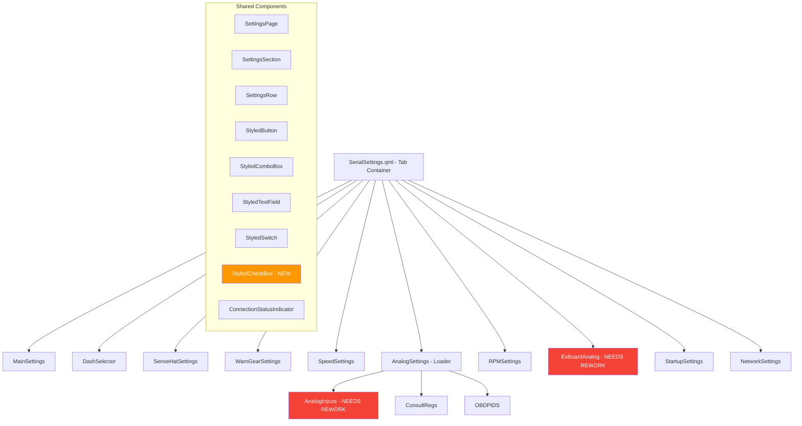

# Settings UI Cleanup Plan

## 1. File-by-File Issue Analysis

### Tier 1: Critical - No Dark Theme (Grey Background, Unstyled Controls)

#### [`ExBoardAnalog.qml`](PowerTune/Core/ExBoardAnalog.qml:1) - WORST OFFENDER
- **Background**: `color: "grey"` (line 9) - completely breaks dark theme
- **Layout**: Uses raw `Grid` instead of `GridLayout`/`ColumnLayout` - no proper alignment
- **Controls**: All `TextField` and `CheckBox` are unstyled Qt defaults (white backgrounds, white checkboxes)
- **Font sizing**: Uses `mainWindow.width / 60` dynamic sizing instead of fixed `font.pixelSize`
- **No imports** for `QtQuick.Layouts`, no styled components, no `SettingsSection`
- **No `ScrollView`** - content will overflow on smaller screens
- **1300+ lines** of repetitive grid code with no component reuse
- **Missing styled components**: Does not use `StyledTextField`, `StyledComboBox`, or `StyledSwitch`
- **ComboBox delegates** reference wrong parent id (`cylindercombobox` used for all delegates)

#### [`AnalogInputs.qml`](PowerTune/Core/AnalogInputs.qml:1) - SECOND WORST
- **Background**: `color: "grey"` (line 8) - breaks dark theme
- **Layout**: Raw `Grid` with `spacing: 5` - inconsistent with other pages
- **Controls**: All `TextField` unstyled Qt defaults
- **Explanation text**: `color: "black"` (line 319) - invisible on dark background if fixed
- **No ScrollView**, no `SettingsSection`, no styled components
- **No imports** for layouts or styled components

### Tier 2: Partially Styled - Using Some Components But With Issues

#### [`MainSettings.qml`](PowerTune/Settings/MainSettings.qml:1) - MOSTLY GOOD
- Uses `SettingsSection`, `StyledButton`, `StyledComboBox`, `StyledTextField`, `StyledSwitch`
- **Language ComboBox** (line 633): Uses raw `ComboBox` instead of `StyledComboBox` with custom delegate for flags - needs special handling
- **Three-column `RowLayout`** with hardcoded widths (520, 520, 480px) - not responsive
- **Hardcoded color values** instead of referencing theme constants
- Individual `Text` labels repeat `font.pixelSize: 20; font.family: "Lato"; color: "#FFFFFF"` pattern everywhere

#### [`AnalogSettings.qml`](PowerTune/Settings/AnalogSettings.qml:1) - LOADER WRAPPER
- Just a `Loader` that loads [`AnalogInputs.qml`](PowerTune/Core/AnalogInputs.qml), [`ConsultRegs.qml`](PowerTune/Core/ConsultRegs.qml), or [`OBDPIDS.qml`](PowerTune/Core/OBDPIDS.qml)
- No background color set on the Rectangle - inherits default
- The loaded components are the ones with issues

### Tier 3: Well-Styled - Minor Tweaks Needed

#### [`DashSelector.qml`](PowerTune/Settings/DashSelector.qml:1) - GOOD
- Uses dark theme `#121212`, `SettingsSection`, `StyledComboBox`
- Minor: Label width 200 vs 180 used in MainSettings - inconsistency

#### [`SenseHatSettings.qml`](PowerTune/Settings/SenseHatSettings.qml:1) - GOOD BUT SWITCH UNSTYLED
- Uses dark theme, `SettingsSection`, nice card-based sensor toggles
- **Issue**: Line 104/161/219/275/332 - raw `Switch` instead of `StyledSwitch`
- Has `MaterialIcon` component usage - need to verify this works

#### [`WarnGearSettings.qml`](PowerTune/Settings/WarnGearSettings.qml:1) - GOOD
- Uses dark theme, `SettingsSection`, `StyledTextField`, `StyledSwitch`
- Clean `GridLayout` for warnings and gear values

#### [`SpeedSettings.qml`](PowerTune/Settings/SpeedSettings.qml:1) - GOOD
- Uses dark theme, `SettingsSection`, `StyledTextField`, `StyledSwitch`, `StyledButton`, `StyledComboBox`

#### [`RPMSettings.qml`](PowerTune/Settings/RPMSettings.qml:1) - GOOD
- Color-coded stage cards with proper dark theme
- Uses `SettingsSection`, `StyledTextField`

#### [`StartupSettings.qml`](PowerTune/Settings/StartupSettings.qml:1) - GOOD
- Uses dark theme, all styled components
- Warning box properly styled

#### [`NetworkSettings.qml`](PowerTune/Settings/NetworkSettings.qml:1) - GOOD
- Console output panel, all styled components
- Progress bar properly themed

### Tab Container

#### [`SerialSettings.qml`](PowerTune/Core/SerialSettings.qml:1) - TAB BAR CONTAINER
- **Translation issue**: Tab at index 5 uses dynamic `regtabTitle` which calls `Translator.translate()` - the "Translation not ..." text appears when translation keys are missing
- All other tabs pass through `Translator.translate(model.title, Settings.language)` - if translation key not found, it shows the fallback message
- Tab titles that may show "Translation not ...":
  - "Sensehat" - likely not in translation dictionary
  - "Warn / Gear" - likely not in translation dictionary
  - "Analog" - likely in dictionary
  - "EX Board" - likely not in translation dictionary
  - "Startup" - likely not in translation dictionary
  - "Network" - likely not in translation dictionary
- **Suggested correct labels**: Keep English labels as-is; add missing translation keys to Translator

---

## 2. Style Guide - Design Tokens

All settings pages MUST use these consistent values:

### Colors
| Token | Value | Usage |
|-------|-------|-------|
| `colorBackground` | `#121212` | Page background |
| `colorBackgroundSecondary` | `#1E1E1E` | Section cards, panels |
| `colorBackgroundTertiary` | `#2D2D2D` | Input fields, controls |
| `colorAccent` | `#009688` | Active tabs, focus borders, toggles |
| `colorTextPrimary` | `#FFFFFF` | Labels, headings |
| `colorTextSecondary` | `#B0B0B0` | Descriptions, captions, column headers |
| `colorTextMuted` | `#707070` | Help text, placeholder text |
| `colorDivider` | `#3D3D3D` | Borders, separators |
| `colorSuccess` | `#4CAF50` | Connected status |
| `colorWarning` | `#FF9800` | Pending status |
| `colorError` | `#F44336` | Danger buttons, disconnected |

### Typography
| Element | Size | Weight | Family |
|---------|------|--------|--------|
| Section Title | 28px | DemiBold | Lato |
| Sub-heading | 22px | DemiBold | Lato |
| Body/Label | 20px | Normal | Lato |
| Column Header | 18px | DemiBold | Lato |
| Caption/Help | 16px | Normal/Italic | Lato |
| Console | 14px | Normal | Courier New |

### Spacing
| Token | Value |
|-------|-------|
| Page margin | 16px |
| Section padding | 16px |
| Section spacing | 20px |
| Row spacing | 12px |
| Column spacing | 20px |
| Button spacing | 12px |

### Control Sizes
| Control | Width | Height |
|---------|-------|--------|
| Label column | 180-250px | auto |
| StyledComboBox | 240-280px | 44px |
| StyledTextField | 200-280px | 44px |
| StyledButton | 140-280px | 48px |
| Border radius | 8px | - |

---

## 3. Reusable Styled Components

### Already Existing in [`PowerTune/Settings/components/`](PowerTune/Settings/components/)
- [`SettingsSection.qml`](PowerTune/Settings/components/SettingsSection.qml:1) - Card container with title, divider, collapsible
- [`SettingsRow.qml`](PowerTune/Settings/components/SettingsRow.qml:1) - Label + control layout (NOT widely used yet)
- [`SettingsPage.qml`](PowerTune/Settings/components/SettingsPage.qml:1) - Base page with ScrollView and theme object (NOT used by any page)
- [`StyledButton.qml`](PowerTune/Settings/components/StyledButton.qml:1) - Primary/secondary/danger button
- [`StyledComboBox.qml`](PowerTune/Settings/components/StyledComboBox.qml:1) - Dark dropdown
- [`StyledTextField.qml`](PowerTune/Settings/components/StyledTextField.qml:1) - Dark input field
- [`StyledSwitch.qml`](PowerTune/Settings/components/StyledSwitch.qml:1) - Toggle with label
- [`ConnectionStatusIndicator.qml`](PowerTune/Settings/components/ConnectionStatusIndicator.qml:1) - Status dot + text

### New Components Needed
- **`StyledCheckBox.qml`** - Dark themed checkbox (needed for ExBoardAnalog 30+ checkboxes)
- **`StyledGridSection.qml`** - Grid layout for tabular data (analog values, NTC calibration) with column headers

### Components to Adopt More Widely
- **`SettingsPage.qml`** should be used as the base for ALL settings pages instead of each page defining its own `Rectangle + ScrollView + ColumnLayout`
- **`SettingsRow.qml`** should replace the repeated `RowLayout { Text { ... } StyledComboBox/TextField { ... } }` pattern

---

## 4. Prioritized Work Items

### Phase 1: Shared Infrastructure
1. Create `StyledCheckBox.qml` component in `PowerTune/Settings/components/`
2. Ensure `SettingsPage.qml` theme object is accessible to child components
3. Verify `PowerTune/Settings/components/` qmldir exports all components properly

### Phase 2: Critical Fixes - Unstyled Pages
4. Rewrite [`ExBoardAnalog.qml`](PowerTune/Core/ExBoardAnalog.qml) with dark theme:
   - Change `color: "grey"` to `color: "#121212"`
   - Wrap in `ScrollView` + `ColumnLayout` + `SettingsSection`
   - Replace all raw `TextField` with `StyledTextField`
   - Replace all raw `CheckBox` with new `StyledCheckBox`
   - Replace all raw `ComboBox` with `StyledComboBox`
   - Use `GridLayout` instead of `Grid` for proper alignment
   - Fix font sizing from dynamic `width/60` to fixed pixel sizes
   - Organize into sections: Analog Inputs, NTC Calibration, RPM CAN, Digital Extender, Brightness

5. Rewrite [`AnalogInputs.qml`](PowerTune/Core/AnalogInputs.qml) with dark theme:
   - Change `color: "grey"` to `color: "#121212"`
   - Wrap in `ScrollView` + `ColumnLayout` + `SettingsSection`
   - Replace all raw `TextField` with `StyledTextField`
   - Use `GridLayout` instead of `Grid`
   - Fix explanation text `color: "black"` to `color: "#B0B0B0"`
   - Fix font sizing from dynamic to fixed pixel sizes

6. Set background color on [`AnalogSettings.qml`](PowerTune/Settings/AnalogSettings.qml) Rectangle to `#121212`

### Phase 3: Consistency Fixes - Partially Styled Pages
7. Fix [`SenseHatSettings.qml`](PowerTune/Settings/SenseHatSettings.qml) - Replace 5 raw `Switch` with `StyledSwitch`

8. Fix [`MainSettings.qml`](PowerTune/Settings/MainSettings.qml):
   - Replace the custom language `ComboBox` (line 633) with a `StyledComboBox` variant or extract to a `LanguagePicker.qml` component
   - Ensure label widths are consistent (standardize to 180px)

### Phase 4: Translation Fixes
9. Investigate [`SerialSettings.qml`](PowerTune/Core/SerialSettings.qml) tab titles:
   - Identify which `Translator.translate()` keys return "Translation not ..."
   - Add missing translation keys for: "Sensehat", "Warn / Gear", "EX Board", "Startup", "Network"
   - OR use untranslated English strings directly for technical terms

### Phase 5: Adopt Base Components
10. Migrate all settings pages to use `SettingsPage.qml` as their root component instead of individual `Rectangle + ScrollView` patterns
11. Replace repeated `RowLayout { Text { ... } Control { ... } }` patterns with `SettingsRow` component where appropriate

---

## 5. Translation Tab Labels

### Current Tab Model in [`SerialSettings.qml`](PowerTune/Core/SerialSettings.qml:43)

| Index | Model Title | Translate Call | Likely Issue |
|-------|-------------|----------------|--------------|
| 0 | "Main" | `Translator.translate` | May work |
| 1 | "Dash Sel." | `Translator.translate` | May fail - abbreviation |
| 2 | "Sensehat" | `Translator.translate` | May fail - product name |
| 3 | "Warn / Gear" | `Translator.translate` | May fail - compound |
| 4 | "Speed" | `Translator.translate` | Likely works |
| 5 | (dynamic) | `regtabTitle` | Uses own translate logic |
| 6 | "RPM" | `Translator.translate` | May fail - acronym |
| 7 | "EX Board" | `Translator.translate` | May fail - product term |
| 8 | "Startup" | `Translator.translate` | May fail |
| 9 | "Network" | `Translator.translate` | May fail |

### Recommended Tab Labels
For technical product terms that do not need translation, bypass `Translator.translate()`:

| Index | Recommended Label | Needs Translation |
|-------|-------------------|-------------------|
| 0 | "Main" or "Settings" | Yes |
| 1 | "Dashboards" | Yes |
| 2 | "SenseHat" | No - product name |
| 3 | "Warn / Gear" | Yes - split to "Warnings" |
| 4 | "Speed" | Yes |
| 5 | Dynamic per ECU | Already handled |
| 6 | "RPM" | No - universal |
| 7 | "EX Board" | No - product name |
| 8 | "Startup" | Yes |
| 9 | "Network" | Yes |

---

## 6. Architecture Diagram

