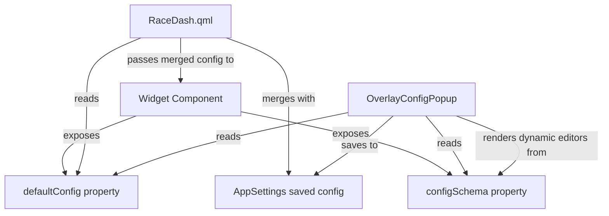

# Race Dashboard Refactor Plan

## 1. Current State Assessment

### Architecture Overview

The race dashboard system is composed of:

- [`RaceDash.qml`](PowerTune/Dashboard/RaceDash.qml) - Main layout file declaring 10 `DraggableOverlay` widgets over a background image
- [`DraggableOverlay.qml`](PowerTune/Dashboard/DraggableOverlay.qml) - Wrapper providing drag-to-reposition, double-tap edit mode, triple-tap config popup
- [`OverlayConfigPopup.qml`](PowerTune/Dashboard/OverlayConfigPopup.qml:1) - 2058-line monolithic config popup with 70+ flat properties
- [`DashboardTheme.qml`](PowerTune/Dashboard/DashboardTheme.qml) - Singleton with default positions, sizes, colors, fonts
- 11 widget components in [`PowerTune/Gauges/RaceDash/`](PowerTune/Gauges/RaceDash/)
- [`RaceArcItem`](PowerTune/Gauges/RaceDash/geohelpers/RaceArcItem.h) - C++ QQuickItem for GPU-rendered arc gauge
- `PropertyRouter` - C++ class exposing ~537 sensor properties from 13 domain models
- `AppSettings` - Persistence layer for overlay configs via `loadOverlayConfig`/`saveOverlayConfig`

### What Works

- **Draggable overlays**: Position save/restore, alignment guides, lock mechanism
- **Config persistence**: Per-overlay configs load/save correctly with legacy migration
- **Arc rendering**: `RaceArcItem` renders smooth tapered arcs with gradient colors
- **PropertyRouter bindings**: Most widgets correctly subscribe to `onValueChanged` signals
- **Test loop**: Animation sweep for arc gauges works correctly for alignment purposes
- **Shift indicator**: Proper center-out pattern via `ShiftHelper` C++ helper

### What Does Not Work / Known Issues

1. **`testLoopEnabled` defaults to `true`** in [`defaultClusterConfig()`](PowerTune/Dashboard/RaceDash.qml:34) (lines 34, 83) and [`defaultArcConfigFor()`](PowerTune/Dashboard/OverlayConfigPopup.qml:190) (lines 190, 219). Test sweep animation runs on first load before user configures anything.
2. **BrakeBiasBar has no `sensorKey`** in its defaults at [line 182](PowerTune/Dashboard/RaceDash.qml:182) - the config is `{ leftLabel, rightLabel, minValue, maxValue }` with no data source.
3. **OverlayConfigPopup is fixed-center** at [line 130-131](PowerTune/Dashboard/OverlayConfigPopup.qml:130) - user cannot see the widget they are configuring.
4. **Duplicated defaults**: Every config default appears in 3 places: `RaceDash.qml` `defaultClusterConfig()`, `OverlayConfigPopup.qml` `defaultArcConfigFor()`, and inline in each widget component.
5. **70+ flat properties** in `OverlayConfigPopup` making it fragile and hard to extend.

---

## 2. SVG Alignment Report

### Reference File

[`Resources/main_1600x720_display.svg`](Resources/main_1600x720_display.svg) - 1600x720 Figma export, 1:1 scale reference (not used at runtime).

### SVG-Defined Element Positions

Extracted from SVG transform matrices and element coordinates:

| Element | SVG Center/Position | SVG Size |
|---------|-------------------|----------|
| Tach gauge center | (803.462, 377.527) | Outer ring radius ~588px diameter, inner ~385px |
| Speed gauge center | (1274.34, 419.336) | Outer ring radius ~514px diameter, inner ~337px |
| Shift pills | x=337..1262, y=37 | 11 pills, each 75x30, gap=10, rx=15 |
| Bottom bar | y=680, height=40 | Full width 1600px |
| Brake bias bar | (134, 614), 223x17 | Gradient bar with pointer |
| Tach horizontal split | y~362, x=652..953 | Center line across tach face |
| Tach text: gear | ~(770-840, 257-345) | "2nd" gear indicator |
| Tach text: RPM value | ~(682-925, 384-461) | "7,700" with "RPM" below |
| Speed text: value | ~(1180-1390, 381-461) | "123" with "MPH" below |
| Water Temp label | ~(110, 58-83) | Upper-left sensor card |
| Water Temp value | ~(72, 103-146) | Large value text |
| Oil Pressure label | ~(116, 250-275) | Below water temp |
| Oil Pressure value | ~(66, 295-338) | Large value text |
| Status row: Fuel Pump | ~(66, 412-432) | "Fuel Pump.: ON" |
| Status row: Cooling Fan | ~(71, 475-495) | "Cooling Fan.: ON" |

### DashboardTheme Default Positions vs SVG

| Widget | DashboardTheme Default | SVG Expected | Computed Center | Status |
|--------|----------------------|-------------|----------------|--------|
| Shift Indicator | x=337, y=37, w=925 | x=337, y=37, 11x(75+10) | - | ALIGNED |
| Tach Cluster | x=515.936, y=90.001, size=575.051 | center=(803.5, 377.5) | (515.9+287.5, 90+287.5)=(803.4, 377.5) | ALIGNED |
| Speed Cluster | x=1022.751, y=167.751, size=503.17 | center=(1274.3, 419.3) | (1022.75+251.6, 167.75+251.6)=(1274.35, 419.35) | ALIGNED |
| Water Temp | x=66, y=62, w=250, h=113 | ~(66-316, 58-171) | - | ALIGNED (minor 4px y offset) |
| Oil Pressure | x=66, y=250, w=250, h=113 | ~(66-316, 250-363) | - | ALIGNED |
| Status Row 0 | x=66, y=409, w=250, h=25 | ~(66-316, 412-432) | - | ALIGNED (3px y offset) |
| Status Row 1 | x=66, y=472, w=250, h=25 | ~(71-316, 475-495) | - | ALIGNED (3px y offset) |
| Brake Bias | x=62, y=570, w=365, h=82 | ~(62-427, 570-652) | - | ALIGNED |
| Bottom Bar | x=0, y=680, w=1600, h=40 | y=680, h=40, full width | - | ALIGNED |

### Gear Indicator Positioning (Tach-Internal)

The gear indicator is a child of TachCluster, positioned via `anchors.centerIn: parent` with offsets:
- Default `gearOffsetX`: 21.5 (from center of tach, rightward)
- Default `gearOffsetY`: -76 (from center of tach, upward)
- Computed absolute position: (803.4 + 21.5, 377.5 - 76) = **(824.9, 301.5)**
- SVG shows gear "2nd" text centered approximately at **(805, 300)**
- **Delta**: ~20px horizontal offset. The `gearOffsetX: 21.5` shifts the gear number to the right to make room for the suffix text, which the SVG also shows.

### Tach/Speed Readout Positioning (Tach-Internal)

- Tach `readoutOffsetY`: 94 -> absolute y = 377.5 + 94 = **471.5** (SVG RPM text at ~y=475-503)
- Speed `readoutOffsetY`: 62 -> absolute y = 419.3 + 62 = **481.3** (SVG MPH text at ~y=475-503)

### Alignment Conclusion

The `DashboardTheme` default positions are well-aligned with the SVG reference. Minor 3-4px offsets exist for the left-side widgets but are within tolerance. The primary issue is NOT default positioning, but rather:

1. When `testLoopEnabled: true` by default, the arc animation runs immediately obscuring the background reference
2. If a user saves a partial config, the `arcOffsetX: 5` and other fine-tuning values may get lost, causing the arc to drift from the background bezel rings

---

## 3. Widget Config Architecture Proposal

### Current Problem

Defaults are defined in three places:
1. [`RaceDash.qml` `defaultClusterConfig()`](PowerTune/Dashboard/RaceDash.qml:15) - master defaults
2. [`OverlayConfigPopup.qml` `defaultArcConfigFor()`](PowerTune/Dashboard/OverlayConfigPopup.qml:178) - duplicated defaults
3. Each widget component's inline fallbacks (e.g., [`ArcGauge.qml`](PowerTune/Gauges/RaceDash/ArcGauge.qml:9) line 9: `config.sensorKey !== undefined ? ... : ""`)

This triple-redundancy means any default change must be made in all 3 places.

### Proposed Architecture: Widget-Owned Config Schema

Each widget component exposes a static `defaultConfig` property:

```
// In TachCluster.qml
readonly property var defaultConfig: ({
    shapeMode: "tachSvg",
    sensorKey: "rpm",
    minValue: 0,
    maxValue: 10000,
    unit: "RPM",
    decimals: 0,
    overlaySize: 575.051,
    startAngle: 225,
    endAngle: 56,
    arcWidth: 0.285,
    arcScale: 0.945,
    arcOffsetX: 5,
    arcOffsetY: 0,
    // ... all 30+ arc config properties
    testLoopEnabled: false,
    // gear sub-config
    gearKey: "Gear",
    gearTextColor: "#FFFFFF",
    gearFontSize: 140.013,
    // etc.
})
```

Additionally, each widget exposes a `configSchema` describing field types for the popup:

```
readonly property var configSchema: [
    { key: "sensorKey", type: "datasource", label: "Data Source" },
    { key: "minValue", type: "real", label: "Min Value" },
    { key: "maxValue", type: "real", label: "Max Value" },
    { key: "unit", type: "string", label: "Unit" },
    { key: "decimals", type: "int", label: "Decimals", min: 0, max: 6 },
    { key: "startAngle", type: "real", label: "Start Angle", section: "Arc Geometry" },
    // ...
]
```

### Data Flow (Proposed)



### Migration Path

1. Add `defaultConfig` property to each widget - no behavior change, just a single source of truth
2. Update `RaceDash.qml` to read defaults from widget components instead of inline objects
3. Update `OverlayConfigPopup.qml` to read schemas from widget components
4. Remove duplicated `defaultArcConfigFor()` and `defaultClusterConfig()` functions

---

## 4. Popup Movability Design

### Current State

[`OverlayConfigPopup.qml`](PowerTune/Dashboard/OverlayConfigPopup.qml:130) is centered:
```qml
x: (parent ? (parent.width - width) / 2 : 0)
y: (parent ? (parent.height - height) / 2 : 0)
modal: true
```

### Proposed Design

1. **Remove `modal: true`** - replace with `modal: false` and `closePolicy: Popup.CloseOnEscape`
2. **Add a drag header** - the existing header row already has "Configure: overlayId" text. Add a `DragHandler` on the header area.
3. **Bind x/y to draggable properties**:

```qml
property real popupX: (parent ? (parent.width - width) / 2 : 0)
property real popupY: (parent ? (parent.height - height) / 2 : 0)
x: popupX
y: popupY
```

4. **Add `DragHandler` to header**:

```qml
// In the header RowLayout
DragHandler {
    id: popupDragHandler
    target: null  // manual handling
    onTranslationChanged: {
        popup.popupX = Math.max(0, Math.min(popup.parent.width - popup.width,
            popup.popupX + translation.x - _lastTranslation.x))
        popup.popupY = Math.max(0, Math.min(popup.parent.height - popup.height,
            popup.popupY + translation.y - _lastTranslation.y))
    }
}
```

5. **Add semi-transparent overlay behind** - Instead of the current `#80000000` modal overlay, use a lighter `#20000000` non-blocking overlay, or remove entirely.

6. **Reset position on open** - When `openFor()` is called, reset `popupX`/`popupY` to default center position so it does not remember a previous off-screen drag.

---

## 5. PropertyRouter Binding Audit

### Per-Widget Binding Status

| Widget | File | sensorKey Source | PropertyRouter Binding | Status |
|--------|------|-----------------|----------------------|--------|
| **ShiftIndicator** | [`ShiftIndicator.qml`](PowerTune/Gauges/RaceDash/ShiftIndicator.qml:7) | `config.sensorKey` default `"rpm"` | `Connections { onValueChanged }` at [line 28](PowerTune/Gauges/RaceDash/ShiftIndicator.qml:28) | OK - bound to RPM |
| **TachCluster / ArcGauge** | [`ArcGauge.qml`](PowerTune/Gauges/RaceDash/ArcGauge.qml:9) | `config.sensorKey` default `""` | `Connections { onValueChanged }` at [line 74](PowerTune/Gauges/RaceDash/ArcGauge.qml:74) | OK - `sensorKey:"rpm"` provided by RaceDash defaults |
| **SpeedCluster / ArcGauge** | same as above | same mechanism | same binding | OK - `sensorKey:"speed"` provided |
| **GearIndicator** | [`GearIndicator.qml`](PowerTune/Gauges/RaceDash/GearIndicator.qml:7) | `config.gearKey` default `"Gear"` | `Connections { onValueChanged }` at [line 44](PowerTune/Gauges/RaceDash/GearIndicator.qml:44) | OK - uses separate `gearKey` field |
| **SensorCard** (waterTemp) | [`SensorCard.qml`](PowerTune/Gauges/RaceDash/SensorCard.qml:7) | `config.sensorKey` default `""` | `Connections { onValueChanged }` at [line 38](PowerTune/Gauges/RaceDash/SensorCard.qml:38) | OK - `sensorKey:"Watertemp"` provided |
| **SensorCard** (oilPressure) | same | same | same | OK - `sensorKey:"oilpres"` provided |
| **StatusBox** (statusRow0) | [`StatusBox.qml`](PowerTune/Gauges/RaceDash/StatusBox.qml:7) | `config.sensorKey` default `""` | `Connections { onValueChanged }` at [line 27](PowerTune/Gauges/RaceDash/StatusBox.qml:27) | OK - `sensorKey:"DigitalInput1"` provided |
| **StatusBox** (statusRow1) | same | same | same | OK - `sensorKey:"DigitalInput2"` provided |
| **BrakeBiasBar** | [`BrakeBiasBar.qml`](PowerTune/Gauges/RaceDash/BrakeBiasBar.qml:7) | `config.sensorKey` default `""` | `Connections { onValueChanged }` at [line 30](PowerTune/Gauges/RaceDash/BrakeBiasBar.qml:30) | MISSING - no `sensorKey` in [`RaceDash.qml` defaults](PowerTune/Dashboard/RaceDash.qml:182) |
| **BottomStatusBar** | [`BottomStatusBar.qml`](PowerTune/Gauges/RaceDash/BottomStatusBar.qml:8) | N/A (no sensor) | Uses `Diagnostics.canStatusText` directly | OK - not sensor-driven |

### Multi-Element Binding Analysis

**TachCluster** contains 3 sub-components:
1. `ArcGauge` - reads `config.sensorKey` (e.g., "rpm") for arc progress
2. `GearIndicator` - reads `config.gearKey` (e.g., "Gear") for gear display -- **separate key, correctly independent**
3. `GaugeReadout` - reads `arc.displayValue` -- **piggybacks on ArcGauge's value, no separate binding needed**

This is correct: the arc and readout share the same sensor via the `displayValue` property chain, while the gear uses a separate `gearKey`.

**SpeedCluster** contains 2 sub-components:
1. `ArcGauge` - reads `config.sensorKey` ("speed")
2. `GaugeReadout` - reads `arc.displayValue` -- correctly derived

### Binding Gaps

1. **BrakeBiasBar** - The widget reads `config.sensorKey` at [`BrakeBiasBar.qml:7`](PowerTune/Gauges/RaceDash/BrakeBiasBar.qml:7) and has a full `Connections` binding, but `RaceDash.qml` provides no `sensorKey` in its brakeBias defaults. The `OverlayConfigPopup` `hasDatasource` flag at [line 110](PowerTune/Dashboard/OverlayConfigPopup.qml:110) also **excludes** `isBrakeBias` from the datasource section (`hasDatasource: isArc || isGear || isSensor || isStatus || isBrakeBias` -- wait, it actually includes it). Let me re-check.

   Actually at [line 109-110](PowerTune/Dashboard/OverlayConfigPopup.qml:109): `readonly property bool hasDatasource: isArc || isGear || isSensor || isStatus || isBrakeBias` - this DOES include brakeBias. So the popup shows a datasource picker for it, but the default config has no sensorKey, so it starts empty.

   **Fix**: Add a sensible default `sensorKey` (or document that it must be configured by the user).

### Gear Indicator Configuration

The gear indicator is configurable through the **tachCluster** config type. When `configType === "tachCluster"`, [line 121](PowerTune/Dashboard/OverlayConfigPopup.qml:121) `hasGearConfig: isGear || isTachCluster` is true, enabling the gear configuration section. The settings include:
- `gearKey` (datasource, separate from arc sensorKey)
- `gearTextColor`, `gearFontSize`, `suffixFontSize`
- `gearOffsetX`, `gearOffsetY` (position within tach)
- `gearWidth`, `gearHeight`

This is correctly wired. The gear indicator's X/Y offsets are relative to the tach center via `anchors.centerIn: parent` with `anchors.horizontalCenterOffset` and `anchors.verticalCenterOffset`.

---

## 6. Implementation Plan

### Phase 1: Bug Fixes

| # | Task | File(s) | Details |
|---|------|---------|---------|
| 1.1 | Change `testLoopEnabled` default to `false` | [`RaceDash.qml`](PowerTune/Dashboard/RaceDash.qml:34) lines 34, 83 | Change `testLoopEnabled: true` to `testLoopEnabled: false` in both tachCluster and speedCluster defaults |
| 1.2 | Change `testLoopEnabled` default to `false` in popup | [`OverlayConfigPopup.qml`](PowerTune/Dashboard/OverlayConfigPopup.qml:190) lines 190, 219 | Change `testLoopEnabled: true` to `testLoopEnabled: false` in both speed and tach `defaultArcConfigFor()` returns |
| 1.3 | Add `sensorKey` to brakeBias defaults | [`RaceDash.qml`](PowerTune/Dashboard/RaceDash.qml:182) line 183 | Add `sensorKey: ""` to brakeBias default config to make the gap explicit, or add a real default if a common brake bias sensor key exists |
| 1.4 | Audit for `undefined`-to-`Number()` issues | All widget QML files | The pattern `Number(config.someProperty)` returns `NaN` if the property is undefined. Most widgets guard with `!== undefined` checks, but verify no edge cases exist |
| 1.5 | Check for deprecated signal handler syntax | All widget QML files | Ensure all `Connections` use `function onSignalName()` syntax, not the deprecated `onSignalName:` syntax. Current code appears correct. |

### Phase 2: Widget Alignment Verification

| # | Task | File(s) | Details |
|---|------|---------|---------|
| 2.1 | Visually verify widget alignment with test loop off | [`RaceDash.qml`](PowerTune/Dashboard/RaceDash.qml) | After Phase 1.1-1.2, load the dashboard and verify each widget aligns with the [`Racedash_AiM.png`](Resources/graphics/Racedash_AiM.png) background |
| 2.2 | Fine-tune any misaligned positions | [`DashboardTheme.qml`](PowerTune/Dashboard/DashboardTheme.qml) | Adjust any default positions that do not match the background. Based on SVG analysis, current defaults appear correct within 3-4px |
| 2.3 | Document SVG-to-DashboardTheme coordinate mapping | This plan file or separate doc | Record the coordinate derivation for each widget so future changes can reference the SVG |

### Phase 3: Widget Self-Contained Config Refactor

| # | Task | File(s) | Details |
|---|------|---------|---------|
| 3.1 | Add `defaultConfig` property to TachCluster | [`TachCluster.qml`](PowerTune/Gauges/RaceDash/TachCluster.qml) | Static `readonly property var defaultConfig` containing all tach-specific defaults including gear sub-config |
| 3.2 | Add `defaultConfig` property to SpeedCluster | [`SpeedCluster.qml`](PowerTune/Gauges/RaceDash/SpeedCluster.qml) | Static `readonly property var defaultConfig` for speed cluster |
| 3.3 | Add `defaultConfig` property to ShiftIndicator | [`ShiftIndicator.qml`](PowerTune/Gauges/RaceDash/ShiftIndicator.qml) | Default config for shift indicator |
| 3.4 | Add `defaultConfig` property to SensorCard | [`SensorCard.qml`](PowerTune/Gauges/RaceDash/SensorCard.qml) | Default config with empty sensorKey, label, unit, decimals |
| 3.5 | Add `defaultConfig` property to StatusBox | [`StatusBox.qml`](PowerTune/Gauges/RaceDash/StatusBox.qml) | Default config with threshold, colors |
| 3.6 | Add `defaultConfig` property to BrakeBiasBar | [`BrakeBiasBar.qml`](PowerTune/Gauges/RaceDash/BrakeBiasBar.qml) | Default config with labels, range |
| 3.7 | Add `defaultConfig` property to BottomStatusBar | [`BottomStatusBar.qml`](PowerTune/Gauges/RaceDash/BottomStatusBar.qml) | Default config with text, timeEnabled |
| 3.8 | Refactor RaceDash.qml to use widget defaultConfig | [`RaceDash.qml`](PowerTune/Dashboard/RaceDash.qml:15) | Replace `defaultClusterConfig()` and inline defaults with references to widget `defaultConfig` properties. This requires loading the widget component to access its defaults (via a Loader or by instantiating a temporary component) |
| 3.9 | Remove `defaultArcConfigFor()` from OverlayConfigPopup | [`OverlayConfigPopup.qml`](PowerTune/Dashboard/OverlayConfigPopup.qml:178) | Popup should read defaults from the widget's `defaultConfig` instead of maintaining its own copy |

### Phase 4: Config Popup Improvements

| # | Task | File(s) | Details |
|---|------|---------|---------|
| 4.1 | Make OverlayConfigPopup non-modal | [`OverlayConfigPopup.qml`](PowerTune/Dashboard/OverlayConfigPopup.qml:132) | Change `modal: true` to `modal: false`, update overlay color |
| 4.2 | Add DragHandler to popup header | [`OverlayConfigPopup.qml`](PowerTune/Dashboard/OverlayConfigPopup.qml:494) | Add draggable header area with `DragHandler`, track `popupX`/`popupY` properties |
| 4.3 | Reset popup position on open | [`OverlayConfigPopup.qml`](PowerTune/Dashboard/OverlayConfigPopup.qml:148) | In `openFor()`, reset x/y to default center |
| 4.4 | Add `configSchema` properties to widgets | All widget QML files | Each widget exposes an array of `{ key, type, label, section, ... }` objects describing its configurable fields |
| 4.5 | Implement dynamic editor rendering in popup | [`OverlayConfigPopup.qml`](PowerTune/Dashboard/OverlayConfigPopup.qml:486) | Replace hard-coded editor sections with a schema-driven Repeater that creates appropriate editor controls based on field type |
| 4.6 | Replace 70+ flat properties with a single config object | [`OverlayConfigPopup.qml`](PowerTune/Dashboard/OverlayConfigPopup.qml:19) | Replace individual `property string sensorKey`, `property real minValue`, etc. with a single `property var editableConfig: ({})` and use it throughout |

### Phase 5: PropertyRouter Binding Completeness

| # | Task | File(s) | Details |
|---|------|---------|---------|
| 5.1 | Add sensible sensorKey default for BrakeBiasBar | [`RaceDash.qml`](PowerTune/Dashboard/RaceDash.qml:182), [`BrakeBiasBar.qml`](PowerTune/Gauges/RaceDash/BrakeBiasBar.qml) | Determine the correct sensor key for brake bias data and add it to defaults, or add a user-visible warning when no sensor is bound |
| 5.2 | Validate PropertyRouter key names match ECU data | All widget default configs | Cross-reference sensorKey values ("rpm", "speed", "Watertemp", "oilpres", "Gear", "DigitalInput1", "DigitalInput2") against PropertyRouter's actual property list |
| 5.3 | Add binding diagnostics | Any relevant widgets | Consider adding visual feedback (dim opacity or "No Data" text) when a widget's sensorKey is empty or PropertyRouter reports no data for it |

---

## Appendix: File Inventory

### Dashboard Core Files

| File | Purpose | Lines |
|------|---------|-------|
| [`PowerTune/Dashboard/RaceDash.qml`](PowerTune/Dashboard/RaceDash.qml) | Main dashboard layout | ~436 |
| [`PowerTune/Dashboard/OverlayConfigPopup.qml`](PowerTune/Dashboard/OverlayConfigPopup.qml) | Config editor popup | ~2058 |
| [`PowerTune/Dashboard/DraggableOverlay.qml`](PowerTune/Dashboard/DraggableOverlay.qml) | Drag wrapper | ~215 |
| [`PowerTune/Dashboard/DashboardTheme.qml`](PowerTune/Dashboard/DashboardTheme.qml) | Theme singleton | ~79 |

### Widget Components

| File | Purpose |
|------|---------|
| [`PowerTune/Gauges/RaceDash/TachCluster.qml`](PowerTune/Gauges/RaceDash/TachCluster.qml) | Tach arc + gear + readout |
| [`PowerTune/Gauges/RaceDash/SpeedCluster.qml`](PowerTune/Gauges/RaceDash/SpeedCluster.qml) | Speed arc + readout |
| [`PowerTune/Gauges/RaceDash/ArcGauge.qml`](PowerTune/Gauges/RaceDash/ArcGauge.qml) | Arc rendering + data binding |
| [`PowerTune/Gauges/RaceDash/ArcAlertMarker.qml`](PowerTune/Gauges/RaceDash/ArcAlertMarker.qml) | Warning threshold marker |
| [`PowerTune/Gauges/RaceDash/GaugeReadout.qml`](PowerTune/Gauges/RaceDash/GaugeReadout.qml) | Numeric value + unit display |
| [`PowerTune/Gauges/RaceDash/GearIndicator.qml`](PowerTune/Gauges/RaceDash/GearIndicator.qml) | Gear number with ordinal suffix |
| [`PowerTune/Gauges/RaceDash/ShiftIndicator.qml`](PowerTune/Gauges/RaceDash/ShiftIndicator.qml) | Shift light pill row |
| [`PowerTune/Gauges/RaceDash/SensorCard.qml`](PowerTune/Gauges/RaceDash/SensorCard.qml) | Label + value + unit card |
| [`PowerTune/Gauges/RaceDash/StatusBox.qml`](PowerTune/Gauges/RaceDash/StatusBox.qml) | ON/OFF status indicator |
| [`PowerTune/Gauges/RaceDash/BrakeBiasBar.qml`](PowerTune/Gauges/RaceDash/BrakeBiasBar.qml) | Brake bias gradient bar |
| [`PowerTune/Gauges/RaceDash/BottomStatusBar.qml`](PowerTune/Gauges/RaceDash/BottomStatusBar.qml) | System status + time bar |

### C++ Backend

| File | Purpose |
|------|---------|
| [`PowerTune/Gauges/RaceDash/geohelpers/RaceArcItem.h`](PowerTune/Gauges/RaceDash/geohelpers/RaceArcItem.h) | Arc QQuickItem header |
| [`PowerTune/Gauges/RaceDash/geohelpers/RaceArcItem.cpp`](PowerTune/Gauges/RaceDash/geohelpers/RaceArcItem.cpp) | Arc GPU rendering |
| [`Core/PropertyRouter.h`](Core/PropertyRouter.h) | Sensor property routing header |
| [`Core/PropertyRouter.cpp`](Core/PropertyRouter.cpp) | Sensor property routing impl |

### Reference Assets

| File | Purpose |
|------|---------|
| [`Resources/main_1600x720_display.svg`](Resources/main_1600x720_display.svg) | 1:1 scale Figma reference layout |
| [`Resources/graphics/Racedash_AiM.png`](Resources/graphics/Racedash_AiM.png) | Runtime background image |
