# PowerTune Prism Advanced - Codebase Review and Audit

**Date:** 2026-03-12
**Scope:** UDP controller-to-dashboard communication, settings/theming/styling audit, QML-to-C++ refactoring analysis, ExAnalog binding audit, sensor dropdown UX audit, diagnostics tab audit, virtual keyboard audit
**Status:** Read-only review -- no code changes made

---

## Table of Contents

1. [Architecture Overview](#1-architecture-overview)
2. [UDP Controller to Dashboard Communication](#2-udp-controller-to-dashboard-communication)
3. [Settings, Theming, and Styling Audit](#3-settings-theming-and-styling-audit)
4. [Large QML Files -- C++ Refactoring Analysis](#4-large-qml-files----c-refactoring-analysis)
5. [ExAnalog Channel Binding and Custom Name Audit](#5-exanalog-channel-binding-and-custom-name-audit)
6. [Sensor Binding Dropdown -- Sorting, Grouping, and Active Filtering](#6-sensor-binding-dropdown----sorting-grouping-and-active-filtering)
7. [Diagnostics Tab Audit](#7-diagnostics-tab-audit)
8. [Virtual Keyboard Audit](#8-virtual-keyboard-audit)
9. [Critical Issues Summary](#9-critical-issues-summary)
10. [Recommendations Priority Matrix](#10-recommendations-priority-matrix)

---

## 1. Architecture Overview

### 1.1 High-Level System Architecture

```mermaid
graph TB
    subgraph External["External ECU Systems"]
        DAEMON["ECU Daemons<br/>(Haltech, Link, OBD, etc.)"]
        CAN["CAN Bus<br/>(Extender Board)"]
    end

    subgraph Core["C++ Core Layer"]
        CONNECT["Connect<br/>(connect.cpp / connect.h)<br/>Central orchestrator"]
        UDP["UDPReceiver<br/>(UDPReceiver.cpp)<br/>Port 45454"]
        EXTENDER["Extender<br/>(Extender.cpp)<br/>CAN I/O"]
        CALC["Calculations<br/>(Calculations.cpp)"]
        APPSETTINGS["AppSettings<br/>(appsettings.cpp)<br/>Persistence"]
        LOGGER["DataLogger<br/>(DataLogger.cpp)"]
        DIAG["DiagnosticsProvider<br/>(DiagnosticsProvider.cpp)"]
        SENREG["SensorRegistry<br/>(SensorRegistry.cpp)"]
    end

    subgraph Models["Domain Data Models"]
        ENGINE["EngineData<br/>(1500 lines)"]
        VEHICLE["VehicleData<br/>(613 lines)"]
        ANALOG["AnalogInputs<br/>(342 lines)"]
        DIGITAL["DigitalInputs<br/>(142 lines)"]
        EXPANDER_DATA["ExpanderBoardData<br/>(142 lines)"]
        FLAGS["FlagsData<br/>(359 lines)"]
        SENSOR["SensorData<br/>(174 lines)"]
        CONN_DATA["ConnectionData<br/>(172 lines)"]
        SETTINGS_DATA["SettingsData<br/>(255 lines)"]
        ELECTRIC["ElectricMotorData<br/>(244 lines)"]
        TIMING["TimingData<br/>(146 lines)"]
        UISTATE["UIState<br/>(90 lines)"]
    end

    subgraph Bridge["C++ to QML Bridge"]
        PROUTER["PropertyRouter<br/>(285 lines)<br/>Dynamic property access"]
        OVERLAY_MGR["OverlayConfigManager<br/>(318 lines)<br/>Position persistence"]
        CALIB["CalibrationHelper<br/>(552 lines)<br/>Sensor presets"]
        STEINHART["SteinhartCalculator<br/>(180 lines)"]
        SHIFT["ShiftIndicatorHelper<br/>(89 lines)"]
    end

    subgraph QML["QML UI Layer"]
        MAIN["Main.qml<br/>(369 lines)<br/>SwipeView root"]
        RACEDASH["RaceDash.qml<br/>(437 lines)"]
        USERDASH["UserDashboard.qml<br/>(75 lines)"]
        SETTINGS_QML["MainSettings.qml<br/>(573 lines)"]
        EXBOARD["ExBoardAnalog.qml<br/>(2849 lines)"]
        ANALOGINPUTS["AnalogInputs.qml<br/>(938 lines)<br/>SCHEDULED FOR REMOVAL"]
        OVERLAY_POPUP["OverlayConfigPopup.qml<br/>(2058 lines)"]
        DIAG_QML["DiagnosticsSettings.qml<br/>(655 lines)"]
    end

    DAEMON -->|"UDP packets<br/>ident,value"| UDP
    CAN -->|"CAN frames"| EXTENDER

    UDP --> ENGINE
    UDP --> VEHICLE
    UDP --> ANALOG
    UDP --> DIGITAL
    UDP --> EXPANDER_DATA
    UDP --> FLAGS
    UDP --> SENSOR
    UDP --> CONN_DATA
    UDP --> ELECTRIC
    UDP --> SETTINGS_DATA

    EXTENDER --> DIGITAL
    EXTENDER --> EXPANDER_DATA
    EXTENDER --> ENGINE
    EXTENDER --> VEHICLE

    CONNECT --> UDP
    CONNECT --> EXTENDER
    CONNECT --> CALC
    CONNECT --> APPSETTINGS
    CONNECT --> LOGGER

    ENGINE -.->|"Q_PROPERTY NOTIFY"| PROUTER
    VEHICLE -.->|"Q_PROPERTY NOTIFY"| PROUTER
    ANALOG -.->|"Q_PROPERTY NOTIFY"| PROUTER
    PROUTER -.->|"valueChanged()"| RACEDASH
    PROUTER -.->|"valueChanged()"| USERDASH

    APPSETTINGS -.->|"setContextProperty"| SETTINGS_QML
    OVERLAY_MGR -.->|"setContextProperty"| RACEDASH
```

### 1.2 File Size Distribution

| File | Lines | Category |
|------|------:|----------|
| `ExBoardAnalog.qml` | 2,849 | QML - Configuration |
| `OverlayConfigPopup.qml` | 2,058 | QML - Dashboard |
| `EngineData.h` | 1,324 | C++ Header |
| `EngineData.cpp` | 1,500 | C++ Source |
| `connect.cpp` | 1,382 | C++ Source |
| `UDPReceiver.cpp` | 1,356 | C++ Source |
| `DiagnosticsProvider.cpp` | 1,017 | C++ Source |
| `AnalogInputs.qml` | 938 | QML - Configuration |
| `appsettings.cpp` | 786 | C++ Source |
| `DiagnosticsSettings.qml` | 655 | QML - Settings |
| `VehicleData.cpp` | 613 | C++ Source |
| `SensorRegistry.cpp` | 639 | C++ Source |
| `MainSettings.qml` | 573 | QML - Settings |
| `CalibrationHelper.cpp` | 552 | C++ Source |
| `RaceDash.qml` | 437 | QML - Dashboard |
| `DatasourcesList.qml` | 361 | QML - Data |

---

## 2. UDP Controller to Dashboard Communication

### 2.1 Data Flow Architecture

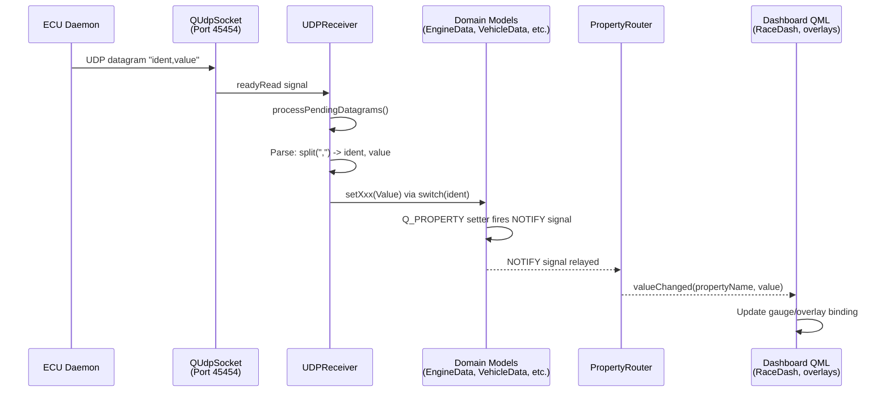

### 2.2 Verified Connection Chain

**Step 1: Socket Binding (UDPReceiver.cpp:73-77)**
- `QUdpSocket` binds to port **45454** with `QUdpSocket::ShareAddress`
- Signal connection: `QUdpSocket::readyRead` -> `udpreceiver::processPendingDatagrams`
- VERIFIED: Binding and signal connection are correctly wired

**Step 2: Datagram Processing (UDPReceiver.cpp:85-105)**
- Reads all pending datagrams in a `while` loop
- Parses each datagram as `"ident,value"` where ident is an integer and value is a float
- Routes via a massive `switch(ident)` statement (~300 cases) to the appropriate model setter

**Step 3: Model -> QML via PropertyRouter (PropertyRouter.h)**
- `PropertyRouter` connects to all model NOTIFY signals via `connectModelSignals()`
- When any model property changes, `onModelPropertyChanged()` fires
- This emits `valueChanged(propertyName, value)` which QML overlays subscribe to

**Step 4: Connect Class Lifecycle (connect.cpp:1220-1231)**
- `Connect::openConnection()` calls `m_udpreceiver->startreceiver()`
- `Connect::closeConnection()` calls `m_udpreceiver->closeConnection()`

### 2.3 Issues Found in UDP Communication

#### ISSUE-UDP-1: closeConnection() is a No-Op (CRITICAL)

```
File: Utils/UDPReceiver.cpp, line 80-83
```

The `closeConnection()` method has a TODO comment and does nothing:

```cpp
void udpreceiver::closeConnection()
{
    // TODO: Implement proper cleanup if needed
}
```

**Impact:** When `Connect::closeConnection()` is called, the UDP socket is never closed. The socket continues to listen on port 45454 and process datagrams even after the user disconnects. If `openConnection()` is called again, `startreceiver()` creates a **new** `QUdpSocket` without deleting the old one, causing a memory leak and potential double-processing of datagrams.

**Required fix:** The method should close and delete the socket:
- Call `udpSocket->close()`
- Call `udpSocket->deleteLater()`
- Set `udpSocket = nullptr`

#### ISSUE-UDP-2: No Guard Against Double Start (HIGH)

```
File: Utils/UDPReceiver.cpp, line 73-78
```

`startreceiver()` unconditionally creates a new `QUdpSocket` without checking if one already exists. If called twice (e.g., user clicks "Connect" twice), a second socket is created and the first one leaks.

**Required fix:** Check `if (udpSocket)` before creating a new one, or close/delete the existing socket first.

#### ISSUE-UDP-3: Unused QDataStream (LOW)

```
File: Utils/UDPReceiver.cpp, line 93
```

```cpp
QDataStream in(&datagram, QIODevice::ReadOnly);
```

A `QDataStream` is constructed on every datagram but never used. The actual parsing uses `datagram.data()` as a raw string. This is wasted allocation per packet.

#### ISSUE-UDP-4: No Bounds Check on Split Result (MEDIUM)

```
File: Utils/UDPReceiver.cpp, line 103-105
```

```cpp
QStringList list = raw.split(",");
int ident = list[0].toInt();
float Value = list[1].toFloat();
```

If a malformed datagram arrives with no comma (after the `contains(",")` check passes with e.g., `"123,"`) or with an empty second field, `list[1]` could be an empty string. While `toFloat()` returns 0.0 for empty strings, there is no check for `list.size() >= 2`. A datagram like `"123"` that somehow passes the comma check would crash.

#### ISSUE-UDP-5: Empty Datagram Handling Masks Errors (LOW)

```
File: Utils/UDPReceiver.cpp, line 96-101
```

When an empty datagram or one without a comma arrives, it is silently replaced with `"0,0"`. This means ident=0 and Value=0 are dispatched through the switch statement, which falls through to `default: break;`. While harmless, this masks the fact that invalid data was received. No logging or diagnostics event is generated.

#### ISSUE-UDP-6: Hardcoded Port Number (LOW)

Port 45454 is hardcoded in `UDPReceiver.cpp`. While documented in the header and `PROJECT_REFERENCE.md`, it cannot be changed at runtime. This is a configuration inflexibility.

### 2.4 UDP Ident-to-Model Routing Coverage

The switch statement routes ~300 ident codes across these models:

| Model | Ident Ranges | Count (approx) |
|-------|-------------|-----:|
| VehicleData | 1-5, 27-28, 32, 106-107, 113-118, 150, 160, 168, 178, 191, 194, 199-200, 217, 222-227, 401-402, 826, 864-871 | ~38 |
| EngineData | 6-7, 10-11, 16-48, 81-89, 100-105, 119-149, 151-177, 179-181, 190, 201-221, 228-229, 271-278, 290, 400-416, 827-831, 916-953 | ~130 |
| FlagsData | 49-73, 808-823 | 41 |
| AnalogInputs | 12-15, 182-189, 260-270, 286-298 | ~26 |
| GPSData | 108-112 (intentionally disabled; ident 111 still active -- should also be disabled) | 5 |
| DigitalInputs | 279-285, 900-907, 999 | 16 |
| ExpanderBoardData | 908-915 | 8 |
| ElectricMotorData | 832-863 | 32 |
| SensorData | 800-807 | 8 |
| ConnectionData | 219, 825 | 2 |
| **Unimplemented/Reserved** | 25, 74-80, 108-110, 112, 172, 177, 180, 192-198, 255, 259, 272-274, 277, 824, 924 | ~20 |

**GPS Data (ident 108-112):** GPS data is intentionally disabled. Only `gpsSpeed` (ident 111) remains active. The other GPS fields (altitude, latitude, longitude, time) are commented-out stubs. All GPS ident handlers (108, 109, 110, 112) should be fully disabled to match this intent -- currently they exist as empty case blocks rather than being removed, which is acceptable but should be documented as intentionally inactive.

**Action:** Ensure the remaining `gpsSpeed` (ident 111) handler is also disabled to bring the full GPS block to a consistent disabled state. Update `GPSData.h` documentation to reflect that GPS features are not currently supported.

### 2.5 Data Flow from Models to Dashboard QML

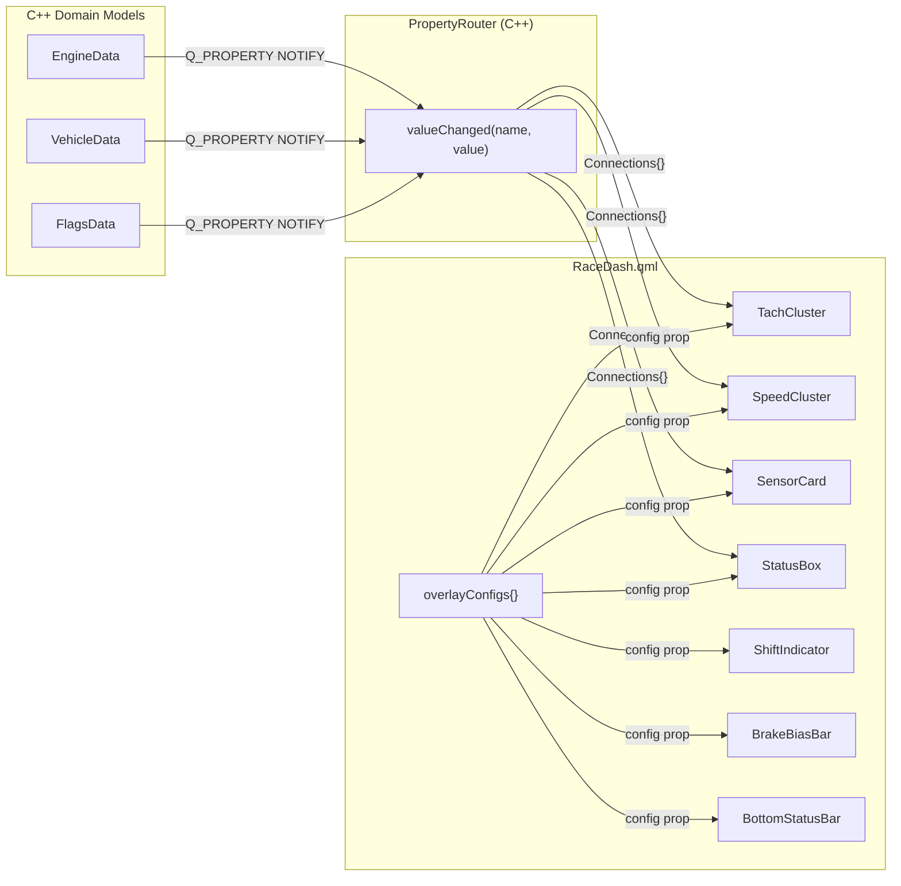

**Verification:** The `RaceDash.qml` loads overlay configs from `AppSettings.loadOverlayConfig()` on `Component.onCompleted`, then passes them as `config` properties to each gauge component. Each gauge component internally uses `PropertyRouter.getValue()` and/or `Connections { target: PropertyRouter }` to read live sensor values. This chain is properly connected.

---

## 3. Settings, Theming, and Styling Audit

### 3.1 Theme Architecture

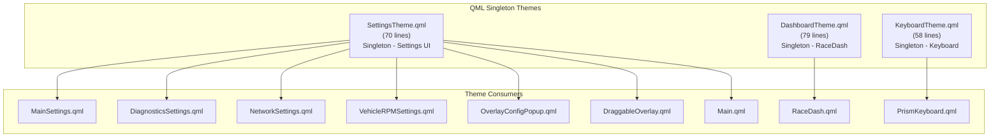

### 3.2 SettingsTheme Audit

The `SettingsTheme.qml` singleton is well-structured with a clear hierarchy:

| Category | Properties | Assessment |
|----------|-----------|------------|
| Background colors | 5 (background, surface, surfaceElevated, surfacePressed, controlBg) | Well-organized elevation hierarchy |
| Text colors | 4 (textPrimary, textSecondary, textPlaceholder, textDisabled) | Complete coverage |
| Semantic colors | 4 (success, warning, error, errorPressed) | Good status signaling |
| Typography | 8 properties (2 font families, 6 sizes) | Clean hierarchy |
| Spacing | 8 properties | Consistent system |
| Control sizes | 10 properties | Thorough |
| Border/radius | 4 properties | Adequate |

#### ISSUE-THEME-1: AnalogInputs.qml Settings Page Scheduled for Removal (ACTION ITEM)

```
File: PowerTune/Core/AnalogInputs.qml (938 lines)
```

The `AnalogInputs.qml` settings page is scheduled for removal. It defines its own hardcoded styling constants outside `SettingsTheme`, uses no font family declarations, and its analog input configuration functionality is fully superseded by the `ExBoardAnalog.qml` page which provides the same calibration controls alongside NTC presets, voltage divider configuration, and per-channel enable/disable.

**Action:** Remove `AnalogInputs.qml` and its references from the build system and any tab bar / settings manager that loads it. Verify that all analog calibration settings keys (`AN00` through `AN105`, `ui/analogPreset0` through `ui/analogPreset10`) are exclusively managed by `ExBoardAnalog.qml` before deletion to avoid orphaned settings.

#### ISSUE-THEME-2: Main.qml Drawer Uses Unstyled Components (MEDIUM)

```
File: PowerTune/Core/Main.qml, lines 145-337
```

The top-edge `Drawer` popup uses raw `Button` and `Switch` controls with inline styling instead of `StyledButton`/`StyledSwitch` from the settings component library:

```qml
Button {
    id: btntripreset
    text: "Trip Reset"
    background: Rectangle {
        radius: window.width / 10
        color: btntripreset.down ? "darkgrey" : "grey"
        border.color: btntripreset.down ? "grey" : "darkgrey"
```

This drawer uses:
- Hardcoded `"grey"`, `"darkgrey"`, `"red"`, `"darkred"`, `"black"` colors
- `window.width / N` sizing expressions instead of theme constants
- Raw `Button` instead of `StyledButton`
- Raw `Switch` instead of `StyledSwitch`

**Impact:** The drawer looks visually inconsistent with the settings pages that use the styled components.

#### THEME NOTE: Dual Theme Usage in Dashboard is Intentional (NOT AN ISSUE)

`RaceDash.qml` imports both `SettingsTheme` and `DashboardTheme`. This is by design:

- **`DashboardTheme`** controls the actual dashboard visuals: gauge colors, arc geometry, font sizes, background assets, and default overlay positions. Each dashboard type will always have its own dedicated theme.
- **`SettingsTheme`** is used exclusively for settings/configuration overlays that appear on top of the dashboard (the layout tools popup, `OverlayConfigPopup`, `DraggableOverlay` edit borders, alignment guides). These overlays are part of the system-wide settings UI and must match the system theme regardless of which dashboard is active.

This separation is correct. The system theme (`SettingsTheme`) governs all interactive configuration surfaces. The dashboard theme (`DashboardTheme`) governs the gauge display layer. No change needed.

### 3.3 Styled Component Library Assessment

| Component | File | Lines | Assessment |
|-----------|------|------:|------------|
| `StyledButton` | Settings/components/StyledButton.qml | 56 | Well-structured, supports primary/danger variants |
| `StyledComboBox` | Settings/components/StyledComboBox.qml | 130 | Complete custom styling |
| `StyledSwitch` | Settings/components/StyledSwitch.qml | 47 | Clean, uses theme tokens |
| `StyledTextField` | Settings/components/StyledTextField.qml | 36 | Minimal, theme-aware |
| `StyledCheckBox` | Settings/components/StyledCheckBox.qml | 71 | Complete |
| `StyledSpinBox` | Settings/components/StyledSpinBox.qml | 97 | Complete |
| `StyledColorPicker` | Settings/components/StyledColorPicker.qml | 141 | Inline color hex editor with swatch |
| `SettingsSection` | Settings/components/SettingsSection.qml | 90 | Card-like container |
| `SettingsRow` | Settings/components/SettingsRow.qml | 56 | Label + control layout |
| `SettingsPage` | Settings/components/SettingsPage.qml | 30 | Base page with scroll |
| `ConnectionStatusIndicator` | Settings/components/ConnectionStatusIndicator.qml | 73 | Status dot + text |

**Overall assessment:** The component library is comprehensive and consistently uses `SettingsTheme` tokens. The inconsistencies arise in files that predate this library or were authored separately.

### 3.4 Typography Consistency

| Context | Font Family Used | Expected (Theme) | Match |
|---------|-----------------|-------------------|-------|
| Settings UI | `SettingsTheme.fontFamily` ("Lato") | Lato | Yes |
| Dashboard gauges | `DashboardTheme.fontFamily` ("Hyperspace Race") | Hyperspace Race | Yes |
| Main.qml Drawer | `SettingsTheme.fontFamily` | Lato | Yes |
| AnalogInputs.qml | No font family specified | N/A -- page scheduled for removal | N/A |

#### ~~ISSUE-THEME-4~~ (SUPERSEDED)

Previously flagged as missing font family in `AnalogInputs.qml`. This is moot since the entire page is scheduled for removal (see ISSUE-THEME-1).

### 3.5 Settings Data Flow

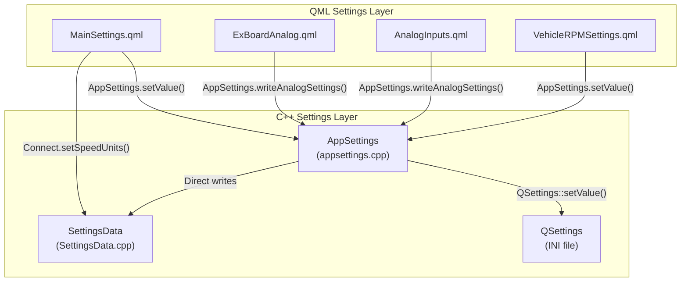

#### ISSUE-SETTINGS-1: Dual Write Paths for Units (MEDIUM)

`MainSettings.qml` sets units through **two** different paths simultaneously:

1. `Connect.setSpeedUnits(currentIndex)` -- calls `m_settingsData->setspeedunits("metric"/"imperial")` via C++
2. `AppSettings.setValue("ui/unitSelector1", currentIndex)` -- persists the combo index

On next startup, only the combo index is restored, and `Connect.setSpeedUnits()` is called again from `Component.onCompleted`. This works but is fragile -- the actual unit string and the combo index could theoretically get out of sync.

#### ISSUE-SETTINGS-2: Hidden Item Pattern for Functions (LOW)

```
File: PowerTune/Settings/MainSettings.qml, lines 500-572
```

`MainSettings.qml` uses invisible `Item` elements as function containers:

```qml
Item {
    visible: false
    id: autoconnect
    function auto() { ... }
}

Item {
    visible: false
    id: functconnect
    function connectfunc() { ... }
}
```

There are 6 such invisible items: `autoconnect`, `changeweighttext`, `logger`, `functconnect`, `functdisconnect`, `playwarning`, `functLanguageselect`. This pattern uses unnecessary QML elements to hold functions that could simply be JavaScript functions declared at the component level.

---

## 4. Large QML Files -- C++ Refactoring Analysis

### 4.1 File Size Ranking and Refactoring Potential

| File | Lines | Refactoring Benefit | Priority |
|------|------:|---------------------|----------|
| `ExBoardAnalog.qml` | 2,849 | **Very High** | P0 |
| `OverlayConfigPopup.qml` | 2,058 | **High** | P1 |
| `AnalogInputs.qml` | 938 | **Removal** (superseded by ExBoardAnalog) | P1 |
| `DiagnosticsSettings.qml` | 655 | Medium | P2 |
| `MainSettings.qml` | 573 | Medium | P2 |
| `RaceDash.qml` | 437 | Low | P3 |

### 4.2 ExBoardAnalog.qml (2,849 lines) -- CRITICAL CANDIDATE

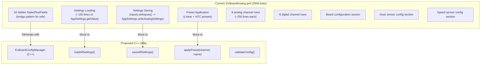

**What should move to C++:**

1. **Settings load/save block (lines ~2695-2842):** The `Component.onCompleted` handler has ~150 sequential `AppSettings.getValue()` calls loading individual settings. This should be a single `Q_INVOKABLE` method that returns a structured config object.

2. **The hidden bridge TextField pattern (lines 132-233):** 16 invisible `StyledTextField` elements serve only as property bridges between `Repeater` delegates and the settings save logic. A C++ model with named properties would eliminate these entirely.

3. **The `inputs.setInputs()` function:** This calls `AppSettings.writeAnalogSettings()` with 22 parameters. A C++ method that reads the config from a structured model would be cleaner.

4. **Preset application functions (lines 52-83):** `applyLinearPreset()` and `applyNtcPreset()` could be `Q_INVOKABLE` methods on `CalibrationHelper` that directly update the model.

**Estimated reduction:** ~1,200 lines could move to C++ (42% of the file).

### 4.3 OverlayConfigPopup.qml (2,058 lines) -- HIGH CANDIDATE

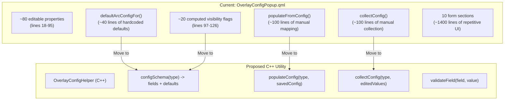

**What should move to C++:**

1. **Config schema and defaults (lines 170-241):** `defaultArcConfigFor()` and `defaultOverlaySizeFor()` contain hardcoded default values that duplicate the defaults in `RaceDash.qml`'s `defaultClusterConfig()`. Both locations must be kept in sync manually. A single C++ source of truth would prevent drift.

2. **populateFromConfig() (lines 246-341):** 100 lines of manual property-by-property mapping from a config QVariantMap to popup properties. This could be a C++ method that validates and coerces types.

3. **collectConfig() (lines 369-471):** 100 lines of manual reverse mapping. Same argument as above.

4. **Section visibility flags (lines 97-126):** 20 computed boolean properties that determine which form sections are visible based on `configType`. This classification logic belongs in C++.

**Estimated reduction:** ~500 lines could move to C++ (24% of the file), plus eliminating the default value duplication between this file and `RaceDash.qml`.

### 4.4 AnalogInputs.qml (938 lines) -- SCHEDULED FOR REMOVAL

This page is flagged for full removal rather than refactoring. Its analog input calibration functionality is already available through `ExBoardAnalog.qml`, which provides a superset of the same features (NTC/linear presets, per-channel voltage calibration, digital input configuration).

**Action:** Remove the file and all references. Verify no orphaned `AppSettings` keys remain. See ISSUE-THEME-1 in Section 3.2 for details.

**Estimated reduction:** 938 lines removed entirely (100% of the file).

### 4.5 DiagnosticsSettings.qml (655 lines)

**Assessment:** This file is mostly declarative UI with proper theme usage. The repetitive status rows (lines 42-370) could use a `Repeater` pattern, but the logic is lightweight and the file is maintainable. C++ migration would not provide significant benefit beyond potential `Repeater` optimization.

**Recommended:** Keep as QML but refactor to use `Repeater` for the status rows. No C++ migration needed.

### 4.6 MainSettings.qml (573 lines)

**Assessment:** Moderately sized with the main issue being the invisible `Item` function container pattern (see ISSUE-SETTINGS-2). The file is otherwise well-structured using the settings component library.

**Recommended:** Remove invisible `Item` function holders (replace with top-level functions). No C++ migration needed.

### 4.7 connect.cpp (1,382 lines) -- C++ Internal Refactoring

While already in C++, several sections of `connect.cpp` deserve attention:

#### ISSUE-CPP-1: Global Variables (MEDIUM)

```
File: Core/connect.cpp, lines 59-67
```

```cpp
int ecu;
int logging;
int connectclicked = 0;
int canbaseadress;
int rpmcanbaseadress;
QByteArray checksumhex;
QByteArray recvchecksumhex;
QString selectedPort;
QVector<QString> dashfilenames(3);
```

Eight global variables are declared at file scope. These should be member variables of the `Connect` class.

#### ISSUE-CPP-2: Daemon Switch Statement (LOW)

```
File: Core/connect.cpp, lines 752-939
```

`daemonstartup()` is a 188-line switch statement mapping daemon indices (0-60) to executable names. This should be a lookup table (map or array).

#### ISSUE-CPP-3: checkReg() Switch Statement (LOW)

```
File: Core/connect.cpp, lines 476-716
```

`checkReg()` is a 240-line switch statement mapping hex register codes to sequential integers. A lookup table would reduce this to ~10 lines.

#### ISSUE-CPP-4: LiveReqMsg 45-Parameter Function (MEDIUM)

```
File: Core/connect.h, lines 113-123
```

```cpp
Q_INVOKABLE void LiveReqMsg(const int &val1, const int &val2, ... const int &val45);
```

A function with 45 integer parameters. This should accept a `QVariantList` or a structured config object.

### 4.8 UDPReceiver.cpp Switch Statement Analysis

The 1,356-line file is dominated by a single `switch(ident)` statement (~1,250 lines). While the pattern is functional, it has maintenance risks:

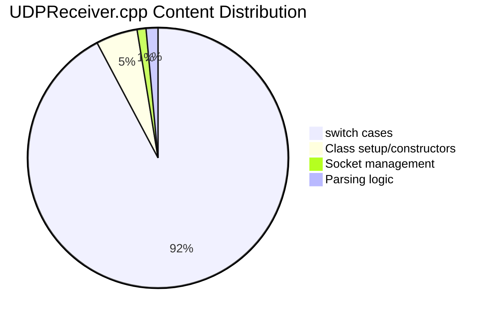

**Refactoring option:** Replace the switch statement with a lookup table:

```cpp
// Proposed: registration-based dispatch
struct IdentHandler {
    QObject *model;
    void (QObject::*setter)(float);
};
QHash<int, IdentHandler> m_identMap;
```

This would reduce the file from ~1,350 lines to ~200 lines and make adding new ident codes a single-line operation.

---

## 5. ExAnalog Channel Binding and Custom Name Audit

### 5.1 Overview

The extender board analog system provides 8 analog input channels and 8 digital input channels. Users configure these channels in `ExBoardAnalog.qml` -- assigning custom names, calibration presets, and enable/disable states. The calibrated values (`EXAnalogCalc0`-`EXAnalogCalc7`) are then available for binding to dashboard gauges. This section traces the entire chain from user configuration through to gauge display and identifies where the binding interface breaks down.

### 5.2 End-to-End Data Flow

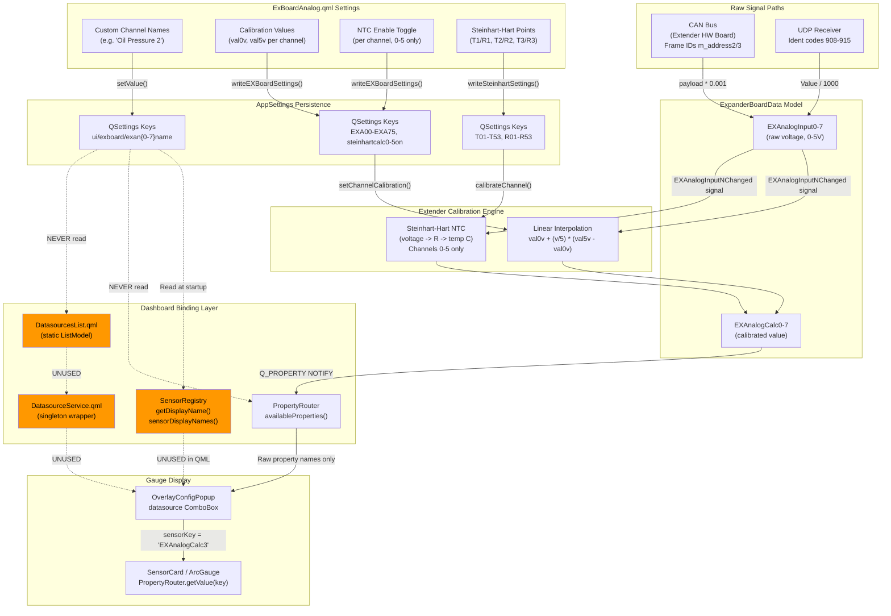

### 5.3 Calibration Pipeline (Verified Working)

The calibration pipeline from raw voltage to calculated value is correctly wired and functional:

1. **Raw input arrives** via CAN (`Extender.cpp` lines 426-441) or UDP (`UDPReceiver.cpp` ident 908-915), both writing millivolts converted to volts onto `ExpanderBoardData::EXAnalogInput0-7`.
2. **Signal triggers calibration**: `Extender::connectCalibrationSignals()` connects each `EXAnalogInputNChanged` signal to `applyCalibration(channel, voltage)`.
3. **Calibration formula is selected** per-channel:
   - **Linear** (all channels): `calibrated = val0v + (voltage / 5.0) * (val5v - val0v)`
   - **NTC/Steinhart-Hart** (channels 0-5 only): voltage -> sensor resistance via voltage divider equation -> temperature via Steinhart-Hart `1/T = A + B*ln(R) + C*ln(R)^3`
4. **Result is written** to `ExpanderBoardData::setEXAnalogCalcN(calibrated)`, which emits `EXAnalogCalcNChanged`.
5. **PropertyRouter picks up** the change via its signal relay and emits `valueChanged("EXAnalogCalcN", calibrated)`.

**Limitation:** Channels 6 and 7 are hardcoded to linear-only. `SteinhartCalculator::MAX_CHANNELS = 6`. The NTC toggle in the settings UI is correctly absent for channels 6-7. This is a hardware limitation of the extender board (channels 6-7 have no NTC voltage divider circuit).

### 5.4 Custom Channel Naming -- Where It Breaks

The user can type a custom name for each channel in `ExBoardAnalog.qml` (e.g., typing "Oil Pressure" into channel 3's name field). This name is persisted to QSettings key `ui/exboard/exan3name`. The name then propagates to exactly **one** place and fails to reach **three** others:

#### Where Custom Names DO Propagate

| Destination | How | Result |
|-------------|-----|--------|
| `SensorRegistry` | `refreshExtenderAnalogInputs()` reads QSettings key on startup | Display name becomes `"EX AN Calc 3: Oil Pressure"` |

#### ISSUE-EXAN-1: Custom Names Do NOT Reach the Gauge Binding ComboBox (HIGH)

The `OverlayConfigPopup.qml` data source selector combo box uses `PropertyRouter.availableProperties()` as its model:

```
model: PropertyRouter.availableProperties()
```

`PropertyRouter::availableProperties()` returns raw `Q_PROPERTY` names from the C++ meta-object system -- it scans `QMetaObject::property()` and returns names like `EXAnalogCalc0`, `EXAnalogCalc1`, etc. These names are compile-time fixed and cannot change at runtime.

**The user sees:** A dropdown containing `EXAnalogCalc0`, `EXAnalogCalc1`, ... `EXAnalogCalc7` -- with no indication of what sensor is connected to each channel.

**The user expects:** If they named channel 3 "Oil Pressure" in ExBoardAnalog settings, the dropdown should show "Oil Pressure" (or at minimum "EX AN Calc 3: Oil Pressure") instead of the raw property name `EXAnalogCalc3`.

#### ISSUE-EXAN-2: SensorRegistry is Exposed to QML but Never Used (HIGH)

`SensorRegistry` is:
- Created in `connect.cpp` line 142
- Populated with custom display names in `refreshExtenderAnalogInputs()` (lines 276-309 of `SensorRegistry.cpp`)
- Exposed to QML as context property `"SensorRegistry"` in `connect.cpp` line 199
- Has `Q_INVOKABLE` methods specifically designed for combo box integration:
  - `sensorDisplayNames(category)` -- returns list of `"displayName (key)"` strings
  - `getDisplayName(key)` -- returns custom display name for a given property key
  - `indexOfSensorKey(key, category)` -- maps property key to combo index
  - `getUnit(key)` -- returns unit string for a sensor

**Yet zero QML files reference `SensorRegistry`.** The entire display name system was built but never wired into the UI.

#### ISSUE-EXAN-3: DatasourceService/DatasourcesList are Dead Code (MEDIUM)

Two QML files exist to provide a structured data source system:
- `DatasourcesList.qml` (361 lines) -- static `ListModel` with hardcoded entries for all sensors including `titlename`, `sourcename`, `defaultsymbol`, `decimalpoints`, `maxvalue`
- `DatasourceService.qml` (94 lines) -- singleton wrapper with search/filter and `getBySourceName()` lookup

These contain useful metadata (default units, decimal points, max values) that the current binding system ignores entirely. The `OverlayConfigPopup` uses `PropertyRouter` directly, bypassing both. The `DatasourcesList` entries for exanalog channels use hardcoded titles like `"EX Analog Calc 0"` and never reflect custom names.

#### ISSUE-EXAN-4: No Cross-Binding to Existing Properties (MEDIUM)

If a user configures channel 3 as an oil pressure sensor, they cannot bind it to the existing `oilpres` property on `EngineData`. The system has two completely independent oil pressure values:

- `EngineData::oilpres` -- set via UDP ident from the ECU daemon, represents the ECU-reported oil pressure
- `ExpanderBoardData::EXAnalogCalc3` -- calculated from the extender board's physical sensor, represents the locally-measured oil pressure

There is no mechanism to:
1. Alias `EXAnalogCalc3` as `oilpres` (making it a drop-in replacement)
2. Have `EXAnalogCalc3` write its value into `EngineData::oilpres` (cross-model routing)
3. Let the user choose which source feeds the `oilpres` property (source selection)

The user must manually find `EXAnalogCalc3` in the binding dropdown and bind their gauge to it, losing the semantic meaning of the channel.

#### ISSUE-EXAN-5: Custom Names Not Refreshed After Settings Change (MEDIUM)

`SensorRegistry::refreshExtenderAnalogInputs()` is called once during startup in `connect.cpp` line 211. If the user changes a channel name in `ExBoardAnalog.qml` and saves, the QSettings key is updated but `SensorRegistry` is never notified. The display names become stale until the next application restart.

`ExBoardAnalog.qml`'s `inputs.setInputs()` saves channel names via `AppSettings.setValue()` but never calls `SensorRegistry.refreshExtenderAnalogInputs()`. The `SensorRegistry` does have this as a `Q_INVOKABLE` method, so calling it from QML after save would be a straightforward fix.

### 5.5 The Three Disconnected Data Source Systems

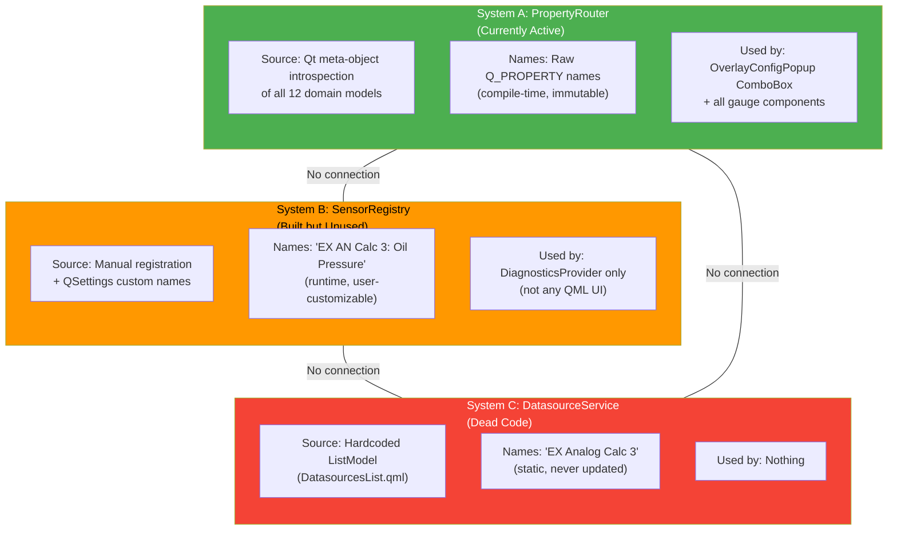

**Current state:** Three parallel systems for data source identification that do not interact. The active one (PropertyRouter) has no custom name support. The one with custom names (SensorRegistry) is not connected to the UI. The static one (DatasourceService) provides useful metadata but is entirely dead code.

### 5.6 Binding Interface -- Detailed Walkthrough

**What happens today when a user wants to bind a gauge to their oil pressure sensor on ExAnalog channel 3:**

1. User opens `ExBoardAnalog` settings, names channel 3 "Oil Pressure", sets calibration to 0-100 PSI linear, saves.
2. User navigates to the `RaceDash` dashboard, taps an overlay to configure it.
3. `OverlayConfigPopup` opens with a data source dropdown.
4. The dropdown shows `PropertyRouter.availableProperties()` -- an alphabetically sorted list of ~300 raw C++ property names.
5. User must scroll through the list to find `EXAnalogCalc3`. The name "Oil Pressure" does not appear anywhere in this list.
6. User selects `EXAnalogCalc3`, saves.
7. The gauge now displays the calibrated value from channel 3. It works, but the UX is poor.

**What the user expects:**

1. After naming channel 3 "Oil Pressure" in settings, the binding dropdown should show "Oil Pressure" (or "EX AN 3: Oil Pressure") as a selectable option.
2. Alternatively, the user expects to be able to bind channel 3 to the existing "Oil Pressure" property (`oilpres` on `EngineData`) so that any gauge already bound to oil pressure automatically picks up the extender board's sensor.
3. The dropdown should show human-readable names for all sensors, not raw C++ property names.

### 5.7 ExAnalog Issues Summary

| ID | Severity | Description |
|----|----------|-------------|
| ISSUE-EXAN-1 | **HIGH** | Custom channel names from ExBoardAnalog settings do not appear in the gauge binding dropdown. Users see raw `EXAnalogCalc0`-`EXAnalogCalc7` names. |
| ISSUE-EXAN-2 | **HIGH** | `SensorRegistry` has display name infrastructure and is exposed as a QML context property, but zero QML files use it. The bridge was built but never connected. |
| ISSUE-EXAN-3 | **MEDIUM** | `DatasourceService.qml` and `DatasourcesList.qml` are dead code -- 455 lines of structured sensor metadata unused by any consumer. |
| ISSUE-EXAN-4 | **MEDIUM** | No mechanism to cross-bind an exanalog channel to an existing property (e.g., bind EXAnalogCalc3 to `oilpres`) or source-select between ECU and extender readings. |
| ISSUE-EXAN-5 | **MEDIUM** | `SensorRegistry` display names are only populated at startup. Changing a channel name in settings does not refresh the registry until app restart. |

### 5.8 Recommended Resolution Architecture

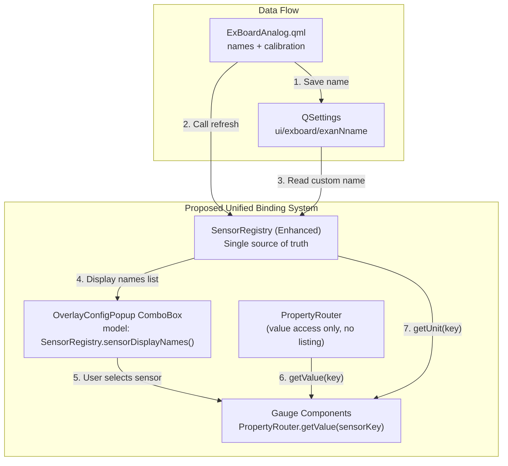

**The recommended approach consolidates around `SensorRegistry`:**

1. **Wire `SensorRegistry.sensorDisplayNames()` into the `OverlayConfigPopup` combo box** in place of `PropertyRouter.availableProperties()`. This gives human-readable names with custom labels.
2. **Call `SensorRegistry.refreshExtenderAnalogInputs()` from QML** after saving channel names in `ExBoardAnalog.qml`, so display names update immediately.
3. **Keep `PropertyRouter` for value access only** -- `getValue(key)` and `valueChanged(key, value)` remain the gauge data path. Do not add display name responsibility to PropertyRouter.
4. **Retire `DatasourceService.qml` and `DatasourcesList.qml`** -- migrate their useful metadata (default units, decimal points, max values, step sizes) into `SensorRegistry` entries, then delete the dead QML files.
5. **For cross-binding** (optional, higher effort): Add an `aliasProperty(sourceKey, targetKey)` mechanism to `PropertyRouter` that forwards one property's changes to another key. This would allow `EXAnalogCalc3` to alias as `oilpres` when the user explicitly configures it, making extender sensors drop-in replacements for ECU-reported values.

---

## 6. Sensor Binding Dropdown -- Sorting, Grouping, and Active Filtering

### 6.1 Current State

The sensor binding dropdown in `OverlayConfigPopup.qml` uses `PropertyRouter.availableProperties()` as its model -- a flat, alphabetically sorted `QStringList` of every `Q_PROPERTY` name from all 13 domain models. The user must scroll through ~400 raw C++ property names in a 300px-tall popup showing ~7 items at a time with no search, no categories, and no way to filter active vs. inactive sensors.

#### Property Count by Model

| Model | Q_PROPERTY Count |
|-------|----------------:|
| EngineData | ~100 |
| VehicleData | ~81 |
| FlagsData | ~49 |
| AnalogInputs | ~46 |
| ElectricMotorData | ~32 |
| SettingsData | ~29 |
| SensorData | ~20 |
| ExpanderBoardData | 18 |
| DigitalInputs | 18 |
| ConnectionData | 18 |
| TimingData | 18 |
| UIState | 14 |
| GPSData | 10 |
| **Total (with dedup)** | **~350-400** |

### 6.2 StyledComboBox Limitations

The current `StyledComboBox` (130 lines) is a themed `ComboBox` with:

- **No search/filter** -- no `TextField` for typing to narrow results
- **No sections/categories/grouping** -- flat list with alternating row colors
- **Hardcoded delegate** -- cannot pass a custom delegate from outside
- **300px max popup height** -- shows ~7-8 items, requiring 50+ scroll gestures to traverse
- **ScrollIndicator (cosmetic)** -- not a draggable `ScrollBar`
- **O(n) width calculation** -- iterates all ~400 items to measure text width on creation

#### Redundant API Calls

Each combo calls `PropertyRouter.availableProperties()` three separate times:
1. `model:` binding (initial population)
2. `onActivated:` handler (re-fetches entire list per selection)
3. `updateDatasourceIndex()` (re-fetches for index restore)

Each call regenerates and re-sorts the full list from the C++ `QHash`.

### 6.3 SensorRegistry Active Tracking -- Non-Functional

`SensorRegistry` has a complete liveness tracking system that was designed to solve this exact problem, but it is **entirely non-functional** because the core activation method is never called.

#### ISSUE-DROPDOWN-1: `markCanSensorActive()` Is Never Called (CRITICAL)

`SensorRegistry::markCanSensorActive(key)` (SensorRegistry.cpp line 103) is the only method that sets `active = true` and updates `lastActiveTimestamp`. **No file in the entire codebase calls it.** Not `UDPReceiver`, not `Extender`, not `connect.cpp`, not any model -- nobody.

This means:
- All `DaemonUDP` sensors permanently stay `active = false` (their registration default)
- All `ExtenderAnalog` and `ExtenderDigital` sensors permanently stay `active = false`
- Only `GPS`, `SenseHat`, and `Computed` sensors start as `active = true` (unconditionally)
- The 5-second timeout timer (`checkCanTimeouts`) runs but has nothing to timeout since nothing is ever marked active

The entire active/inactive tracking system was built but never integrated.

#### ISSUE-DROPDOWN-2: Timeout Only Covers DaemonUDP (HIGH)

Even if `markCanSensorActive()` were properly called from UDPReceiver and Extender, the timeout logic in `checkCanTimeouts()` (SensorRegistry.cpp line 622) only checks `SensorSource::DaemonUDP`:

```cpp
if (it->source == SensorSource::DaemonUDP && it->active) {
```

ExtenderAnalog and ExtenderDigital sensors that become active would **never** time out back to inactive. The timeout check needs to also cover these sources.

#### ISSUE-DROPDOWN-3: DiagnosticsProvider Overrides Active Flag (MEDIUM)

`DiagnosticsProvider::getLiveSensorData()` (line 519) ignores the registry's `active` flag entirely and applies its own heuristic:

```cpp
entry["active"] = (qAbs(rawValue) > 0.0001);
```

This "is it nonzero?" check is a crude proxy for liveness that reports sensors as "active" even if they haven't received data in hours (their last non-zero value persists in the model). It also reports legitimately zero-valued sensors (like a pressure sensor reading 0 PSI) as inactive.

### 6.4 Filtering Methods -- Missing

`SensorRegistry` has **no method that returns only active sensors**. All query methods (`getSensorsByCategory`, `sensorDisplayNames`, `availableSensors`) return both active and inactive entries. The `active` field is included in the `entryToVariantMap()` output, so client-side filtering is possible but would require QML JavaScript loops.

### 6.5 Categories Available in SensorRegistry

| Category | Source | Sensor Count |
|----------|--------|-------------:|
| Engine | DaemonUDP | 21 |
| Vehicle | DaemonUDP | 10 |
| Fuel | DaemonUDP | 5 |
| Oil | DaemonUDP | 6 |
| Exhaust | DaemonUDP | 13 |
| Tires | DaemonUDP | 8 |
| Electrical | DaemonUDP | 2 |
| Analog Inputs | DaemonUDP | 22 |
| Digital Inputs | DaemonUDP | 7 |
| Extender Board | ExtenderAnalog/Digital | 24 |
| GPS | GPS | 6 |
| Accelerometer | SenseHat | 3 |
| Gyroscope | SenseHat | 3 |
| Compass | SenseHat | 1 |
| Environment | SenseHat | 2 |

PropertyRouter also has `getModelName(key)` in C++ that maps each property to its source model name, but this is completely unused by the UI.

### 6.6 Required Custom Dropdown Component

The standard `StyledComboBox` cannot support the requirements. A custom `SensorPicker` component is needed with:

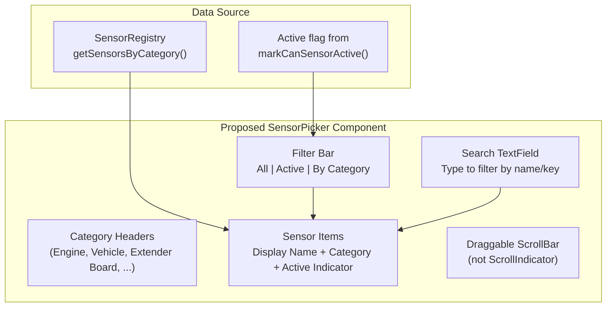

**Requirements:**
1. **Three-mode filter toggle**: "All" (every registered sensor), "Active" (only sensors with `active = true` and recent data), "By Category" (grouped by SensorRegistry category)
2. **Search field**: Filters by both `displayName` and `key` as the user types
3. **Categorized sections**: Visual section headers when in category mode (Engine, Vehicle, Extender Board, etc.)
4. **Active indicator**: Green dot or similar for sensors currently receiving data
5. **Display names**: Show `SensorRegistry.getDisplayName(key)` not raw property names
6. **Unit display**: Show `SensorRegistry.getUnit(key)` inline with each sensor entry
7. **Larger popup**: At least 400-500px tall or proportional to screen height
8. **Draggable ScrollBar**: Replace `ScrollIndicator` with an interactive `ScrollBar`

### 6.7 Dropdown Issues Summary

| ID | Severity | Description |
|----|----------|-------------|
| ISSUE-DROPDOWN-1 | **CRITICAL** | `markCanSensorActive()` never called -- entire liveness system non-functional |
| ISSUE-DROPDOWN-2 | **HIGH** | `checkCanTimeouts()` only covers DaemonUDP, not ExtenderAnalog/ExtenderDigital |
| ISSUE-DROPDOWN-3 | **MEDIUM** | DiagnosticsProvider overrides SensorRegistry `active` flag with crude "nonzero" heuristic |
| ISSUE-DROPDOWN-4 | **MEDIUM** | No `getActiveSensors()` or filtered query methods in SensorRegistry |
| ISSUE-DROPDOWN-5 | **MEDIUM** | StyledComboBox cannot support search, categories, or active filtering -- custom component required |
| ISSUE-DROPDOWN-6 | **LOW** | Three redundant `PropertyRouter.availableProperties()` calls per combo box |

---

## 7. Diagnostics Tab Audit

### 7.1 Page Structure

`DiagnosticsSettings.qml` (655 lines) displays four sections in a 2x2 grid plus one standalone:

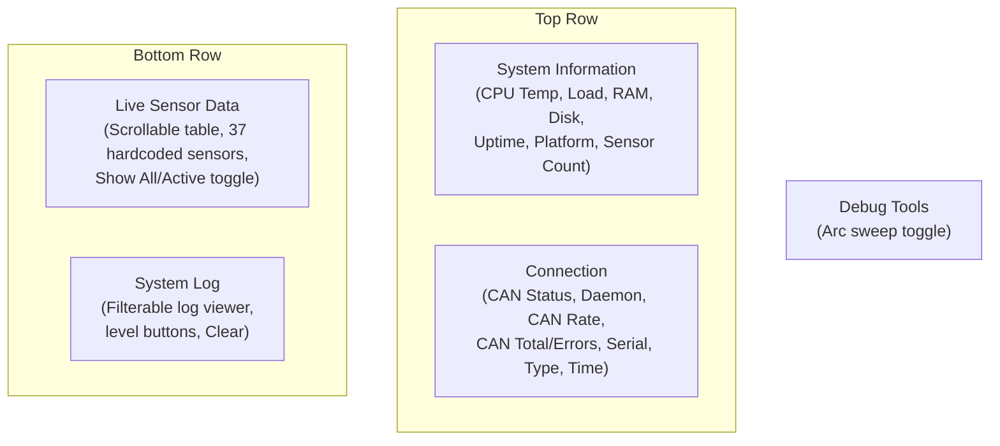

### 7.2 CAN Status Display -- Working but Limited

The Connection section shows aggregate CAN metrics:

| Display | Source Property | Status |
|---------|----------------|--------|
| CAN Status dot (green/amber/red) | `Diagnostics.canStatusText` | Working -- 3-state: Active/Waiting/Disconnected |
| Daemon name | `Diagnostics.daemonName` | Working |
| Message rate (msg/s) | `Diagnostics.canMessageRate` | Working -- 1-second snapshot |
| Total messages + errors | `Diagnostics.canTotalMessages`, `canErrorCount` | Working -- lifetime counters |
| Serial connected | `Diagnostics.serialConnected` | Working |
| Serial port + baud | `Diagnostics.serialPort`, `serialBaudRate` | Working |
| Connection type | `Diagnostics.connectionType` | Working |
| System time | `Diagnostics.systemTime` | Working |

**CAN status determination** (DiagnosticsProvider.cpp line 241):
- "Disconnected" -- `m_canConnected` is false
- "Active" -- connected AND last CAN message within 5 seconds
- "Waiting" -- connected but no messages in 5 seconds

### 7.3 What Does NOT Exist -- CAN Message Viewer

#### ISSUE-DIAG-1: No Raw CAN Message Viewer (HIGH)

There is no way to see individual CAN frames, CAN IDs, or hex payloads. The diagnostics page only shows aggregate counters (rate, total, errors). `DiagnosticsProvider` does not capture, store, or expose individual CAN frame data. There is:

- No `canMessages` property or `QCanBusFrame` storage
- No CAN ID filter
- No hex payload display
- No "Start/Stop CAN Capture" control
- No "Reset CAN Errors" button
- No CAN bus configuration interface

For debugging CAN communication issues, users have no visibility into what frames are actually being received or what IDs are active.

### 7.4 Live Sensor Table -- Partially Functional

#### ISSUE-DIAG-2: Hardcoded 37-Sensor Static Array (HIGH)

The live sensor table at `refreshLiveSensorEntries()` (DiagnosticsProvider.cpp line 366) uses a hardcoded `static const SensorDef sensors[]` with exactly 37 entries. This table does NOT query SensorRegistry dynamically. If new sensors are added to the system, they will not appear in the live table.

The hardcoded 37 sensors are:

| Group | Sensors |
|-------|---------|
| Engine (17) | RPM, Speed, Water Temp, Intake Temp, MAP, MAF, Boost, Throttle, AFR, AFR2, Injector Duty, Ignition Advance, Battery Voltage, Oil Temp, Oil Pressure, Fuel Pressure, EGT1 |
| Vehicle (2) | Gear, Wheel Speed |
| Expander Analog (8) | EX AN 0-7 (raw inputs only, NOT calc values) |
| ECU Analog (5) | Analog 0-4 (not all 11) |
| Expander Digital (8) | EX Digi 1-8 |

**Missing from the live table:**
- `EXAnalogCalc0`-`EXAnalogCalc7` (the calibrated values users actually care about)
- `Analog5`-`Analog10` and `AnalogCalc0`-`AnalogCalc10` (ECU analog channels)
- All `DigitalInput1`-`DigitalInput7` (ECU digital inputs)
- All `ElectricMotorData` properties (32 properties)
- All `FlagsData` properties (49 properties)
- All `TimingData` properties (18 properties)
- All `SensorData` properties (20 properties)

The dynamic `getLiveSensorData()` method (DiagnosticsProvider.cpp line 494) DOES query SensorRegistry and would show all registered sensors, but **it is never called from QML**. The page uses the property-bound `liveSensorEntries` instead.

#### ISSUE-DIAG-3: Show All/Active Toggle Uses Crude Heuristic (MEDIUM)

The "Show All / Show Active" toggle filters by `qAbs(value) < 0.001` (is the value nonzero):

```cpp
if (!m_showAllSensors && qAbs(value) < 0.001)
    continue;
```

This is not actual activity detection -- it reports:
- A pressure sensor reading 0 PSI as "inactive" (false negative)
- A sensor that last updated 30 minutes ago but holds a nonzero value as "active" (false positive)

The proper mechanism would use `SensorRegistry::active` flag with timeout-based staleness, but since `markCanSensorActive()` is never called (ISSUE-DROPDOWN-1), this is not currently possible.

### 7.5 Unused Q_INVOKABLE Methods

Five diagnostic data methods are fully implemented in C++ but never called from QML:

| Method | Lines | Purpose | Why Unused |
|--------|-------|---------|------------|
| `getLiveSensorData()` | 494-530 | Dynamic sensor list from SensorRegistry | Page uses hardcoded `liveSensorEntries` instead |
| `getAnalogInputDiagnostics()` | 540-570 | ECU analog channels with raw + calc values | No section in QML page |
| `getDigitalInputDiagnostics()` | 575-600 | ECU digital input states | No section in QML page |
| `getExpanderBoardDiagnostics()` | 604-634 | Extender analog raw + calc values | No section in QML page |
| `getExtenderDigitalDiagnostics()` | 639-665 | Extender digital states | No section in QML page |

These methods provide richer data than the hardcoded live sensor table (they include both raw and calculated values for each channel, plus model-specific metadata). Wiring them to dedicated QML sections would significantly improve diagnostics visibility.

### 7.6 System Information -- Platform-Limited

| Metric | Linux | macOS | Windows |
|--------|-------|-------|---------|
| CPU Temperature | Working (`/sys/class/thermal/thermal_zone0/temp`) | Returns 0.0 | Returns 0.0 |
| CPU Load Average | Working (`/proc/loadavg`) | Returns 0.0 | Returns 0.0 |
| Memory Usage | Working (`/proc/meminfo`) | Working (Mach `host_statistics64`) | Returns 0.0 |
| Disk Usage | Working (`statvfs("/")`) | Returns 0.0 | Returns 0.0 |
| Uptime | Working (`/proc/uptime`) | Returns "N/A" | Returns "N/A" |

This is acceptable for the target platform (Raspberry Pi / embedded Linux) but worth noting.

### 7.7 Log System -- Functional

The log system is properly implemented:
- Global Qt message handler captures all `qDebug`/`qInfo`/`qWarning`/`qCritical`/`qFatal` output
- Log level filter works (0=All, 1=Info, 2=Warning, 3=Critical)
- 500-entry ring buffer prevents unbounded growth
- Timestamped entries with level prefix
- Clear button functional
- CAN status transitions generate log entries

### 7.8 Timer-Based Refresh

Three timers drive diagnostics updates:

| Timer | Interval | Refreshes |
|-------|----------|-----------|
| `m_systemInfoTimer` | 2000ms | CPU temp, memory, load, disk, uptime |
| `m_canRateTimer` | 1000ms | CAN message rate snapshot |
| `m_liveSensorTimer` | 1000ms | Live sensor table rebuild |

All timers start in the constructor and run continuously. This is functional but means the diagnostics page costs ~3 timer callbacks/second even when not visible.

### 7.9 Diagnostics Issues Summary

| ID | Severity | Description |
|----|----------|-------------|
| ISSUE-DIAG-1 | **HIGH** | No raw CAN message viewer -- no CAN frame data, IDs, or hex payloads visible |
| ISSUE-DIAG-2 | **HIGH** | Live sensor table uses hardcoded 37-sensor static array instead of dynamic SensorRegistry query |
| ISSUE-DIAG-3 | **MEDIUM** | Show All/Active toggle uses crude "nonzero" heuristic instead of proper activity tracking |
| ISSUE-DIAG-4 | **MEDIUM** | 5 fully implemented Q_INVOKABLE diagnostic methods never wired to QML |
| ISSUE-DIAG-5 | **LOW** | Diagnostic timers run continuously even when page is not visible |

---

## 8. Virtual Keyboard Audit

### 8.1 Component Inventory

| File | Lines | Purpose |
|------|------:|---------|
| `Prism/Keyboard/PrismKeyboard.qml` | 377 | Main keyboard controller, text manipulation, show/hide |
| `Prism/Keyboard/NumericPad.qml` | 179 | 4x4 numeric grid layout |
| `Prism/Keyboard/QwertyLayout.qml` | 137 | Full QWERTY text layout |
| `Prism/Keyboard/KeyButton.qml` | 86 | Individual key button with long-press repeat |
| `Prism/Keyboard/KeyboardTheme.qml` | 59 | Theme singleton |
| `Prism/Keyboard/KeyIcon.qml` | 31 | Material icon renderer |

### 8.2 Architecture

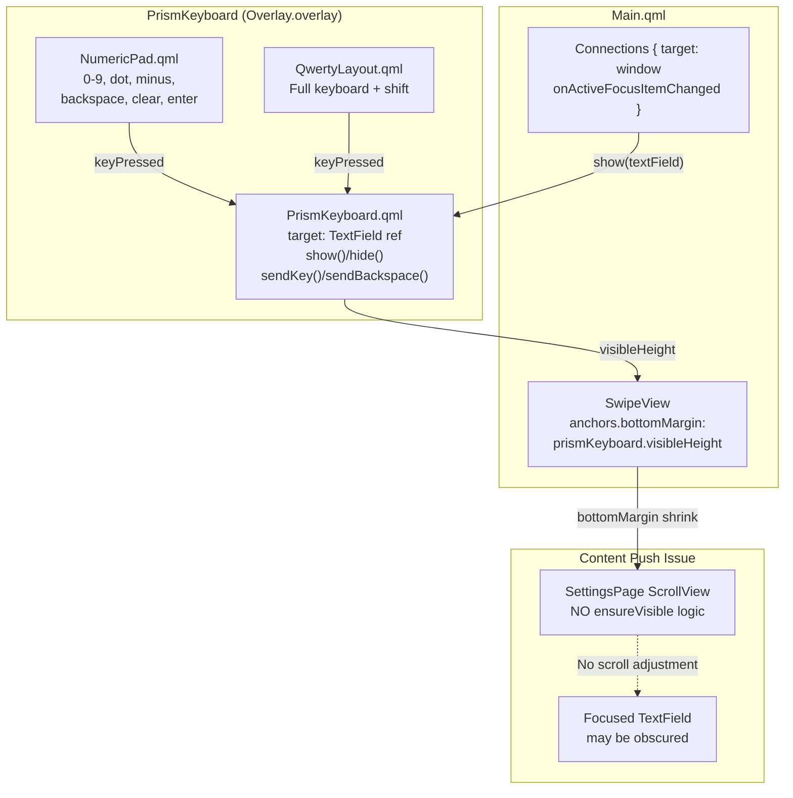

### 8.3 Content Push / Field Visibility

The keyboard is instantiated in the Qt Quick Controls `Overlay.overlay` layer and slides up from the bottom with a 200ms animation. Content push is handled by a single `anchors.bottomMargin` binding on the `SwipeView`:

```
anchors.bottomMargin: prismKeyboard.visibleHeight
```

#### ISSUE-KB-1: No ScrollIntoView for Focused Field (HIGH)

When the keyboard appears, the `SwipeView` shrinks from the bottom via `bottomMargin`. However, the inner `ScrollView` within `SettingsPage.qml` has **no awareness** that the keyboard appeared. There is:

- No `ensureVisible()` call on the ScrollView
- No `contentY` adjustment to scroll the focused field into view
- No calculation of the field's position relative to the visible area

If a user taps a text field in the lower half of a settings page, the keyboard slides up and the `SwipeView` shrinks, but the `ScrollView` does not scroll. The field the user is editing can end up partially or fully hidden behind the keyboard.

**Expected behavior:** When the keyboard appears, the system should calculate the focused field's position within the `ScrollView`, determine if it is above or below the new visible area, and scroll the `ScrollView.contentY` to center the field in the remaining visible space.

#### ISSUE-KB-2: visibleHeight Only Affects SwipeView Container (MEDIUM)

The `visibleHeight` property only pushes the outermost `SwipeView`. Any content that is positioned absolutely, uses a `Popup`, or exists in a different stacking context will not receive the push. Additionally, in popout (undocked) mode, `visibleHeight` is always 0, so content push is entirely disabled even though the keyboard may still overlap fields.

### 8.4 Number Pad Backspace Bug

#### ISSUE-KB-3: `target.remove()` Called with Wrong Arguments (CRITICAL)

The `sendBackspace()` function in `PrismKeyboard.qml` line 344:

```qml
function sendBackspace() {
    if (!target) return
    var pos = target.cursorPosition
    if (pos > 0) {
        if (target.remove) {
            target.remove(pos - 1, 1)    // BUG: second arg is end position, not length
        } else {
            var txt = target.text
            target.text = txt.substring(0, pos - 1) + txt.substring(pos)
        }
        target.cursorPosition = pos - 1
    }
}
```

The Qt `TextInput.remove(start, end)` API takes **two positions** (start index, end index), not a position and a length. The call `target.remove(pos - 1, 1)` means "remove characters from position `(pos - 1)` to position `1`" -- not "remove 1 character at position `pos - 1`".

**Behavior trace for text "124" with cursor at end:**

| Step | Text Before | Cursor | Call | Effective Range | Result |
|------|-------------|--------|------|-----------------|--------|
| 1st backspace | `124` | pos=3 | `remove(2, 1)` | Qt swaps: `remove(1, 2)` -- removes chars at indices 1-2 | `1` -- deleted "24" |
| 2nd backspace | `1` | pos=1 (clamped from 2) | `remove(0, 1)` | Removes char at index 0-1 | `` -- deleted "1" |

For "124", the first backspace removes two characters instead of one. The user expects "12" but gets "1".

**Behavior trace for "10000":**

| Step | Text Before | Cursor | Call | Effective Range | Result |
|------|-------------|--------|------|-----------------|--------|
| 1st | `10000` | pos=5 | `remove(4, 1)` | Swapped: `remove(1, 4)` removes indices 1-4 | `10` -- deleted "000" and "0" |
| 2nd | `10` | pos=1 (clamped from 4) | `remove(0, 1)` | Removes index 0-1 | `0` |

This explains the "paginate by 10s" behavior: deleting characters from a number appears to divide by powers of 10 because the `remove()` call deletes from position 1 to the cursor, stripping trailing digits.

**The correct call:**

```qml
target.remove(pos - 1, pos)
```

This removes exactly one character: from position `pos - 1` to position `pos`.

The fallback path (when `target.remove` does not exist) uses correct string slicing:
```qml
target.text = txt.substring(0, pos - 1) + txt.substring(pos)
```
But this path is never reached because all Qt Quick `TextField`/`TextInput` components have the `remove` method.

#### Long-Press Repeat Amplifies the Bug

The `KeyButton` backspace key has `repeatEnabled: true` with a 100ms repeat timer. When long-pressing backspace, the buggy `remove()` fires 10 times per second, each time deleting multiple characters. The text is destroyed almost instantly instead of character-by-character deletion.

### 8.5 Focus Detection

Focus detection uses duck-typing on `window.activeFocusItemChanged`:

```qml
function onActiveFocusItemChanged() {
    var item = window.activeFocusItem
    if (item
        && item.hasOwnProperty("text")
        && item.hasOwnProperty("cursorPosition")
        && item.hasOwnProperty("inputMethodHints")
        && !item.hasOwnProperty("currentIndex")
        && (!item.hasOwnProperty("readOnly") || !item.readOnly)) {
        prismKeyboard.show(item)
    } else {
        if (prismKeyboard.visible)
            prismKeyboard.hide()
    }
}
```

The `!hasOwnProperty("currentIndex")` check excludes `ComboBox` (which has a text property but shouldn't trigger the keyboard). This is a reasonable heuristic but could false-match custom components.

Layout auto-detection works correctly: fields with `Qt.ImhDigitsOnly`, `Qt.ImhFormattedNumbersOnly`, or `Qt.ImhPreferNumbers` hints get the numeric pad; all others get QWERTY.

### 8.6 Keyboard Issues Summary

| ID | Severity | Description |
|----|----------|-------------|
| ISSUE-KB-3 | **CRITICAL** | `target.remove(pos - 1, 1)` uses wrong API -- second arg is end position, not length. Causes multi-character deletion, "paginate by 10s" behavior. |
| ISSUE-KB-1 | **HIGH** | No `scrollIntoView`/`ensureVisible` when keyboard appears -- focused fields can be obscured |
| ISSUE-KB-2 | **MEDIUM** | Content push only affects `SwipeView` container, not inner `ScrollView` positioning |

---

## 9. Critical Issues Summary

### 9.1 Severity Classification

| ID | Severity | Category | Description |
|----|----------|----------|-------------|
| ISSUE-UDP-1 | **CRITICAL** | UDP | `closeConnection()` is a no-op -- socket never closes, memory leak on reconnect |
| ISSUE-DROPDOWN-1 | **CRITICAL** | Sensor Dropdown | `markCanSensorActive()` never called -- entire liveness tracking system non-functional |
| ISSUE-KB-3 | **CRITICAL** | Keyboard | `target.remove(pos - 1, 1)` uses wrong API signature -- causes multi-character deletion, "paginate by 10s" bug |
| ISSUE-EXAN-1 | **HIGH** | ExAnalog Binding | Custom channel names do not appear in gauge binding dropdown; users see raw `EXAnalogCalc0`-`7` names |
| ISSUE-EXAN-2 | **HIGH** | ExAnalog Binding | `SensorRegistry` has display name infrastructure and QML context property, but zero QML files reference it |
| ISSUE-UDP-2 | **HIGH** | UDP | No guard against double `startreceiver()` call -- socket leak |
| ISSUE-DROPDOWN-2 | **HIGH** | Sensor Dropdown | `checkCanTimeouts()` only covers DaemonUDP, not ExtenderAnalog/ExtenderDigital |
| ISSUE-DIAG-1 | **HIGH** | Diagnostics | No raw CAN message viewer -- no CAN frame data, IDs, or hex payloads visible |
| ISSUE-DIAG-2 | **HIGH** | Diagnostics | Live sensor table uses hardcoded 37-sensor static array instead of dynamic SensorRegistry query |
| ISSUE-KB-1 | **HIGH** | Keyboard | No `scrollIntoView`/`ensureVisible` when keyboard appears -- focused fields obscured |
| ISSUE-EXAN-3 | **MEDIUM** | ExAnalog Binding | `DatasourceService.qml` + `DatasourcesList.qml` (455 lines) are dead code -- unused by any consumer |
| ISSUE-EXAN-4 | **MEDIUM** | ExAnalog Binding | No mechanism to cross-bind exanalog channel to existing property (e.g., EXAnalogCalc3 -> oilpres) |
| ISSUE-EXAN-5 | **MEDIUM** | ExAnalog Binding | `SensorRegistry` display names only populated at startup; name changes require app restart |
| ISSUE-DROPDOWN-3 | **MEDIUM** | Sensor Dropdown | DiagnosticsProvider overrides SensorRegistry `active` flag with crude "nonzero" heuristic |
| ISSUE-DROPDOWN-4 | **MEDIUM** | Sensor Dropdown | No `getActiveSensors()` or filtered query methods in SensorRegistry |
| ISSUE-DROPDOWN-5 | **MEDIUM** | Sensor Dropdown | StyledComboBox cannot support search, categories, or active filtering -- custom component required |
| ISSUE-UDP-4 | **MEDIUM** | UDP | No bounds check on split result -- potential crash on malformed data |
| ISSUE-CPP-1 | **MEDIUM** | C++ | 8 global variables in `connect.cpp` should be member variables |
| ISSUE-CPP-4 | **MEDIUM** | C++ | 45-parameter function `LiveReqMsg()` |
| ISSUE-THEME-1 | **ACTION** | Removal | `AnalogInputs.qml` settings page scheduled for removal (superseded by ExBoardAnalog) |
| ISSUE-THEME-2 | **MEDIUM** | Theming | `Main.qml` Drawer uses unstyled raw components |
| ISSUE-SETTINGS-1 | **MEDIUM** | Settings | Dual write paths for unit settings |
| ISSUE-DIAG-3 | **MEDIUM** | Diagnostics | Show All/Active toggle uses crude "nonzero" heuristic instead of proper activity tracking |
| ISSUE-DIAG-4 | **MEDIUM** | Diagnostics | 5 fully implemented Q_INVOKABLE diagnostic methods never wired to QML |
| ISSUE-KB-2 | **MEDIUM** | Keyboard | Content push only affects SwipeView container, not inner ScrollView positioning |
| ISSUE-SETTINGS-2 | **LOW** | Settings | Invisible `Item` pattern for functions in `MainSettings.qml` |
| ISSUE-UDP-3 | **LOW** | UDP | Unused `QDataStream` allocated per datagram |
| ISSUE-UDP-5 | **LOW** | UDP | Empty datagram silently replaced with "0,0" |
| ISSUE-UDP-6 | **LOW** | UDP | Hardcoded port 45454 |
| ISSUE-DROPDOWN-6 | **LOW** | Sensor Dropdown | Three redundant `PropertyRouter.availableProperties()` calls per combo box |
| ISSUE-DIAG-5 | **LOW** | Diagnostics | Diagnostic timers run continuously even when page is not visible |
| ~~ISSUE-THEME-3~~ | **RESOLVED** | Theming | Dual theme usage in dashboard is intentional (settings overlays use system theme, dashboard uses own theme) |
| ~~ISSUE-THEME-4~~ | **SUPERSEDED** | Theming | Moot -- `AnalogInputs.qml` scheduled for removal |
| ISSUE-CPP-2 | **LOW** | C++ | `daemonstartup()` 188-line switch should be lookup table |
| ISSUE-CPP-3 | **LOW** | C++ | `checkReg()` 240-line switch should be lookup table |

### 9.2 Default Value Duplication Map

A significant structural concern is that overlay default values are defined in **three** separate locations:

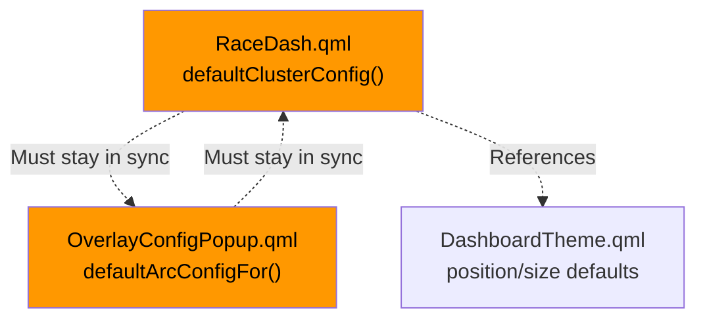

**Evidence of drift:** The tach cluster defaults differ between the two files:
- `RaceDash.qml` sets `arcWidth: 0.32`, `arcScale: 1`, `arcOffsetX: 0`
- `OverlayConfigPopup.qml` sets `arcWidth: 0.285`, `arcScale: 0.945`, `arcOffsetX: 5`

These values should be defined in exactly one place -- ideally a C++ class or a shared QML singleton.

---

## 10. Recommendations Priority Matrix

### P0 -- Immediate (Bugs/Data Loss Risk)

| Action | Effort | Impact |
|--------|--------|--------|
| Fix `PrismKeyboard.sendBackspace()`: change `target.remove(pos - 1, 1)` to `target.remove(pos - 1, pos)` | 5 min | Fixes multi-character deletion / "paginate by 10s" bug |
| Implement `UDPReceiver::closeConnection()` with socket cleanup | 30 min | Prevents memory leak and stale socket on disconnect/reconnect |
| Add socket null-check in `startreceiver()` | 15 min | Prevents double-socket creation |
| Add `list.size() >= 2` check before accessing `list[1]` | 15 min | Prevents crash on malformed datagram |
| Wire `markCanSensorActive()` calls into `UDPReceiver::processPendingDatagrams()` and `Extender::processCanFrames()` | 2-4 hours | Activates the entire sensor liveness tracking system |

### P0.5 -- High Priority (User-Facing UX)

| Action | Effort | Impact |
|--------|--------|--------|
| Build custom `SensorPicker` component with All/Active/Category filter, search field, display names, and active indicators | 2-3 days | Replaces unusable 400-item flat combo with organized, searchable sensor selection |
| Wire `SensorRegistry.sensorDisplayNames()` into `SensorPicker` in place of `PropertyRouter.availableProperties()` | 2-4 hours | Users see "EX AN Calc 3: Oil Pressure" instead of raw `EXAnalogCalc3` |
| Add `getActiveSensors()` and `getSensorsByCategory(category, activeOnly)` filter methods to SensorRegistry | 2 hours | Enables All/Active/Category filter modes in the dropdown |
| Extend `checkCanTimeouts()` to also cover `ExtenderAnalog` and `ExtenderDigital` sources | 30 min | Extender sensors correctly timeout back to inactive |
| Call `SensorRegistry.refreshExtenderAnalogInputs()` from `ExBoardAnalog.qml` after saving channel names | 30 min | Custom names propagate immediately without app restart |
| Add `scrollIntoView` logic to `PrismKeyboard.show()` -- calculate focused field position and adjust `ScrollView.contentY` | 2-4 hours | Focused fields remain visible when keyboard appears |

### P1 -- Short Term (Consistency/Maintainability)

| Action | Effort | Impact |
|--------|--------|--------|
| Replace hardcoded 37-sensor static array in `DiagnosticsProvider::refreshLiveSensorEntries()` with dynamic SensorRegistry query | 1 day | Live sensor table shows all registered sensors including EXAnalogCalc values |
| Wire 5 unused `Q_INVOKABLE` diagnostic methods to QML sections (analog diagnostics, digital diagnostics, extender board) | 1-2 days | Richer diagnostics with raw + calc values per channel |
| Create `ExBoardConfigManager` C++ class to hold ExBoardAnalog settings logic | 2-3 days | Reduces 2,849-line QML by ~1,200 lines |
| Create `OverlayConfigDefaults` C++ singleton as single source of truth for defaults | 1 day | Eliminates default value duplication/drift |
| Remove `AnalogInputs.qml` settings page and all references | 2 hours | Eliminates 938 lines of superseded code; functionality covered by ExBoardAnalog |
| Retire `DatasourceService.qml` + `DatasourcesList.qml`; migrate useful metadata (units, decimals, maxvalue) to `SensorRegistry` | 1 day | Eliminates 455 lines of dead code; centralizes sensor metadata |
| Update `Main.qml` Drawer to use styled components | 2 hours | Visual consistency |

### P2 -- Medium Term (Code Quality)

| Action | Effort | Impact |
|--------|--------|--------|
| Move `connect.cpp` global variables to class members | 1 hour | Eliminates global state |
| Replace `daemonstartup()` switch with lookup table | 1 hour | Reduces 188 lines to ~15 |
| Replace `checkReg()` switch with lookup table | 1 hour | Reduces 240 lines to ~15 |
| Refactor `LiveReqMsg()` to accept a `QVariantList` | 2 hours | Cleaner API |
| Remove invisible `Item` function holders in `MainSettings.qml` | 1 hour | Cleaner QML |
| Extract `OverlayConfigPopup.qml` config schema to C++ | 1-2 days | Reduces 2,058-line QML by ~500 lines |

### P3 -- Long Term (Architecture)

| Action | Effort | Impact |
|--------|--------|--------|
| Replace `UDPReceiver::processPendingDatagrams()` switch with registration-based dispatch table | 2-3 days | Reduces 1,356-line file by ~1,100 lines; makes adding ident codes trivial |
| Build CAN message viewer in diagnostics: capture frame buffer, display CAN IDs, hex payloads, filter by ID | 3-5 days | Enables CAN debugging without external tools |
| Add `aliasProperty(sourceKey, targetKey)` to PropertyRouter for cross-binding exanalog channels to existing properties | 2-3 days | Allows EXAnalogCalc3 to alias as `oilpres`, making extender sensors drop-in replacements for ECU values |
| Add `sensorBecameActive`/`sensorBecameInactive` signals to SensorRegistry for per-sensor transition notifications | 1 day | Enables fine-grained reactive UI updates without diffing entire sensor list |
| Pause diagnostic timers when DiagnosticsSettings page is not visible | 2 hours | Eliminates ~3 timer callbacks/second when page is off-screen |
| Disable remaining GPS `gpsSpeed` handler (ident 111) to fully deactivate GPS block; document as intentionally inactive | 30 min | Consistent GPS disabled state across all ident handlers |
| Add UDP port configuration via AppSettings | 1 hour | Runtime flexibility |

---

### Summary Statistics

| Metric | Value |
|--------|-------|
| Total QML files reviewed | 57 |
| Total C++ files reviewed | 42 (.cpp) + 42 (.h) |
| Total QML lines | ~14,070 |
| Total C++ source lines | ~12,546 |
| Issues identified | 34 |
| Active issues | 30 |
| Resolved/Superseded | 2 (THEME-3 intentional, THEME-4 moot) |
| Action items | 2 (AnalogInputs removal, GPS full disable) |
| Critical issues | 3 (UDP-1, DROPDOWN-1, KB-3) |
| High issues | 7 (UDP-2, EXAN-1, EXAN-2, DROPDOWN-2, DIAG-1, DIAG-2, KB-1) |
| Medium issues | 14 |
| Low issues | 6 |
| Lines reducible via C++ migration | ~1,700 (12% of QML) |
| Lines removable (AnalogInputs + DatasourceService/List) | ~1,393 (10% of QML) |
| Dead code QML files | 2 (DatasourceService.qml, DatasourcesList.qml) |
| Unused Q_INVOKABLE methods | 5 (DiagnosticsProvider) + full SensorRegistry API in QML |
| Non-functional subsystems | SensorRegistry liveness tracking (built, never integrated) |
