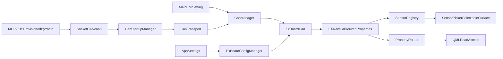

# Extender Native CAN / Steinhart Implementation Specification

Date: 2026-03-13  
Status: Implementation design approved for execution planning  
Related audit: `docs-misc/EXTENDER_UDP_STEINHART_AUDIT_REPORT.md`

## 1. Purpose

This document converts the extender / UDP / Steinhart audit into a concrete
implementation specification.

It defines:

- the corrected runtime flow after remediation
- the canonical property surface available to QML and user-selectable dashboards
- the ownership rules for native CAN startup, selected CAN protocol modules,
  persistence, and runtime application
- the calibration and Steinhart contract that must hold across live edit, save,
  reboot restore, and dashboard consumption
- the implementation approach for every audit action item
- the expected user-visible behavior after completion
- the validation matrix required before the subsystem can be considered complete

This is not an audit report. It is the target-state design for the subsystem.

The current approved direction is:

- retire app-side UDP as the active EX runtime path
- move to native app-owned CAN startup and validation on top of the Yocto-provided
  `MCP2515 -> SocketCAN can0` stack
- use one shared CAN startup and transport layer
- load exactly one active CAN protocol module from the main ECU setting
- implement the EX board as the first module pair: `ExBoardCan.h` and
  `ExBoardCan.cpp`

## 2. Scope

This spec covers:

- `Hardware/Extender.cpp`
- `Can/CanStartupManager.*`
- `Can/CanTransport.*`
- `Can/CanManager.*`
- `Can/CanInterface.h`
- `Can/Protocols/ExBoardCan.*`
- `Utils/SteinhartCalculator.cpp`
- `Utils/CalibrationHelper.cpp`
- `Core/SensorRegistry.cpp`
- `Core/PropertyRouter.cpp`
- `Core/appsettings.cpp`
- `Core/ExBoardConfigManager.cpp`
- `Core/connect.cpp`
- `operating_platform/config.txt`
- `PowerTune/Core/ExBoardAnalog.qml`
- `PowerTune/Settings/components/SensorPicker.qml`
- related EX/raw/calibrated/derived model properties in `Core/Models/`

Legacy cleanup work may still touch `Utils/UDPReceiver.cpp`, but UDP is no longer
part of the active EX runtime target architecture.

## 3. Non-Goals

This spec does not:

- redesign the entire dashboard system
- implement additional CAN protocol modules beyond EX board in this phase
- add new user-facing dashboard layout features
- add true DI2-DI8 digital frequency capture unless explicitly noted as future work
- change git workflow, build tooling, or unrelated app structure
- move device-tree or kernel-driver provisioning out of Yocto or boot image setup

## 4. Current Problems To Correct

The implementation must correct all of the following categories of issues:

### 4.1 Property-Surface Problems

- live derived EX properties exist but are not fully available through the same
  selectable sensor flow as raw properties
- calibrated EX properties are writable and readable, but activity classification
  does not match actual updates
- some GPS keys can become active without the owning model actually being updated
- dead calculated analog ECU properties are still exposed as if they are valid
- disabled EX channels remain selectable and active

### 4.2 Calibration / Persistence Problems

- linear presets define real sensor voltage spans that runtime ignores
- restore/apply logic is duplicated between `AppSettings` and EX-board-specific
  runtime application paths
- EX speed exists as a derived EX property but is not consistently integrated
  into the app-wide speed-source selection model
- digital speed input selection persists unsupported choices

### 4.3 Runtime Ownership Problems

- the active EX path is split between legacy UDP assumptions and direct CAN logic
- disconnect does not fully stop EX-derived updates
- registry and runtime ownership rules are not explicit enough
- MCP2515 and `can0` startup ownership is not defined clearly enough
- protocol selection is not cleanly separated from shared CAN transport

### 4.4 Performance Problems

- extender frame processing performs avoidable string/meta work in the hot path
- property routing fans out broad reflective notifications before the property
  surface is normalized
- legacy UDP parsing still adds avoidable overhead until the EX runtime path is retired cleanly

## 5. Target Architecture

The subsystem must follow this ownership model:

- Yocto and boot provisioning own the static `MCP2515` hardware setup and expose
  Linux `can0`
- `CanStartupManager` owns startup validation and runtime `can0` state control
- `CanTransport` owns Qt `QCanBus` device open, close, read, and write
- `CanManager` owns loading exactly one active CAN protocol module from the main
  ECU setting
- `ExBoardCan` owns EX-specific CAN parsing, EX raw values, EX calibrated values,
  EX-derived values, and EX-specific write behavior
- `SensorRegistry` owns the authoritative selectable sensor surface
- `PropertyRouter` owns canonical read access to the live property surface
- `AppSettings` owns storage only
- `ExBoardConfigManager` owns shaping, validation, and application of EX-board
  runtime configuration
- `Connect` owns lifecycle coordination only

### 5.1 Corrected Flow



### 5.2 Property-Surface Rules

The target system must distinguish:

- `raw` properties: direct measurements from UDP or extender CAN
- `calibrated` properties: translated/scaled outputs from raw EX analog channels
- `derived` properties: computed values such as speed, gear, or DI1 frequency
- `selectable` properties: properties the user can assign to overlays/dashboard widgets
- `non-selectable` properties: internal or compatibility-only properties

### 5.3 MCP2515 Startup Ownership

The startup boundary is explicit:

- Yocto or boot provisioning owns:
  - enabling SPI
  - loading the `mcp2515-can0` overlay
  - ensuring the kernel driver is available
  - wiring-specific static parameters like oscillator and interrupt pin
- the app owns:
  - verifying that `can0` exists
  - verifying and applying the expected runtime bitrate
  - bringing `can0` down and up when runtime reconfiguration is required
  - surfacing clear diagnostics when CAN startup fails
  - opening Qt `socketcan` only after validation succeeds
- the app does not own:
  - direct `MCP2515` register programming
  - device-tree overlay installation
  - kernel module compilation or Yocto image assembly

## 6. Canonical Property Surface

`SensorRegistry` is the authoritative selectable surface.  
`PropertyRouter` is the canonical read layer over the same normalized property space.

### 6.1 Raw Properties That Remain Supported

The following properties remain part of the supported raw surface:

- `Analog0-10`
- `DigitalInput1-7`
- `EXAnalogInput0-7`
- `EXDigitalInput1-8`
- supported GPS properties only when a real writer exists
- supported engine/vehicle/core ECU properties already produced by UDP

### 6.2 Calibrated Properties That Remain Supported

The following properties remain part of the supported calibrated surface:

- `EXAnalogCalc0-7`

These are the only calibrated analog properties supported by this implementation
spec.

### 6.3 Derived Properties That Must Be Exposed

The following properties are supported derived EX properties and must be visible
through both the registry and the router:

- `frequencyDIEX1`
- `EXGear`
- `EXSpeed`

These are live properties, not metadata, and must be treated as first-class
selectable sensors where appropriate.

### 6.4 Properties To Remove

The following old ECU analog calculated properties are not part of the supported
surface and must be removed, not merely hidden:

- `AnalogCalc0`
- `AnalogCalc1`
- `AnalogCalc2`
- `AnalogCalc3`
- `AnalogCalc4`
- `AnalogCalc5`
- `AnalogCalc6`
- `AnalogCalc7`
- `AnalogCalc8`
- `AnalogCalc9`
- `AnalogCalc10`

Full removal means:

- remove from `SensorRegistry`
- remove from `PropertyRouter` exposure if possible
- remove from model/property definitions where unused
- remove from user-selectable surfaces
- remove stale documentation and metadata references

### 6.5 Property Taxonomy Table

| Property Family | Kind | Producer | Selectable | Notes |
| --- | --- | --- | --- | --- |
| `Analog0-10` | raw | `udp` | yes | existing ECU analog raw surface |
| `DigitalInput1-7` | raw | `udp` | yes | existing ECU digital surface |
| `EXAnalogInput0-7` | raw | `extender_can` | yes | raw EX analog volts |
| `EXDigitalInput1-8` | raw | `extender_can` | yes | raw EX digital states |
| `EXAnalogCalc0-7` | calibrated | `derived_from_extender_raw` | yes | voltage-scaled or NTC-calculated EX values |
| `frequencyDIEX1` | derived | `derived_from_extender_raw` | yes | current supported EX digital frequency source |
| `EXGear` | derived | `derived_from_extender_raw` | yes | EX-local derived gear |
| `EXSpeed` | derived | `derived_from_extender_raw` | yes | EX-local derived speed |
| `AnalogCalc0-10` | stale | none | no | remove from code and selectable surface |

## 7. SensorRegistry Rules

`SensorRegistry` becomes the authoritative list of sensors the user may choose
from when configuring dashboards.

### 7.1 Registration Rules

`SensorRegistry` must register:

- all supported raw properties
- all supported calibrated EX properties
- all supported derived EX properties

`SensorRegistry` must not register:

- unsupported compatibility aliases
- dead properties with no producer
- old calculated ECU analog properties

### 7.2 Activity Rules

A sensor is active only when that exact property is written.

This means:

- writing `EXAnalogInput2` marks `EXAnalogInput2` active
- writing `EXAnalogCalc2` marks `EXAnalogCalc2` active
- writing `EXSpeed` marks `EXSpeed` active
- writing `gpsLatitude` marks `gpsLatitude` active only if `GPSData::setgpsLatitude`
  actually ran

Activity must not be inferred from upstream source movement alone.

### 7.3 Enabled-Flag Rules

If an EX channel is disabled:

- it is not selectable
- it is not marked active
- it does not contribute to derived EX signals
- it is not treated as a valid calibration source
- it is not offered as a brightness source

The enabled flags become real runtime behavior, not metadata.

## 8. PropertyRouter Rules

`PropertyRouter` remains the canonical QML read layer, but it must be aligned
with the normalized property surface.

### 8.1 Canonical-Key Rules

- canonical keys represent supported live properties
- aliases are compatibility-only
- aliases are non-selectable
- aliases must never shadow a canonical property
- `availableProperties()` should return canonical keys only

### 8.2 Duplicate-Property Rules

Where duplicate names exist across models:

- canonical ownership must be explicit
- duplicate shadowing must be prevented or warned
- first-model-wins behavior must not silently misrepresent the supported surface

### 8.3 Removal Rules

As old `AnalogCalc0-10` properties are removed, any stale router exposure or
compatibility alias must also be removed.

## 9. Legacy UDP Transition Rules

UDP is no longer part of the target EX runtime architecture.

### 9.1 EX Runtime Rule

The supported implementation rule is:

- native CAN is the canonical and only active EX transport path
- EX raw, calibrated, and derived properties are produced only by `ExBoardCan`
- UDP must not co-own any EX properties in the target state

If legacy UDP code remains during migration, it must be treated as transitional
cleanup only and must not remain attached to active EX ownership.

### 9.2 Legacy GPS Rule

If `UDPReceiver` remains in the repository during migration, unsupported GPS keys
must not be marked active unless they are actually written into `GPSData`.

Default implementation decision for this spec:

- remove unsupported GPS idents from active-state mapping until real writers exist

This remains a legacy cleanup rule, not a target EX runtime dependency.

## 10. EX Protocol Module Contract

`ExBoardCan` is the runtime executor for EX configuration and translation.

### 10.1 EX Analog Channel Runtime Contract

Every EX analog channel must have a unified runtime contract containing:

- `enabled`
- `mode`: `linear` or `ntc`
- `val0v`
- `val5v`
- `minVoltage`
- `maxVoltage`
- `ntcEnabled`
- `steinhartCoefficients`
- `dividerR3`
- `dividerR4`

This contract must be applied the same way:

- on live UI edit
- on save
- on reboot restore

### 10.2 Raw / Calibrated / Derived Lifecycle

For each EX analog update:

1. raw channel is written
2. raw channel is marked active
3. channel config determines whether calibration is permitted
4. calibrated EX value is computed
5. calibrated EX value is written
6. calibrated EX value is marked active
7. any derived EX values depending on that channel are recomputed
8. derived EX values are written and marked active

For DI1 frequency:

1. raw digital frame updates digital inputs
2. supported DI1 frequency is computed
3. `frequencyDIEX1` is written
4. `frequencyDIEX1` is marked active
5. any derived EX speed from DI1 is recomputed

## 11. Linear Calibration Contract

### 11.1 Target Formula

Linear presets must honor real electrical sensor span.

Correct algorithm:

1. clamp raw measured voltage to `[minVoltage, maxVoltage]`
2. normalize that clamped range into `0-5V`
3. apply `val0v` / `val5v` scaling to the normalized value

### 11.2 Formula Definition

```text
normalizedVoltage = ((clampedVoltage - minVoltage) / (maxVoltage - minVoltage)) * 5.0
calibratedValue = val0v + (normalizedVoltage / 5.0) * (val5v - val0v)
```

### 11.3 Default / Custom Behavior

- preset-backed channels persist full preset runtime data
- custom channels default to:
  - `minVoltage = 0.0`
  - `maxVoltage = 5.0`
- the runtime must not silently assume `0-5V` for presets whose metadata says otherwise

### 11.4 Preset Persistence Rule

Applying a preset must persist the full runtime contract, not just:

- preset name
- `val0v`
- `val5v`

The persisted contract must include:

- `minVoltage`
- `maxVoltage`
- mode
- any NTC data when relevant

## 12. Steinhart / NTC Contract

### 12.1 Supported NTC Surface

NTC mode is supported only for EX channels that are intentionally designed to
use it.

Current implementation assumption:

- EX channels `0-5` remain the NTC-capable set unless hardware design changes

### 12.2 Required Persistence Symmetry

For every NTC-enabled channel, the following must round-trip identically:

- channel enabled state
- mode = NTC
- coefficients
- divider jumper values
- runtime conversion behavior

After reboot, the same raw input voltage must produce the same temperature as it
did before reboot.

### 12.3 Runtime Application Rule

NTC runtime application must come through the same unified EX apply path used by
linear channels.

The implementation must avoid two separate restore systems fighting each other.

### 10.3 Selected-Module Rule

At runtime:

- only one CAN protocol module is active at a time
- `CanManager` selects that module from the main ECU setting
- in this phase, the only supported active module is `ExBoardCan`
- the active module attaches to the shared `CanTransport`
- protocol-specific read and write behavior stays inside the selected module pair

## 13. Persistence / Restore Contract

### 13.1 Ownership Chain

The supported ownership chain is:

- `AppSettings` stores
- `ExBoardConfigManager` validates, merges, shapes, and applies
- `ExBoardCan` executes
- `CanManager` owns the selected protocol instance
- `Connect` coordinates lifecycle

### 13.2 AppSettings Responsibilities After Remediation

`AppSettings` should remain responsible for storage primitives only:

- save raw values/maps
- load raw values/maps
- sync persistent storage

It should not be the long-term owner of duplicated EX runtime apply logic.

### 13.3 ExBoardConfigManager Responsibilities After Remediation

`ExBoardConfigManager` becomes the single EX runtime application surface.

It must:

- load current persisted EX config
- validate and normalize config values
- clamp unsupported values
- apply EX runtime config to `ExBoardCan`
- refresh `SensorRegistry` based on enabled/configured state

### 13.4 Connect Responsibilities After Remediation

`Connect` must:

- validate and prepare `can0` through the shared CAN startup path
- start only the selected CAN module and shared transport for the active session
- stop the selected CAN module and shared transport on disconnect
- call the EX apply path during startup/restore in one place
- not own calibration math or duplicated EX restore logic
- not rely on shell scripts for normal CAN runtime bring-up

## 14. Speed And Gear Rules

### 14.1 EX Speed

`EXSpeed` is an EX-owned derived property and must always be computed when EX
speed config is enabled and valid.

`EXSpeed` does not automatically become the app-global speed source.

The app-global speed source changes only when the user explicitly selects:

- `EX Board Speed`

After that selection:

- the app mirrors the chosen EX speed source into the canonical app speed path
  used by dashboards and UI expecting the main speed property

### 14.2 EX Gear

`EXGear` remains a local EX-derived property.

It is:

- exposed
- selectable
- active when written

It does not overwrite the global ECU gear source unless a future dedicated
gear-source feature is designed.

### 14.3 Digital Speed Input Rule

Current supported digital EX frequency source is:

- `DI1` only

Therefore:

- `digitalPort` must be clamped to DI1 in runtime
- the UI must present DI1-only behavior
- previously saved unsupported values must be normalized back to DI1

Future support for DI2-DI8 requires:

- distinct runtime frequency properties
- full capture logic
- registry integration
- router exposure
- UI support

Until then, only DI1 is valid.

## 15. Disconnect Behavior

After implementation:

- `Connect::openConnection()` validates `can0`, starts the shared CAN transport,
  and attaches the selected CAN module
- `Connect::closeConnection()` stops:
  - the active CAN protocol module
  - shared CAN transport
  - any related EX active-state updates tied to the closed session

No EX raw, calibrated, or derived values may continue updating after disconnect.

## 16. User Interaction Expectations After Implementation

From the user’s perspective, the system must behave like this:

### 16.1 Sensor Selection

- sensor pickers show only real, supported, live-backed properties
- EX-derived properties appear in the picker when intended
- dead old ECU analog-calculated properties do not appear anywhere

### 16.2 Activity Visibility

- a raw EX channel becomes active when the raw property is updated
- a calibrated EX channel becomes active when the calibrated property is updated
- a derived EX property becomes active only when that derived value is written
- unsupported GPS packets do not create false active-state indicators

### 16.3 Channel Enablement

- disabled EX channels are hidden or non-selectable consistently
- disabled EX channels do not show active transitions
- disabled EX channels do not feed calibration, derived values, or brightness logic

### 16.4 Calibration UI

- applying a preset produces correct live values immediately
- saving and rebooting preserves that exact behavior
- unsupported digital speed input choices are not offered

### 16.5 Speed Source Selection

- configuring EX speed creates/updates `EXSpeed`
- selecting EX board speed as the main speed source causes the app-wide speed
  value to follow `EXSpeed`
- if EX board speed is not selected as the main source, `EXSpeed` remains
  available as a selectable derived signal but does not replace the canonical
  speed path

## 17. Performance Strategy

Performance work must be staged after correctness normalization begins.

### 17.1 Stage 1: CAN Startup And Transport

Optimize shared CAN startup and transport by:

- avoiding redundant `can0` reconfiguration work when settings have not changed
- minimizing expensive diagnostics work in the steady-state receive path
- making startup failure detection explicit rather than retrying blindly

### 17.2 Stage 2: EX Protocol Hot Path

Optimize `ExBoardCan.cpp` by:

- removing avoidable per-frame string/debug work from hot-path processing
- caching repeated registry key strings where needed
- ensuring monitor/debug fan-out is controlled

### 17.3 Stage 3: PropertyRouter Semantics

Before broad performance tuning, normalize:

- canonical keys
- alias rules
- duplicate-key behavior

Then optimize if profiling still shows router fan-out as hot.

### 17.4 Stage 4: Legacy UDP Cleanup

If `UDPReceiver` remains in the tree during migration, optimize it only as
cleanup work:

- reduce parser allocations
- avoid unnecessary eager conversions
- avoid active-state marking for no-op or unsupported writes

### 17.5 Optimization Order Rule

Correctness changes come first.  
Do not optimize stale or incorrect property surfaces before the supported
property surface is finalized.

## 18. Action-Item Resolution Matrix

This section maps every audit action item to an implementation decision.

| Audit Issue | Implementation Decision |
| --- | --- |
| Live derived EX properties not selectable | Register `frequencyDIEX1`, `EXGear`, `EXSpeed` in `SensorRegistry` and treat them as supported derived selectable properties |
| `EXAnalogCalc0-7` not marked active correctly | Mark active at the point the calibrated property is written, not only at the raw source |
| GPS keys active without model update | Remove unsupported GPS idents from liveness mapping or wire real `GPSData` writers before marking active |
| Extender remains live after disconnect | Stop the selected CAN module and shared transport in disconnect flow and enforce transport boundary correctness |
| Linear preset span ignored | Persist and apply `minVoltage` / `maxVoltage` in runtime formula |
| EX speed not integrated into app-global speed | Add explicit `EX Board Speed` as a main speed source; keep `EXSpeed` local until chosen |
| `digitalPort` unsupported | Clamp to DI1 and simplify UI/runtime accordingly |
| UDP and direct CAN both write EX values | Remove UDP from active EX ownership and make `ExBoardCan` the only EX producer |
| `AnalogCalc0-10` stale | Remove from models, registry, router, and selectable surfaces |
| Computed EX values not represented cleanly | Normalize derived EX registration and activity semantics |
| EX enabled flags metadata-only | Make enabled flags control runtime availability and selectability |
| Save-button-only persistence gaps | Standardize live apply/save behavior per config area |
| Brightness source/channel partially implemented | Either complete runtime use or explicitly reduce UI scope to what works |
| UDP hot-path overhead | Treat as legacy cleanup only once EX runtime no longer depends on UDP |
| Extender hot-path overhead | Move EX-specific hot-path work into `ExBoardCan` and optimize there after correctness fixes |
| PropertyRouter broad relay overhead | Optimize only after canonical surface normalization |
| Missing MCP2515 startup contract | Add explicit shared CAN startup ownership for `MCP2515 -> SocketCAN can0 -> Qt/QCanBus` |
| Over-split CAN protocol structure | Use one protocol file pair per CAN source, loaded by main ECU setting |

## 19. Files Expected To Change During Implementation

- `Core/SensorRegistry.h`
- `Core/SensorRegistry.cpp`
- `Core/PropertyRouter.h`
- `Core/PropertyRouter.cpp`
- `Hardware/Extender.h`
- `Hardware/Extender.cpp`
- `Can/CanStartupManager.h`
- `Can/CanStartupManager.cpp`
- `Can/CanTransport.h`
- `Can/CanTransport.cpp`
- `Can/CanInterface.h`
- `Can/CanManager.h`
- `Can/CanManager.cpp`
- `Can/Protocols/ExBoardCan.h`
- `Can/Protocols/ExBoardCan.cpp`
- `Core/appsettings.h`
- `Core/appsettings.cpp`
- `Core/ExBoardConfigManager.h`
- `Core/ExBoardConfigManager.cpp`
- `PowerTune/Core/ExBoardAnalog.qml`
- `PowerTune/Settings/components/SensorPicker.qml`
- `Core/connect.cpp`
- `Core/Models/AnalogInputs.h`
- `Core/Models/AnalogInputs.cpp`
- `Core/Models/ExpanderBoardData.h`
- `Core/Models/ExpanderBoardData.cpp`
- `Core/Models/DigitalInputs.h`
- `Core/Models/DigitalInputs.cpp`
- `Core/Models/SettingsData.h`
- `Core/Models/SettingsData.cpp`

## 20. Migration / Compatibility Notes

### 20.1 Saved Config Compatibility

During migration:

- unsupported `digitalPort` values are clamped to DI1
- removed `AnalogCalc0-10` keys are ignored or migrated out of selectable config
- EX speed config remains valid, but only becomes app-global speed when the user
  explicitly selects that source
- any remaining legacy UDP EX paths are disabled and must not override native EX CAN values

### 20.2 Compatibility Aliases

If legacy property aliases are kept:

- they remain read compatibility only
- they are not shown in sensor selection
- they cannot shadow canonical keys

### 20.3 Removed Surface Rule

Removing `AnalogCalc0-10` is intentional and required by this spec.  
No compatibility UI should preserve them in user-selectable flows.

## 21. Verification Matrix

The subsystem is not considered complete until all of the following pass.

| Area | Validation |
| --- | --- |
| Raw EX analog | raw EX analog update causes matching `EXAnalogInput*` activation |
| Calibrated EX analog | calibrated EX analog update causes matching `EXAnalogCalc*` activation |
| Derived EX properties | `EXGear`, `EXSpeed`, and `frequencyDIEX1` are selectable and active only when actually written |
| CAN startup | app validates and prepares `can0` on top of Yocto-provisioned `MCP2515` before opening Qt CAN |
| Active module selection | exactly one CAN module is loaded from the main ECU setting |
| GPS correctness | unsupported legacy UDP GPS packets do not create active-but-stale GPS properties |
| Dead ECU calculated analog | `AnalogCalc0-10` are removed from models, router exposure, registry, and selection flows |
| Disconnect lifecycle | disconnect stops the selected CAN module and shared CAN transport updates |
| Linear scaling | a `0.5-4.5V` preset produces correct scaling before and after reboot |
| Steinhart persistence | Steinhart outputs match before and after persistence restore |
| EX speed ownership | `EXSpeed` updates whenever EX speed logic is active |
| Main speed selection | EX speed only becomes canonical app speed when explicitly selected |
| Enabled flags | disabled EX channels are not selectable and do not emit active-state transitions |
| Derived EX visibility | sensor picker shows computed EX properties that are intended to be selectable |
| Ownership | no duplicate-source race occurs because `ExBoardCan` is the only EX producer |
| Unsupported digital ports | saved unsupported digital speed port values normalize back to DI1 |

## 22. Final Expected State

After implementation:

- native EX operation is `MCP2515 -> can0 -> shared CAN layer -> selected module`
- shared CAN startup and transport are generic
- the selected module is loaded from the main ECU setting
- `ExBoardCan` is the sole EX implementation in this phase
- the property surface is truthful
- translated and derived EX values are first-class selectable properties
- active-state metadata matches actual writes
- EX calibration behaves consistently before and after persistence restore
- old unsupported ECU calculated analog properties are gone
- EX runtime ownership is explicit
- disconnect boundaries are correct
- shell scripts are no longer the normal owner of runtime CAN bring-up
- performance work proceeds on top of a normalized and trustworthy property model

This is the required target state for the subsystem.
