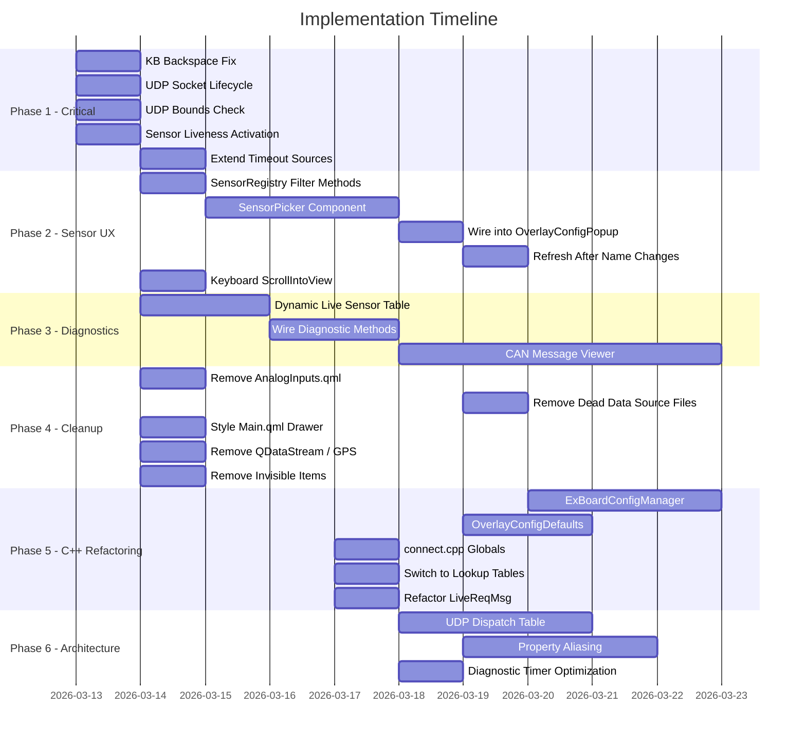

# PowerTune Prism Advanced - Implementation Plan

**Source:** `CODEBASE_REVIEW_AUDIT.md` (34 issues identified)
**Date:** 2026-03-12
**Status:** Pending implementation

---

## Phase 1: Critical Bug Fixes

Blocking issues that cause data loss, crashes, or broken core functionality. Each task is independent and can be done in any order.

---

### 1.1 Keyboard Backspace Bug

**Issues:** ISSUE-KB-3
**Files:** `Prism/Keyboard/PrismKeyboard.qml`
**Effort:** 15 minutes

**Problem:** `sendBackspace()` calls `target.remove(pos - 1, 1)`. Qt's `TextInput.remove(start, end)` takes two positions, not position + length. The second argument `1` is treated as an end position, causing multi-character deletion that escalates with each press.

**Implementation:**

| File                               | Line | Change                                                       |
| ---------------------------------- | ---- | ------------------------------------------------------------ |
| `Prism/Keyboard/PrismKeyboard.qml` | 344  | `target.remove(pos - 1, 1)` -> `target.remove(pos - 1, pos)` |

**Verification:** Type "12345" into any numeric field, press backspace once. Result should be "1234", not "1".

---

### 1.2 UDP Socket Lifecycle

**Issues:** ISSUE-UDP-1, ISSUE-UDP-2
**Files:** `Utils/UDPReceiver.h`, `Utils/UDPReceiver.cpp`
**Effort:** 45 minutes

**Problem:** `closeConnection()` is a no-op. `startreceiver()` has no guard against double invocation. Both cause socket leaks.

**Implementation:**

`UDPReceiver.h` -- add member declaration if not present:

```cpp
QUdpSocket *udpSocket = nullptr;
```

`UDPReceiver.cpp` -- `closeConnection()`:

```cpp
void udpreceiver::closeConnection()
{
    if (udpSocket) {
        udpSocket->close();
        udpSocket->deleteLater();
        udpSocket = nullptr;
    }
}
```

`UDPReceiver.cpp` -- `startreceiver()` guard at top of method:

```cpp
void udpreceiver::startreceiver()
{
    if (udpSocket) {
        udpSocket->close();
        udpSocket->deleteLater();
        udpSocket = nullptr;
    }
    udpSocket = new QUdpSocket(this);
    // ... existing bind and connect logic
}
```

**Verification:** Call openConnection/closeConnection/openConnection. Confirm no duplicate socket warnings in log. Confirm data flows after reconnect.

---

### 1.3 UDP Datagram Bounds Check

**Issues:** ISSUE-UDP-4
**Files:** `Utils/UDPReceiver.cpp`
**Effort:** 15 minutes

**Problem:** `list[1]` accessed without verifying `list.size() >= 2`. Malformed datagrams crash the application.

**Implementation:**

Replace the current split/access block with:

```cpp
QStringList list = raw.split(",");
if (list.size() < 2)
    continue;
int ident = list[0].toInt();
float Value = list[1].toFloat();
```

---

### 1.4 Sensor Liveness Activation

**Issues:** ISSUE-DROPDOWN-1
**Files:** `Utils/UDPReceiver.cpp`, `Hardware/Extender.cpp`, `Core/SensorRegistry.h`
**Effort:** 2-4 hours

**Problem:** `SensorRegistry::markCanSensorActive()` is never called. All sensors permanently read as inactive.

**Implementation:**

`UDPReceiver.cpp` -- at the top of `processPendingDatagrams()`, after the switch statement dispatches a value, call:

```cpp
if (m_sensorRegistry) {
    m_sensorRegistry->markCanSensorActive(propertyKey);
}
```

This requires:

1. Add `SensorRegistry *m_sensorRegistry = nullptr;` member to `udpreceiver` class
2. Add setter: `void setSensorRegistry(SensorRegistry *reg) { m_sensorRegistry = reg; }`
3. In `connect.cpp`, after creating both objects, call `m_udpreceiver->setSensorRegistry(m_sensorRegistry);`
4. Build a mapping from ident code to SensorRegistry key (can reuse the same switch structure or build a lookup table alongside)

`Extender.cpp` -- in the CAN frame processing method, after writing to ExpanderBoardData:

```cpp
if (m_sensorRegistry) {
    m_sensorRegistry->markCanSensorActive(QStringLiteral("EXAnalogInput%1").arg(channel));
}
```

Same wiring pattern: add member, setter, wire in `connect.cpp`.

**Verification:** Connect to ECU daemon, open diagnostics. Sensors receiving data should show `active = true`. After disconnecting for 10+ seconds, they should revert to inactive.

---

### 1.5 Extend Timeout to Cover Extender Sources

**Issues:** ISSUE-DROPDOWN-2
**Files:** `Core/SensorRegistry.cpp`
**Effort:** 15 minutes

**Implementation:**

In `checkCanTimeouts()`, change the source filter from:

```cpp
if (it->source == SensorSource::DaemonUDP && it->active) {
```

to:

```cpp
if ((it->source == SensorSource::DaemonUDP ||
     it->source == SensorSource::ExtenderAnalog ||
     it->source == SensorSource::ExtenderDigital) && it->active) {
```

---

## Phase 2: Sensor Binding UX

The highest-impact user-facing improvement. Phases 2.1-2.4 must be done in order. 2.5 is independent.

---

### 2.1 SensorRegistry Filtered Query Methods

**Issues:** ISSUE-DROPDOWN-4
**Files:** `Core/SensorRegistry.h`, `Core/SensorRegistry.cpp`
**Effort:** 2 hours

**Implementation:**

Add to `SensorRegistry.h`:

```cpp
Q_INVOKABLE QVariantList getActiveSensors() const;
Q_INVOKABLE QVariantList getSensorsByCategory(const QString &category, bool activeOnly = false) const;
Q_INVOKABLE QStringList sensorDisplayNames(const QString &category, bool activeOnly = false) const;
Q_INVOKABLE QStringList sensorKeys(const QString &category = QString(), bool activeOnly = false) const;
```

`getActiveSensors()` returns entries where `active == true`.
`getSensorsByCategory(category, activeOnly)` adds an optional active filter.
`sensorDisplayNames(category, activeOnly)` returns display strings with optional active filter.
`sensorKeys(category, activeOnly)` returns just the property keys for combo value mapping.

The existing `sensorDisplayNames(category)` signature is preserved as the `activeOnly = false` default.

---

### 2.2 SensorPicker Custom Component

**Issues:** ISSUE-DROPDOWN-5, ISSUE-EXAN-1, ISSUE-EXAN-2
**Files:** New file `PowerTune/Settings/components/SensorPicker.qml`
**Effort:** 2-3 days

**Structure:**

```
SensorPicker.qml
+-- property string selectedKey          // bound to config sensorKey
+-- property string filterMode: "all"    // "all" | "active" | "category"
+-- property string categoryFilter: ""
+-- property string searchText: ""
|
+-- ColumnLayout
    +-- RowLayout (filter toggles)
    |   +-- StyledButton "All"
    |   +-- StyledButton "Active"
    |   +-- StyledButton "Category"
    |
    +-- StyledTextField (search, with magnifying glass icon)
    |
    +-- RowLayout (category pills, visible when filterMode === "category")
    |   +-- Repeater { model: SensorRegistry.availableCategories }
    |       +-- StyledButton per category
    |
    +-- ListView (sensor list)
        +-- model: internal filtered ListModel
        +-- delegate: sensor row
        |   +-- Rectangle (active dot, green/grey)
        |   +-- Text (displayName)
        |   +-- Text (unit, right-aligned, secondary color)
        +-- section.property: "category"
        +-- section.delegate: category header
        +-- ScrollBar.vertical: ScrollBar { policy: ScrollBar.AlwaysOn }
```

**Data flow:**

1. On open, read `SensorRegistry.getSensorsByCategory("", filterMode === "active")` into internal `ListModel`
2. Search field filters by `displayName` and `key` (case-insensitive `indexOf`)
3. Category buttons set `categoryFilter`, re-query with category string
4. Selection writes `selectedKey` (the SensorRegistry `key`, which is the Q_PROPERTY name)
5. Parent reads `selectedKey` to save in overlay config

**Signals:**

```qml
signal sensorSelected(string key, string displayName, string unit)
```

---

### 2.3 Wire SensorPicker into OverlayConfigPopup

**Issues:** ISSUE-EXAN-1, ISSUE-EXAN-2
**Files:** `PowerTune/Dashboard/OverlayConfigPopup.qml`
**Effort:** 2-4 hours

**Implementation:**

Replace the two `StyledComboBox` instances (datasourceCombo at line 566, gearDatasourceCombo at line 1650) with `SensorPicker`:

```qml
SensorPicker {
    id: datasourcePicker
    Layout.fillWidth: true
    selectedKey: popup.sensorKey
    onSensorSelected: function(key, displayName, unit) {
        popup.sensorKey = key
    }
}
```

Remove `updateDatasourceIndex()` and `updateGearDatasourceIndex()` functions -- SensorPicker handles selection restoration internally via `selectedKey` binding.

Remove all `PropertyRouter.availableProperties()` calls from OverlayConfigPopup.

---

### 2.4 Refresh SensorRegistry After Name Changes

**Issues:** ISSUE-EXAN-5
**Files:** `PowerTune/Core/ExBoardAnalog.qml`
**Effort:** 30 minutes

**Implementation:**

In `inputs.setInputs()`, after saving channel names (after the `AppSettings.setValue("ui/exboard/exan7name", ...)` line), add:

```qml
SensorRegistry.refreshExtenderAnalogInputs()
SensorRegistry.refreshExtenderDigitalInputs()
```

---

### 2.5 Keyboard ScrollIntoView

**Issues:** ISSUE-KB-1, ISSUE-KB-2
**Files:** `Prism/Keyboard/PrismKeyboard.qml`, `PowerTune/Settings/components/SettingsPage.qml`
**Effort:** 2-4 hours

**Implementation:**

`PrismKeyboard.qml` -- in `show(textField)`, after setting `visible = true`:

```qml
function show(textField) {
    // ... existing logic ...
    visible = true
    ensureFieldVisible(textField)
}

function ensureFieldVisible(field) {
    if (!field || !docked) return

    var scrollView = findParentScrollView(field)
    if (!scrollView) return

    var fieldRect = field.mapToItem(scrollView.contentItem, 0, 0)
    var fieldBottom = fieldRect.y + field.height
    var visibleTop = scrollView.contentItem.contentY
    var visibleBottom = visibleTop + scrollView.height - height

    if (fieldBottom > visibleBottom) {
        scrollView.contentItem.contentY = fieldBottom - scrollView.height + height + 20
    } else if (fieldRect.y < visibleTop) {
        scrollView.contentItem.contentY = fieldRect.y - 20
    }
}

function findParentScrollView(item) {
    var parent = item.parent
    while (parent) {
        if (parent instanceof Flickable || parent.hasOwnProperty("contentY"))
            return parent
        parent = parent.parent
    }
    return null
}
```

The `contentY` adjustment accounts for the keyboard height so the field is centered in the remaining visible area above the keyboard.

---

## Phase 3: Diagnostics Tab

Can be done independently of Phase 2. Tasks 3.1 and 3.2 are sequential. 3.3 is independent.

---

### 3.1 Dynamic Live Sensor Table

**Issues:** ISSUE-DIAG-2, ISSUE-DIAG-3
**Files:** `Core/DiagnosticsProvider.cpp`
**Effort:** 1 day

**Implementation:**

Replace the hardcoded 37-sensor `static const SensorDef sensors[]` in `refreshLiveSensorEntries()` with a dynamic query to SensorRegistry:

```cpp
void DiagnosticsProvider::refreshLiveSensorEntries()
{
    if (!m_sensorRegistry || !m_propertyRouter) return;

    QVariantList entries;
    const QVariantList allSensors = m_sensorRegistry->availableSensors();

    for (const QVariant &v : allSensors) {
        QVariantMap sensor = v.toMap();
        const QString key = sensor.value("key").toString();
        const bool active = sensor.value("active").toBool();

        if (!m_showAllSensors && !active)
            continue;

        double value = 0.0;
        if (m_propertyRouter->hasProperty(key))
            value = m_propertyRouter->getValue(key).toDouble();

        QVariantMap entry;
        entry["name"] = sensor.value("displayName");
        entry["source"] = sensor.value("category");
        entry["value"] = value;
        entry["unit"] = sensor.value("unit");
        entry["active"] = active;
        entries.append(entry);
    }

    m_liveSensorEntries = entries;
    emit liveSensorEntriesChanged();
}
```

Update `DiagnosticsSettings.qml` delegate to show the active indicator dot using the new `active` field.

---

### 3.2 Wire Unused Diagnostic Methods

**Issues:** ISSUE-DIAG-4
**Files:** `PowerTune/Settings/DiagnosticsSettings.qml`
**Effort:** 1-2 days

**Implementation:**

Add three new collapsible `SettingsSection` components to the diagnostics page:

1. **"Analog Inputs"** section using `Diagnostics.getAnalogInputDiagnostics()`:
   - Table columns: Channel, Raw Value (V), Calibrated Value, Unit
   - Covers both ECU analog (0-10) and extender analog (0-7)

2. **"Digital Inputs"** section using `Diagnostics.getDigitalInputDiagnostics()` and `Diagnostics.getExtenderDigitalDiagnostics()`:
   - Table columns: Channel, State (On/Off), Custom Name
   - Covers ECU digital (1-7) and extender digital (1-8)

3. **"Extender Board"** section using `Diagnostics.getExpanderBoardDiagnostics()`:
   - Table columns: Channel, Raw Voltage, Calibrated, Unit, NTC Enabled
   - Shows both raw and calc values side by side

Each section uses a `Timer { interval: 1000; running: section.expanded }` so it only refreshes when visible (addresses ISSUE-DIAG-5 pattern).

---

### 3.3 CAN Message Viewer

**Issues:** ISSUE-DIAG-1
**Files:** `Core/DiagnosticsProvider.h`, `Core/DiagnosticsProvider.cpp`, `PowerTune/Settings/DiagnosticsSettings.qml`
**Effort:** 3-5 days

**Implementation -- C++ side:**

Add to `DiagnosticsProvider`:

```cpp
struct CanFrame {
    quint32 frameId;
    QByteArray payload;
    qint64 timestamp;
};

Q_PROPERTY(QVariantList canFrameBuffer READ canFrameBuffer NOTIFY canFrameBufferChanged)
Q_PROPERTY(bool canCaptureEnabled READ canCaptureEnabled WRITE setCanCaptureEnabled NOTIFY canCaptureEnabledChanged)
Q_PROPERTY(QString canIdFilter READ canIdFilter WRITE setCanIdFilter NOTIFY canIdFilterChanged)

Q_INVOKABLE void resetCanErrors();
Q_INVOKABLE void clearCanFrameBuffer();
```

- Ring buffer of 500 frames (configurable)
- `recordCanFrame(quint32 id, const QByteArray &payload)` called from Extender CAN processing
- Filter by hex CAN ID string (empty = show all)
- `canFrameBuffer` returns filtered frames as `QVariantList` of `{id, payload, timestamp}` maps

**Implementation -- QML side:**

Add a new `SettingsSection` titled "CAN Messages" with:

- Toggle: "Start/Stop Capture" bound to `canCaptureEnabled`
- TextField: "Filter by CAN ID (hex)" bound to `canIdFilter`
- Button: "Clear" calls `Diagnostics.clearCanFrameBuffer()`
- Button: "Reset Errors" calls `Diagnostics.resetCanErrors()`
- ListView: columns for Timestamp, ID (hex), Length, Payload (hex bytes), decoded ASCII

---

## Phase 4: Code Cleanup and Dead Code Removal

Independent tasks. Can be done in any order alongside other phases.

---

### 4.1 Remove AnalogInputs.qml

**Issues:** ISSUE-THEME-1
**Files:** `PowerTune/Core/AnalogInputs.qml`, `CMakeLists.txt`, settings manager/tab bar QML
**Effort:** 2 hours

**Steps:**

1. Grep for `AnalogInputs` in all QML and CMake files to find references
2. Remove the file from `CMakeLists.txt` QML sources
3. Remove any `Loader` or tab entry that loads `AnalogInputs.qml`
4. Verify `ExBoardAnalog.qml` handles all analog calibration keys (`AN00`-`AN105`)
5. Delete the file

---

### 4.2 Remove Dead Data Source Files

**Issues:** ISSUE-EXAN-3
**Files:** `PowerTune/Gauges/Shared/DatasourcesList.qml`, `PowerTune/Gauges/Shared/DatasourceService.qml`
**Effort:** 1 day

**Steps:**

1. Migrate useful metadata from `DatasourcesList.qml` into `SensorRegistry`:
   - `defaultsymbol` -> SensorEntry `unit` field
   - `decimalpoints` -> add `decimals` field to SensorEntry
   - `maxvalue` -> add `maxValue` field to SensorEntry
   - `stepsize` -> add `stepSize` field to SensorEntry
2. Add `Q_INVOKABLE` accessors: `getDecimals(key)`, `getMaxValue(key)`, `getStepSize(key)`
3. Update any gauge component that might have referenced DatasourceService (search confirms none do)
4. Remove both files from `CMakeLists.txt` and `qmldir`
5. Delete the files

---

### 4.3 Style Main.qml Drawer

**Issues:** ISSUE-THEME-2
**Files:** `PowerTune/Core/Main.qml`
**Effort:** 2 hours

Replace all raw `Button` and `Switch` components in the `Drawer` (lines 145-337) with `StyledButton` and `StyledSwitch`. Replace hardcoded colors (`"grey"`, `"darkgrey"`, `"red"`, etc.) with `SettingsTheme` tokens. Replace `window.width / N` sizing with `SettingsTheme` spacing constants.

---

### 4.4 Remove Unused QDataStream

**Issues:** ISSUE-UDP-3
**Files:** `Utils/UDPReceiver.cpp`
**Effort:** 5 minutes

Delete line 93:

```cpp
QDataStream in(&datagram, QIODevice::ReadOnly);
```

---

### 4.5 Disable GPS gpsSpeed Handler

**Files:** `Utils/UDPReceiver.cpp`
**Effort:** 15 minutes

Comment out or remove the `case 111:` handler for `gpsSpeed` to match the disabled state of ident codes 108-110, 112. Add a comment block documenting that the full GPS block (108-112) is intentionally disabled.

---

### 4.6 Remove Invisible Item Function Holders

**Issues:** ISSUE-SETTINGS-2
**Files:** `PowerTune/Settings/MainSettings.qml`
**Effort:** 1 hour

Move all 6 functions from invisible `Item` wrappers to top-level JavaScript functions on the root component. Remove the empty `Item` elements.

---

## Phase 5: C++ Refactoring

Larger structural changes. Each task is independent.

---

### 5.1 ExBoardConfigManager

**Issues:** Section 4.2 of audit
**Files:** New `Core/ExBoardConfigManager.h`, `Core/ExBoardConfigManager.cpp`, refactor `PowerTune/Core/ExBoardAnalog.qml`
**Effort:** 2-3 days

**Creates a C++ class that replaces ~1,200 lines of QML:**

```cpp
class ExBoardConfigManager : public QObject {
    Q_OBJECT
    Q_INVOKABLE QVariantMap loadAllSettings() const;
    Q_INVOKABLE void saveAllSettings(const QVariantMap &config);
    Q_INVOKABLE void applyLinearPreset(int channel, const QString &presetName);
    Q_INVOKABLE void applyNtcPreset(int channel, const QString &presetName);
    Q_INVOKABLE QVariantMap getChannelConfig(int channel) const;
};
```

**Eliminates:**

- 150-line `Component.onCompleted` settings load block
- 16 invisible `StyledTextField` bridge fields
- `inputs.setInputs()` 50-line save function
- `applyLinearPreset()` / `applyNtcPreset()` QML functions

---

### 5.2 OverlayConfigDefaults Singleton

**Issues:** Section 9.2 (default value drift)
**Files:** New `Core/OverlayConfigDefaults.h/.cpp`, refactor `PowerTune/Dashboard/RaceDash.qml`, `PowerTune/Dashboard/OverlayConfigPopup.qml`
**Effort:** 1 day

Single source of truth for overlay default configs. Exposed to QML as context property. Both `RaceDash.qml` and `OverlayConfigPopup.qml` read from this instead of maintaining separate hardcoded defaults.

---

### 5.3 Move connect.cpp Globals to Class Members

**Issues:** ISSUE-CPP-1
**Files:** `Core/connect.h`, `Core/connect.cpp`
**Effort:** 1 hour

Move `ecu`, `logging`, `connectclicked`, `canbaseadress`, `rpmcanbaseadress`, `checksumhex`, `recvchecksumhex`, `selectedPort`, `dashfilenames` from file scope to `Connect` class private members.

---

### 5.4 Replace Switch Statements with Lookup Tables

**Issues:** ISSUE-CPP-2, ISSUE-CPP-3
**Files:** `Core/connect.cpp`
**Effort:** 2 hours

`daemonstartup()` -- replace 188-line switch with:

```cpp
static const QMap<int, QString> daemonMap = {
    {0, "haltechv1"}, {1, "haltechv2"}, ...
};
```

`checkReg()` -- replace 240-line switch with:

```cpp
static const QMap<int, int> registerMap = { ... };
```

---

### 5.5 Refactor LiveReqMsg

**Issues:** ISSUE-CPP-4
**Files:** `Core/connect.h`, `Core/connect.cpp`
**Effort:** 2 hours

Replace the 45-parameter signature with:

```cpp
Q_INVOKABLE void LiveReqMsg(const QVariantList &values);
```

Update all QML callers to pass an array.

---

## Phase 6: Long-Term Architecture

These are larger efforts to be scheduled across multiple sprints.

---

### 6.1 UDP Dispatch Table

**Files:** `Utils/UDPReceiver.h`, `Utils/UDPReceiver.cpp`
**Effort:** 2-3 days

Replace the 1,250-line switch statement with a registration-based dispatch:

```cpp
using IdentHandler = std::function<void(float)>;
QHash<int, IdentHandler> m_dispatchTable;

void registerHandler(int ident, QObject *model, const char *setter);
```

Register all ~300 handlers in the constructor. `processPendingDatagrams()` reduces to:

```cpp
auto it = m_dispatchTable.find(ident);
if (it != m_dispatchTable.end())
    (*it)(Value);
```

---

### 6.2 Property Aliasing

**Files:** `Core/PropertyRouter.h`, `Core/PropertyRouter.cpp`
**Effort:** 2-3 days

Add `Q_INVOKABLE void aliasProperty(const QString &sourceKey, const QString &targetKey)` that:

1. Registers `targetKey` as a virtual property pointing to `sourceKey`
2. When `sourceKey` changes, emits `valueChanged` for both `sourceKey` and `targetKey`
3. `getValue(targetKey)` reads from the source model

This allows `EXAnalogCalc3` to alias as `oilpres`, making extender sensors drop-in replacements for ECU values when explicitly configured by the user.

---

### 6.3 Diagnostic Timer Optimization

**Files:** `Core/DiagnosticsProvider.h/.cpp`, `PowerTune/Settings/DiagnosticsSettings.qml`
**Effort:** 2 hours

Add `Q_INVOKABLE void setPageVisible(bool visible)` to `DiagnosticsProvider`. When `visible = false`, stop `m_systemInfoTimer` and `m_liveSensorTimer`. Restart when page becomes visible again. Wire via `Component.onCompleted` / `Component.onDestruction` or `StackView.onActivated` / `onDeactivated` in the settings manager.

---

## Summary

| Phase                     | Tasks | Total Effort | Dependencies                    |
| ------------------------- | ----: | ------------ | ------------------------------- |
| 1. Critical Bug Fixes     |     5 | ~4-5 hours   | None                            |
| 2. Sensor Binding UX      |     5 | ~5-7 days    | Phase 1.4 (liveness activation) |
| 3. Diagnostics Tab        |     3 | ~5-8 days    | Phase 1.4 (liveness activation) |
| 4. Code Cleanup           |     6 | ~1-2 days    | None                            |
| 5. C++ Refactoring        |     5 | ~5-7 days    | None                            |
| 6. Long-Term Architecture |     3 | ~5-7 days    | Phases 1-3 complete             |


