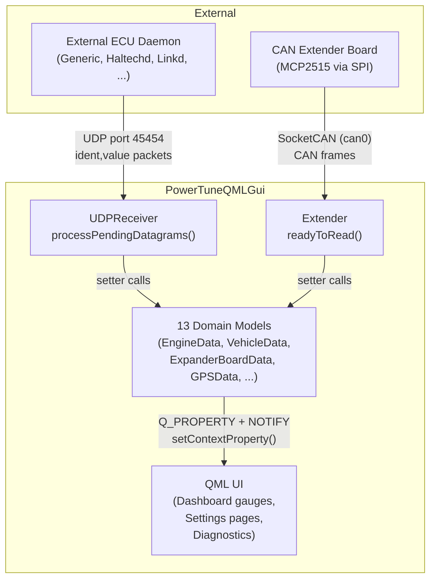
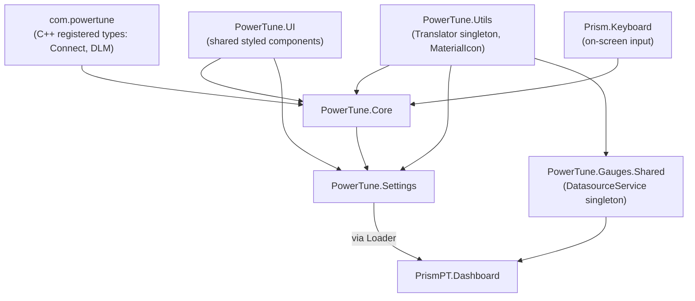
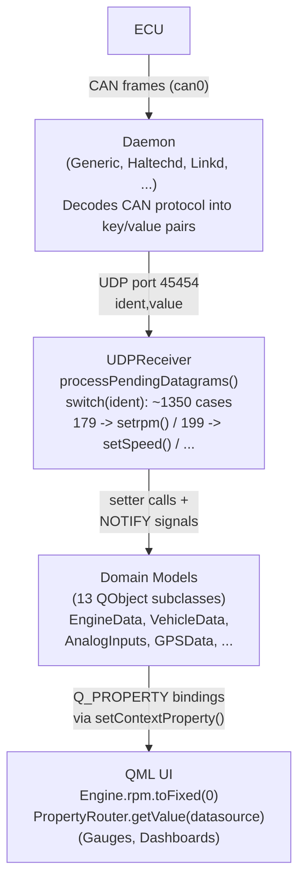
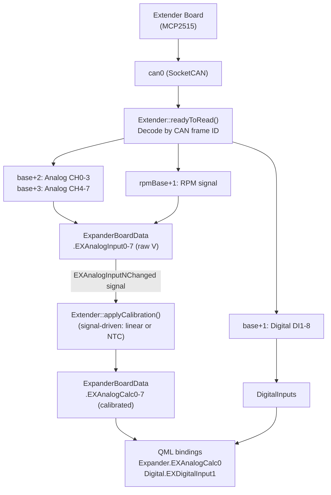
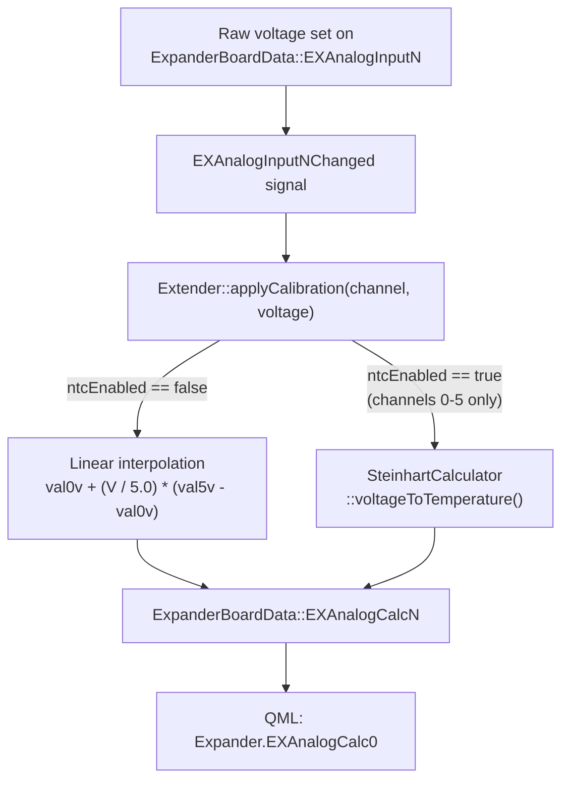

# PowerTune Digital Dashboard -- Project Reference

Version: 2026-03-09
Maintainer: Kai Wyborny

This document provides a complete technical reference for the PowerTune Digital
Dashboard application. It is intended as the single source of truth for any
developer or AI agent joining the project. It covers architecture, data flow,
build system, deployment, file locations, and cross-check rules.

---

## Table of Contents

1. [Project Identity](#1-project-identity)
2. [High-Level Architecture](#2-high-level-architecture)
3. [Directory Structure](#3-directory-structure)
4. [Build System (CMake)](#4-build-system-cmake)
5. [Application Bootstrap](#5-application-bootstrap)
6. [QML Module Structure](#6-qml-module-structure)
7. [C++ Backend Classes](#7-c-backend-classes)
8. [Data Models](#8-data-models)
9. [Data Flow: CAN Bus to QML Gauges](#9-data-flow-can-bus-to-qml-gauges)
10. [Extender Board (CAN Expansion)](#10-extender-board-can-expansion)
11. [PropertyRouter and Dynamic Binding](#11-propertyrouter-and-dynamic-binding)
12. [Sensor System](#12-sensor-system)
13. [Settings and Persistence](#13-settings-and-persistence)
14. [Dashboard and Gauge Architecture](#14-dashboard-and-gauge-architecture)
15. [Diagnostics System](#15-diagnostics-system)
16. [Settings UI Structure](#16-settings-ui-structure)
17. [Deployment and Target Device](#17-deployment-and-target-device)
18. [Resource Locations](#18-resource-locations)
19. [Archived Code](#19-archived-code)
20. [Cross-Check Rules](#20-cross-check-rules)
21. [Known Issues](#21-known-issues)
22. [Onboarding Checklist](#22-onboarding-checklist)

---

## 1. Project Identity

| Field               | Value                                                    |
| ------------------- | -------------------------------------------------------- |
| Name                | PowerTuneQMLGui                                          |
| Description         | Automotive digital dashboard for ECU monitoring          |
| Primary Language    | C++17 / QML (Qt Quick)                                   |
| Qt Version (dev)    | Qt 6.x (CMake build)                                     |
| Qt Version (device) | Qt 5.15.7 (qmake build on Yocto)                         |
| Target Hardware     | Raspberry Pi 4 (ARMv7, 32-bit Poky/Yocto)                |
| Display             | EGLFS (no X11), touchscreen, 800x480 or 1024x600         |
| Repository          | PowerTuneDigitalOfficial/Prism                           |
| Git Branch Model    | main -> release/_ -> staging -> dev -> feature/_, bug/\* |

---

## 2. High-Level Architecture

The application is an automotive digital dashboard that reads engine telemetry
from an ECU via CAN bus and renders it as configurable gauges on a touchscreen.

There are two separate data ingest paths that feed into a shared set of domain
models, which QML then binds to reactively.



**Path 1 -- UDP (primary data path):**
External ECU daemons (one of ~60 protocol-specific decoders) run as separate
processes on the Pi. Each daemon reads raw CAN frames from `can0`, decodes the
ECU-specific protocol, and sends parsed telemetry as UDP datagrams to port
45454 in the format `"ident,value"`. The `UDPReceiver` class receives these
and routes each identifier to the correct domain model setter via a large
`switch(ident)` block (~1350 cases).

**Path 2 -- Direct CAN (extender board):**
The `Extender` class reads raw CAN frames directly from `can0` via Qt's
`QCanBus` / SocketCAN interface. It decodes frames from the custom Extender
board hardware (8 analog inputs, 8 digital inputs, optional RPM) and writes
directly into `ExpanderBoardData` and `DigitalInputs` models.

Both paths populate QObject-based domain models whose Q_PROPERTYs have NOTIFY
signals. QML binds to these properties reactively through `setContextProperty()`.

---

## 3. Directory Structure

```
PowerTuneDigitalOfficial_Prism/
|-- main.cpp                     Application entry point
|-- CMakeLists.txt               Primary build system (Qt6 CMake)
|-- CMakePresets.json             CMake presets (debug, release, etc.)
|
|-- Core/                        Central C++ backend
|   |-- connect.cpp/.h           Main orchestrator: creates all objects, registers QML
|   |-- dashboard.cpp/.h         Legacy coordination shell (thin wrapper, being phased out)
|   |-- appsettings.cpp/.h       QSettings read/write for persistent app configuration
|   |-- PropertyRouter.cpp/.h    Dynamic property lookup for configurable gauges
|   |-- SensorRegistry.cpp/.h    Runtime sensor availability and liveness tracker
|   |-- DiagnosticsProvider.cpp/.h  System health, CAN status, log buffer
|   |-- Models/                  Domain data model classes (all QObject-based)
|       |-- DataModels.h         Convenience header: includes every model
|       |-- EngineData.h/.cpp    Engine metrics (~170 Q_PROPERTYs)
|       |-- VehicleData.h/.cpp   Speed, gear, odometer, wheel speeds
|       |-- ExpanderBoardData.h/.cpp  Extender analog raw + calibrated (0-7)
|       |-- DigitalInputs.h/.cpp     ECU digital (1-7) + extender digital (1-8)
|       |-- AnalogInputs.h/.cpp      ECU analog channels (0-10)
|       |-- GPSData.h/.cpp           GPS coordinates, speed, altitude, satellites
|       |-- FlagsData.h/.cpp         ECU status flags (Flag1-25, FlagString1-16)
|       |-- ElectricMotorData.h/.cpp EV motor/inverter metrics
|       |-- TimingData.h/.cpp        Timing advance data
|       |-- SensorData.h/.cpp        SenseHat sensor readings
|       |-- ConnectionData.h/.cpp    Connection state flags
|       |-- SettingsData.h/.cpp      Runtime settings state
|       |-- UIState.h/.cpp           UI mode, current page, brightness
|
|-- Hardware/
|   |-- Extender.cpp/.h          CAN Extender board: reads/calibrates analog, digital, RPM via SocketCAN
|
|-- Utils/
|   |-- UDPReceiver.cpp/.h       UDP socket listener: parses daemon "ident,value" packets
|   |-- Calculations.cpp/.h      Derived computations (boost, fuel economy, etc.)
|   |-- CalibrationHelper.cpp/.h Sensor preset data and calibration helpers for QML
|   |-- SteinhartCalculator.cpp/.h  NTC thermistor calibration (Steinhart-Hart)
|   |-- SignalSmoother.cpp/.h    Signal damping/smoothing filter
|   |-- DataLogger.cpp/.h        CSV data logging to file
|   |-- downloadmanager.cpp/.h   HTTP download manager (firmware updates)
|   |-- ParseGithubData.cpp/.h   GitHub release JSON parser
|   |-- wifiscanner.cpp/.h       WiFi network scanner
|   |-- shcalc.cpp/.h            Steinhart-Hart coefficient solver
|   |-- textprogressbar.cpp/.h   Console progress bar utility
|
|-- PowerTune/                   QML source organized by module
|   |-- Core/                    PowerTune.Core -- main application pages
|   |   |-- Main.qml             Root window, SwipeView, dashboard loader
|   |   |-- SerialSettings.qml   Settings TabBar + StackLayout
|   |   |-- ExBoardAnalog.qml    Extender board calibration page
|   |   |-- Intro.qml            Splash/intro screen
|   |   |-- BrightnessPopUp.qml  Brightness control popup
|   |   |-- AnalogInputs.qml     ECU analog input display
|   |
|   |-- Dashboard/               PrismPT.Dashboard -- user dashboard canvas
|   |   |-- DashboardTheme.qml   Theme singleton (colors, fonts, spacing)
|   |   |-- UserDashboard.qml    Main dashboard view
|   |
|   |-- Gauges/                  Shared gauge helpers
|   |   |-- Shared/
|   |       |-- DatasourceService.qml  Datasource routing singleton
|   |       |-- DatasourcesList.qml    Static sensor list model (~400 entries)
|   |       |-- Warning.qml            Warning popup logic
|   |       |-- WarningLoader.qml      Warning trigger loader
|   |
|   |-- Settings/                PowerTune.Settings -- settings pages
|   |   |-- MainSettings.qml     ECU/CAN/connection/startup config
|   |   |-- VehicleRPMSettings.qml  Combined speed/gear/RPM/warning settings
|   |   |-- NetworkSettings.qml  WiFi and network config
|   |   |-- DiagnosticsSettings.qml  System health, CAN status, sensor data
|   |   |-- DashSelector.qml     Dashboard selection/management
|   |   |-- DashSelectorWidget.qml  Dashboard dropdown widget
|   |   |-- CanMonitor.qml       Raw CAN frame monitor
|   |   |-- AnalogSettings.qml   Analog input calibration
|   |   |-- HelpPage.qml         QR codes and contact info
|   |   |-- (+ legacy stubs: StartupSettings, WarnGearSettings, SpeedSettings,
|   |   |     RPMSettings, SenseHatSettings -- content moved elsewhere)
|   |   |-- WifiCountryList.qml  WiFi country code list
|   |   |-- components/          Shared styled UI primitives
|   |       |-- SettingsPage.qml
|   |       |-- SettingsSection.qml
|   |       |-- SettingsRow.qml
|   |       |-- StyledButton.qml
|   |       |-- StyledComboBox.qml
|   |       |-- StyledTextField.qml
|   |       |-- StyledSwitch.qml
|   |       |-- StyledCheckBox.qml
|   |       |-- ConnectionStatusIndicator.qml
|   |
|   |-- Utils/                   PowerTune.Utils -- shared QML utilities
|       |-- Translator.qml       Internationalization singleton
|       |-- MaterialIcon.qml     Material Design icon component
|       |-- Translator.js        Translation lookup script
|
|-- Prism/
|   |-- Keyboard/                Prism.Keyboard -- custom virtual keyboard
|       |-- PrismKeyboard.qml
|       |-- QwertyLayout.qml
|       |-- NumericPad.qml
|       |-- KeyButton.qml
|
|-- Resources/                   Static assets (embedded via qt_add_resources)
|   |-- graphics/                PNG/SVG gauge graphics, LEDs, backgrounds, QR codes
|   |   |-- Flags/               Country flag icons (ae, de, es, fr, jp, us)
|   |-- fonts/                   MaterialSymbolsOutlined.ttf, HyperspaceRaceVariable.otf
|   |-- KTracks/                 GPS track coordinate files by country
|   |-- Logo/                    Alternate logo assets (device deployment)
|   |-- Sounds/                  Audio files (device deployment)
|
|-- Scripts/                     Build, install, and platform scripts
|   |-- build-macos.sh           Local macOS CMake build
|   |-- run-macos.sh             Build + run on macOS
|   |-- updatePowerTune.sh       On-device build and install (qmake path)
|   |-- updatedaemons.sh         Daemon update on Yocto
|   |-- updatepi4.sh             Pi 4 system setup
|   |-- updateUserDashboards.sh  Sync example dashboards to device
|
|-- docs-misc/                   Documentation and archives
|   |-- PROJECT_REFERENCE.md     This file
|   |-- Documents-powertune/     Protocol docs, PDFs, spreadsheets
|   |-- device-audit/            Device configuration audit
|   |-- device-backup/           Full Pi root filesystem backup (gitignored)
|   |-- code-archive/            Archived C++, fonts, and example files (see Section 19)
|   |-- keyboard-design.md       Keyboard design notes
|
|-- operating_platform/          Platform-specific config (config.txt, Licence)
|-- daemons/                     Daemon binaries (not committed)
|-- .clang-format                C++ formatting rules
|-- .clang-tidy                  C++ static analysis config
|-- .clangd                      clangd LSP configuration
|-- .qmllint.ini                 QML linter configuration
```

---

## 4. Build System (CMake)

**File:** `CMakeLists.txt` (single root file, no subdirectory CMake files)

### 4.1 Configuration

- Project: `PowerTuneQMLGui`, version 1.0.0, C++17
- Qt modules: Core, Gui, Qml, Quick, QuickControls2, Network, SerialBus
- Qt6-only extras: Core5Compat (for GraphicalEffects), ShaderTools
- Optional: ddcutil (DDC/CI brightness control, Linux only)
- `CMAKE_EXPORT_COMPILE_COMMANDS ON` for clangd integration

### 4.2 Source File Organization

CMake groups sources into three variable sets:

| Variable           | Directory   | Files                                                                                                                                                 |
| ------------------ | ----------- | ----------------------------------------------------------------------------------------------------------------------------------------------------- |
| `CORE_SOURCES`     | `Core/`     | connect, dashboard, appsettings, PropertyRouter, SensorRegistry, DiagnosticsProvider, all 13 Models                                                   |
| `HARDWARE_SOURCES` | `Hardware/` | Extender only                                                                                                                                         |
| `UTILS_SOURCES`    | `Utils/`    | UDPReceiver, Calculations, Steinhart, Calibration, SignalSmoother, DataLogger, downloadmanager, ParseGithubData, shcalc, textprogressbar, wifiscanner |

These combine into `PROJECT_SOURCES` along with `main.cpp`.

### 4.3 QML Modules (Qt6 only)

Seven QML modules are built as static libraries and linked to the executable:

| Module URI              | Library Target       | Key Files                                                   |
| ----------------------- | -------------------- | ----------------------------------------------------------- |
| PowerTune.Utils         | PowerTuneUtilsLib    | Translator.qml (singleton), MaterialIcon.qml                |
| PowerTune.Core          | PowerTuneCoreLib     | Main.qml, SerialSettings.qml, ExBoardAnalog.qml             |
| PowerTune.UI            | PowerTuneUiLib       | Settings/components/\* (SettingsPage, StyledButton, etc.)   |
| PowerTune.Settings      | PowerTuneSettingsLib | MainSettings.qml, DiagnosticsSettings.qml, DashSelector.qml |
| PowerTune.Gauges.Shared | GaugesSharedLib      | DatasourcesList.qml, DatasourceService.qml (singleton)      |
| PrismPT.Dashboard       | PrismPTDashboardLib  | DashboardTheme.qml (singleton), UserDashboard.qml           |
| Prism.Keyboard          | PrismKeyboardLib     | PrismKeyboard.qml, QwertyLayout.qml, NumericPad.qml         |

All modules use `RESOURCE_PREFIX /qt/qml`. Singletons are declared via
`set_source_files_properties(... QT_QML_SINGLETON_TYPE TRUE)`.

### 4.4 Static Resources

Static assets (images, fonts) are embedded directly into the executable using
`qt_add_resources()` with `PREFIX /`. This produces clean `qrc:/Resources/...`
paths identical to the legacy `qml.qrc` approach but without a separate resource
file.

```cmake
qt_add_resources(${PROJECT_NAME} "resources"
    PREFIX /
    FILES
        Resources/fonts/MaterialSymbolsOutlined.ttf
        Resources/graphics/Logo.png
        ...
)
```

QML references these assets as `"qrc:/Resources/graphics/Logo.png"`,
`"qrc:/Resources/fonts/MaterialSymbolsOutlined.ttf"`, etc.

Note: `Resources/KTracks/`, `Resources/Logo/`, and `Resources/Sounds/` are
NOT embedded in the binary. They are device deployment data accessed via
filesystem paths at runtime.

### 4.5 Building

**macOS local build:**

```
Scripts/build-macos.sh       # Output: build/macos-dev/PowerTuneQMLGui.app
Scripts/run-macos.sh         # Build + run
```

**On-device build (Yocto, qmake):**

```
ssh root@<device>
cd /home/pi/src && git pull
qmake && make -j4
make install                 # -> /opt/PowerTune/
```

### 4.6 Adding New Files

When adding a new C++ source:

1. Add `.cpp` to the appropriate `*_SOURCES` list
2. Add `.h` to the matching `*_HEADERS` list

When adding a new QML file:

1. Add to the appropriate `qt_add_qml_module(QML_FILES ...)` block
2. The `qmldir` file is auto-generated by CMake

When adding a new static resource (image, font):

1. Add to the `qt_add_resources(... FILES ...)` block in `CMakeLists.txt`
2. Reference in QML as `"qrc:/Resources/<path>"`

---

## 5. Application Bootstrap

**File:** `main.cpp`

Startup sequence:

1. Set `QQuickStyle::setStyle("Basic")` for cross-platform consistency
2. Create `QGuiApplication` with org "PowerTune" / app "PowerTune"
3. Create `QQmlApplicationEngine`
4. Add import path `qrc:/qt/qml` for QML modules
5. Register C++ types:
   - `DownloadManager` as QML type `DLM 1.0`
   - `Connect` as QML type `com.powertune.ConnectObject 1.0`
6. Set context properties: `DLM`, `Connect`, `Extender2`, `HAVE_DDCUTIL`
7. Load `qrc:/qt/qml/PowerTune/Core/PowerTune/Core/Main.qml`
8. Enter event loop: `app.exec()`

The doubled resource path (`PowerTune/Core/PowerTune/Core/`) is an artifact
of `qt_add_qml_module` with `RESOURCE_PREFIX /qt/qml` and `OUTPUT_DIRECTORY`.

The `Connect` constructor then creates all 13 domain models, all utility
objects, and registers ~30 additional context properties (see Section 7).

---

## 6. QML Module Structure

### 6.1 Module Dependency Graph



Core imports Settings, Utils, and UI. Settings imports Utils and UI. The
Dashboard module loads gauge components via `Loader.source` with `qrc:` paths.

### 6.2 QML Resource Paths

QML module files are loaded from resource paths following this pattern:

```
qrc:/qt/qml/<MODULE_OUTPUT_DIR>/<MODULE_URI_PATH>/<File>.qml
```

For example:

- `qrc:/qt/qml/PowerTune/Core/PowerTune/Core/Main.qml`
- `qrc:/qt/qml/PowerTune/Settings/PowerTune/Settings/MainSettings.qml`

Static resources (graphics, fonts) use `qt_add_resources` with `PREFIX /`,
giving clean paths:

- `qrc:/Resources/graphics/<file>.png`
- `qrc:/Resources/fonts/MaterialSymbolsOutlined.ttf`

---

## 7. C++ Backend Classes

### 7.1 Connect (Core/connect.h) -- The Orchestrator

Created once in `main.cpp`. This is the central wiring point for the entire
application.

**Responsibilities:**

- Creates ALL domain models and utility objects
- Registers everything with `QQmlApplicationEngine` via `setContextProperty()`
- Manages connection lifecycle: `openConnection()`, `closeConnection()`
- System actions: `reboot()`, `shutdown()`, `restartDaemon()`, `update()`

**Object creation order (constructor):**

1. DashBoard, UIState
2. Domain models: EngineData, VehicleData, GPSData, AnalogInputs, DigitalInputs,
   ExpanderBoardData, ElectricMotorData, FlagsData, TimingData, SensorData,
   ConnectionData, SettingsData
3. AppSettings (receives pointers to domain models)
4. PropertyRouter (receives pointers to all 13 models)
5. UDPReceiver (receives pointers to all 13 models)
6. DataLogger, Calculations, WifiScanner
7. Extender (CAN hardware interface)
8. SteinhartCalculator -- wired into Extender via `setSteinhartCalculator()`
9. Extender calibration signals connected (`connectCalibrationSignals()` --
   links `ExpanderBoardData::EXAnalogInputNChanged` to `Extender::applyCalibration`)
10. CalibrationHelper, SensorRegistry, DiagnosticsProvider
11. QFileSystemModel instances (file browser for dashboards)
12. AppSettings receives Extender + SteinhartCalculator pointers, then
    `readandApplySettings()` loads persisted calibration into both

### 7.2 QML Context Property Map

Every C++ object exposed to QML, listed by the name QML uses to access it:

| QML Name       | C++ Class           | Purpose                                |
| -------------- | ------------------- | -------------------------------------- |
| Dashboard      | DashBoard           | Legacy shell (being phased out)        |
| UI             | UIState             | currentPage, editMode, brightness      |
| Engine         | EngineData          | ~170 engine properties                 |
| Vehicle        | VehicleData         | Speed, gear, odometer, wheel speeds    |
| GPS            | GPSData             | Position, altitude, satellites         |
| Analog         | AnalogInputs        | ECU analog channels 0-10               |
| Digital        | DigitalInputs       | ECU digital 1-7, extender digital 1-8  |
| Expander       | ExpanderBoardData   | Extender analog raw/calc 0-7           |
| Motor          | ElectricMotorData   | EV motor metrics                       |
| Flags          | FlagsData           | ECU status flags                       |
| Timing         | TimingData          | Timing advance data                    |
| Sensor         | SensorData          | SenseHat sensor readings               |
| Connection     | ConnectionData      | Connection status flags                |
| Settings       | SettingsData        | Runtime settings state                 |
| PropertyRouter | PropertyRouter      | Dynamic property lookup                |
| Extender2      | Extender            | CAN interface, calibration engine      |
| AppSettings    | AppSettings         | QSettings read/write                   |
| Logger         | DataLogger          | CSV logging start/stop                 |
| Calculations   | Calculations        | Derived computations                   |
| Calibration    | CalibrationHelper   | Calibration presets and UI helpers      |
| Steinhart      | SteinhartCalculator | NTC thermistor calibration             |
| SensorRegistry | SensorRegistry      | Runtime sensor availability            |
| Diagnostics    | DiagnosticsProvider | CPU temp, CAN status, log buffer       |
| Wifiscanner    | WifiScanner         | WiFi network scanning                  |
| Dirmodel       | QFileSystemModel    | Directory listing (file browser)       |
| Filemodel      | QFileSystemModel    | File listing (file browser)            |
| DLM            | DownloadManager     | HTTP downloads                         |
| Connect        | Connect             | Main orchestrator                      |

---

## 8. Data Models

All 13 domain models follow a consistent pattern:

- Inherit from `QObject`
- Declare properties with `Q_PROPERTY(type name READ getter WRITE setter NOTIFY signal)`
- All numeric properties default to 0
- Setters emit change signals for automatic QML reactive binding
- Created in `Connect` constructor, registered via `setContextProperty()`
- Convenience header: `Core/Models/DataModels.h` includes all 13

| Model             | QML Name   | Count | Key Properties                                                                                    |
| ----------------- | ---------- | ----- | ------------------------------------------------------------------------------------------------- |
| EngineData        | Engine     | ~170  | rpm, Intakepress, MAP, TPS, BatteryV, Watertemp, egt1-12, AFR, InjDuty, Ign, Knock, Power, Torque |
| VehicleData       | Vehicle    | ~25   | speed, Gear, Odo, WheelSpeedFL/FR/RL/RR, lateralg, altitude                                       |
| ExpanderBoardData | Expander   | 16    | EXAnalogInput0-7 (raw V), EXAnalogCalc0-7 (calibrated)                                            |
| DigitalInputs     | Digital    | 16    | DigitalInput1-7 (ECU), EXDigitalInput1-8 (Extender)                                               |
| AnalogInputs      | Analog     | 22    | Analog0-10 (raw V), AnalogCalc0-10 (calibrated)                                                   |
| GPSData           | GPS        | ~15   | gpsLatitude, gpsLongitude, gpsSpeed, gpsAltitude, gpsSatellites                                   |
| FlagsData         | Flags      | ~40   | Flag1-25 (int), FlagString1-16 (string)                                                           |
| ElectricMotorData | Motor      | ~20   | motorRPM, motorTemp, batterySOC, motorTorque                                                      |
| TimingData        | Timing     | ~8    | timing advance, base timing, accel timer                                                          |
| SensorData        | Sensor     | ~12   | accelX/Y/Z, gyroX/Y/Z, compassX/Y/Z, ambientTemp                                                  |
| ConnectionData    | Connection | ~8    | connected, serialConnected, port, baudRate                                                        |
| SettingsData      | Settings   | ~15   | Runtime setting values                                                                            |
| UIState           | UI         | ~10   | currentPage, editMode, brightness, fullscreen                                                     |

---

## 9. Data Flow: CAN Bus to QML Gauges

This is the core pipeline that makes the dashboard work. Understanding this
flow is essential for working on any part of the application.

### 9.1 The Complete Pipeline



### 9.2 UDP Path Detail

The daemon sends datagrams as ASCII strings: `"179,3500\n"` (ident 179 = RPM,
value 3500). `UDPReceiver::processPendingDatagrams()` splits on comma and
runs a massive switch on the ident integer. Each case calls the appropriate
model setter, which emits a NOTIFY signal, which triggers QML property binding
updates.

Key ident ranges:

| Ident Range | Data Category           | Target Model      |
| ----------- | ----------------------- | ----------------- |
| 100-199     | Core engine metrics     | EngineData        |
| 200-299     | Vehicle/speed data      | VehicleData       |
| 260-270     | ECU analog channels     | AnalogInputs      |
| 279-285     | ECU digital inputs      | DigitalInputs     |
| 300-399     | Fuel system             | EngineData        |
| 400-499     | Temperatures            | EngineData        |
| 500-599     | Boost/turbo             | EngineData        |
| 600-699     | Ignition/timing         | EngineData        |
| 700-799     | O2/Lambda/AFR           | EngineData        |
| 800-899     | Flags/status            | FlagsData         |
| 900-907     | Extender digital inputs | DigitalInputs     |
| 908-915     | Extender analog inputs  | ExpanderBoardData |
| 832-863     | EV motor data           | ElectricMotorData |
| 1000-1099   | GPS data                | GPSData           |
| 1200-1299   | EGT 1-12                | EngineData        |
| 1300-1399   | Knock data              | EngineData        |
| 1400-1499   | Traction/launch control | EngineData        |

Exact mappings are in `Utils/UDPReceiver.cpp`. Always verify against the
actual switch statement, as daemon-specific idents may vary.

### 9.3 CAN Path Detail (Extender Board)

The Extender reads CAN frames directly (bypassing the daemon/UDP layer):



### 9.4 How QML Binds to Data

**Direct binding** (most common, explicit model reference):

```qml
Text { text: Engine.rpm.toFixed(0) }
Text { text: Vehicle.speed.toFixed(1) + " km/h" }
```

**Dynamic binding via PropertyRouter** (configurable gauges):

```qml
property string datasource: "rpm"
Text { text: PropertyRouter.getValue(datasource).toFixed(0) }
```

**Legacy pattern** (deprecated, avoid in new code):

```qml
Text { text: Dashboard[datasource] }
```

---

## 10. Extender Board (CAN Expansion)

### 10.1 Hardware

The CAN Extender Board connects via SPI-based MCP2515 CAN controller on the
Pi. It provides:

- **8 Analog inputs** (0-5V range): `EXAnalogInput0-7`
  - Channels 0-5 support non-linear NTC temperature sensors (Steinhart-Hart)
  - All 8 support linear voltage sensors
  - Each broadcasts raw voltage and calibrated value
- **8 Digital inputs** (3.5V-12V threshold): `EXDigitalInput1-8`
  - Positively switched only (not ground-switched)
  - `EXDigitalInput1` can be configured as tachometer/RPM input

### 10.2 CAN Frame Structure

The Extender uses a configurable base CAN address. Three frame IDs carry data:

| Frame ID    | Payload                                            |
| ----------- | -------------------------------------------------- |
| base + 2    | Analog CH0-3: 4x uint16 little-endian (millivolts) |
| base + 3    | Analog CH4-7: 4x uint16 little-endian (millivolts) |
| base + 1    | Digital DI1-8: 8 bytes, bit 7 = on/off state       |
| rpmBase + 1 | RPM: uint16 raw, formula: `(raw * 4) / (cyl / 2)`  |

Default base address is configurable in MainSettings.qml (CAN Configuration
section, hex input). Stored via `AppSettings::setValue("CANBaseAddress", ...)`.

### 10.3 Calibration Pipeline

Calibration runs entirely in C++ and is triggered automatically whenever a raw
analog input value changes -- regardless of whether the data arrived via CAN
(`Extender::readyToRead`) or UDP (`UDPReceiver`).



The signal connections are established once in `Connect` constructor via
`Extender::connectCalibrationSignals()`, which connects each of the 8
`EXAnalogInputNChanged` signals to `Extender::applyCalibration(channel, voltage)`.

Per-channel calibration parameters are stored in `ChannelCalibration` structs
(val0v, val5v, ntcEnabled) inside the `Extender` class. These are loaded from
`QSettings` at startup via `AppSettings::readandApplySettings()` and updated
live when the user saves settings from `ExBoardAnalog.qml`.

**Linear calibration** (`CalibrationHelper` presets + `Extender::applyCalibration`):
Maps 0V and 5V to user-defined values (e.g., 0V = 0 psi, 5V = 100 psi).
Formula: `calibrated = val0v + (raw_voltage / 5.0) * (val5v - val0v)`

**NTC thermistor calibration** (`SteinhartCalculator`):
Uses Steinhart-Hart equation with 3 resistance/temperature reference points.
Only available for EX Analog channels 0-5. Requires voltage divider jumper
configuration (R3 = 100 Ohm, R4 = 1k Ohm) to calculate NTC resistance from
the measured voltage.

**RPM from digital input:**
When `DI1RPMEnabled` is true, `EXDigitalInput1` acts as a tachometer input.
`RPMFrequencyDivider` configures the pulses-per-revolution ratio. A 10-sample
rolling average filter smooths the frequency counter data.

---

## 11. PropertyRouter and Dynamic Binding

### 11.1 Purpose

`PropertyRouter` exists for configurable dashboards where gauge-to-sensor
assignments are determined at runtime (drag-and-drop dashboard builder).
Instead of hardcoding `Engine.rpm`, a gauge stores a string like `"rpm"` and
calls `PropertyRouter.getValue("rpm")` to resolve it at runtime.

### 11.2 How It Works

At construction time, `initializePropertyMappings()` uses Qt's meta-object
system to scan every `Q_PROPERTY` from all 13 domain models:

```
For each model (EngineData, VehicleData, GPSData, ...):
    For each Q_PROPERTY on the model:
        m_propertyModelMap["rpm"] = ModelType::Engine
        m_propertyModelMap["speed"] = ModelType::Vehicle
        m_propertyModelMap["EXAnalogInput0"] = ModelType::Expander
        ...
```

This produces a `QHash<QString, ModelType>` mapping every known property name
to its owning model. Then at runtime:

```
getValue("rpm")
  -> looks up "rpm" in hash -> ModelType::Engine
  -> returns m_engine->property("rpm")
```

### 11.3 Key Methods (Q_INVOKABLE)

| Method                                      | Returns    | Purpose                  |
| ------------------------------------------- | ---------- | ------------------------ |
| `getValue(const QString &propertyName)`     | `QVariant` | Read current value       |
| `hasProperty(const QString &propertyName)`  | `bool`     | Check if property exists |
| `getModelName(const QString &propertyName)` | `QString`  | Which model owns it      |

---

## 12. Sensor System

### 12.1 SensorRegistry (Core/SensorRegistry.h)

Runtime registry tracking which sensors exist and are currently receiving data.
Sensors are grouped by source:

| Source          | Examples                                 |
| --------------- | ---------------------------------------- |
| DaemonUDP       | rpm, boost, speed, AFR, analog channels  |
| ExtenderAnalog  | EXAnalogInput0-7                         |
| ExtenderDigital | EXDigitalInput1-8                        |
| GPS             | gpsLatitude, gpsLongitude, gpsSatellites |
| SenseHat        | accelX/Y/Z, gyroX/Y/Z, ambientTemp       |
| Computed        | Derived/calculated values                |

### 12.2 Liveness Tracking

DaemonUDP sensors start as `active=false`. When `UDPReceiver` processes a
datagram for a given ident, it calls `markCanSensorActive(key)`. A 10-second
timeout timer marks sensors inactive again if no new data arrives. This lets
the UI show which sensors are actually connected and producing data vs.
registered but silent.

### 12.3 QML API

```qml
SensorRegistry.availableSensors              // all registered sensors
SensorRegistry.getSensorsByCategory("Engine") // filtered by category
SensorRegistry.isAvailable("rpm")            // true if registered
SensorRegistry.getDisplayName("rpm")         // "RPM"
SensorRegistry.getUnit("rpm")               // "rpm"
```

---

## 13. Settings and Persistence

### 13.1 Unified Settings (Single Config File)

All application settings are persisted through a single `AppSettings` C++ class
using `QSettings("PowerTune", "PowerTune")`. Both `main.cpp` and `AppSettings`
use the same org/app identity.

| Property          | Value                                                |
| ----------------- | ---------------------------------------------------- |
| Config file       | `/home/root/.config/PowerTune/PowerTune.conf`        |
| Organization      | `PowerTune`                                          |
| Application       | `PowerTune`                                          |
| C++ class         | `AppSettings` (`Core/appsettings.h`)                 |
| QML context name  | `AppSettings`                                        |

QML files read and write settings exclusively through `AppSettings`:
- **Read**: `AppSettings.getValue(key, defaultValue)` in `Component.onCompleted`
- **Write**: `AppSettings.setValue(key, value)` or grouped methods like
  `AppSettings.writeRPMSettings(...)`, `AppSettings.writeWarnGearSettings(...)`
- **Dashboard configs**: `AppSettings.writeDashboardConfig(index, bg, color)` /
  `AppSettings.loadDashboardConfig(index)` for per-dashboard state

There is no `Qt.labs.settings` usage anywhere in the codebase. All `Settings {}`
blocks have been removed from QML.

### 13.2 Settings Keys

**Engine/RPM**: `Max RPM`, `Shift Light1-4`, `rpmwarn`, `Cylinders`
**Speed**: `Speedcorrection`, `Pulsespermile`, `ExternalSpeed`
**Extender**: `DI1RPMEnabled`, `RPMFrequencyDivider`, `ExternalRPM`
**CAN**: `CANBaseAddress`, `RPMCANBaseID`
**Gears**: `valgear1-6`
**Warnings**: `waterwarn`, `boostwarn`, `knockwarn`
**Daemon**: `DaemonLicenseKey`, `Country`, `Track`
**Display**: `Brightness`
**Analog calibration**: `AN00`-`AN105` (0V/5V endpoints per channel)
**Extender calibration**: `EXA00`-`EXA75`, `steinhartcalc0on`-`steinhartcalc5on`
**Steinhart coefficients**: `T01`-`T53`, `R01`-`R53`
**UI state** (prefixed `ui/`): `ui/connectAtStartup`, `ui/vehicleWeight`,
`ui/unitSelector`, `ui/odometer`, `ui/tripmeter`, `ui/extenderCanBase`,
`ui/bitrateSelect`, `ui/dashSelect1-4`, `ui/dashCount`,
`ui/wifiCountryIndex`, `ui/brightnessPopupEnabled`, `ui/mainSpeedSource`
**SenseHat** (prefixed `sensehat/`): `sensehat/accel`, `sensehat/gyro`, etc.
**Extender UI** (prefixed `ui/exboard/`): channel names, combo indices, etc.
**Dashboard per-index** (prefixed `dashboard_N/`): `backgroundPicture`, `backgroundColor`

Loaded at startup by `AppSettings::readandApplySettings()` which:
1. Applies C++ model properties (RPM, warnings, speed, gears, brightness, etc.)
2. Loads per-channel extender calibration (val0v/val5v/NTC flags) into `Extender`
3. Loads Steinhart-Hart coefficients and voltage divider jumper settings into
   `SteinhartCalculator` (channels 0-5, with `calibrateChannel()` and
   `setVoltageDividerParams()`)

QML UI state is loaded separately by each page's `Component.onCompleted` handler.

### 13.3 Dashboard Configs

User dashboard layouts (gauge positions, sizes, sensor bindings) use the same
unified config file, stored under `dashboard_N/` key prefixes where N is the
dashboard index.

On-device locations for exported dashboards:

- `/home/pi/UserDashboards/` -- exported/imported dashboard config files
- `/home/pi/Logo/` -- custom logo images for dashboards

---

## 14. Dashboard and Gauge Architecture

### 14.1 Current State

The gauge system has been significantly refactored. The original application
had 35+ individual gauge components (RoundGauge, SquareGauge, VerticalBarGauge,
RPMBar, ShiftLights, etc.) with JavaScript factory scripts for dynamic
instantiation. Most of these have been removed.

The current dashboard architecture centers on:

- `PowerTune/Dashboard/UserDashboard.qml` -- the main dashboard canvas
- `PowerTune/Dashboard/DashboardTheme.qml` -- shared theme singleton (colors,
  fonts, spacing constants)
- `PowerTune/Gauges/Shared/DatasourceService.qml` -- datasource routing singleton
- `PowerTune/Gauges/Shared/DatasourcesList.qml` -- static list of ~400 sensor
  entries (display name, property key, unit, max value, decimal points)

### 14.2 How Gauges Get Their Data

Gauges typically have a `datasource` property (a string like `"rpm"` or
`"speed"`). They resolve this to a live value through one of:

1. **Direct binding**: `Engine.rpm` (compile-time, fast, but inflexible)
2. **PropertyRouter**: `PropertyRouter.getValue(datasource)` (runtime, flexible)
3. **DatasourceService**: The shared singleton that provides metadata about
   available datasources (display name, unit, min/max) alongside the value

### 14.3 Sensor Selection

`DatasourcesList.qml` provides a `ListModel` with ~400 entries. Each entry has:

- `titlename`: Display name (e.g., "RPM", "Boost Pressure")
- `sourcename`: Property key (e.g., "rpm", "BoostPres")
- `symbol`: Unit string (e.g., "rpm", "psi")
- `maxvalue`: Default maximum for gauge scaling
- `decimalpoints`: Decimal precision for display

This static list is being replaced by `SensorRegistry` (Section 12) which
provides runtime discovery and liveness tracking.

---

## 15. Diagnostics System

### 15.1 DiagnosticsProvider (Core/DiagnosticsProvider.h)

Provides system health data to the DiagnosticsSettings.qml page:

- **System info** (2s poll): CPU temp, memory %, RAM MB, CPU load, disk %, uptime
- **CAN status** (1s poll): connected, message rate, error count, total messages
- **CAN status text**: 3-state logic:
  - "Disconnected" if `!m_canConnected`
  - "Active" if `m_lastCanMsgTime.elapsed() <= 5000`
  - "Waiting" if connected but no recent messages
- **Log buffer**: Circular buffer of 200 entries with level/message/timestamp
- **Sensor summary**: active sensor count, total sensor count

### 15.2 System Metrics Sources

| Metric     | Linux Source                             | macOS     |
| ---------- | ---------------------------------------- | --------- |
| CPU temp   | `/sys/class/thermal/thermal_zone0/temp`  | N/A (0.0) |
| Memory     | `/proc/meminfo` (MemTotal, MemAvailable) | `vm_stat` |
| CPU load   | `/proc/loadavg`                          | `sysctl`  |
| Disk usage | `statvfs("/")`                           | `statvfs` |
| Uptime     | `QElapsedTimer` (app uptime, not system) | Same      |

---

## 16. Settings UI Structure

### 16.1 Tab Layout

`SerialSettings.qml` defines the settings area as a `TabBar` + `StackLayout`:

| Index | Tab Name    | Component               |
| ----- | ----------- | ----------------------- |
| 0     | Settings    | MainSettings.qml        |
| 1     | RPM/Vehicle | VehicleRPMSettings.qml  |
| 2     | Dashboards  | DashSelector.qml        |
| 3     | EX Board    | ExBoardAnalog.qml       |
| 4     | Network     | NetworkSettings.qml     |
| 5     | Diagnostics | DiagnosticsSettings.qml |

### 16.2 Styled Components (PowerTune.UI)

All settings pages use shared styled components from `Settings/components/`:

| Component                 | Purpose                                 |
| ------------------------- | --------------------------------------- |
| SettingsPage              | Page wrapper with consistent padding    |
| SettingsSection           | Card-style section with title           |
| SettingsRow               | Label + control row layout              |
| StyledButton              | Themed button                           |
| StyledComboBox            | Themed dropdown                         |
| StyledTextField           | Themed text input                       |
| StyledSwitch              | Themed toggle switch                    |
| StyledCheckBox            | Themed checkbox                         |
| ConnectionStatusIndicator | 3-state LED (connected/warning/disconn) |

### 16.3 MainSettings Sections

- **ECU Configuration**: ECU type, daemon selection, license key
- **CAN Configuration**: CAN base address (hex), RPM base address (hex)
- **Connection**: Connect/disconnect buttons, CAN status indicator
- **Startup / CAN**: Auto-connect, startup delay, daemon auto-start

---

## 17. Deployment and Target Device

### 17.1 Target Device

| Property         | Value                                         |
| ---------------- | --------------------------------------------- |
| Board            | Raspberry Pi 4 Model B (BCM2711)              |
| OS               | Poky (Yocto) 4.0.17, kernel 6.1.61-v7l        |
| Init System      | SysVinit (NOT systemd)                        |
| Qt on device     | Qt 5.15.7                                     |
| Display          | EGLFS (QT_QPA_PLATFORM=eglfs), no X11         |
| CAN              | MCP2515 via SPI (can0, 1Mbps)                 |
| IP (dev default) | 192.168.15.129                                |
| SSH              | root@192.168.15.129 (passwordless root login) |

### 17.2 Device File Locations

| Path                                                 | Contents                    |
| ---------------------------------------------------- | --------------------------- |
| `/opt/PowerTune/PowertuneQMLGui`                     | Main application binary     |
| `/home/pi/daemons/`                                  | ECU daemons (67 total)      |
| `/home/pi/daemons/Generic`                           | Currently active daemon     |
| `/home/pi/daemons/Key.lic`, `Licence.lic`            | Daemon license files        |
| `/home/pi/UserDashboards/`                           | User dashboard configs      |
| `/home/pi/Logo/`                                     | Custom logo images          |
| `/home/pi/src/`                                      | Git source repo clone       |
| `/home/pi/Recovery/`                                 | Recovery app (fallback)     |
| `/home/root/.config/PowerTune/PowerTune.conf`        | Unified app settings (single file) |
| `/etc/init.d/powertune`                              | SysVinit startup script     |
| `/home/pi/startdaemon.sh`                            | CAN + daemon startup script |
| `/home/pi/bootsplash.mp4`                            | Boot splash video           |

### 17.3 Boot Sequence on Device

1. SysVinit starts `/etc/init.d/powertune` at priority S010
2. Script runs `powertune-update.sh` (auto-update check)
3. Script runs `startdaemon.sh` in background (brings up CAN, starts Generic)
4. Script launches `PowertuneQMLGui -platform eglfs` in background
5. Monitor loop: if PowertuneQMLGui crashes, launch Recovery app

---

## 18. Resource Locations

### 18.1 Embedded Resources (in binary via qt_add_resources)

All files listed in `qt_add_resources(... FILES ...)` in `CMakeLists.txt` are
compiled into the executable and available at runtime via `qrc:/` paths.

**Graphics** (`Resources/graphics/`):

| Resource                | Path                             | QRC Path                                 |
| ----------------------- | -------------------------------- | ---------------------------------------- |
| Gauge background images | `Resources/graphics/`            | `qrc:/Resources/graphics/<file>.png`     |
| LED indicators          | `Resources/graphics/led*.png`    | `qrc:/Resources/graphics/ledgreen.png`   |
| RPM bar fill/empty      | `Resources/graphics/RPM_*.png`   | `qrc:/Resources/graphics/RPM_BG.png`     |
| Needle SVG              | `Resources/graphics/needle.svg`  | `qrc:/Resources/graphics/needle.svg`     |
| QR codes (help page)    | `Resources/graphics/*QR.png`     | `qrc:/Resources/graphics/contactQR.png`  |
| Country flags           | `Resources/graphics/Flags/*.png` | `qrc:/Resources/graphics/Flags/ae.png`   |
| Brightness controls     | `Resources/graphics/brightness*` | `qrc:/Resources/graphics/brightness.png` |
| App logo                | `Resources/graphics/Logo.png`    | `qrc:/Resources/graphics/Logo.png`       |

**Fonts** (`Resources/fonts/`):

| Font                                  | Purpose                              |
| ------------------------------------- | ------------------------------------ |
| `MaterialSymbolsOutlined.ttf`         | Material Design icon glyphs          |
| `HyperspaceRaceVariable.otf`         | Variable-weight display font for gauges |

### 18.2 Device-Only Resources (not embedded, filesystem access)

These directories exist under `Resources/` but are NOT compiled into the
binary. They are deployed to the device filesystem and accessed at runtime
via regular file paths.

| Directory             | Purpose                             |
| --------------------- | ----------------------------------- |
| `Resources/KTracks/`  | GPS track coordinate files by country |
| `Resources/Logo/`     | Alternate logo assets               |
| `Resources/Sounds/`   | Audio files                         |

---

## 19. Archived Code

Legacy C++ files that were removed from the active build during the 2026
refactoring have been moved to `docs-misc/code-archive/`. These files compile
but are not referenced by any active source.

**Archived C++ Files:**

| Archived File                     | Original Location | Purpose                                              |
| --------------------------------- | ----------------- | ---------------------------------------------------- |
| `code-archive/Core/serialport.*`  | `Core/`           | QSerialPort subclass (dependency of GPS + Speedo)    |
| `code-archive/Hardware/gps.*`     | `Hardware/`       | NMEA serial GPS driver (replaced by UDP daemon path) |
| `code-archive/Hardware/sensors.*` | `Hardware/`       | SenseHat hardware sensor wrapper                     |
| `code-archive/Hardware/gopro.*`   | `Hardware/`       | GoPro WiFi remote control                            |
| `code-archive/Utils/Speedo.*`     | `Utils/`          | Serial speed sensor (test prototype)                 |
| `code-archive/Utils/iomapdata.*`  | `Utils/`          | KML track data loader for lap timer                  |

**Archived Resources:**

| Archived Path                            | Original Location       | Purpose                                           |
| ---------------------------------------- | ----------------------- | ------------------------------------------------- |
| `code-archive/Resources/fonts/`          | `Resources/fonts/`      | Legacy gauge fonts (DS-DIGI, Magneto, etc.)       |
| `code-archive/Resources/exampleDash/`    | `Resources/exampleDash/`| Example dashboard QML files                       |

See `docs-misc/code-archive/README.md` for restoration instructions and
detailed descriptions of each archived file.

---

## 20. Cross-Check Rules

Critical "if you change X, verify Y" relationships. Follow these whenever
making changes to avoid breaking the application.

### 20.1 C++ Changes

| If you change...                         | Verify...                                                  |
| ---------------------------------------- | ---------------------------------------------------------- |
| A `Q_PROPERTY` name in any model         | All QML files binding to that property name                |
| A `Q_PROPERTY` name in any model         | `PropertyRouter::initializePropertyMappings()` maps it     |
| A `Q_PROPERTY` name in any model         | `SensorRegistry::registerCommonCanSensors()` uses new name |
| `UDPReceiver::processPendingDatagrams()` | The `ident` matches what the external daemon sends         |
| `Extender::readyToRead()` frame parsing  | CAN base address config in MainSettings matches            |
| `Extender::applyCalibration()` logic     | `ChannelCalibration` values loaded by `readandApplySettings()` |
| `AppSettings::readandApplySettings()`    | Keys match what QML writes with `setValue`/`write*` methods |
| `AppSettings::writeEXBoardSettings()`    | Live-updates both `Extender` calibration and `SteinhartCalculator` |
| `Connect` constructor object creation    | All `setContextProperty()` calls follow creation           |
| Context property name in `connect.cpp`   | ALL QML files that reference that context property         |
| `DiagnosticsProvider` properties         | `DiagnosticsSettings.qml` bindings                         |
| `SensorRegistry` sensor keys             | `PropertyRouter` property names match                      |
| Any `Q_INVOKABLE` method signature       | All QML `callsite.method()` invocations                    |

### 20.2 QML Changes

| If you change...                       | Verify...                                            |
| -------------------------------------- | ---------------------------------------------------- |
| A QML file name                        | `CMakeLists.txt` QML_FILES entry                     |
| A QML file name                        | Any `Loader.source` or `Component` references        |
| Tab order in `SerialSettings.qml`      | `StackLayout` indices match new tab order            |
| `StyledComboBox` model items           | All `onCurrentIndexChanged` handlers                 |
| Dashboard page in `DashSelector.qml`   | `Main.qml` SwipeView page indices                    |
| An `AppSettings` key name              | Existing user data under old key will be lost        |
| `SettingsSection` or component styling | Test on target resolution (800x480 or 1024x600)      |

### 20.3 Build System Changes

| If you change...                        | Verify...                                        |
| --------------------------------------- | ------------------------------------------------ |
| CMakeLists.txt SOURCES                  | Files exist on disk at the listed paths          |
| CMakeLists.txt QML_FILES                | Module builds correctly (`cmake --build`)        |
| New Qt module dependency                | Yocto image includes that Qt module              |
| New C++ class registered in connect.cpp | CMakeLists.txt SOURCES/HEADERS updated           |
| `qt_add_resources` FILES list           | Files exist at listed paths; QML refs match      |
| RESOURCE_PREFIX in CMake                | Main.qml load path in main.cpp                  |
| New image/font resource                 | Added to `qt_add_resources` in CMakeLists.txt    |

### 20.4 Deployment Changes

| If you change...              | Verify...                                      |
| ----------------------------- | ---------------------------------------------- |
| Application binary name       | `/etc/init.d/powertune` script references      |
| Install path                  | Init script looks in `/opt/PowerTune/`         |
| Daemon communication protocol | `UDPReceiver` ident mappings still match       |
| CAN bitrate                   | `/etc/network/interfaces` can0 bitrate matches |
| Qt version on device          | Rebuild all QML modules for that Qt version    |

---

## 21. Known Issues

1. **Generic daemon 97% CPU**: The `/home/pi/daemons/Generic` daemon uses a
   busy-wait loop. This is an upstream daemon issue, not app code.

2. **CAN ERROR-PASSIVE state**: Device CAN interface reports ERROR-PASSIVE,
   likely because no ECU is connected during development.

3. **Qt version mismatch**: Development uses Qt6 (CMake), device runs Qt5.15.7
   (qmake). Some Qt6-only features may not work on the device without updating
   the Yocto Qt layer.

4. *(Resolved)* Two config file locations have been unified into a single
   `PowerTune/PowerTune.conf` via the `AppSettings` C++ class.

5. **Legacy QML stubs in CMake**: Several settings pages (StartupSettings,
   WarnGearSettings, SpeedSettings, RPMSettings, SenseHatSettings) are still
   listed in CMakeLists.txt QML_FILES but their content has been moved to
   other pages. They exist as stubs and should be removed eventually.

---

## 22. Onboarding Checklist

For any new developer or AI agent joining this project:

1. **Read this document first** (you are here).

2. **Understand the data flow** (Section 9). Trace a single value (e.g., RPM)
   from ECU through daemon through UDP through UDPReceiver through EngineData
   to a QML gauge binding. This is the heart of the application.

3. **Know the build system** (Section 4). CMake is primary for development.
   Every C++ file must be in CMakeLists.txt. Every QML file must be in a
   `qt_add_qml_module()` block.

4. **Know the QML module structure** (Section 6). Imports like
   `PowerTune.Settings 1.0` map to specific library targets and file sets.

5. **Check the cross-check rules** (Section 20) before every change. The most
   common breakages: renamed properties without updating QML, new files not
   added to CMakeLists.txt, settings key mismatches.

6. **Know where settings are persisted** (Section 13). Single config file
   (`PowerTune/PowerTune.conf`), managed exclusively through `AppSettings`.

7. **Know the device** (Section 17). Raspberry Pi 4 running 32-bit Yocto with
   SysVinit, EGLFS, and Qt 5.15.7. No X11. No systemd.

8. **Key files to read for orientation:**
   - `Core/connect.cpp` -- how everything is wired together
   - `PowerTune/Core/Main.qml` -- the application root
   - `PowerTune/Core/SerialSettings.qml` -- settings tab structure
   - `Core/Models/EngineData.h` -- example of the Q_PROPERTY pattern
   - `Utils/UDPReceiver.cpp` -- the data intake pipeline
   - `Hardware/Extender.cpp` -- direct CAN frame parsing

9. **Test changes on the target device** when possible. EGLFS rendering and
   touch input behave differently than desktop.

10. **Commit frequently** with detailed messages. Use
    `git commit -F .git-commit-msg.txt && rm .git-commit-msg.txt` for large
    messages. Update `.gitignore` before committing new file types.

---

## Appendix A: Extender Board CAN Frame Detail

| Frame ID                    | Member        | Payload Layout                                               |
| --------------------------- | ------------- | ------------------------------------------------------------ |
| base + 1                    | `m_address1`  | Digital DI1-8: 8 bytes, bit 7 = state, bits 0-6 = freq count |
| base + 2                    | `m_address2`  | Analog CH0-3: 4x uint16 LE (millivolts)                      |
| base + 3                    | `m_address3`  | Analog CH4-7: 4x uint16 LE (millivolts)                      |
| rpmBase + 1                 | `m_address5`  | RPM: uint16, formula `(raw * 4) / (cylinders / 2)`           |

Raw analog values are multiplied by 0.001 to convert millivolts to volts
before storing in `ExpanderBoardData::EXAnalogInput0-7`. Setting these raw
values triggers `EXAnalogInputNChanged` signals, which are connected to
`Extender::applyCalibration()` to populate `EXAnalogCalc0-7` with linear
or Steinhart-Hart calibrated values (see Section 10.3).

All CAN address variables (`m_canBaseAddress`, `m_address1-3`, `m_address5`)
and the frequency averaging buffer (`m_hzAverage`) are `Extender` class
members (not file-scope globals).

Digital input byte format: `[state_bit(7)][freq_count(6:0)]`

- Bit 7 (STATUS_MASK = 0x80): 1 = ON, 0 = OFF
- Bits 0-6 (FREQUENCY_MASK = 0x7F): frequency count for RPM derivation on DI1
- DI1 frequency averaging uses a 10-sample rolling window (`HZ_AVERAGE_WINDOW`)

---

End of document.
