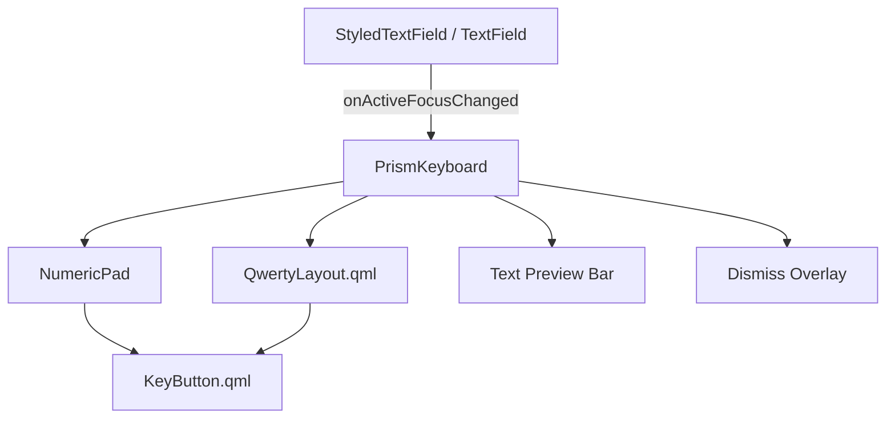
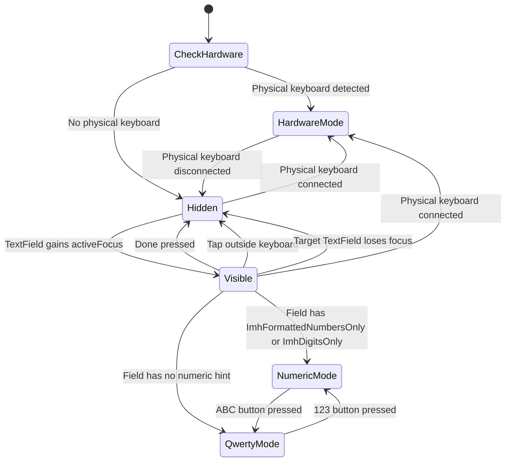

# Prism.Keyboard - Custom On-Screen Keyboard Design Specification

## 1. Overview

This document specifies the design for `Prism.Keyboard`, a reusable custom on-screen keyboard QML module. While initially developed for PowerTune, this component is designed as a standalone, reusable module that can be integrated into any Qt/QML application across Prism projects.

The first integration target is PowerTune, where it replaces the Qt Virtual Keyboard. The keyboard is optimized for automotive touchscreen use on Raspberry Pi devices with 7-10" displays (800x480 or 1024x600).

Approximately 95% of PowerTune input fields are numeric (sensor calibration, RPM limits, voltage ranges, gear ratios, etc.) and only ~5% require text input (WiFi passwords, log filenames, GoPro passwords). The keyboard prioritizes the numeric use case while providing a full QWERTY layout when needed.

---

## 2. Component Hierarchy

```
Prism/Keyboard/
    qmldir                    - QML module definition for Prism.Keyboard
    KeyButton.qml             - Reusable styled key button
    NumericPad.qml            - Compact numeric keypad
    QwertyLayout.qml          - Full QWERTY keyboard with shift/caps
    PrismKeyboard.qml         - Main keyboard component, layout switcher, show/hide

Core/
    HardwareInputDetector.h   - C++ class detecting physical keyboard presence
    HardwareInputDetector.cpp - Implementation using QInputDeviceManager / /dev/input
```

The module is namespaced as `Prism.Keyboard` so it can be reused across projects without PowerTune-specific naming. Import with:

```qml
import Prism.Keyboard 1.0
```



### Component Responsibilities

| Component | Responsibility |
|-----------|---------------|
| [`KeyButton.qml`](Prism/Keyboard/KeyButton.qml) | Single reusable key with press/release visual feedback, configurable label, icon support, long-press detection, and size variants |
| [`NumericPad.qml`](Prism/Keyboard/NumericPad.qml) | 4x4 grid layout for digits 0-9, decimal point, minus sign, backspace, clear, layout switch, and enter |
| [`QwertyLayout.qml`](Prism/Keyboard/QwertyLayout.qml) | Standard QWERTY layout with shift/caps toggle, backspace, space bar, layout switch, and enter |
| [`PrismKeyboard.qml`](Prism/Keyboard/PrismKeyboard.qml) | Root keyboard component: manages target TextField reference, layout switching, show/hide animation, input method hint detection, text preview, and dismiss logic |
| `qmldir` | Module registration for `import Prism.Keyboard 1.0` |
| [`HardwareInputDetector.h`](Core/HardwareInputDetector.h) / [`.cpp`](Core/HardwareInputDetector.cpp) | C++ class that detects physical keyboard/mouse connection via QInputDeviceManager or /dev/input, exposed to QML as a context property |

---

## 3. Layout Specifications

### 3.1 NumericPad Layout

4 columns x 4 rows. Optimized for rapid numeric entry with one hand.

```
+-------+-------+-------+-------------+
|   7   |   8   |   9   |  Backspace  |
+-------+-------+-------+-------------+
|   4   |   5   |   6   |   Clear     |
+-------+-------+-------+-------------+
|   1   |   2   |   3   |   ABC       |
+-------+-------+-------+-------------+
|   -   |   0   |   .   |   Done      |
+-------+-------+-------+-------------+
```

- **Height budget**: Maximum 35% of screen height
  - 800x480 display: max 168px total (42px per row)
  - 1024x600 display: max 210px total (52px per row)
- **Width**: 60% of screen width, centered horizontally
- **Key sizing**: Digit keys are equal width (1fr each). Action keys (rightmost column) are 1.5x width.
- **Minimum key height**: 48dp (meets automotive touch target requirement)

### 3.2 QwertyLayout

Standard QWERTY with 4 rows.

```
Row 1: [ q ][ w ][ e ][ r ][ t ][ y ][ u ][ i ][ o ][ p ]
Row 2:   [ a ][ s ][ d ][ f ][ g ][ h ][ j ][ k ][ l ]
Row 3: [Shift][ z ][ x ][ c ][ v ][ b ][ n ][ m ][Backspace]
Row 4: [ 123 ][         Space Bar         ][ . ][ Done ]
```

- **Height budget**: Maximum 45% of screen height
  - 800x480 display: max 216px total (54px per row)
  - 1024x600 display: max 270px total (67px per row)
- **Width**: 95% of screen width, centered horizontally
- **Row 1**: 10 equal-width keys
- **Row 2**: 9 keys, offset by half-key width for staggered look
- **Row 3**: Shift (1.5x), 8 letter keys (1x each), Backspace (1.5x)
- **Row 4**: 123 switch (1.5x), Space (stretch fill), period (1x), Done (1.5x)
- **Minimum key height**: 48dp

---

## 4. Styling Specifications

All colors are derived from the existing Material Dark theme defined in [`qtquickcontrols2.conf`](qtquickcontrols2.conf).

### 4.1 Color Palette

| Element | Color | Notes |
|---------|-------|-------|
| Keyboard background | `#1a1a2e` | Dark navy, matches app background |
| Key background (default) | `#16213e` | Slightly lighter than keyboard bg |
| Key background (pressed) | `#009688` | Teal accent on press |
| Key background (action keys) | `#0f3460` | Distinct color for Backspace, Clear, Shift, Done |
| Key text color | `#FFFFFF` | White |
| Key text color (pressed) | `#FFFFFF` | White, maintained on press |
| Key border | `#2a2a4a` | Subtle border for key separation |
| Key border (focused) | `#009688` | Teal accent |
| Preview bar background | `#0f0f23` | Darker than keyboard bg |
| Preview bar text | `#009688` | Teal accent for current value |
| Done key background | `#009688` | Teal - primary action |
| Done key text | `#FFFFFF` | White |

### 4.2 Typography

| Element | Font | Size | Weight |
|---------|------|------|--------|
| Digit keys | Lato | 22px | Normal |
| Letter keys | Lato | 18px | Normal |
| Action key labels | Lato | 14px | Bold |
| Preview text | Lato | 16px | Normal |

### 4.3 Key Dimensions

| Property | Value |
|----------|-------|
| Key corner radius | 6px |
| Key spacing (gap) | 4px |
| Key minimum height | 48dp |
| Key press scale | 0.95 (scale down on press) |
| Key press animation | 80ms ease-out |

### 4.4 Animations

| Animation | Duration | Easing |
|-----------|----------|--------|
| Keyboard slide up/down | 250ms | `Easing.OutCubic` |
| Key press feedback | 80ms | `Easing.OutQuad` |
| Key color transition | 100ms | `ColorAnimation` |
| Layout switch crossfade | 150ms | `Easing.InOutQuad` |

---

## 5. Interaction Design

### 5.1 External Keyboard Detection

The keyboard manager must detect whether a physical HMI keyboard (USB or Bluetooth) is connected. When an external keyboard is present, the on-screen keyboard must not appear, and all input is handled natively by Qt through the hardware keyboard and mouse/touch.

**Detection mechanism:**

- On startup and on device hotplug events, query connected input devices
- On Linux/Raspberry Pi, monitor `/dev/input/` for keyboard-class devices via `QInputDeviceManager` or by reading `/proc/bus/input/devices`
- Expose a `hardwareKeyboardConnected: bool` property on `PrismKeyboard`
- When `hardwareKeyboardConnected` is `true`, the `show()` function becomes a no-op
- When the hardware keyboard is disconnected at runtime, the on-screen keyboard resumes normal behavior

**C++ helper (optional but recommended):**

A small C++ class `HardwareInputDetector` exposed to QML via context property:

```cpp
class HardwareInputDetector : public QObject {
    Q_OBJECT
    Q_PROPERTY(bool keyboardConnected READ keyboardConnected NOTIFY keyboardConnectedChanged)
public:
    bool keyboardConnected() const;
signals:
    void keyboardConnectedChanged();
};
```

This class uses `QInputDeviceManager` (Qt6) or polls `/dev/input/` on Linux to detect keyboard presence. It emits `keyboardConnectedChanged` on hotplug events.

**QML integration in `PrismKeyboard.qml`:**

```qml
property bool hardwareKeyboardConnected: HardwareInputDetector.keyboardConnected

function show(textField) {
    if (hardwareKeyboardConnected) return  // Let hardware keyboard handle input
    target = textField
    visible = true
}
```

**Behavior with external keyboard connected:**

| Scenario | Behavior |
|----------|----------|
| Hardware keyboard connected at boot | On-screen keyboard never shows |
| Hardware keyboard connected while app running | On-screen keyboard dismissed if visible, stops showing |
| Hardware keyboard disconnected while app running | On-screen keyboard resumes showing on TextField focus |
| Mouse click on TextField with hardware keyboard | TextField gets focus, hardware keyboard types directly, no on-screen keyboard |
| Touch on TextField with hardware keyboard | Same as mouse click - no on-screen keyboard |

### 5.2 Show/Hide Behavior



### 5.2 Key Interactions

| Action | Behavior |
|--------|----------|
| Tap digit/letter | Append character to target TextField text |
| Tap Backspace | Remove last character from target TextField text |
| Long-press Backspace (500ms) | Clear entire text field |
| Tap Clear | Clear entire text field |
| Tap Done/Enter | Dismiss keyboard, trigger `editingFinished` on target |
| Tap Shift | Toggle uppercase for next character (single shot) |
| Double-tap Shift | Enable caps lock (persistent uppercase) |
| Tap ABC | Switch from NumericPad to QwertyLayout |
| Tap 123 | Switch from QwertyLayout to NumericPad |
| Tap minus (-) | Insert minus sign (only at position 0 for numeric fields) |
| Tap decimal (.) | Insert decimal point (only one allowed for numeric fields) |
| Tap outside keyboard area | Dismiss keyboard |

### 5.3 Text Preview Bar

A thin bar (28px height) sits above the keyboard showing the current text value of the target field. This provides visual feedback without requiring the user to look away from the keyboard area.

```
+--------------------------------------------------+
|  Current value: 14.7                             |
+--------------------------------------------------+
|   7   |   8   |   9   |  Backspace               |
|   ... keyboard rows ...                           |
```

### 5.4 Input Validation

The keyboard respects the `validator` property on the target TextField. Characters that would make the text invalid are visually disabled (dimmed) or rejected. Specifically:

- If the field has `Qt.ImhFormattedNumbersOnly`, only digits, decimal, and minus are available
- If the field has `Qt.ImhDigitsOnly`, only digits are available (no decimal or minus)
- The decimal key is disabled if the text already contains a decimal point
- The minus key is disabled if the cursor is not at position 0 or text already starts with minus

---

## 6. Integration Plan

### 6.1 Target Property Approach

The keyboard uses a direct `target` property approach rather than Qt's input method system. This is simpler and avoids the complexity of implementing a custom `QInputMethod`.

```
PrismKeyboard {
    id: prismKeyboard
    property Item target: null    // The currently focused TextField

    function show(textField) {
        target = textField
        visible = true
    }

    function hide() {
        if (target) target.focus = false
        target = null
        visible = false
    }

    function insertText(text) {
        if (!target) return
        var pos = target.cursorPosition
        target.text = target.text.substring(0, pos) + text + target.text.substring(pos)
        target.cursorPosition = pos + text.length
    }

    function backspace() {
        if (!target || target.cursorPosition === 0) return
        var pos = target.cursorPosition
        target.text = target.text.substring(0, pos - 1) + target.text.substring(pos)
        target.cursorPosition = pos - 1
    }
}
```

### 6.2 Wiring Into Existing TextFields

Two approaches, applied in parallel:

**Approach A - Modify [`StyledTextField`](PowerTune/Settings/components/StyledTextField.qml)**

Add an `onActiveFocusChanged` handler to `StyledTextField` that calls the keyboard:

```qml
TextField {
    id: root
    // ... existing properties ...

    onActiveFocusChanged: {
        if (activeFocus) {
            prismKeyboard.show(root)
        }
    }
}
```

This covers all Settings pages that use `StyledTextField` (~100+ instances).

**Approach B - Handle raw TextFields in Gauges**

For the ~60 raw `TextField` instances in Gauges (RoundGauge, SquareGauge, etc.), add the same `onActiveFocusChanged` pattern. Alternatively, create a `Connections` block in [`Main.qml`](PowerTune/Core/Main.qml) that listens for focus changes globally.

**Approach C - Global Focus Listener (recommended)**

Add a global focus change handler in `PrismKeyboard.qml` that watches `window.activeFocusItem`:

```qml
Connections {
    target: window
    function onActiveFocusItemChanged() {
        if (window.activeFocusItem instanceof TextField) {
            prismKeyboard.show(window.activeFocusItem)
        } else {
            prismKeyboard.hide()
        }
    }
}
```

This approach requires zero changes to existing TextFields. The keyboard automatically appears when any TextField in the application receives focus and disappears when focus moves to a non-TextField item.

**Recommended**: Use Approach C as the primary mechanism. It is the least invasive and handles all TextField instances (both `StyledTextField` and raw `TextField`) without modification.

### 6.3 Placement in Main.qml

The `PrismKeyboard` component is placed as a direct child of the root `ApplicationWindow`, anchored to the bottom, with a high `z` value to overlay all content:

```qml
ApplicationWindow {
    id: window
    // ... existing content ...

    PrismKeyboard {
        id: prismKeyboard
        anchors.left: parent.left
        anchors.right: parent.right
        anchors.bottom: parent.bottom
        z: 9999
    }
}
```

### 6.4 Preventing Qt Virtual Keyboard Activation

Since the keyboard bypasses Qt's input method system, TextFields must not trigger the Qt VK. This is achieved by:

1. Removing `qputenv("QT_IM_MODULE", QByteArray("qtvirtualkeyboard"))` from [`main.cpp`](main.cpp:20)
2. Removing `import QtQuick.VirtualKeyboard 2.1` from [`Main.qml`](PowerTune/Core/Main.qml:4)
3. Removing the `InputPanel` and `keyboardcontainer` Rectangle from [`Main.qml`](PowerTune/Core/Main.qml:53-93)

---

## 7. Migration Plan

### Step 1: Create HardwareInputDetector

1. Create `Core/HardwareInputDetector.h` and `Core/HardwareInputDetector.cpp`
2. Implement keyboard detection using `QInputDeviceManager` (Qt6) or `/dev/input/` polling (Linux)
3. Expose `keyboardConnected` Q_PROPERTY with `NOTIFY` signal
4. Register as context property in [`main.cpp`](main.cpp): `engine.rootContext()->setContextProperty("HardwareInputDetector", new HardwareInputDetector(&engine))`
5. Add source files to [`CMakeLists.txt`](CMakeLists.txt) target sources

### Step 2: Create the Keyboard Module

1. Create directory `Prism/Keyboard/`
2. Create `qmldir` with module definition
3. Implement `KeyButton.qml`
4. Implement `NumericPad.qml`
5. Implement `QwertyLayout.qml`
6. Implement `PrismKeyboard.qml` (including `hardwareKeyboardConnected` binding to `HardwareInputDetector.keyboardConnected`)

### Step 3: Register the Module

1. Add the `Prism/Keyboard/` directory to [`CMakeLists.txt`](CMakeLists.txt) as a QML module (`qt_add_qml_module` or add to existing resource set)
2. Add import path if needed in [`main.cpp`](main.cpp)

### Step 4: Remove Qt Virtual Keyboard

1. In [`main.cpp`](main.cpp:20): Remove `qputenv("QT_IM_MODULE", QByteArray("qtvirtualkeyboard"))` 
2. In [`CMakeLists.txt`](CMakeLists.txt): Remove `VirtualKeyboard` from `find_package` if present
3. In [`PowertuneQMLGui.pro`](PowertuneQMLGui.pro): Remove any `virtualkeyboard` references
4. In [`Main.qml`](PowerTune/Core/Main.qml:4): Remove `import QtQuick.VirtualKeyboard 2.1`
5. In [`Main.qml`](PowerTune/Core/Main.qml:53-93): Remove the `keyboardcontainer` Rectangle and `InputPanel`

### Step 5: Integrate the Custom Keyboard

1. In [`Main.qml`](PowerTune/Core/Main.qml): Add `import Prism.Keyboard 1.0`
2. In [`Main.qml`](PowerTune/Core/Main.qml): Add `PrismKeyboard` component as child of `ApplicationWindow`
3. Wire up the global focus listener (Approach C)

### Step 6: Test and Validate

1. Verify numeric input on Settings pages (RPM, speed, warn values, analog inputs)
2. Verify text input on WiFi password, log filename, GoPro password fields
3. Verify keyboard auto-selects numeric vs QWERTY based on `inputMethodHints`
4. Verify keyboard dismisses on Done, tap-outside, and focus loss
5. Verify long-press backspace clears field
6. Test on target resolution (800x480 and 1024x600)
7. Verify no Qt VK artifacts remain
8. Verify on-screen keyboard does NOT appear when a USB keyboard is connected
9. Verify on-screen keyboard resumes when USB keyboard is disconnected at runtime
10. Verify hardware keyboard input works correctly with all TextField types when connected

---

## 8. File-by-File Implementation Notes

### 8.1 `qmldir`

```
module Prism.Keyboard
KeyButton 1.0 KeyButton.qml
NumericPad 1.0 NumericPad.qml
QwertyLayout 1.0 QwertyLayout.qml
PrismKeyboard 1.0 PrismKeyboard.qml
```

### 8.2 `KeyButton.qml`

- Extends `AbstractButton` or `Item` with `MouseArea`
- Properties:
  - `keyText: string` - display label
  - `keyValue: string` - value to emit (defaults to keyText)
  - `isAction: bool` - whether this is an action key (different styling)
  - `isHighlighted: bool` - for Done key teal highlight
  - `keyWidth: real` - width multiplier (default 1.0)
  - `enabled: bool` - dims the key when false
- Signals:
  - `keyPressed(string value)` - emitted on tap
  - `keyLongPressed(string value)` - emitted on long press (500ms)
- Visual:
  - Rectangle background with rounded corners
  - Scale animation on press (0.95)
  - Color transitions between default/pressed/action states
  - Text centered, using Lato font

### 8.3 `NumericPad.qml`

- Uses `Grid` or `GridLayout` with 4 columns
- Signals:
  - `keyPressed(string key)` - forwarded from KeyButton
  - `backspacePressed()`
  - `backspaceLongPressed()`
  - `clearPressed()`
  - `switchLayoutRequested()` - ABC button
  - `donePressed()`
- Each key is a `KeyButton` instance
- Minus key: `keyText: "-"`, disabled when not appropriate
- Decimal key: `keyText: "."`, disabled when text already contains `.`
- Properties:
  - `decimalEnabled: bool` - controlled by parent based on field content
  - `minusEnabled: bool` - controlled by parent based on cursor position

### 8.4 `QwertyLayout.qml`

- Uses `Column` of `Row` elements for staggered layout
- Properties:
  - `shiftActive: bool` - toggles uppercase display
  - `capsLock: bool` - persistent uppercase
- Signals:
  - `keyPressed(string key)` - letter/symbol pressed
  - `backspacePressed()`
  - `backspaceLongPressed()`
  - `switchLayoutRequested()` - 123 button
  - `donePressed()`
  - `spacePressed()`
- Shift behavior:
  - Single tap: `shiftActive = true`, resets after next key press
  - Double tap (within 300ms): `capsLock = !capsLock`
  - Visual indicator: Shift key background changes when active, border when caps locked

### 8.5 `PrismKeyboard.qml`

- Root `Item` anchored to bottom of parent
- Properties:
  - `target: Item` - reference to the active TextField
  - `currentLayout: string` - "numeric" or "qwerty"
  - `keyboardVisible: bool` - controls slide animation
- Contains:
  - Semi-transparent overlay `MouseArea` behind keyboard (tap to dismiss)
  - Preview bar `Rectangle` with `Text` showing `target.text`
  - `Loader` or `StackLayout` switching between `NumericPad` and `QwertyLayout`
- Logic:
  - `show(textField)`: Sets target, reads `inputMethodHints`, selects layout, animates in
  - `hide()`: Triggers `editingFinished` on target, clears target, animates out
  - `insertText(char)`: Inserts at cursor position in target
  - `backspace()`: Removes character before cursor in target
  - `clearAll()`: Sets `target.text = ""`
- Animation:
  - `y` property animated from `parent.height` (hidden) to `parent.height - keyboardHeight` (visible)
  - Uses `Behavior on y` or explicit `NumberAnimation`
- Input hint detection:
  ```
  function detectLayout(field) {
      var hints = field.inputMethodHints
      if (hints & Qt.ImhFormattedNumbersOnly ||
          hints & Qt.ImhDigitsOnly) {
          return "numeric"
      }
      return "qwerty"
  }
  ```
- Global focus watcher:
  ```
  Connections {
      target: window
      function onActiveFocusItemChanged() {
          var item = window.activeFocusItem
          if (item && item instanceof TextField) {
              prismKeyboard.show(item)
          }
      }
  }
  ```

---

## 9. Screen Layout Diagrams

### 9.1 Numeric Keyboard on 800x480

```
+--------------------------------------------------+ 0px
|                                                  |
|              Application Content                 |
|                                                  |
+--------------------------------------------------+ 312px
| Current value: 14.7                              | 28px preview
+-------+-------+-------+-------------+            |
|   7   |   8   |   9   |     <x      |  48px      |
+-------+-------+-------+-------------+            |
|   4   |   5   |   6   |    Clear    |  48px      |
+-------+-------+-------+-------------+            |
|   1   |   2   |   3   |    ABC      |  48px      |
+-------+-------+-------+-------------+            |
|   -   |   0   |   .   |    Done     |  48px      |
+-------+-------+-------+-------------+            |
                                          Total: 220px = 46% of 480
```

Note: 46% exceeds the 35% target for 800x480. On this smaller display, reduce key height to 42px (total = 196px = 41%) or reduce preview bar to 20px. The 35% target is achievable on 1024x600 (35% = 210px, 4 rows x 48px + 18px preview = 210px).

### 9.2 QWERTY Keyboard on 1024x600

```
+--------------------------------------------------+ 0px
|              Application Content                 |
|                                                  |
+--------------------------------------------------+ 330px
| Current value: MyLogFile                         | 28px preview
+--+--+--+--+--+--+--+--+--+--+                   |
| q| w| e| r| t| y| u| i| o| p|  52px             |
+--+--+--+--+--+--+--+--+--+--+                   |
|  a| s| d| f| g| h| j| k| l|    52px             |
+----+--+--+--+--+--+--+--+----+                  |
|Shft| z| x| c| v| b| n| m| <x |  52px            |
+----+--+--+--+--+--+--+--+----+                  |
|123 |       Space        | . |Done|  52px         |
+----+--------------------+---+----+               |
                                     Total: 236px = 39% of 600
```

---

## 10. Accessibility and Automotive Considerations

- **Minimum touch target**: 48dp x 48dp for all interactive elements (per Android automotive guidelines)
- **High contrast**: White text on dark backgrounds with teal accent provides strong readability
- **No small text**: Minimum 14px font size on any keyboard element
- **Vibration tolerance**: Large touch targets reduce mis-taps in vibrating vehicle environments
- **Glove-friendly**: Key spacing of 4px prevents accidental adjacent key activation
- **Night mode compatible**: Dark theme does not produce glare in dark cabin environments
- **No haptic feedback**: Raspberry Pi does not have haptic hardware; rely on visual press feedback only

---

## 11. Future Considerations

- **Custom input types**: Hex input mode for CAN address fields (0x prefix, A-F keys)
- **IP address mode**: Numeric pad with period, constrained to valid IP octets
- **Clipboard support**: Long-press on preview bar to paste from system clipboard
- **Sound feedback**: Optional key click sound via `SoundEffect` QML type
- **Swipe-to-type**: Not planned; automotive use favors deliberate tap input
