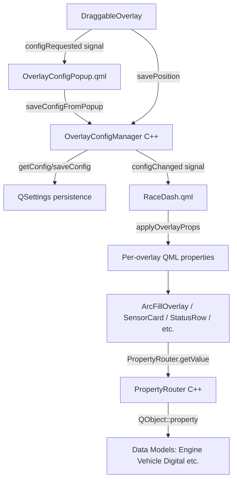
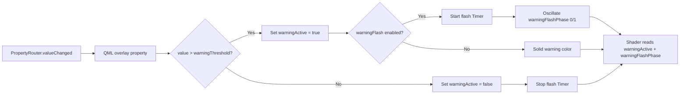
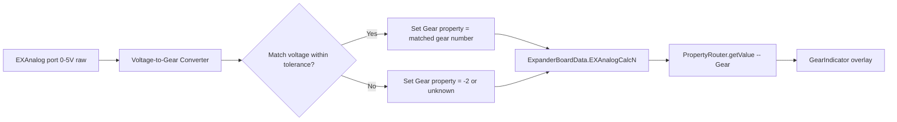
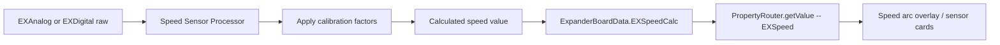

# Overlay Configuration System -- Complete Design Specification

**Date:** 2026-03-10
**Branch:** `dev`
**Target:** 1600x720 ultrawide touchscreen, Qt 6 QML
**Figma:** https://www.figma.com/design/p6aIQVCeE37nwKpDEoImHG/Racedash_AiM?node-id=9-755

---

## Table of Contents

1. [System Overview](#1-system-overview)
2. [Per-Overlay Property Tables](#2-per-overlay-property-tables)
3. [Persistence Model](#3-persistence-model)
4. [Config Popup UI Design](#4-config-popup-ui-design)
5. [Arc Gauge Shader Specification](#5-arc-gauge-shader-specification)
6. [PropertyRouter Reactive Binding Solution](#6-propertyrouter-reactive-binding-solution)
7. [Warning and Trigger System](#7-warning-and-trigger-system)
8. [Implementation Order](#8-implementation-order)
9. [Expander Board Sensor Configuration Extensions](#9-expander-board-sensor-configuration-extensions)

---

## 1. System Overview

### 1.1 Architecture

The RaceDash overlay system consists of dynamic QML elements positioned over a
static background image (`Racedash_AiM.png`) that provides all decorative chrome
(gauge rings, labels, divider lines). Each overlay is wrapped in a
[`DraggableOverlay`](../PowerTune/Dashboard/DraggableOverlay.qml) for
edit-mode repositioning and configuration access.



### 1.2 Current Overlay Types

| Type                | `configType` Value         | Current File                                                        | Status                       |
| ------------------- | -------------------------- | ------------------------------------------------------------------- | ---------------------------- |
| Arc Gauge           | `tachGroup` / `speedGroup` | [`ArcFillOverlay.qml`](../PowerTune/Dashboard/ArcFillOverlay.qml)   | Active -- Canvas-based       |
| Arc Gauge -- shader | N/A                        | [`ArcGauge.qml`](../PowerTune/Dashboard/ArcGauge.qml)               | Unused -- ShaderEffect-based |
| Gear Indicator      | part of `tachGroup`        | [`GearIndicator.qml`](../PowerTune/Dashboard/GearIndicator.qml)     | Active                       |
| Sensor Card         | `sensorCard`               | inline in [`RaceDash.qml`](../PowerTune/Dashboard/RaceDash.qml:148) | Active -- inline             |
| Status Row          | `statusRow`                | inline in [`RaceDash.qml`](../PowerTune/Dashboard/RaceDash.qml:263) | Active -- inline             |
| Brake Bias          | none                       | [`BrakeBiasBar.qml`](../PowerTune/Dashboard/BrakeBiasBar.qml)       | Unused -- needle only        |
| Bottom Bar          | `staticText`               | [`BottomStatusBar.qml`](../PowerTune/Dashboard/BottomStatusBar.qml) | Active                       |
| Shift Lights        | part of `tachGroup`        | [`ShiftIndicator.qml`](../PowerTune/Dashboard/ShiftIndicator.qml)   | Active                       |

### 1.3 Design Principles

- **No default data bindings.** Users select a PropertyRouter parameter for each
  widget. The system provides initial values only so the UI is not blank on first
  load, but these are explicitly configurable and not assumed correct.
- **`SettingsTheme` is correct for config popup UI.** The
  [`OverlayConfigPopup.qml`](../PowerTune/Dashboard/OverlayConfigPopup.qml) is
  settings-tier UI and correctly uses `SettingsTheme` and `StyledButton` /
  `StyledComboBox` / `StyledTextField` components from `PowerTune.UI`.
- **Per-dashboard colors.** Normal gauge rendering uses per-dashboard colors
  stored in overlay config, not a global gauge theme. Colors are persisted per
  overlay instance.
- **Background image owns decorative chrome.** The background PNG provides chrome
  rings, labels, divider lines. Dynamic overlays only draw fills, values, and
  interactive elements.

### 1.4 Global Unit Configuration

[`SettingsData`](../Core/Models/SettingsData.h:28) provides three global unit
properties accessible via `PropertyRouter`:

| Property        | PropertyRouter Key | Values                       | Description              |
| --------------- | ------------------ | ---------------------------- | ------------------------ |
| `units`         | `"units"`          | `"Celsius"` / `"Fahrenheit"` | Temperature display unit |
| `speedunits`    | `"speedunits"`     | `"MPH"` / `"KPH"`            | Speed display unit       |
| `pressureunits` | `"pressureunits"`  | `"PSI"` / `"Bar"`            | Pressure display unit    |

These are set globally in the main settings page and apply across all dashboards.
Overlays should use these global units as their initial/default unit labels rather
than hardcoding unit strings. The per-overlay `unit` property in the config popup
should default to the global unit setting but can be overridden per-widget.

**Access pattern in QML:**

```qml
// Read global speed unit
var globalSpeedUnit = PropertyRouter.getValue("speedunits");
// Use as default when no per-overlay unit is configured
```

[`SettingsData`](../Core/Models/SettingsData.h) also provides related
configuration that overlays may reference:

| Property        | Key                | Type    | Description                       |
| --------------- | ------------------ | ------- | --------------------------------- |
| `maxRPM`        | `"maxRPM"`         | `int`   | Global max RPM setting            |
| `rpmStage1-4`   | `"rpmStage1"` etc. | `int`   | RPM shift light stages            |
| `waterwarn`     | `"waterwarn"`      | `int`   | Water temp warning threshold      |
| `rpmwarn`       | `"rpmwarn"`        | `int`   | RPM warning threshold             |
| `knockwarn`     | `"knockwarn"`      | `int`   | Knock warning threshold           |
| `boostwarn`     | `"boostwarn"`      | `qreal` | Boost warning threshold           |
| `pulsespermile` | `"pulsespermile"`  | `qreal` | Speed sensor pulses per mile      |
| `gearcalc1-6`   | `"gearcalc1"` etc. | `int`   | Gear calculation RPM/speed ratios |

The overlay config system should use `maxRPM` as the default for tach `maxValue`
(already done in [`OverlayConfigManager`](../Utils/OverlayConfigManager.cpp:135))
and should use the global warning thresholds (`waterwarn`, `rpmwarn`, etc.) as
sensible defaults for per-overlay warning thresholds when the user first enables
warnings.

---

## 2. Per-Overlay Property Tables

### 2.1 Arc Gauge

Used for RPM (tach), speed, or any parameter mapped to a swept arc fill.

| Property           | Type     | Persistence Key    | Initial Value             | Description                                                   |
| ------------------ | -------- | ------------------ | ------------------------- | ------------------------------------------------------------- |
| `sensorKey`        | `string` | `sensorKey`        | `"rpm"` / `"speed"`       | PropertyRouter parameter name                                 |
| `minValue`         | `real`   | `minValue`         | `0`                       | Minimum value for arc sweep mapping                           |
| `maxValue`         | `real`   | `maxValue`         | `10000` / `200`           | Maximum value for arc sweep mapping                           |
| `unit`             | `string` | `unit`             | `"RPM"` / `"MPH"`         | Display unit label                                            |
| `decimals`         | `int`    | `decimals`         | `0`                       | Decimal places for text display                               |
| `startAngle`       | `real`   | `startAngle`       | `135`                     | Arc start angle in degrees (from 3-o'clock, CW)               |
| `sweepAngle`       | `real`   | `sweepAngle`       | `270`                     | Total arc sweep in degrees                                    |
| `arcWidth`         | `real`   | `arcWidth`         | `0.209`                   | Arc thickness as fraction of container (outer - inner radius) |
| `arcColorStart`    | `color`  | `arcColorStart`    | `"#E88A1A"` / `"#AA1111"` | Gradient start color (at 0% sweep)                            |
| `arcColorEnd`      | `color`  | `arcColorEnd`      | `"#C45A00"` / `"#880000"` | Gradient end color (at 100% sweep)                            |
| `arcColorMid`      | `color`  | `arcColorMid`      | `""` (empty = disabled)   | Optional mid gradient stop color                              |
| `arcColorMidPos`   | `real`   | `arcColorMidPos`   | `0.5`                     | Position of mid color stop (0.0-1.0)                          |
| `arcBgColor`       | `color`  | `arcBgColor`       | `"#151518"`               | Background arc color (unfilled region)                        |
| `warningEnabled`   | `bool`   | `warningEnabled`   | `false`                   | Enable warning threshold system                               |
| `warningThreshold` | `real`   | `warningThreshold` | `8000`                    | Value at which warning activates                              |
| `warningColor`     | `color`  | `warningColor`     | `"#FF0000"`               | Color when warning is active                                  |
| `warningFlash`     | `bool`   | `warningFlash`     | `true`                    | Flash the entire arc when warning active                      |
| `warningFlashRate` | `int`    | `warningFlashRate` | `200`                     | Flash interval in ms (on/off cycle)                           |

**Gradient system:** The arc supports a minimum 2-color gradient (start + end)
with an optional mid-point for 3-stop gradients. For N-stop gradients, extend to
a `gradientStops` JSON array format in a future iteration. The initial
implementation uses 2-3 stops which covers the vast majority of use cases.

**Arc geometry note:** `startAngle` and `sweepAngle` replace the current combined
`startAngleDeg` / `sweepAngleDeg` naming. `arcWidth` replaces the pair
`arcOuterRadius` / `arcInnerRadius` by computing inner = outer - arcWidth. The
outer radius remains fixed by the container size and a `gapFromEdge` constant.

### 2.2 Gear Indicator

The gear indicator is independently bindable -- the user selects its
PropertyRouter parameter separately from the tach arc's parameter via a full
Category + Sensor ComboBox in the config popup.

| Property    | Type     | Persistence Key | Initial Value | Description                                                  |
| ----------- | -------- | --------------- | ------------- | ------------------------------------------------------------ |
| `sensorKey` | `string` | `gearKey`       | `"Gear"`      | PropertyRouter parameter for gear value (full sensor picker) |
| `textColor` | `color`  | `gearTextColor` | `"#FFFFFF"`   | Gear number text color                                       |
| `fontSize`  | `int`    | `gearFontSize`  | `140`         | Font pixel size for gear number                              |

**Note:** Although the gear indicator is visually part of the `tachGroup`
compound widget in the layout, its data binding is completely independent. The
user selects the gear parameter via a full Category + Sensor ComboBox (identical
to the primary sensor picker), not a plain text field. The key is stored as
`gearKey` within the tachGroup config namespace to differentiate it from the tach
arc's `sensorKey`.

### 2.3 Shift Indicator

Part of `tachGroup` compound widget.

| Property       | Type     | Persistence Key | Initial Value  | Description                                                                       |
| -------------- | -------- | --------------- | -------------- | --------------------------------------------------------------------------------- |
| `shiftPoint`   | `real`   | `shiftPoint`    | `0.75`         | Activation threshold as fraction of maxValue (0.0-1.0)                            |
| `shiftCount`   | `int`    | `shiftCount`    | `11`           | Number of shift light pills                                                       |
| `shiftPattern` | `string` | `shiftPattern`  | `"center-out"` | Activation pattern: `center-out`, `left-to-right`, `right-to-left`, `alternating` |

**Note:** Shift lights derive their RPM value from the parent tachGroup's
`sensorKey` and `maxValue`. The shift point is relative: `shiftPoint * maxValue`
gives the RPM at which the first light activates.

### 2.4 Sensor Card

Text display showing a live parameter value with label and unit.

| Property           | Type     | Persistence Key    | Initial Value                     | Description                                           |
| ------------------ | -------- | ------------------ | --------------------------------- | ----------------------------------------------------- |
| `sensorKey`        | `string` | `sensorKey`        | `"Watertemp"` / `"oilpres"`       | PropertyRouter parameter                              |
| `label`            | `string` | `label`            | `"Water Temp"` / `"Oil Pressure"` | Display label text                                    |
| `unit`             | `string` | `unit`             | `"F deg"` / `"PSI"`               | Unit label                                            |
| `decimals`         | `int`    | `decimals`         | `2`                               | Decimal places for value display                      |
| `warningEnabled`   | `bool`   | `warningEnabled`   | `false`                           | Enable warning threshold                              |
| `warningThreshold` | `real`   | `warningThreshold` | `0`                               | Value at which warning activates                      |
| `warningDirection` | `string` | `warningDirection` | `"above"`                         | `"above"` or `"below"` -- which side triggers warning |
| `warningColor`     | `color`  | `warningColor`     | `"#FF0000"`                       | Text color when warning active                        |
| `normalColor`      | `color`  | `normalColor`      | `"#FFFFFF"`                       | Text color in normal state                            |

### 2.5 Status Row (LED Indicator)

ON/OFF indicator driven by a threshold comparison.

| Property      | Type     | Persistence Key | Initial Value     | Description                        |
| ------------- | -------- | --------------- | ----------------- | ---------------------------------- |
| `sensorKey`   | `string` | `sensorKey`     | `"DigitalInput1"` | PropertyRouter parameter           |
| `label`       | `string` | `label`         | `"Digital 1:"`    | Label text                         |
| `threshold`   | `real`   | `threshold`     | `0.5`             | Trip point: value > threshold = ON |
| `onColor`     | `color`  | `onColor`       | `"#1ED033"`       | Color when ON                      |
| `offColor`    | `color`  | `offColor`      | `"#FF0909"`       | Color when OFF                     |
| `invertLogic` | `bool`   | `invertLogic`   | `false`           | If true, value < threshold = ON    |

### 2.6 Brake Bias Bar

Horizontal slider indicating front/rear brake bias percentage.

| Property     | Type     | Persistence Key | Initial Value | Description                                |
| ------------ | -------- | --------------- | ------------- | ------------------------------------------ |
| `sensorKey`  | `string` | `sensorKey`     | `""`          | PropertyRouter parameter for bias value    |
| `minValue`   | `real`   | `minValue`      | `0`           | Minimum slider extent (maps to left edge)  |
| `maxValue`   | `real`   | `maxValue`      | `100`         | Maximum slider extent (maps to right edge) |
| `leftLabel`  | `string` | `leftLabel`     | `"RWD"`       | Left endpoint label                        |
| `rightLabel` | `string` | `rightLabel`    | `"FWD"`       | Right endpoint label                       |

**Note:** The brake bias bar is currently not instantiated in RaceDash.qml. The
background image contains the gradient bar and labels. Only the needle overlay
needs to be data-bound and positioned. The needle's x-position is computed as:
`(value - minValue) / (maxValue - minValue) * barWidth`.

### 2.7 Bottom Status Bar

| Property | Type     | Persistence Key | Initial Value       | Description             |
| -------- | -------- | --------------- | ------------------- | ----------------------- |
| `text`   | `string` | `text`          | `"Cardinal Racing"` | Team name / center text |

### 2.8 Needle Gauge (Future)

For dashboards with a physical needle rotating over a printed scale.

| Property           | Type     | Persistence Key    | Initial Value | Description                     |
| ------------------ | -------- | ------------------ | ------------- | ------------------------------- |
| `sensorKey`        | `string` | `sensorKey`        | `""`          | PropertyRouter parameter        |
| `minValue`         | `real`   | `minValue`         | `0`           | Value at start angle            |
| `maxValue`         | `real`   | `maxValue`         | `10000`       | Value at end angle              |
| `startAngle`       | `real`   | `startAngle`       | `135`         | Needle rotation start (degrees) |
| `endAngle`         | `real`   | `endAngle`         | `405`         | Needle rotation end (degrees)   |
| `warningEnabled`   | `bool`   | `warningEnabled`   | `false`       | Enable redline warning          |
| `warningThreshold` | `real`   | `warningThreshold` | `8000`        | Redline value                   |
| `warningColor`     | `color`  | `warningColor`     | `"#FF0000"`   | Needle color in warning zone    |
| `needleColor`      | `color`  | `needleColor`      | `"#FFFFFF"`   | Normal needle color             |

---

## 3. Persistence Model

### 3.1 Current Architecture

[`OverlayConfigManager`](../Utils/OverlayConfigManager.h) uses `QSettings` with
org/app `"PowerTune"/"PowerTune"`. Configuration is stored under two top-level
groups:

- **`overlay/<overlayId>/<key>`** -- Widget configuration (sensor key, colors,
  thresholds, etc.)
- **`overlayPos/<overlayId>/x|y`** -- Position persistence for drag-and-drop

### 3.2 Per-Dashboard Prefix

To support multiple dashboard layouts, the persistence key structure must be
extended with a dashboard prefix:

```
overlay/<dashboardId>/<overlayId>/<key>
overlayPos/<dashboardId>/<overlayId>/x|y
```

Where `<dashboardId>` is an identifier like `"racedash"`, `"userdash1"`, etc.
This is passed to `OverlayConfigManager` at construction or via a `setDashboard()`
method.

**Migration path:** If `<dashboardId>` is not set, fall back to the current
unprefixed keys for backward compatibility with existing persisted settings.

### 3.3 Settings Key Map

Complete mapping of all persistence keys per overlay type:

| Overlay ID    | Config Type  | Keys Stored                                                                                                                                                                                                                                                                                                                                                      |
| ------------- | ------------ | ---------------------------------------------------------------------------------------------------------------------------------------------------------------------------------------------------------------------------------------------------------------------------------------------------------------------------------------------------------------- |
| `tachGroup`   | `tachGroup`  | `sensorKey`, `minValue`, `maxValue`, `unit`, `decimals`, `startAngle`, `sweepAngle`, `arcWidth`, `arcColorStart`, `arcColorEnd`, `arcColorMid`, `arcColorMidPos`, `arcBgColor`, `warningEnabled`, `warningThreshold`, `warningColor`, `warningFlash`, `warningFlashRate`, `gearKey`, `gearTextColor`, `gearFontSize`, `shiftPoint`, `shiftCount`, `shiftPattern` |
| `speedGroup`  | `speedGroup` | `sensorKey`, `minValue`, `maxValue`, `unit`, `decimals`, `startAngle`, `sweepAngle`, `arcWidth`, `arcColorStart`, `arcColorEnd`, `arcColorMid`, `arcColorMidPos`, `arcBgColor`, `warningEnabled`, `warningThreshold`, `warningColor`, `warningFlash`, `warningFlashRate`                                                                                         |
| `waterTemp`   | `sensorCard` | `sensorKey`, `label`, `unit`, `decimals`, `warningEnabled`, `warningThreshold`, `warningDirection`, `warningColor`, `normalColor`                                                                                                                                                                                                                                |
| `oilPressure` | `sensorCard` | (same as above)                                                                                                                                                                                                                                                                                                                                                  |
| `statusRow0`  | `statusRow`  | `sensorKey`, `label`, `threshold`, `onColor`, `offColor`, `invertLogic`                                                                                                                                                                                                                                                                                          |
| `statusRow1`  | `statusRow`  | (same as above)                                                                                                                                                                                                                                                                                                                                                  |
| `biasNeedle`  | `brakeBias`  | `sensorKey`, `minValue`, `maxValue`, `leftLabel`, `rightLabel`                                                                                                                                                                                                                                                                                                   |
| `bottomBar`   | `staticText` | `text`                                                                                                                                                                                                                                                                                                                                                           |

### 3.4 OverlayConfigManager Changes Required

The [`OverlayConfigManager`](../Utils/OverlayConfigManager.cpp) needs these
extensions:

1. **Add `brakeBias` config type** to
   [`saveConfigFromPopup()`](../Utils/OverlayConfigManager.cpp:158) and
   [`getConfigForPopup()`](../Utils/OverlayConfigManager.cpp:115)
2. **Add warning properties** to all config type handlers
3. **Add arc geometry properties** (`startAngle`, `sweepAngle`, `arcWidth`) to
   gauge group handlers
4. **Add status row color properties** (`onColor`, `offColor`, `invertLogic`)
5. **Extend `getOverlayProperties()`** for each overlay ID with the new property
   defaults
6. **Add dashboard prefix support** via a `dashboardId` member and updated
   `prefix()` method

---

## 4. Config Popup UI Design

### 4.1 Section Organization by Config Type

The [`OverlayConfigPopup.qml`](../PowerTune/Dashboard/OverlayConfigPopup.qml)
displays different sections based on the `configType`. Below is the complete
section map:

#### Sections for `tachGroup`

| Section         | Controls                                                                                   | Visibility  |
| --------------- | ------------------------------------------------------------------------------------------ | ----------- |
| Data Binding    | Category ComboBox + Sensor ComboBox                                                        | Always      |
| Value Range     | Min text field + Max text field                                                            | Always      |
| Unit + Decimals | Unit text field + Decimals spinbox                                                         | Always      |
| Arc Geometry    | Start Angle, Sweep Angle, Arc Width -- all numeric text fields                             | Always      |
| Arc Colors      | Color Start picker + Color End picker                                                      | Always      |
| Arc Mid Color   | Enable toggle + Color picker + Position slider                                             | Collapsible |
| Arc Background  | Background color picker                                                                    | Always      |
| Warning         | Enable toggle + Threshold text field + Color picker + Flash toggle + Flash rate spinbox    | Collapsible |
| Gear Binding    | Gear Category ComboBox + Gear Sensor ComboBox + gear text color picker + font size spinbox | Always      |
| Shift Lights    | Shift point text field + light count spinbox + pattern combobox                            | Always      |

#### Sections for `speedGroup`

Same as `tachGroup` minus Gear Binding and Shift Lights sections.

#### Sections for `sensorCard`

| Section         | Controls                                                                                               | Visibility  |
| --------------- | ------------------------------------------------------------------------------------------------------ | ----------- |
| Data Binding    | Category ComboBox + Sensor ComboBox                                                                    | Always      |
| Label           | Label text field                                                                                       | Always      |
| Unit + Decimals | Unit text field + Decimals spinbox                                                                     | Always      |
| Warning         | Enable toggle + Threshold text field + Direction combobox + Warning color picker + Normal color picker | Collapsible |

#### Sections for `statusRow`

| Section      | Controls                                   | Visibility |
| ------------ | ------------------------------------------ | ---------- |
| Data Binding | Category ComboBox + Sensor ComboBox        | Always     |
| Label        | Label text field                           | Always     |
| Threshold    | Threshold text field + Invert logic toggle | Always     |
| Colors       | ON color picker + OFF color picker         | Always     |

#### Sections for `brakeBias`

| Section      | Controls                                       | Visibility |
| ------------ | ---------------------------------------------- | ---------- |
| Data Binding | Category ComboBox + Sensor ComboBox            | Always     |
| Range        | Min text field + Max text field                | Always     |
| Labels       | Left label text field + Right label text field | Always     |

#### Sections for `staticText`

| Section | Controls   | Visibility |
| ------- | ---------- | ---------- |
| Text    | Text field | Always     |

### 4.2 UI Layout Additions

New boolean flags needed in the popup:

```qml
readonly property bool hasArcGeometry: isGaugeGroup
readonly property bool hasArcMidColor: isGaugeGroup
readonly property bool hasArcBgColor: isGaugeGroup
readonly property bool hasWarning: configType === "sensorCard" || isGaugeGroup
readonly property bool hasStatusColors: configType === "statusRow"
readonly property bool hasBiasConfig: configType === "brakeBias"
readonly property bool hasInvertLogic: configType === "statusRow"
readonly property bool hasWarningDirection: configType === "sensorCard"
```

### 4.3 Collapsible Sections

Warning and optional mid-color sections should use a collapsible pattern: a
toggle switch (`StyledSwitch` or `Switch`) that shows/hides the section contents.
This keeps the popup compact for common use cases while exposing advanced
options.

```qml
// Pattern for collapsible warning section
ColumnLayout {
    visible: hasWarning
    StyledSwitch {
        text: "Enable Warning"
        checked: popup.warningEnabled
        onToggled: popup.warningEnabled = checked
    }
    ColumnLayout {
        visible: popup.warningEnabled
        // threshold, color, flash controls
    }
}
```

---

## 5. Arc Gauge Shader Specification

### 5.1 Decision: Replace Canvas with ShaderEffect

The current [`ArcFillOverlay.qml`](../PowerTune/Dashboard/ArcFillOverlay.qml)
uses Canvas 2D which has these limitations:

- No GPU-accelerated anti-aliasing (relies on platform Canvas implementation)
- Conical gradient has potential banding artifacts
- `requestPaint()` on every value change is CPU-bound
- No SDF-based edge smoothing

The existing [`ArcGauge.qml`](../PowerTune/Dashboard/ArcGauge.qml) already has a
ShaderEffect-based renderer with the
[`arcgauge.frag`](../Shaders/arcgauge.frag) shader. This shader should be
extended to support the full configuration system.

### 5.2 New Shader: `arcoverlay.frag`

A new shader `arcoverlay.frag` replaces `arcgauge.frag`. The key difference:
`arcgauge.frag` renders chrome rings (decorative), while `arcoverlay.frag` only
renders the fill arc since chrome comes from the background image.

#### Uniform Block

```glsl
layout(std140, binding = 0) uniform buf {
    mat4 qt_Matrix;
    float qt_Opacity;

    // Arc geometry
    float startAngle;      // radians, from 12-o'clock CW
    float sweepAngle;       // radians, total arc span
    float outerRadius;      // normalized 0-0.5
    float innerRadius;      // normalized 0-0.5

    // Fill state
    float progress;         // 0.0 to 1.0, maps value to arc fill
    float antiAlias;        // smoothstep width, typically 1.5/gaugeSize

    // Gradient colors -- 3-stop
    vec4 colorStart;        // color at 0% of arc
    vec4 colorMid;          // color at midPos of arc (alpha=0 to disable)
    float colorMidPos;      // 0.0 to 1.0, position of mid color
    vec4 colorEnd;          // color at 100% of arc

    // Background
    vec4 arcBgColor;        // unfilled arc region color

    // Warning
    float warningThreshold; // normalized 0-1 position on arc
    vec4 warningColor;      // color override when in warning
    float warningFlashPhase; // 0.0 to 1.0, driven by QML timer for flash
    float warningActive;    // 1.0 when warning is active, 0.0 otherwise

    // Padding for std140 alignment
    float _pad0;
    float _pad1;
};
```

#### Fragment Shader Logic

```glsl
#version 440

layout(location = 0) in vec2 qt_TexCoord0;
layout(location = 0) out vec4 fragColor;

// ... uniform block as above ...

const float PI = 3.14159265359;
const float TWO_PI = 6.28318530718;

// SDF for arc segment -- returns signed distance to arc annulus
float arcSDF(vec2 uv, float startAng, float sweep, float rOuter, float rInner)
{
    float r = length(uv);
    float angle = atan(uv.x, -uv.y);
    if (angle < 0.0) angle += TWO_PI;

    // Radial distance to annulus
    float dRadial = max(r - rOuter, rInner - r);

    // Angular distance to arc span
    float normAngle = mod(angle - startAng + TWO_PI, TWO_PI);
    float halfSweep = sweep * 0.5;
    float midAngle = startAng + halfSweep;
    float angDist = abs(mod(angle - midAngle + PI + TWO_PI, TWO_PI) - PI) - halfSweep;

    // Arc-local angular distance in pixel-ish units
    float angDistPixels = angDist * r;

    // Combine: inside arc = negative, outside = positive
    return max(dRadial, angDistPixels);
}

void main()
{
    vec2 uv = qt_TexCoord0 * 2.0 - 1.0;
    float r = length(uv);
    float angle = atan(uv.x, -uv.y);
    if (angle < 0.0) angle += TWO_PI;

    float aa = antiAlias;

    // -- Background arc (full sweep, unfilled region) --
    float bgDist = arcSDF(uv, startAngle, sweepAngle, outerRadius, innerRadius);
    float bgMask = 1.0 - smoothstep(-aa, aa, bgDist);

    // -- Fill arc (partial sweep based on progress) --
    float fillSweep = sweepAngle * clamp(progress, 0.0, 1.0);
    float fillDist = arcSDF(uv, startAngle, fillSweep, outerRadius, innerRadius);
    float fillMask = 1.0 - smoothstep(-aa, aa, fillDist);

    // -- Gradient along arc angle --
    float normAngle = mod(angle - startAngle + TWO_PI, TWO_PI);
    float t = clamp(normAngle / max(sweepAngle, 0.001), 0.0, 1.0);

    // 2-3 stop gradient
    vec4 gradColor;
    if (colorMid.a > 0.001) {
        // 3-stop gradient
        if (t < colorMidPos) {
            gradColor = mix(colorStart, colorMid, t / max(colorMidPos, 0.001));
        } else {
            gradColor = mix(colorMid, colorEnd,
                (t - colorMidPos) / max(1.0 - colorMidPos, 0.001));
        }
    } else {
        // 2-stop gradient
        gradColor = mix(colorStart, colorEnd, t);
    }

    // -- Glow effect: brighter at arc center --
    float radialNorm = (r - innerRadius) / max(outerRadius - innerRadius, 0.001);
    float glow = 1.0 + 0.15 * (1.0 - abs(2.0 * radialNorm - 1.0));
    gradColor.rgb *= glow;

    // -- Warning override --
    vec4 finalFillColor = gradColor;
    if (warningActive > 0.5) {
        // Flash: warningFlashPhase oscillates 0-1, use step for on/off
        float flashOn = step(0.5, warningFlashPhase);
        finalFillColor = mix(warningColor, gradColor, flashOn * 0.3);
    }

    // -- Compose layers --
    vec4 result = vec4(0.0);

    // Layer 1: Background arc
    float bgOnly = bgMask * (1.0 - fillMask);
    result = mix(result, arcBgColor, bgOnly);

    // Layer 2: Fill arc
    result = mix(result, finalFillColor, fillMask);

    // -- Leading edge highlight (tip cap) --
    float edgeAngle = startAngle + fillSweep;
    float edgeDist = mod(angle - edgeAngle + PI + TWO_PI, TWO_PI) - PI;
    float edgeBand = 1.0 - smoothstep(0.0, 0.06, abs(edgeDist));
    float edgeRadial = fillMask;
    float edgeGlow = edgeBand * edgeRadial * 0.4;
    result.rgb += vec3(edgeGlow);

    fragColor = result * qt_Opacity;
}
```

### 5.3 Anti-Aliasing Approach

The shader uses **SDF-based edge smoothing** via `smoothstep(-aa, aa, dist)`:

- `aa = 1.5 / gaugeSize` provides approximately 1.5 pixels of smooth transition
- The arc SDF function computes exact signed distance to the arc annulus boundary
- Both radial edges (inner/outer) and angular edges (start/end of arc) are
  anti-aliased
- The `smoothstep` function provides smooth gradients at all boundaries without
  aliasing artifacts

### 5.4 Warning Flash Effect

The warning flash is driven by a QML `Timer` that oscillates
`warningFlashPhase` between 0.0 and 1.0:

```qml
Timer {
    id: warningFlashTimer
    interval: warningFlashRate / 2  // half-period
    running: warningActive && warningFlash
    repeat: true
    property bool phase: false
    onTriggered: phase = !phase
}

// Feed to shader
property real warningFlashPhase: warningFlashTimer.phase ? 1.0 : 0.0
property real warningActive: {
    var norm = (value - minValue) / (maxValue - minValue);
    return norm >= warningThreshold ? 1.0 : 0.0;
}
```

When `warningActive` is 1.0 and flash is enabled, the shader alternates between
`warningColor` (solid) and a muted version of the gradient. When flash is
disabled but warning is active, the fill simply switches to `warningColor`
permanently.

### 5.5 QML Component: Updated ArcFillOverlay

The updated [`ArcFillOverlay.qml`](../PowerTune/Dashboard/ArcFillOverlay.qml)
replaces Canvas with ShaderEffect:

```qml
Item {
    id: root

    property real value: 0
    property real minValue: 0
    property real maxValue: 10000
    property real startAngleDeg: 135
    property real sweepAngleDeg: 270
    property real arcWidth: 0.209
    property color arcColorStart: "#E88A1A"
    property color arcColorEnd: "#C45A00"
    property color arcColorMid: "transparent"
    property real arcColorMidPos: 0.5
    property color arcBgColor: "#151518"
    property bool warningEnabled: false
    property real warningThreshold: 0.8
    property color warningColor: "#FF0000"
    property bool warningFlash: true
    property int warningFlashRate: 200
    property bool startupAnimation: false

    // Computed
    readonly property real _outerRadius: 0.434
    readonly property real _innerRadius: _outerRadius - arcWidth
    readonly property real _startRad: startAngleDeg * Math.PI / 180.0
    readonly property real _sweepRad: sweepAngleDeg * Math.PI / 180.0
    readonly property real _dataProgress: Math.max(0, Math.min(1,
        (value - minValue) / (maxValue - minValue)))
    readonly property bool _warningActive: warningEnabled &&
        _dataProgress >= warningThreshold

    property real _animatedProgress: 0

    ShaderEffect {
        anchors.fill: parent
        fragmentShader: "qrc:/shaders/arcoverlay.frag.qsb"
        vertexShader: "qrc:/shaders/arcoverlay.vert.qsb"

        property real progress: root._animatedProgress
        property real startAngle: root._startRad
        property real sweepAngle: root._sweepRad
        property real outerRadius: root._outerRadius
        property real innerRadius: root._innerRadius
        property real antiAlias: 1.5 / Math.max(root.width, 1)

        property color colorStart: root.arcColorStart
        property color colorMid: root.arcColorMid
        property real colorMidPos: root.arcColorMidPos
        property color colorEnd: root.arcColorEnd
        property color arcBgColor: root.arcBgColor

        property real warningThreshold: root.warningThreshold
        property color warningColor: root.warningColor
        property real warningFlashPhase: flashTimer.phase ? 1.0 : 0.0
        property real warningActive: root._warningActive ? 1.0 : 0.0
    }

    // ... animation and flash timer as described above ...
}
```

### 5.6 Shader Compilation

The GLSL source must be compiled to `.qsb` using Qt's `qsb` tool. The
`CMakeLists.txt` shader compilation target should include:

```cmake
qt6_add_shaders(PowerTune "shaders"
    PREFIX "/shaders"
    FILES
        Shaders/arcoverlay.vert
        Shaders/arcoverlay.frag
)
```

---

## 6. PropertyRouter Reactive Binding Solution

### 6.1 Problem Statement

[`PropertyRouter.getValue()`](../Core/PropertyRouter.h:75) is a `Q_INVOKABLE`
that returns a `QVariant` snapshot. QML expression bindings like:

```qml
text: PropertyRouter.getValue(sensorKey)
```

are only re-evaluated when the QML engine decides to repaint. There is no signal
from `PropertyRouter` telling QML that a specific value has changed. This means:

- Intermediate value changes may be missed
- Display values can be stale
- No guaranteed update rate

### 6.2 Recommended Solution: Signal Forwarding via QMetaObject::connectSlotsByName

**Approach:** Add a `valueChanged(propertyName, newValue)` signal to
`PropertyRouter` and connect each model's NOTIFY signals to forward through it.

#### C++ Changes to PropertyRouter

```cpp
// PropertyRouter.h additions
signals:
    void valueChanged(const QString &propertyName, const QVariant &value);

private:
    void connectModelSignals(QObject *model, ModelType type);
    QHash<int, QString> m_signalToPropertyName; // maps signal index to property name
```

```cpp
// PropertyRouter.cpp additions
void PropertyRouter::connectModelSignals(QObject *model, ModelType type)
{
    if (!model) return;

    const QMetaObject *meta = model->metaObject();
    for (int i = meta->propertyOffset(); i < meta->propertyCount(); ++i) {
        QMetaProperty prop = meta->property(i);
        if (!prop.hasNotifySignal()) continue;

        QString propName = QString::fromLatin1(prop.name());
        if (!m_propertyModelMap.contains(propName)) continue;

        // Connect NOTIFY signal to our forwarder slot
        QMetaMethod notifySignal = prop.notifySignal();
        // Use a lambda via QObject::connect
        int propIndex = i;
        QObject::connect(model, notifySignal,
            this, [this, propName, model, propIndex]() {
                QVariant val = model->metaObject()->property(propIndex).read(model);
                emit valueChanged(propName, val);
            });
    }
}
```

Call `connectModelSignals()` for each model in `initializePropertyMappings()`.

#### QML Usage Pattern

With `valueChanged` signal available, QML bindings can use a `Connections` block
or a helper component:

```qml
// Option A: Direct Connections + local property cache
property real rpmValue: 0

Connections {
    target: PropertyRouter
    function onValueChanged(propertyName, value) {
        if (propertyName === raceDash.tachSensorKey)
            rpmValue = Number(value);
    }
}
```

**Alternative: QQmlPropertyMap approach.** `PropertyRouter` could expose a
`QQmlPropertyMap` subclass where each property key maps to a live value. QML
could then bind directly as `PropertyRouter.values.rpm`. However, this requires
maintaining a flat property map of all model values and would involve more memory
overhead. The signal forwarding approach is more surgical -- only active bindings
receive updates.

### 6.3 Performance Considerations

- Each model property with a NOTIFY signal gets one `QObject::connect` call at
  initialization
- The `valueChanged` signal fires per-property change, which QML filters by
  property name
- For high-frequency properties (RPM at 50Hz), the signal overhead is negligible
  compared to Canvas `requestPaint()` calls
- QML `Connections` filtering by property name is O(1) string comparison

### 6.4 Backward Compatibility

The existing `Q_INVOKABLE getValue()` method remains unchanged. Existing code
using the expression-reevaluation pattern continues to work. The new signal-based
approach is additive -- overlays can be migrated incrementally from the snapshot
pattern to the reactive pattern.

---

## 7. Warning and Trigger System

### 7.1 Architecture



### 7.2 Warning Evaluation

Warning threshold comparison is done in QML, not in the shader. The shader
receives a `warningActive` float (0.0 or 1.0) and a `warningFlashPhase` float.
This keeps the shader simple and allows different widget types to implement
warning differently.

#### For Arc Gauges

```qml
readonly property bool _warningActive: warningEnabled &&
    (_dataProgress >= warningThreshold)
```

When `_warningActive` is true:

- If `warningFlash` is true: entire arc fill alternates between `warningColor`
  and a dimmed version at `warningFlashRate` ms intervals
- If `warningFlash` is false: entire arc fill switches to `warningColor`

#### For Sensor Cards

```qml
readonly property bool _warningActive: warningEnabled && (
    (warningDirection === "above" && value > warningThreshold) ||
    (warningDirection === "below" && value < warningThreshold)
)
```

When `_warningActive` is true, the value text color changes from `normalColor` to
`warningColor`. No flash on sensor cards -- just a color change.

#### For Status Rows

Status rows already have ON/OFF coloring via threshold comparison. The existing
`onColor`/`offColor` system IS the warning system for this widget type. Adding
`invertLogic` allows the user to flip the sense (useful for normally-closed
sensors).

### 7.3 Flash Animation Component

A reusable `WarningFlashTimer` component encapsulates the flash logic:

```qml
// WarningFlashTimer.qml
Timer {
    id: root
    property bool active: false
    property bool flashEnabled: true
    property int flashRate: 200
    property bool phase: false

    interval: flashRate / 2
    running: active && flashEnabled
    repeat: true
    onTriggered: phase = !phase
    onActiveChanged: if (!active) phase = false
    onRunningChanged: if (!running) phase = false
}
```

---

## 8. Implementation Order

### Phase 1: PropertyRouter Reactive Binding

1. Add `valueChanged(QString, QVariant)` signal to
   [`PropertyRouter.h`](../Core/PropertyRouter.h)
2. Implement `connectModelSignals()` in
   [`PropertyRouter.cpp`](../Core/PropertyRouter.cpp) to forward NOTIFY signals
3. Verify signal emission with a test overlay that logs received values
4. Migrate one overlay (e.g., tach arc) from `getValue()` expression to
   `Connections`-based reactive binding
5. Validate update frequency and visual smoothness

### Phase 2: Arc Gauge Shader

6. Write `Shaders/arcoverlay.frag` GLSL source with SDF anti-aliasing, gradient,
   warning flash uniforms
7. Write `Shaders/arcoverlay.vert` pass-through vertex shader
8. Add shader compilation to `CMakeLists.txt`
9. Update [`ArcFillOverlay.qml`](../PowerTune/Dashboard/ArcFillOverlay.qml) to
   use `ShaderEffect` instead of `Canvas`, wiring all new properties
10. Test arc rendering quality: anti-aliasing, gradient smoothness, banding

### Phase 3: Warning System

11. Create `WarningFlashTimer.qml` reusable component
12. Add warning properties to
    [`ArcFillOverlay.qml`](../PowerTune/Dashboard/ArcFillOverlay.qml) --
    threshold, color, flash, flash rate
13. Wire `warningFlashPhase` and `warningActive` uniforms to the shader
14. Test flash behavior at various RPM values crossing the threshold

### Phase 4: Extend OverlayConfigManager

15. Add new config keys to
    [`OverlayConfigManager::saveConfigFromPopup()`](../Utils/OverlayConfigManager.cpp:158)
    and
    [`getConfigForPopup()`](../Utils/OverlayConfigManager.cpp:115) for: arc
    geometry, warning, status colors, brake bias
16. Add new defaults to
    [`getOverlayProperties()`](../Utils/OverlayConfigManager.cpp:198)
17. Add dashboard prefix support to `prefix()` method

### Phase 5: Config Popup UI

18. Add new QML properties to
    [`OverlayConfigPopup.qml`](../PowerTune/Dashboard/OverlayConfigPopup.qml)
    for all new config fields
19. Add arc geometry section (startAngle, sweepAngle, arcWidth)
20. Add warning section with collapsible toggle
21. Add status row color pickers (onColor, offColor, invertLogic)
22. Add brake bias config section
23. Update `doSave()` and `openFor()` to handle all new fields
24. Test popup for each config type, verify save/load round-trip

### Phase 6: Brake Bias Integration

25. Add `configType: "brakeBias"` and sensor binding to `biasNeedle` overlay in
    [`RaceDash.qml`](../PowerTune/Dashboard/RaceDash.qml:351)
26. Wire needle x-position to PropertyRouter value using reactive binding
27. Add config popup support for brake bias

### Phase 7: Overlay Migration to Reactive Bindings

28. Migrate all overlays in [`RaceDash.qml`](../PowerTune/Dashboard/RaceDash.qml)
    from `PropertyRouter.getValue()` expression pattern to `Connections`-based
    reactive binding
29. Verify all overlays update correctly with live data
30. Remove redundant `getValue()` calls from expression bindings

### Phase 8: Polish and Testing

31. Verify all config popup sections display correctly per overlay type
32. Verify persistence round-trip: save config, restart app, verify all values
    restored
33. Test warning flash on arc gauges at boundary conditions
34. Test shader anti-aliasing quality at 1600x720 resolution
35. Performance test: verify no frame drops with all overlays active

---

## 9. Expander Board Sensor Configuration Extensions

These features extend the existing [`ExBoardAnalog.qml`](../PowerTune/Core/ExBoardAnalog.qml)
settings page with new sensor processing modes. The processed values feed into
[`ExpanderBoardData`](../Core/Models/ExpanderBoardData.h) calculated properties
(`EXAnalogCalc0-7`) and become available to the overlay system via
`PropertyRouter`.

### 9.1 Voltage-to-Gear Position Sensor

#### Concept

Some gear position sensors output a resistance (converted to 0-5V by the
expander board's analog input) where each gear corresponds to a specific voltage
level. The user configures the expected voltage for each gear position, and the
system converts the raw analog voltage to a gear number integer.

#### Data Flow



#### Configuration Settings

| Setting             | Type   | Persistence Key                   | Default | Description                                         |
| ------------------- | ------ | --------------------------------- | ------- | --------------------------------------------------- |
| `gearSensorEnabled` | `bool` | `ui/exboard/gearSensor/enabled`   | `false` | Enable voltage-to-gear conversion                   |
| `gearSensorPort`    | `int`  | `ui/exboard/gearSensor/port`      | `0`     | Which EXAnalog port (0-7) is the gear sensor        |
| `gearTolerance`     | `real` | `ui/exboard/gearSensor/tolerance` | `0.2`   | Global voltage tolerance in volts (+/- from target) |
| `gearVoltageN`      | `real` | `ui/exboard/gearSensor/voltageN`  | `0.0`   | Voltage for Neutral                                 |
| `gearVoltageR`      | `real` | `ui/exboard/gearSensor/voltageR`  | `0.5`   | Voltage for Reverse                                 |
| `gearVoltage1`      | `real` | `ui/exboard/gearSensor/voltage1`  | `1.0`   | Voltage for 1st gear                                |
| `gearVoltage2`      | `real` | `ui/exboard/gearSensor/voltage2`  | `1.5`   | Voltage for 2nd gear                                |
| `gearVoltage3`      | `real` | `ui/exboard/gearSensor/voltage3`  | `2.0`   | Voltage for 3rd gear                                |
| `gearVoltage4`      | `real` | `ui/exboard/gearSensor/voltage4`  | `2.5`   | Voltage for 4th gear                                |
| `gearVoltage5`      | `real` | `ui/exboard/gearSensor/voltage5`  | `3.0`   | Voltage for 5th gear                                |
| `gearVoltage6`      | `real` | `ui/exboard/gearSensor/voltage6`  | `3.5`   | Voltage for 6th gear                                |

#### Conversion Logic (C++ in Calibration or ExpanderBoardData)

```cpp
int voltageToGear(double voltage, const GearVoltageConfig &config) {
    struct GearEntry { int gear; double targetV; };
    GearEntry entries[] = {
        { 0, config.voltageN },   // Neutral
        {-1, config.voltageR },   // Reverse
        { 1, config.voltage1 },
        { 2, config.voltage2 },
        { 3, config.voltage3 },
        { 4, config.voltage4 },
        { 5, config.voltage5 },
        { 6, config.voltage6 }
    };

    double bestDelta = config.tolerance + 1.0; // Start beyond tolerance
    int bestGear = -2; // Unknown

    for (const auto &e : entries) {
        double delta = std::abs(voltage - e.targetV);
        if (delta <= config.tolerance && delta < bestDelta) {
            bestDelta = delta;
            bestGear = e.gear;
        }
    }
    return bestGear;
}
```

The converter runs each time the assigned EXAnalog port value changes. The result
is written to a new virtual property (e.g., `EXGear`) on `ExpanderBoardData` or
a dedicated property on a new `GearSensorData` model, making it available via
`PropertyRouter.getValue("EXGear")`.

#### UI in ExBoardAnalog Settings

A new collapsible section "Gear Position Sensor" in the ExBoard settings:

| Control            | Type      | Description                                               |
| ------------------ | --------- | --------------------------------------------------------- |
| Enable toggle      | Switch    | Enables/disables gear voltage mode                        |
| Port selector      | ComboBox  | Select EXAnalog0-7                                        |
| Tolerance          | TextField | Global tolerance in V (0.05 - 0.5)                        |
| Gear voltage table | 8 rows    | N, R, 1st-6th -- each row has a label + voltage TextField |
| Live preview       | Text      | Shows current raw voltage + detected gear                 |

### 9.2 Speed Sensor with Gear Ratio / Tire Size

#### Concept

A speed sensor (VSS or wheel speed sensor) can be connected to either an
EXAnalog port (voltage proportional to speed) or an EXDigital port (pulse
frequency proportional to wheel rotation). The raw signal needs calibration:

- **Pulses-per-revolution** (for digital/frequency input)
- **Voltage multiplier** (for analog input)
- **Tire circumference** (to convert wheel RPM to linear speed)
- **Final drive ratio** (if measuring driveshaft not wheel)

#### Data Flow



#### Configuration Settings

| Setting                  | Type     | Persistence Key                            | Default    | Description                                          |
| ------------------------ | -------- | ------------------------------------------ | ---------- | ---------------------------------------------------- |
| `speedSensorEnabled`     | `bool`   | `ui/exboard/speedSensor/enabled`           | `false`    | Enable speed sensor processing                       |
| `speedSourceType`        | `string` | `ui/exboard/speedSensor/sourceType`        | `"analog"` | `"analog"` or `"digital"`                            |
| `speedAnalogPort`        | `int`    | `ui/exboard/speedSensor/analogPort`        | `0`        | Which EXAnalog port (0-7) if analog source           |
| `speedDigitalPort`       | `int`    | `ui/exboard/speedSensor/digitalPort`       | `0`        | Which EXDigital port (1-8) if digital source         |
| `speedPulsesPerRev`      | `real`   | `ui/exboard/speedSensor/pulsesPerRev`      | `4.0`      | Pulses per wheel revolution (digital mode)           |
| `speedVoltageMultiplier` | `real`   | `ui/exboard/speedSensor/voltageMultiplier` | `1.0`      | Voltage-to-speed multiplier (analog mode)            |
| `speedTireCircumference` | `real`   | `ui/exboard/speedSensor/tireCircumference` | `2.06`     | Tire circumference in meters                         |
| `speedFinalDriveRatio`   | `real`   | `ui/exboard/speedSensor/finalDriveRatio`   | `1.0`      | Final drive ratio (set to 1.0 if measuring at wheel) |
| `speedUnit`              | `string` | `ui/exboard/speedSensor/unit`              | `"MPH"`    | Display unit: `"MPH"` or `"KPH"`                     |

#### Calculation

**Digital mode (pulse frequency):**

```
wheelRPM = frequency_Hz / pulsesPerRev
wheelSpeedMPS = wheelRPM * tireCircumference / 60.0
driveshaftCorrection = wheelSpeedMPS / finalDriveRatio
speedMPH = driveshaftCorrection * 2.23694
speedKPH = driveshaftCorrection * 3.6
```

**Analog mode (voltage proportional):**

```
speedRaw = voltage * voltageMultiplier
// voltageMultiplier encapsulates all calibration for analog VSS
// User calibrates by: set multiplier so that known speed reads correctly
```

The processed speed is written to a new virtual property `EXSpeed` on
`ExpanderBoardData`, accessible via `PropertyRouter.getValue("EXSpeed")`.

#### UI in ExBoardAnalog Settings

A new collapsible section "Speed Sensor" in the ExBoard settings:

| Control            | Type      | Description                                          |
| ------------------ | --------- | ---------------------------------------------------- |
| Enable toggle      | Switch    | Enables/disables speed sensor                        |
| Source type        | ComboBox  | "Analog" / "Digital"                                 |
| Port selector      | ComboBox  | EXAnalog0-7 or EXDigital1-8 depending on source type |
| Pulses per rev     | TextField | Only visible when source = digital                   |
| Voltage multiplier | TextField | Only visible when source = analog                    |
| Tire circumference | TextField | Always visible, in meters                            |
| Final drive ratio  | TextField | Always visible (1.0 = wheel-mounted sensor)          |
| Speed unit         | ComboBox  | "MPH" / "KPH"                                        |
| Live preview       | Text      | Shows raw input + calculated speed                   |

### 9.3 Integration with PropertyRouter

Both new sensor types produce virtual/calculated properties that must be
registered with `PropertyRouter`:

| Virtual Property | Source                 | Description                                 |
| ---------------- | ---------------------- | ------------------------------------------- |
| `EXGear`         | Gear voltage converter | Integer gear position (0=N, -1=R, 1-6)      |
| `EXSpeed`        | Speed sensor processor | Calculated vehicle speed in configured unit |

These need to be added as `Q_PROPERTY` members on `ExpanderBoardData` (or a new
dedicated model) with NOTIFY signals so that the reactive PropertyRouter binding
from Section 6 propagates changes to QML overlays automatically.

### 9.4 Implementation Steps for Expander Board Extensions

36. Add `EXGear` (int) and `EXSpeed` (qreal) Q_PROPERTY members to
    [`ExpanderBoardData.h`](../Core/Models/ExpanderBoardData.h) with NOTIFY
    signals
37. Implement voltage-to-gear conversion in a new `GearVoltageConverter` class or
    as a method in `Calibration`
38. Implement speed sensor calculation in a new `SpeedSensorProcessor` class or
    method in `Calibration`
39. Connect EXAnalog/EXDigital NOTIFY signals to trigger recalculation when
    source port values change
40. Add gear voltage config persistence keys to `AppSettings`
41. Add speed sensor config persistence keys to `AppSettings`
42. Add "Gear Position Sensor" collapsible section to
    [`ExBoardAnalog.qml`](../PowerTune/Core/ExBoardAnalog.qml) with port
    selector, tolerance field, and per-gear voltage table
43. Add "Speed Sensor" collapsible section to
    [`ExBoardAnalog.qml`](../PowerTune/Core/ExBoardAnalog.qml) with source type
    selector, port selector, calibration fields, and live preview
44. Register `EXGear` and `EXSpeed` in PropertyRouter's property scan (automatic
    if added to `ExpanderBoardData`)
45. Test: connect gear voltage sensor, verify gear indicator updates correctly
46. Test: connect speed sensor, verify speed overlay updates with correct
    calibration

---

## Appendix A: Config Type to Section Visibility Matrix

| Section         | `tachGroup` | `speedGroup` | `sensorCard` | `statusRow` | `brakeBias` | `staticText` |
| --------------- | :---------: | :----------: | :----------: | :---------: | :---------: | :----------: |
| Sensor Picker   |      x      |      x       |      x       |      x      |      x      |              |
| Label           |             |              |      x       |      x      |             |              |
| Unit + Decimals |      x      |      x       |      x       |             |             |              |
| Value Range     |      x      |      x       |              |             |      x      |              |
| Arc Geometry    |      x      |      x       |              |             |             |              |
| Arc Colors      |      x      |      x       |              |             |             |              |
| Arc Mid Color   |      x      |      x       |              |             |             |              |
| Arc Background  |      x      |      x       |              |             |             |              |
| Warning         |      x      |      x       |      x       |             |             |              |
| Threshold       |             |              |              |      x      |             |              |
| Status Colors   |             |              |              |      x      |             |              |
| Gear Binding    |      x      |              |              |             |             |              |
| Shift Lights    |      x      |              |              |             |             |              |
| Bias Labels     |             |              |              |             |      x      |              |
| Static Text     |             |              |              |             |             |      x       |

## Appendix B: Shader Uniform Memory Layout (std140)

```
Offset  Size  Name
------  ----  ----
0       64    qt_Matrix (mat4)
64      4     qt_Opacity (float)
68      4     startAngle (float)
72      4     sweepAngle (float)
76      4     outerRadius (float)
80      4     innerRadius (float)
84      4     progress (float)
88      4     antiAlias (float)
92      4     _pad_pre_colors (float)
96      16    colorStart (vec4)
112     16    colorMid (vec4)
128     4     colorMidPos (float)
132     12    _pad_mid (3 floats)
144     16    colorEnd (vec4)
160     16    arcBgColor (vec4)
176     4     warningThreshold (float)
180     12    _pad_warn (3 floats)
192     16    warningColor (vec4)
208     4     warningFlashPhase (float)
212     4     warningActive (float)
216     8     _pad_end (2 floats)
```

Total: 224 bytes, 16-byte aligned per std140 rules.

**Note:** std140 layout requires vec4 types to start on 16-byte boundaries.
Floats after a vec4 can pack into 4-byte slots. The padding entries ensure
correct alignment. The exact layout should be verified against Qt's
`ShaderEffect` uniform buffer expectations.

## Appendix C: File Change Summary

| File                                                                                          | Action | Description                                                     |
| --------------------------------------------------------------------------------------------- | ------ | --------------------------------------------------------------- |
| [`Core/PropertyRouter.h`](../Core/PropertyRouter.h)                                           | Modify | Add `valueChanged` signal, `connectModelSignals()`              |
| [`Core/PropertyRouter.cpp`](../Core/PropertyRouter.cpp)                                       | Modify | Implement signal forwarding from model NOTIFY signals           |
| `Shaders/arcoverlay.frag`                                                                     | Create | New SDF-based arc fill shader with gradient + warning           |
| `Shaders/arcoverlay.vert`                                                                     | Create | Pass-through vertex shader                                      |
| `CMakeLists.txt`                                                                              | Modify | Add new shader files to compilation                             |
| [`PowerTune/Dashboard/ArcFillOverlay.qml`](../PowerTune/Dashboard/ArcFillOverlay.qml)         | Modify | Replace Canvas with ShaderEffect, add warning properties        |
| [`PowerTune/Dashboard/OverlayConfigPopup.qml`](../PowerTune/Dashboard/OverlayConfigPopup.qml) | Modify | Add arc geometry, warning, status colors, brake bias sections   |
| [`Utils/OverlayConfigManager.h`](../Utils/OverlayConfigManager.h)                             | Modify | Add new config type handling                                    |
| [`Utils/OverlayConfigManager.cpp`](../Utils/OverlayConfigManager.cpp)                         | Modify | Add brakeBias, warning, arc geometry persistence                |
| [`PowerTune/Dashboard/RaceDash.qml`](../PowerTune/Dashboard/RaceDash.qml)                     | Modify | Add brake bias binding, migrate to reactive PropertyRouter      |
| `PowerTune/Dashboard/WarningFlashTimer.qml`                                                   | Create | Reusable flash timer component                                  |
| [`Core/Models/ExpanderBoardData.h`](../Core/Models/ExpanderBoardData.h)                       | Modify | Add `EXGear` (int) and `EXSpeed` (qreal) Q_PROPERTY with NOTIFY |
| [`Core/Models/ExpanderBoardData.cpp`](../Core/Models/ExpanderBoardData.cpp)                   | Modify | Implement EXGear/EXSpeed setters                                |
| [`PowerTune/Core/ExBoardAnalog.qml`](../PowerTune/Core/ExBoardAnalog.qml)                     | Modify | Add Gear Position Sensor and Speed Sensor settings sections     |
